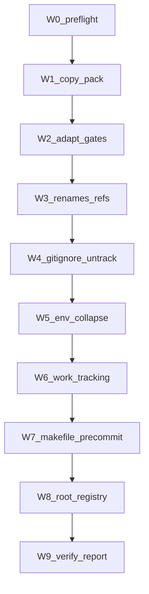

# RB-HK-001 Phase 2+3 Housekeeping

**Plan home (user: consolidate into WIP):** [WIP/housekeeping-pack/](WIP/housekeeping-pack/) — `RB-HK-001.plan.md` + `RB-HK-001.plan.json` land here on execute, not under `.cursor/plans/`. WIP remains human-owned scratch.

**Authority:** [START-HERE-PROMPT.md](WIP/housekeeping-pack/START-HERE-PROMPT.md) > [AGENT_TASK.md](WIP/housekeeping-pack/AGENT_TASK.md) > [RUNBOOK.md](WIP/housekeeping-pack/RUNBOOK.md), then this plan’s locked decisions. Depth: **deep** (CI install, root-file registry, lock-file decision).

**Baseline (inspect 2026-08-13):** `c4806784c61e6627c2aa50bdbab1bc09f768dc52` on `feat/mac-storage-triage-deletion-log` (dirty, unrelated). Execution must use a **new** `chore/housekeeping-rb-hk-001` from `origin/main`, not this branch.

**Execute via:** `@environment/program-execution` then subordinate `@autonomy` under a Program lease. Envelope: local tree edits only. `autonomous_merge: false`. **No commit, no push** (START-HERE). Human commit/PR is a later step.

## Locked decisions

- **`current_work/`:** report contents only. Do not move, delete, or soften the fail-closed gate. Hygiene may stay red on this one residual until you migrate.
- **MCP allowlist:** do not install the pack’s `{linear, supabase, vercel, context7, github, graphiti}` list. Align both [check_repo_hygiene.py](WIP/housekeeping-pack/scripts/check_repo_hygiene.py) and [governance-self-check.yml](WIP/housekeeping-pack/workflows/governance-self-check.yml) to tracked [`.mcp.json`](.mcp.json) (`graphiti-memory` only). Restrict the Python check to **git-tracked** MCP files so a local gitignored `.cursor/mcp.json` cannot false-fail.
- **`rules/15-work-tracking.mdc` is not always-on.** User override of AGENT_TASK shape A. Use [docs/rules-standard.md](docs/rules-standard.md) **shape D** (`alwaysApply: false` + a trigger `description`). Enforcement of the WIP boundary is `.cursorignore` + the hygiene gate, not an always-apply rule. Do not set `alwaysApply: true`. Do not raise `ALWAYS_BUDGET`.

## Agent scope

**In (Phase 2+3):**
- Rename three space-named paths; update live references
- Ignore + untrack generated/runtime files (except the lock)
- Collapse `.env.template` into `.env.example`
- Work-tracking contract: `.cursorignore` + `rules/15-work-tracking.mdc`
- Install hygiene script, Makefile targets, pre-commit hook, four automation files
- Register new/renamed root files in [ops/config/root-file-protection.json](ops/config/root-file-protection.json)
- Report job names, lock decision, `current_work/` inventory, rule size + always-apply total

**Out:**
- Phase 0 (ruleset / auto-delete heads) — human/admin
- Phase 1 (any branch delete / `cleanup_branches.sh --apply`)
- Commit, push, `workflow_dispatch`, adding required checks
- Migrating or deleting `current_work/`
- Deleting `commands/_harvest-copy-REVIEW.md`
- Untracking `.governance-build-lock`
- Touching `CANONICAL_LAW.md`, `ORG_INVARIANTS.yaml`, `CODEOWNERS`, `SECURITY.md`, `.claude/settings.json`, `.claude/hooks/**`
- Raising `ALWAYS_BUDGET` in [ops/scripts/check_rules_standard.py](ops/scripts/check_rules_standard.py)
- `alwaysApply: true` on `rules/15-work-tracking.mdc` (user: not always-on)
- Directory consolidation, command-cluster collapse, skill pruning (RUNBOOK §8)
- Unrelated dirty files on the current branch (`AGENTS.md`, skill-registry, secrets registry, mac-storage-triage)

## Ground truth that changes the pack as-written

| Finding | Effect |
|---|---|
| `.governance-build-lock` is read by [ops/hooks/session_start_bootstrap.sh](ops/hooks/session_start_bootstrap.sh) (backup skip). Makefile / workflows / `tools/` have **no** readers. START-HERE’s grep set is incomplete. | **Keep tracked.** Do not add to `.gitignore`. Do not `git rm --cached`. Report the hook. |
| AGENT_TASK asked for shape A (`alwaysApply: true`). User said do not make it always-on. Prefix `15-` is free. Always-apply total is already 181203/181203. | Ship `rules/15-work-tracking.mdc` as **shape D** only. Always-apply total stays unchanged. |
| Pack MCP allowlist ≠ `.mcp.json` (`graphiti-memory`) | Adapt before install or Phase 3 CI is permanently red. |
| `current_work/` has `harvested/03-26-2026/boundary v2.0/` (19 files) | Hygiene + `repo-hygiene.yml` will fail until you migrate. Expected residual. |
| `.env.template` keys are disjoint Cloudflare IDs (live-looking values). `.env.example` is “flags this repo’s scripts read.” | Merge **key names** as commented placeholders. Do **not** copy account/zone/email values. |
| [`.gitignore`](.gitignore) lines 79–81 say agents must read WIP and not ignore it. | Update that comment to match `.cursorignore` (WIP stays **git-tracked**, agents do not read it). Do not add `WIP/` to `.gitignore`. |
| `Activation Command.md` and `.env.template` are in root-file-protection. New root file `.harvest_executor_state.example.json` must be registered. | Update [ops/config/root-file-protection.json](ops/config/root-file-protection.json) (managed). Makefile / `.pre-commit-config.yaml` stay **append-only**. |
| Pack lives in `WIP/`. After `.cursorignore`, agents cannot re-read it. | **Copy pack artifacts to production paths first.** Add `WIP/` to `.cursorignore` last. |
| Phase 0 listed required check `l9-lint-test`. Actual job names are `Lint and Type Check` and `Test Suite`. | Report only. Do not edit existing workflows. |
| Working tree is on another feature branch and dirty. | New branch from `origin/main`. Leave unrelated diffs alone. |

## Execution DAG



### W0 — Preflight
- Confirm `gh api repos/Quantum-L9/Cursor-Governance/branches/main --jq '.protected'` is `true` (Phase 0 done). If `false`, continue Phase 2 file work but **do not** advise adding required checks.
- Create/switch `chore/housekeeping-rb-hk-001` from `origin/main`. Do not commit.
- Inventory space-named paths, lock readers (`ops/` included), `current_work/` names.

### W1 — Copy pack out of WIP first
Copy before `.cursorignore`:
- `WIP/housekeeping-pack/scripts/check_repo_hygiene.py` → `tools/check_repo_hygiene.py` (executable)
- `workflows/dependabot.yml` → `.github/dependabot.yml`
- `workflows/repo-hygiene.yml` → `.github/workflows/repo-hygiene.yml`
- `workflows/governance-self-check.yml` → `.github/workflows/governance-self-check.yml`
- `workflows/branch-hygiene.yml` → `.github/workflows/branch-hygiene.yml`

Do not copy `cleanup_branches.sh` into `tools/` (Phase 1 is yours).

### W2 — Adapt gates (pack defects vs this repo)
In the **copied** files only:
- MCP allowlist → `graphiti-memory`; Python check uses `git ls-files` for MCP configs
- Leave `current_work/` as error (do not soften)
- Do not add `.governance-build-lock` to `BANNED_TRACKED`

### W3 — Renames + references
```bash
git mv "Activation Command.md" activation-command.md
git mv "key components" key-components
git mv "commands/harvest copy.md" commands/_harvest-copy-REVIEW.md
```
Update live hits (do not rewrite `intelligence/context-memory/sessions/*` or `_archived/`):
- [commands/COMMANDS_MANIFEST.yaml](commands/COMMANDS_MANIFEST.yaml) excluded list
- [ops/scripts/generate_commands_manifest.py](ops/scripts/generate_commands_manifest.py) `DEFAULT_EXCLUDED`
- [README.md](README.md) (`key components/` → `key-components/`)
- [TODO.md](TODO.md) inventory rows B2/B10 (do **not** replace TODO.md with [templates/TODO.md](WIP/housekeeping-pack/templates/TODO.md))
- [key-components/*.md](key%20components) `.env.template` mentions after the dir rename
- [skills/l9-mac-storage-triage/tests/test-layout.sh](skills/l9-mac-storage-triage/tests/test-layout.sh) if it still names `.env.template`

`AGENTS.md` and `.cursor-plugin/plugin.json` have no hits — do not edit them for this.

### W4 — Ignore + untrack
Append RUNBOOK §4.5 block to [`.gitignore`](.gitignore) **except** `.governance-build-lock`. Rewrite the WIP comment (lines 79–81) so git-track vs agent-read is not contradictory. Remove `!.env.template`.

```bash
git rm --cached governance-health-report.json .harvest_executor_state.json
git rm --cached commands/.harvest_executor_state.json
```

Create [`.harvest_executor_state.example.json`](.harvest_executor_state.example.json) with the union of keys from both live state files and placeholder values (no live paths/timestamps).

### W5 — Env collapse
Fold Cloudflare **key names** (and commented Graphiti/Infisical pointer comments, no values) into [`.env.example`](.env.example). Delete `.env.template`. Drop `.env.template` from [ops/scripts/validate_legacy_doctrine_residue.py](ops/scripts/validate_legacy_doctrine_residue.py) `ACTIVE_FILES`.

### W6 — Work-tracking (cursorignore last)
- Create `rules/15-work-tracking.mdc` as **shape D** (not always-on):

```yaml
---
description: Use when touching TODO.md, WIP/, current_work/, or deciding where in-flight work lives.
alwaysApply: false
---
```

  Body: never read/write `WIP/`; agent owns `TODO.md` (one task/line, status prefix, Linear id when cross-session); `current_work/` retired. Under 1 KB. H1 matches slug. No `globs`.
- Mechanical WIP boundary is `.cursorignore` + `repo-hygiene` / `check_repo_hygiene.py`, not this rule.
- Append `WIP/` to [`.cursorignore`](.cursorignore) **last**.
- List `current_work/` contents in the report. Do not migrate.

### W7 — Makefile + pre-commit (append only)
Append to [Makefile](Makefile) (tabs, existing `.PHONY` style):

```makefile
hygiene:
	python3 tools/check_repo_hygiene.py

hygiene-fix:
	@echo "See WIP/housekeeping-pack/RUNBOOK.md Section 4"
```

Append a local hook to [`.pre-commit-config.yaml`](.pre-commit-config.yaml) — do not reorder existing hooks:

```yaml
      - id: repo-hygiene
        name: Repository housekeeping gate (RB-HK-001)
        entry: python3 tools/check_repo_hygiene.py
        language: system
        pass_filenames: false
```

### W8 — Root-file registry
In [ops/config/root-file-protection.json](ops/config/root-file-protection.json):
- `Activation Command.md` → `activation-command.md` (managed)
- remove `.env.template`
- add `.harvest_executor_state.example.json` (managed)

`governance-health-report.json` / `.harvest_executor_state.json` stay registered as regenerable.

### W9 — Verify + report (no commit)
Run `python3 tools/check_repo_hygiene.py` and quote output. Expected remaining **FAIL**: `current_work/` only. If anything else fails, fix Phase 2 items and re-run.

Report:
1. Every file changed + why
2. Job ids for required checks: `repo-hygiene`, `governance-self-check` (leave `branch-hygiene` scheduled; dependabot has no job)
3. `.governance-build-lock` **kept** because `session_start_bootstrap.sh` reads it
4. `current_work/` still has contents (list)
5. `rules/15-work-tracking.mdc` byte size; confirm `alwaysApply: false`; always-apply total unchanged
6. Phase 0 name mismatch: `l9-lint-test` vs `Lint and Type Check` / `Test Suite`
7. `workflow_dispatch` + required-check add are yours after you commit/push

## Success properties

- No tracked path contains a space
- Banned runtime files untracked (lock still tracked)
- Single env template: `.env.example` only
- `WIP/` is a `.cursorignore` line; WIP stays git-tracked
- New workflows + `tools/check_repo_hygiene.py` + `make hygiene` + pre-commit hook present
- Root-file registry matches renamed/new/deleted root files
- Hygiene FAIL set is only `current_work/` (or PASS if you already migrated)
- Working tree dirty with housekeeping edits only; **no commit, no push**
- `make pr-check` is a **human post-commit** gate, not this agent pass (START-HERE forbids commit)

## Stress / rollback

**Disconfirm:** lock has a CI reader we missed (search `ops/` too — already found bootstrap). Secret regex `sk-[A-Za-z0-9]{20,}` goes red on first CI run (repo grep was clean). Shape D rule is never pulled and an agent reads WIP anyway (mitigation is `.cursorignore` + hygiene, not the rule). Renames miss a glob in a generator. Copy-after-cursorignore leaves workflows unadapted.

**Assumed false if:** Phase 0 not actually Active; you want hygiene green before you migrate `current_work/`.

**Blast radius:** broken command manifest / harvest exclude; sessionEnd backup skip if lock were untracked; `governance-self-check` red if MCP list is unmodified; root-protect red if example file is unregistered.

**Rollback:** discard the uncommitted branch (`git checkout --` / delete `chore/housekeeping-rb-hk-001`). After a later human commit: revert that commit. Workflow rollback: remove from required checks **before** deleting the workflow file (RUNBOOK §7). Lock: never untracked, so no lock rollback.

## Doc / root surface

- Update: `.gitignore`, `.env.example`, `.cursorignore`, `TODO.md` (reference rows only), `README.md`, `Makefile` (append), `.pre-commit-config.yaml` (append), `ops/config/root-file-protection.json`
- Create: `activation-command.md` (rename), `.harvest_executor_state.example.json`, `rules/15-work-tracking.mdc`, four `.github` files, `tools/check_repo_hygiene.py`
- Delete/untrack: `.env.template`, three runtime files (cached only)
- N/A: `AGENTS.md`, `CANONICAL_LAW.md` — no reference hits / forbidden

## Convergence

`partial` — Phase 0/1 and `current_work/` migration stay human. Next skill after you accept: `@environment/program-execution` + `/autonomy` (local-only envelope). Then `l9-ynp`. Optional GMP Phase 0 only if you later lift the no-commit constraint and run `make pr`.
