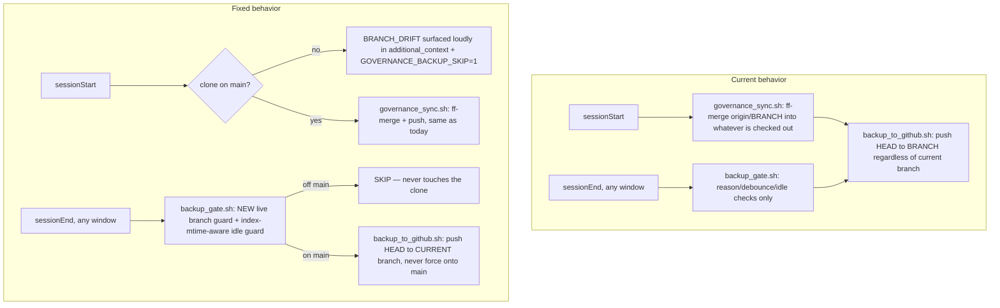

## Objective

`~/.cursor-governance` is a single shared clone that every Cursor window's user-scoped `sessionStart`/`sessionEnd` hooks touch, regardless of which repo that window actually has open (confirmed: `graphiti-session-end.sh` reads `CURSOR_PROJECT_DIR` to target the *open workspace's* memory-bank, but the governance backup scripts always `cd` to `~/.cursor-governance` itself). Root cause, confirmed by `git reflog` and acknowledged directly: a branch (`fix/end-session-memory-bank-fallback`) was checked out **directly in this shared clone** (not a worktree) and committed to, then switched back to `main`. `backup_to_github.sh` already detects branch mismatch but only warns — it still pushes `HEAD:$BRANCH` (`main`) regardless, so any unrelated window's `sessionEnd` firing while the clone sits on a stray branch can shove those commits onto `main` with no PR. Two more gaps compound "work goes missing": `governance_sync.sh`'s stash-pop-conflict detection only fires on literal conflict markers (any other pop failure is silent), and `backup_gate.sh`'s idle/"still editing" guard checks file `mtime`, which doesn't exist for deleted paths — so a mass deletion (like the ~94 `WIP/` deletions currently staged in the clone, discovered live during this investigation) is invisible to the guard meant to stop exactly that kind of half-finished snapshot.

## Scope

**In:**
- Make automated backup/sync branch-safe: never push a non-`main` branch's commits onto `main`; skip automated action entirely when the clone isn't on `main`.
- Fix the stash-pop-failure detection in `governance_sync.sh` to use ground truth (`git stash list`), not just conflict-marker heuristics.
- Fix the activity/quiet-period guard in `backup_gate.sh` to detect deletions (via `.git/index` mtime), not just edited files.
- Make "clone isn't on main" loud and undismissable at the next `sessionStart` (`session_start_bootstrap.sh` `additional_context`), not just a log line.
- Add a `git worktree`-based helper script so feature work on the governance repo itself never again needs an in-place branch checkout.
- Update `AGENTS.md` / `CANONICAL_LAW.md` to state the worktree-only rule and the new skip-when-off-main behavior.
- Extend/add fixture tests (`test_backup_gate.sh`, new `test_backup_to_github.sh`, new `test_governance_sync.sh`) covering all of the above, using local fixture clones/bare repos only — no real network calls.
- Triage (with explicit approval before any git action) the live-staged `WIP/` deletions and the duplicate-but-already-pushed plugin-unification files currently dirty in the shared clone.

**Out:**
- A Cursor-independent periodic LaunchAgent/cron safety net (explicitly declined — staying scoped to the existing hook chain).
- Any change to consumer-repo wiring (`.cursor-commands` symlink, plugin loading) — unrelated to this backup mechanism.
- Actually resolving the WIP deletions without a separate explicit go-ahead at execution time.

## Current vs. fixed flow

## TODO Plan

| # | Task | Files | Effort | Risk |
|---|------|-------|--------|------|
| 1 | Triage current dirty state in the shared clone: confirm the 16 non-WIP files are byte-identical to the already-pushed `feature/cursor-governance-plugin-unification` (already verified), present the ~94 staged + unstaged `WIP/` deletions for explicit approval before touching anything | `~/.cursor-governance` (git ops only, no file edits) | Small | Low (read-only until approved) |
| 2 | Add a live branch guard to `backup_gate.sh`: if clone's checked-out branch != `GOVERNANCE_GITHUB_BRANCH` (default `main`), skip (rc 10) with a clear message; `GOVERNANCE_BACKUP_FORCE=1` still overrides, consistent with existing precedence | `ops/scripts/backup_gate.sh` | Small | Low |
| 3 | Fix the idle/activity guard's blindness to deletions: also fold `.git/index` mtime into the "newest write" computation so a `git add -A`/`git rm` capturing deletions counts as recent activity even though the deleted paths have no mtime | `ops/scripts/backup_gate.sh` | Small | Low |
| 4 | Make `backup_to_github.sh` push to the *actual current branch* when it differs from the configured target, instead of warning-then-forcing `HEAD:$BRANCH`; keep pushing to `$BRANCH` unchanged when already on it | `ops/scripts/backup_to_github.sh` | Small | Medium (touches the push refspec logic directly — needs the new fixture test in #8 before considering done) |
| 5 | Add the same live branch guard to `governance_sync.sh`'s pull-and-push halves: skip the ff-only merge and the `backup_to_github.sh` call entirely when the clone isn't on `main`, logging why | `ops/scripts/governance_sync.sh` | Small | Low |
| 6 | Fix stash-pop failure detection to check `git stash list` (ground truth) instead of only conflict-marker heuristics, so any pop failure — not just conflicts — is logged to `.sync-conflict` and warned about | `ops/scripts/governance_sync.sh` | Small | Low |
| 7 | Surface branch drift loudly at every `sessionStart` until fixed: check `~/.cursor-governance`'s current branch next to the existing `.governance-build-lock` check, append a `BRANCH_DRIFT: ...` line to `PARTS` (same pattern already used for the build-lock kill switch) and export `GOVERNANCE_BACKUP_SKIP=1` for that session | `ops/hooks/session_start_bootstrap.sh` | Small | Low |
| 8 | Add fixture tests: extend `test_backup_gate.sh` with "off-main skips / force overrides / on-main proceeds" and "fresh deletion counts as activity" cases; add `test_backup_to_github.sh` using a local `file://` bare repo as fake origin, asserting feature-branch commits never land on `main`; add `test_governance_sync.sh` covering the off-main skip and the stash-pop ground-truth check | `ops/scripts/test_backup_gate.sh`, new `ops/scripts/test_backup_to_github.sh`, new `ops/scripts/test_governance_sync.sh` | Medium | Low |
| 9 | Add `ops/scripts/governance_worktree.sh <branch>`: creates a sibling `git worktree`, checks out/creates `<branch>` there, runs `setup_workspace_symlinks.sh` inside it (so the `symlinks-check` pre-commit hook passes without polluting the commit — the exact manual steps used for the plugin-unification PR), and prints the follow-up commit/push/PR/`worktree remove` steps | new `ops/scripts/governance_worktree.sh` | Medium | Low |
| 10 | Document the worktree-only rule and the new skip-when-off-main behavior: update `AGENTS.md` §5 (change policy) and `CANONICAL_LAW.md`'s existing backup section (~lines 95-117) | `AGENTS.md`, `CANONICAL_LAW.md` | Small | Low |
| 11 | Add a `Makefile` target wrapping `governance_worktree.sh` for discoverability (`make worktree BRANCH=...`), matching the existing `make backup` / `make start` convention | `Makefile` | Small | Low |

## Dependencies

Tasks 2-7 are independent of each other and can be implemented in any order; task 8 (tests) depends on 2-6 landing first so the new behavior exists to test; task 9 (worktree helper) and 10 (docs) are independent of 2-8 and can proceed in parallel; task 11 depends on 9. Task 1 (triage) is independent and can run first or last — flagged first here only because it is live and time-sensitive.

## Risks

| Risk | Mitigation |
|------|------------|
| Changing `backup_to_github.sh`'s push target could break the existing `make backup` / `make push` manual workflow if something relies on always landing on `main` | New fixture test (#8) pins the exact expected behavior before/after; on-`main` case is unchanged (regression-covered) |
| Skipping automated backup entirely when off `main` means feature-branch WIP in the shared clone gets no automatic safety net | Acceptable per explicit decision — worktree convention + helper script (#9) is the intended way to avoid ever being in that state; manual `make backup`/`FORCE=1` remains available |
| Triage of currently-staged `WIP/` deletions could be genuinely destructive if handled wrong | Task 1 is read-only investigation only; any actual `git reset`/restore requires a separate explicit go-ahead at execution time, per existing WIP-protection governance rules |

## Estimate

**Total:** roughly one focused implementation session (11 small-to-medium file-scoped changes, no protected-core files, no infra changes).
**GMPs:** likely 1 GMP run covering tasks 2-11 (bash script + docs + tests, no kernel/executor/deployment surface), plus a separate, explicitly-approved manual step for task 1.
