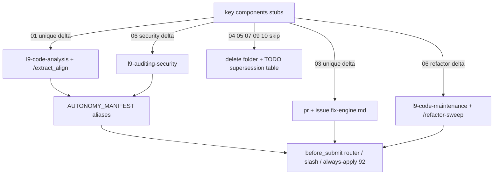

# Absorb key components into live skills

## Decision (locked)

**Fold unique deltas into existing skills/commands that already invoke.** Do not create nine new skills, do not revive the advertised CLIs (`run-pattern-detector`, `deploy-orchestrator`, `validate-security`, `rebuild-session`, `monitor-agent`, `organize-folders`), and do not implement auto-apply patching from regex.

Evidence: `TODO.md` B2 already calls these stub agent docs; nothing in `skills/`, `commands/`, hooks, or `AUTONOMY_MANIFEST.yaml` reads `key components/`. Live successors already own the trigger surface (`l9-code-analysis` + `/extract_align`, `l9-pr-remediation` / `l9-issue-remediation`, `l9-code-maintenance` + `/refactor-sweep`, `l9-auditing-security`, Graphiti session hydrate, `make pr`).

## Why this is first-order leverage

Shared root cause: the 2025 stubs were never compiled, while the live system already has homes. The missing piece is **explicit recall/extract steps on mutating paths** plus **router aliases** for the old names—not a second agent catalog.

What actually still fires if we fold in:

- `ops/hooks/before_submit_skill_router.py` + `claude_routing.routes[]` → auto-invoke
- `/extract_align`, `/analyze`, `/refactor-sweep`, `/pr`, `/issues`
- Always-applied [`rules/92-learned-lessons.mdc`](rules/92-learned-lessons.mdc) (prevention already live; mutating skills do not load the corpus today)

## Absorb vs skip

Port (thin references + one workflow bullet each):

- **01 pattern-detector** → [`skills/l9-code-analysis/references/pattern-alignment.md`](skills/l9-code-analysis/references/pattern-alignment.md) and [`commands/extract_align.md`](commands/extract_align.md). Add scan dimensions for skill/prompt/workflow packs: repeated structures, `if → validate → mutate → return` chains. Keep code-pattern extract as-is. GMP Discover already optionally loads this ref ([`skills/l9-gmp-protocol/references/lifecycle-pipelines.md`](skills/l9-gmp-protocol/references/lifecycle-pipelines.md) line 75).
- **03 error-corrector** → lesson-recall step in both fix engines: [`skills/l9-pr-remediation/references/fix-engine.md`](skills/l9-pr-remediation/references/fix-engine.md) and [`skills/l9-issue-remediation/references/fix-engine.md`](skills/l9-issue-remediation/references/fix-engine.md). Before inventing a fix, `rg` [`learning/failures/repeated-mistakes.md`](learning/failures/repeated-mistakes.md) and [`learning/patterns/quick-fixes.md`](learning/patterns/quick-fixes.md); apply a matching template only when the current failure matches; otherwise proceed. **Must not** auto-apply unmatched regex patches or write `memory_log.json` (retired; Graphiti is SSOT).
- **06 refactor-assistant** → Discovery phase of [`skills/l9-code-maintenance/references/refactor-sweep-protocol.md`](skills/l9-code-maintenance/references/refactor-sweep-protocol.md): treat the learning corpus as constraint tokens, not a missing `lessons.learned.md`.
- **06 security-validator** → optional check class on [`skills/l9-auditing-security/SKILL.md`](skills/l9-auditing-security/SKILL.md): when n8n/L9/Supabase workflow files are present, lint `predefinedCredentialType` and node naming. Skip the check when those files are absent (this repo has zero `.L9.json`). Secrets/OWASP already live here + `make pr` scanners.

Skip (supersession note only, no port):

- **04 deployment-orchestrator** — sequence already lives in [`skills/l9-ci-ops/references/workflow-governance.md`](skills/l9-ci-ops/references/workflow-governance.md) + `make pr` / L4 release. That file already forbids auto-remediate.
- **05 workflow-explainer** — no `.L9.json` in repo; n8n patterns deprecated. `/analyze` flow mapping is the successor.
- **07 session-rebuilder** — Graphiti inject / `l9-graphiti-memory` + SessionStart superseded `memory_log.json` / `session_status.md`.
- **09 monitor-agent** — no daemon; `check_governance_wiring.sh` is on-demand. Do not add a LaunchAgent.
- **10 folder-reorganizer** — targets `Prompts - Production/`, `Data_Management/`, `@.GlobalCommands/` which are not this repo’s layout. Successor is CANONICAL_LAW + `l9-repository-renovation`.

## Downstream wiring (no new skills)

Edit [`skills/AUTONOMY_MANIFEST.yaml`](skills/AUTONOMY_MANIFEST.yaml) `claude_routing.routes[]` `positive_signals` only (do not add skills or change tiers):

- `code_analysis`: `extract patterns`, `pattern detector`, `extract_align`
- `security_audit`: `validate security`, `security validator`, `hardcoded API keys`
- Do **not** add a `monitor-agent` or `rebuild-session` route (those names would misfire)

Then run `python3 ops/scripts/sync_generated_artifacts.py` so `ops/generated/skill-registry.json` and generated llm-rules pick up signal changes.

No new slash commands. No subagent `skills:` preloads. No `l9-wire-skill-into-repo` wire of new packs. Unwire is N/A (these were never skills).

## Retirement

After the four absorbs:

- Delete the nine files under [`key components/`](key%20components/) (directory is not a protected root file).
- Update [`README.md`](README.md) directory listing (managed tier) to drop `key components/` or mark it removed.
- Close [`TODO.md`](TODO.md) B2 with a superseding-skill table (managed tier).
- Do not add `key components/` to `do_not_migrate_to_skills` (orphan heal only scans `skills/<name>/SKILL.md`).

## Execution envelope

- **Branch:** new branch from `origin/main`. Do not land this on `feat/mac-storage-triage-deletion-log` (unrelated dirty tree).
- **May modify:** the skill references and SKILL.md files listed above; `skills/AUTONOMY_MANIFEST.yaml`; `commands/extract_align.md`; `README.md`; `TODO.md`; generated artifacts from sync; delete `key components/*`.
- **Must not modify:** `CANONICAL_LAW.md`, `pyproject.toml`, `AGENTS.md`, hooks, `ops/feedback_loop_config.yaml` auto-apply revival, new CLIs, new LaunchAgents, `memory_log.json` recreation.
- **Secrets / network:** none.
- **Final gate:** `make pr-check` (code + YAML in scope).
- **Merge:** L4 plan Build implies merge after green; `autonomous_merge: false` in the campaign packet.

## Stress and rollback

Disconfirming questions:

- If mutating agents still invent fixes after the recall bullet, was the step too easy to skip (needs a Resource Map link + Hot Path bullet, not only fix-engine)?
- If router aliases steal traffic from `/gmp` or `/plan`, are the new signals too broad?
- If consumer repos still ship `.L9.json`, did skipping 05 leave a real gap? (Revisit only if a consumer path is named.)

Assumed false-ifs: Graphiti remains session SSOT; no n8n daemon requirement; learning corpus paths stay at `learning/failures/` and `learning/patterns/`.

Blast radius: skill routing hints and remediation behavior across every governed workspace. Wrong aliases cause mis-invocation; wrong auto-apply would mutate code unsafely (hence forbidden).

Rollback: revert the PR. Deleted stubs are recoverable from git history (`key components/` is already on `main`).

## Out of scope

- Compiling `key components/` into new `l9-*` skills
- Implementing stub CLIs or a monitor daemon
- Auto-apply / `apply_fix: true` from `03_error-corrector.md`
- Reviving `.L9.json` parsers, `session_status.md`, `memory_log.json`, `folder-logic.yaml`
- Mixing this change with the in-progress mac-storage-triage branch
- Editing `CANONICAL_LAW.md` or activation hooks

## Convergence

Plan is executable after Build. Next skill: `@environment/program-execution` then `/autonomy` (`l9-bounded-autonomy`) under a Program lease. Optional `l9-ynp` after land.

On execute, also emit a `PLAN_DOCUMENT` JSON and project the PE `.plan.md` via `skills/l9-plan/scripts/validate_plan_document.py` + `render_plan_pe_autonomy.py` (Plan mode cannot write those files).
