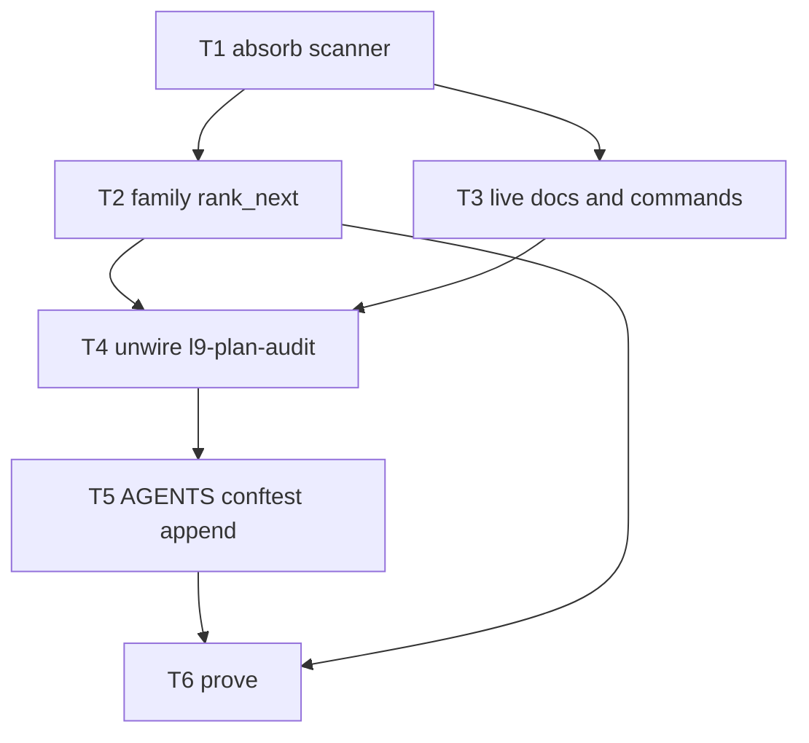

# Absorb plan-audit into pipeline-audit

The `/l9-plan-simple` deliverable is already on disk (not in this Plan-mode card):

- [docs/plans/absorb_plan_audit_into_pipeline_76840ee8.plan.md](docs/plans/absorb_plan_audit_into_pipeline_76840ee8.plan.md)
- [docs/plans/absorb_plan_audit_into_pipeline_76840ee8.plan.json](docs/plans/absorb_plan_audit_into_pipeline_76840ee8.plan.json)

Committed locally as `eacfc756` on `main`. Open that `.plan.md` in the plans store (`.cursor/plans` → `docs/plans/`).

## Why

SessionStart already runs `audit_pipeline.py --format session-start`. That CLI **imports** `l9-plan-audit` `audit_plans.py`, then **skips** every WIP row in `rank_next`. Two skills wrap the same live-queue job.

## Locked contracts

- **One scanner:** `git mv` `audit_plans.py` + `harvest_plan_invariants.py` + `staleness-rules.md` into [skills/l9-pipeline-audit/scripts/](skills/l9-pipeline-audit/scripts/). Point [audit_pipeline.py](skills/l9-pipeline-audit/scripts/audit_pipeline.py) imports at the same directory (today: `parents[2] / "l9-plan-audit" / "scripts"`).
- **Family NEXT:** Pass 1 takes one candidate per surface in order plans, wip, campaigns. Within plans: compiled then README live-queue then other unbuilt. Within WIP: harvestable then pending-active (not landed). Within campaigns: pending then harvestable. Pass 2 fills leftovers. Cap 3. This stops 178 WIP rows from consuming all three slots.
- **Unwire:** archive to `skills/_archived/l9-plan-audit/` with `superseded_by: l9-pipeline-audit`. Follow [skills/l9-wire-skill-into-repo/references/unwire-deprecate.md](skills/l9-wire-skill-into-repo/references/unwire-deprecate.md). Never leave deprecated-in-place under live `skills/`.
- **Append-only:** [AGENTS.md](AGENTS.md) and [conftest.py](conftest.py) gain lines only. Heading stays `### Plan audit`. No auto-Build. No `make campaign`.
- **Isolation:** do not stage foreign plan dirt already on this checkout (`docs/plans/` deletions + untracked `built/` copies).

**C1 stop:** after T1, if `audit_pipeline.py` cannot import `audit_plans` from the pipeline scripts dir, do not unwire.

**C2 stop:** after T2, if pipeline `self_test.py` NEXT omits `note.md`, do not unwire with WIP still skipped.

## Prove

- `.venv/bin/python skills/l9-pipeline-audit/scripts/self_test.py` PASS (NEXT includes compiled plan and `note.md`)
- `pytest tests/ops/scripts/test_pipeline_audit_built_shelf.py` PASS
- `test ! -d skills/l9-plan-audit`
- `make pr-check` on this envelope
