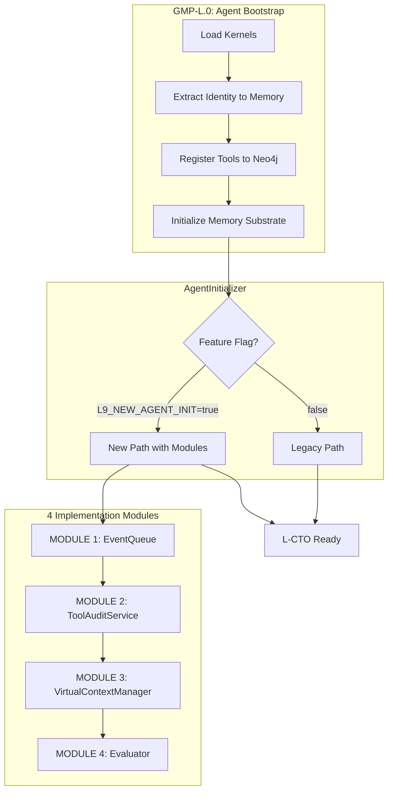

# Agent Initialization Paradigm Shift Implementation

## Executive Summary

Transform L-CTO agent initialization from lazy-loading to **full provisioning at startup** - loading kernels, tools, memory context, and event subscriptions in one deterministic flow. Implements 4 priority modules from the Gap Analysis sequentially via separate GMPs.**Current state**: L9 Maturity 42/100 | **Target**: 68/100---

## Architecture Overview



---

## Scope Boundaries

**IN SCOPE:**

- L-CTO agent only (other agents inherit automatically)
- 4 Implementation Suite modules wired sequentially
- Per-agent memory tier configuration via `config/agents/*.yaml`
- Feature flag `L9_NEW_AGENT_INIT` for migration safety

**OUT OF SCOPE:**

- Research agents (CA, Critic, Architect) - inherit from L
- CodeGenAgent - future phase
- LangGraph DAG integration (GMP-L.6) - Week 5+

**PROTECTED FILES (require explicit TODO):**

- `core/agents/executor.py`
- `memory/substrate_service.py`
- `docker-compose.yml`

---

## GMP Execution Sequence

Each module gets a **separate GMP Action prompt** following `.cursor/protocols/GMP-Action-Prompt-Canonical-v1.0.md`.

### Week 1: GMP-L.0 (Bootstrap) + GMP-L.1 (Tool Registration)

| GMP | Files to Create/Modify | Purpose ||-----|------------------------|---------|| **GMP-L.0** | `core/bootstrap/agent_bootstrap.py` (NEW), `api/server.py` | Bootstrap L with kernels + identity to memory || **GMP-L.1** | `core/governance/approval_manager.py` (NEW), `core/tools/registry_adapter.py` | Tool metadata + approval gates |

### Week 2: GMP-L.2 (Memory Tools) + GMP-L.3 (Prometheus)

| GMP | Files to Create/Modify | Purpose ||-----|------------------------|---------|| **GMP-L.2** | `core/tools/memory_tools.py` (NEW) | memory_search + memory_write as L tools || **GMP-L.3** | `telemetry/memory_metrics.py` (NEW), `memory/tool_audit.py`, `api/server.py` | Prometheus metrics + /metrics endpoint |

### Week 3: GMP-L.4 (Approval Gates)

| GMP | Files to Create/Modify | Purpose ||-----|------------------------|---------|| **GMP-L.4** | `core/tools/gmp_tool.py` (NEW), `core/tools/git_tool.py` (NEW), `core/agents/executor.py` | GMP/git pending approval workflow |

### Week 4: GMP-L.5 (Memory Consolidation)

| GMP | Files to Create/Modify | Purpose ||-----|------------------------|---------|| **GMP-L.5** | `core/memory/consolidation.py` (NEW), `core/memory/virtual_context.py` (NEW) | Automatic memory dedup + tiering |---

## Key Implementation Decisions

### 1. Feature Flag Migration (from your Q4 answer)

```python
# .env
L9_NEW_AGENT_INIT=false  # Start false, flip true after validation

# api/server.py lifespan
if settings.L9_NEW_AGENT_INIT:
    l_instance = await bootstrap.bootstrap_agent_with_modules(l_config)
else:
    l_instance = AgentInstance(config=l_config, ...)  # Legacy path
```


### 2. Per-Agent Memory Tiers (from your Q3 answer)

```yaml
# config/agents/l_cto_config.yaml
memory:
  tiers:
    main:
      size_tokens: 8192
      policy: lru_semantic
    working:
      size_tokens: 16384
      policy: lru
    archival:
      size_tokens: 524288
      policy: importance_based
```


### 3. Module Feature Flags

```bash
# Enable each module incrementally
MODULE_1_ENABLED=true   # Week 1: Event-Driven
MODULE_2_ENABLED=true   # Week 2: Tool Audit + Prometheus
MODULE_3_ENABLED=false  # Week 3: Virtual Context (enable after)
MODULE_4_ENABLED=false  # Week 4: Evaluation (enable after)
```

---

## Files to Create

| File | LOC | Purpose ||------|-----|---------|| `core/bootstrap/agent_bootstrap.py` | ~200 | AgentBootstrapOrchestrator with module wiring || `core/coordination/event_queue.py` | ~400 | MODULE 1: Event-driven coordination || `core/tools/memory_tools.py` | ~150 | memory_search, memory_write tools || `core/governance/approval_manager.py` | ~200 | Approval gate checks || `telemetry/memory_metrics.py` | ~100 | Prometheus metrics || `core/memory/virtual_context.py` | ~500 | MODULE 3: MemGPT-style tiering || `core/memory/consolidation.py` | ~300 | LLM-driven memory dedup || `core/evaluation/evaluator.py` | ~450 | MODULE 4: Eval framework || `config/agents/l_cto_config.yaml` | ~50 | L-CTO tier configuration |---

## Success Criteria

| Week | Milestone | Validation ||------|-----------|------------|| 1 | L bootstrapped with 20 tools registered | Logs: "L bootstrapped, 20 tools, 10 kernels" || 2 | Tool calls visible in Prometheus | `curl /metrics | grep l9_tool_invocation` || 3 | GMP/git pending approval workflow | L proposes GMP, status=pending_igor_approval || 4 | Memory self-consolidating | Long conversations trigger consolidation |---

## Execution Protocol

For each GMP (L.0 through L.5):

1. **Load protocols**: `.cursor/protocols/GMP-Action-Prompt-Canonical-v1.0.md`
2. **Lock TODO Plan** with absolute paths, line ranges, actions
3. **Execute Phases 0-6** per GMP protocol
4. **Generate Report**: `reports/Report_GMP-L.N-Description.md`
5. **Update workflow_state.md** with results
6. **Call /ynp** for next action

---

## Risk Mitigation

| Risk | Mitigation ||------|------------|| Breaking existing init | Feature flag `L9_NEW_AGENT_INIT=false` by default || Module dependency failures | Each module has `MODULE_N_ENABLED` flag || Protected file changes | Explicit TODO entries, Phase 0 plan required || Prometheus overhead | Metrics are async, no blocking |---

## Next Action
