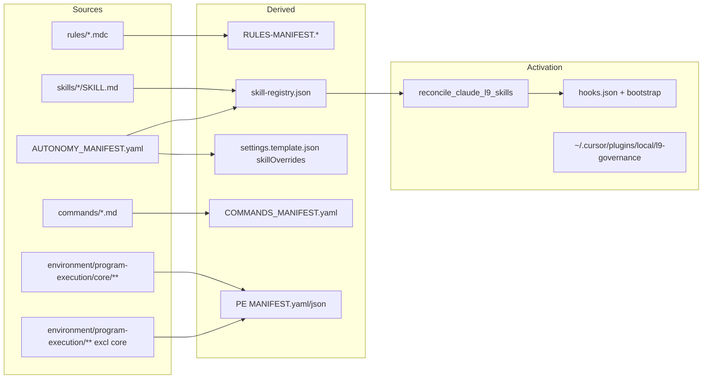

## PLAN: Auto-sync generated artifacts + activate-on-gate

### Objective
Stop `make pr` from failing on stale digests / unwired builds. Every derived artifact that today’s gates (or humans) can trip over must **auto-regenerate**, and local governance must **heal + verify activation** in the same gate so built work is immediately usable.

**Success:** After this ships, editing `rules/`, `skills/`, `commands/`, or PE trees causes generators to rewrite derived files; `make pr` **PASS**es once validators agree (no “stage and re-run because digests drifted”); local `make pr` also reconciles Claude skills/hooks wiring (or fails closed with a fix command, never a silent skip).

### Scope
**In:**
- Unified orchestrator + pre-commit/`run_pr_gate.sh` contract change (regen ≠ hard fail)
- Expand auto-regen: rules manifests, skill-registry, `skillOverrides`, `COMMANDS_MANIFEST.yaml`, PE `MANIFEST.yaml`/`MANIFEST.json`
- Orphan skill heal → append to `explicit_only` + regen + reconcile
- Local activation: reconcile apply+check, stop skipping `symlinks-check` on governance `make pr`, fail-closed hooks/bootstrap/plugin link
- Generator improvements (idempotent, exit semantics, single entrypoint)
- Doc surfaces: Makefile comments, brief AGENTS/`commands` notes if they describe the gate

**Out:**
- Seeding `integrity/manifest-lock.json` (high footprint; leave manual)
- Auto-writing `uv.lock` (keep `uv lock --check`; print exact regen command)
- WIP/pack manifests (excluded from pre-commit)
- Changing consumer-repo sessionStart architecture (reuse existing scripts)
- Dual-clone merge of `Cursor-Governance` vs `~/.cursor-governance` (call out as risk; sync edited SSOT files)

### Pre-Validation
| Check | Command / action | Pass criteria | Result |
|-------|------------------|---------------|--------|
| P0 Target bind | Write root = active governance clone (`/Users/ib-mac/Cursor-Governance`); live runtime = `~/.cursor-governance` | Dual-clone sync called out | PASS (known) |
| P1 Baseline inventory | Generators/validators/wiring from explore | Gap list complete | PASS — see inventory below |
| P2 Clean gate | `make pr` | PASS before claiming done | SKIPPED at plan time — run at implement |
| P3 Wiring | Existing `check_governance_wiring.sh`, `reconcile_claude_l9_skills.py`, `validate_skill_activation.py` | Scripts exist and reusable | PASS |

### Current inventory (what goes stale)



| Artifact | Today | Friction |
|----------|-------|----------|
| `rules/RULES-MANIFEST.*` | Autofix in pre-commit + `make pr` | Low; still FAIL-on-dirty |
| `skill-registry.json` | Autofix | Low; still FAIL-on-dirty |
| `settings.template.json` `skillOverrides` | Validate-only via `claude-skills-check` (**not** in `make pr`) | High |
| `commands/COMMANDS_MANIFEST.yaml` | Hand-maintained; no drift gate | High |
| PE `MANIFEST.yaml` / `MANIFEST.json` | Generators exist; validate not in `make pr` | High |
| Orphan `skills/*` not in AUTONOMY_MANIFEST | No gate (registry walks manifest→disk only) | High — built but never activated |
| Machine wiring / Claude reconcile | Skipped on `make pr` (`SKIP=symlinks-check`); sessionStart fail-open | High — built but not instantiated |

### Design decisions (locked)
1. **Stale digests never block `make pr`.** Regen → validate. If only generated files changed and validators PASS, print `WARN: stage generated files: …` and **continue** (exit 0). Hard-fail only if post-regen validate fails, or non-generated checks fail.
2. **One orchestrator:** [`ops/scripts/sync_generated_artifacts.py`](ops/scripts/sync_generated_artifacts.py) (new) called from pre-commit + [`ops/scripts/run_pr_gate.sh`](ops/scripts/run_pr_gate.sh).
3. **Orphan skills:** auto-append to `AUTONOMY_MANIFEST.yaml` `tiers.explicit_only` (safe default), then regen registry + reconcile. Print WARN naming the skill. (Prefer activation over silent omit.)
4. **CI vs local:** portable sync/validate always; machine heal (`reconcile --apply`, hooks/plugin link) only when `make pr` runs on a real local governance clone (detect via `$HOME/.cursor-governance` / writable `~/.cursor`).

### TODO Plan
| # | Task | Files | Effort | Risk |
|---|------|-------|--------|------|
| 1 | Add `sync_generated_artifacts.py`: detect dirty sources, call generators idempotently, return `{wrote:[], errors:[]}`, exit 0 when clean-or-healed | `ops/scripts/sync_generated_artifacts.py` | M | Med |
| 2 | Extend skill pipeline: generate `skillOverrides` into [`environment/claude-code/settings.template.json`](environment/claude-code/settings.template.json) from AUTONOMY `explicit_only`; orphan→`explicit_only` append | `ops/scripts/build_claude_skill_registry.py` or sibling `sync_skill_activation.py` | M | Med |
| 3 | New `generate_commands_manifest.py` + validate (every `commands/*.md` ↔ manifest entry; drop phantoms / add missing with frontmatter slash name) | `ops/scripts/generate_commands_manifest.py`, `validate_commands_manifest.py`, `commands/COMMANDS_MANIFEST.yaml` | M | Med |
| 4 | Wire PE regen: call existing [`environment/program-execution/core/scripts/generate_manifest.py`](environment/program-execution/core/scripts/generate_manifest.py) + adapter [`environment/program-execution/scripts/generate_manifest.py`](environment/program-execution/scripts/generate_manifest.py) when those trees change; then validate | orchestrator + `run_pr_gate.sh` | S | Low |
| 5 | Replace multi-hook regen with single pre-commit hook `sync-generated-artifacts`; keep ruff/path hooks | [`.pre-commit-config.yaml`](.pre-commit-config.yaml) | S | Low |
| 6 | Rewrite gate contract in [`run_pr_gate.sh`](ops/scripts/run_pr_gate.sh): always run orchestrator when any covered path dirty (or always on this repo); **do not exit 1** solely because generators wrote; run `claude-skills-check` / activation validate after sync | `ops/scripts/run_pr_gate.sh` | M | Med |
| 7 | Activation pack (local): stop `SKIP=symlinks-check` for governance clone in [`run_pr_precommit.sh`](ops/scripts/run_pr_precommit.sh); after sync run `reconcile_claude_l9_skills.py` apply then `--check`; harden `check_governance_wiring.sh` hooks/bootstrap/plugin to **FAIL** (IDE may stay WARN) | `run_pr_precommit.sh`, `reconcile_claude_l9_skills.py`, `check_governance_wiring.sh`, `validate_governance_symlinks.sh` | M | High |
| 8 | Generator quality: shared idempotent write helper; exit semantics documented; ensure volatile timestamps excluded (rules already); skill registry already content-idempotent | `generate_rules_manifest.py`, `build_claude_skill_registry.py`, new scripts | S | Low |
| 9 | Tests: unit tests for orchestrator (orphan append, commands drift, overrides sync, no-churn second run) | `tests/ops/scripts/test_sync_generated_artifacts.py` (+ commands/PE as needed) | M | Low |
| 10 | Docs: Makefile help + short note in AGENTS §6 / commands-index if gate described | `Makefile`, `AGENTS.md` (append-only), `commands/commands-index.md` if needed | S | Low |
| 11 | Sync edited files into `~/.cursor-governance` so live gate matches | dual clone | S | Med |

### Depth
**Friction contract change (critical):** Today [`run_pr_gate.sh`](ops/scripts/run_pr_gate.sh) fails if porcelain changes after generators — that *is* the “blocked on manifests” failure mode. New contract treats generator writes as heal, not failure.

**Orchestrator triggers (existence-based):**
- `rules/**` → RULES-MANIFEST
- `skills/**` or registry path → orphan heal + registry + skillOverrides
- `commands/*.md` or COMMANDS_MANIFEST → commands manifest
- `environment/program-execution/core/**` → core MANIFEST.yaml
- `environment/program-execution/**` (excl core) → adapter MANIFEST.json
- Always after skill sync: `validate_skill_activation.py` (portable)

**Activation (local only):**
- `python3 ops/scripts/reconcile_claude_l9_skills.py --root …` (apply) then `--check`
- Ensure `.claude/rules/l9-skill-routing.md` present (reconcile already owns this)
- `validate_governance_symlinks.sh` without soft-skip on hooks/bootstrap/plugin link
- CI / non-local: skip machine heal; keep portable sync+validate

**Preserved:** Changed-files security/ruff/pytest behavior; no scanner weakening; sessionStart remains primary consumer heal path but PR gate no longer assumes it.

### Doc / Root Surface Impact
| Surface | Action | Notes |
|---------|--------|-------|
| `Makefile` | Update | Document `sync-generated` / new gate behavior |
| `AGENTS.md` | Update (append) | §6 / pr gate: regen does not block; activation local |
| `README.md` | N/A | Dir blurb only unless pr section exists |
| `commands/commands-index.md` | Update if `/pr` or gate docs mention validate-only | |
| `.claude/README.md` | N/A unless skill tables change | |

### Dependencies
```text
1 → 2,3,4
1+2+3+4 → 5+6
6 → 7
2+3+8 → 9
6+7+9 → 10 → 11
```

### Milestones
| Milestone | Outcome | Unlocks |
|-----------|---------|---------|
| M1 Orchestrator + friction contract | Regen never sole cause of `make pr` FAIL | New generators |
| M2 Full derived coverage | Commands + PE + overrides + orphans covered | Activation |
| M3 Activate-on-gate | Local reconcile + wiring fail-closed | Docs/tests green |

### Checkpoints
| CP | After | Evidence | No-go |
|----|-------|----------|-------|
| CP1 | M1 | Touch a rule → manifest updates; second `make pr` PASS without re-stage requirement for digests | Keep old FAIL-on-dirty |
| CP2 | M2 | Add dummy command md / PE file / orphan skill in fixture test → artifacts update; validate PASS | Ship partial coverage |
| CP3 | M3 | `reconcile --check` PASS after `make pr` on governance clone; CI still green without machine paths | Soft-WARN only |

### Checklist
- [ ] Orchestrator exists and is sole regen entry from pre-commit + `run_pr_gate`
- [ ] FAIL-on-generator-dirty removed / replaced with WARN+continue
- [ ] skillOverrides auto-synced; orphans → explicit_only
- [ ] COMMANDS_MANIFEST generate+validate
- [ ] PE manifests regen when those trees change
- [ ] Local activation: reconcile apply+check; symlinks-check not skipped on governance `make pr`
- [ ] Hooks/bootstrap/plugin link fail-closed locally
- [ ] Tests for no-churn + heal paths
- [ ] Doc surfaces updated or N/A justified
- [ ] `make pr` PASS; dual-clone synced
- [ ] No commit/push unless requested

### Risks
| Risk | Mitigation |
|------|------------|
| Auto-append orphans surprises owners | `explicit_only` only + WARN; never auto_invoke |
| Machine checks break CI | Gate on local/gov-clone detection; CI portable-only |
| Dual-clone drift | Explicit sync step; prefer editing workspace then cp to `~/.cursor-governance` |
| PE manifest regen noisy | Trigger only when PE paths in change set |
| Wiring FAIL too strict for IDE | Keep IDE WARN; harden hooks/skills/plugin only |

### Estimate
**Total:** ~1–2 focused GMPs (or one large RUNTIME GMP)
**GMPs:** 1 preferred (orchestrator + gate + generators + activation + tests)

### Final Validation
| Check | Command | Pass criteria |
|-------|---------|---------------|
| V1 | `make pr` | PASS; no “autofixed digests — re-run” sole failure |
| V2 | Fixture: edit rule / skill / command / PE file | Derived artifacts update; second sync is no-op |
| V3 | `make claude-skills-check` + `reconcile --check` (local) | PASS |
| V4 | Doc / Root Surface Impact | Recorded |
| V5 | Honesty | Only claim checks actually run |

### Recommend
Chain to **`l9-gmp-protocol`** (tier RUNTIME) for implementation after approval.
