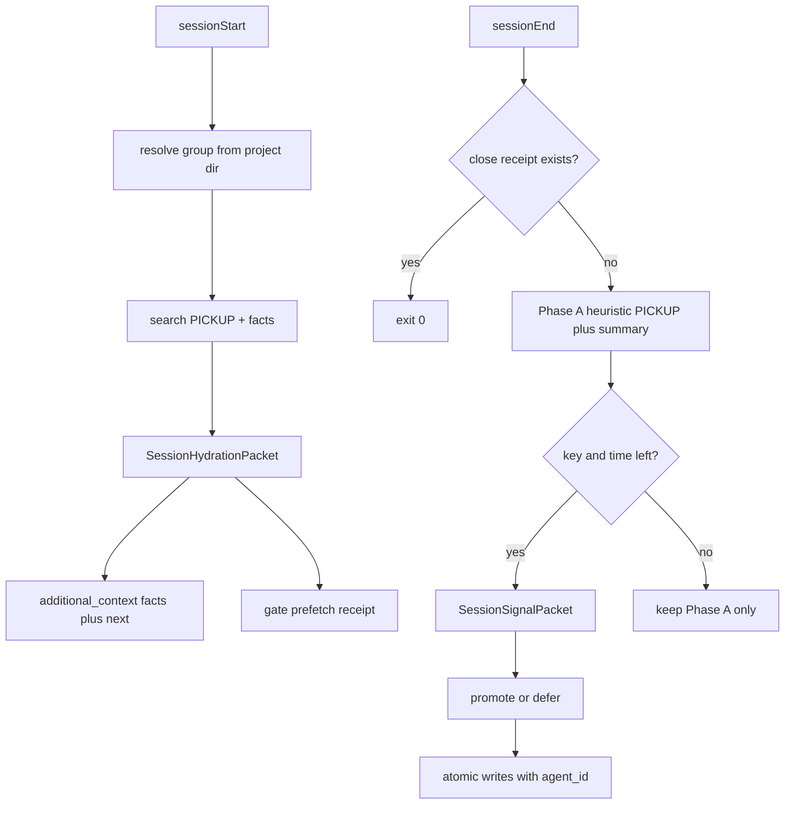

# Auto Graphiti hydrate + close pipeline (audited / aligned / hardened)

## Improve.md context lock

| Field | Value |
|-------|--------|
| **Target** | This plan + eventual implementation under `ops/graphiti/`, `ops/hooks/`, thin `environment/claude-code/` wraps |
| **Mode** | Plan artifact optimization (inspect → align → harden → rewrite plan). Execution deferred until user authorizes. |
| **Authority** | CANONICAL_LAW §2.1 Cursor-primary; ADR-0005 one memory store; rule 03 T1–T3; memory-enforcement contract; agent_registry; WIP packs as **design evidence only** |
| **Preserve** | Fail-open session hooks; T3 no full-chat ingest; PE Graphiti read-only; governance backup separate; no Dropbox; no second memory SSOT |
| **Convergence** | Plan is ready when every CRITICAL/HIGH gap below has an explicit remediation, Unknowns are labeled, and validation is evidence-based |

## Pass results (align → harden)

### CRITICAL — must fix in design (were under-specified)

1. **sessionEnd timeout budget** — [`hooks.json.template`](ops/hooks/hooks.json.template) gives Graphiti `sessionEnd` **30s**; current OpenAI call alone uses **25s**. A naïve “read transcript + distill + N writes” will routinely abort → silent no-PICKUP again.
   - **Hardening:** two-phase close inside 30s:
     - **Phase A (≤8s, no LLM):** resolve group, load/capped transcript excerpt, emit heuristic `pickup_context` + `session_summary` receipt with `agent_id` (always).
     - **Phase B (≤18s, LLM if key present):** distill SessionSignalPacket; atomic promote writes; on timeout/failure keep Phase A (never delete heuristic PICKUP).
   - Do **not** raise timeout above 30s without measuring Cursor’s hard cap; if later proven higher, bump template + install script together.

2. **Idempotency** — `sessionEnd` fires for `completed|aborted|error|window_close|user_close` and can re-fire. Without dedupe, duplicate PICKUPs and lesson spam.
   - **Hardening:** receipt key `session_id` (or `conversation_id`) under `.l9/memory/closes/{id}.json`; skip re-write if same head hash already closed; supersede prior PICKUP for same session via existing near-duplicate path.

3. **Hook cwd / group_id** — resolve from `CURSOR_PROJECT_DIR` / `workspace_roots[0]`, never `~/.cursor` cwd. Fail-open to readonly workspace group **blocks writes** today — must not silently “succeed” with zero writes; log WARN + Phase A skip reason.

4. **Root cause of “status-only hydrate”** — not missing search; **discard of inject payload** in orchestrator. Fix is compile+emit facts, not another health check.

### HIGH — alignment violations in prior plan draft

| Violation | Contract | Correction in this plan |
|-----------|----------|-------------------------|
| WIP as runtime SSOT risk | CANONICAL_LAW / no second tree | Copy slim schemas into `ops/graphiti/hydration/`; WIP remains design reference only |
| Claude implementing shared brain | §2.1 Cursor-primary | All compile/close logic in `ops/graphiti/hydration/`; Claude hooks thin-call only |
| `/end-session` still sounds required | User intent + skill demotion | Docs: normal close = hook; skill = **force-retry / offline recovery only** |
| agent_id only in description | agent_registry + memory_state | Required on EpisodeContract; validated; dual-stamp body envelope + `source_description` |
| Full 13-signal ontology in v1 | Improve simplicity | v1: promote/defer/reject + PICKUP + atomic kinds; ontology files optional later |
| Missing MEMORY_PIPELINE_MAP | skill authority refs | Create map as live path SSOT narrative |
| Generated llm-rules edit | regenerable | Edit source rules / policy; regenerate via project_llm_rules |

### MEDIUM — reliability / security

- **Secrets in transcripts:** reuse `episode_contract.redact_pii` before any LLM call or Graphiti write; never log raw transcript.
- **T3 forbid:** hard char cap on transcript excerpt (env `MEMORY_CLOSE_TRANSCRIPT_CHARS`, default ~12k); distill only structured packet.
- **OPENAI_API_KEY absent:** Phase A still writes; Phase B skipped (Skipped, not Failed).
- **Background agents:** if `is_background_agent=true` and no transcript, skip Phase B; Phase A only if project dir + meaningful git/activity signal.
- **backup_gate coexistence:** do not couple close_session to backup; keep separate hooks; close must finish inside its own 30s.
- **install propagation:** any hook/script change must update installed real-file bootstrap path (`install_cursor_hooks_bootstrap.sh` / sync self-heal) so SSOT edits reach `~/.cursor/hooks/`.

### LOW / leverage

- Prefer one library entrypoint: `python -m ops.graphiti.hydration.cli compile|close`.
- Do not invent Redis if unavailabile; PICKUP remains resume SSOT (already true).
- Historical episodes without agent_id: **Unknown / out of scope** for v1 (no rewrite campaign).

## Locked product decisions

1. **Transcript source:** prefer stdin `transcript_path`; else newest matching agent-transcript for `conversation_id` under `~/.cursor/projects/*/agent-transcripts/`.
2. **Hydration emit:** markdown block + compact JSON fence in `additional_context` (facts + `next_action_contract` mandatory when PICKUP exists).
3. **Budget:** `MEMORY_HYDRATION_CHAR_BUDGET` default 4000 for start context; close Phase A always ≤8s.
4. **Identity:** Cursor hooks set `L9_MEMORY_AGENT_ID=cursor`, `USER_ID=cursor_agent`; Claude keeps `claude-code` / contract defaults; `validate_memory_writer` rejects cross-stamp.
5. **Normal close:** X-out / window_close / completed → automatic Phase A (+ B when possible). User should not need `/end-session`.

## Target architecture (hardened)

## Workstreams (execution order)

### A. Promote slim contracts (ops SSOT)

Create `ops/graphiti/hydration/`:

- `session_hydration_packet.schema.yaml` — required: `packet_id`, `active_objective`, `context_slice`, `next_action_contract`, `group_id`, `agent_id`; optional anchors/artifacts/blockers
- `session_signal_packet.schema.yaml` — required: `packet_id`, `session_id`, `promotion_decisions[]`, `pickup`, `do_not_promote[]`
- `promotion_rules.yaml` — single file (promote thresholds + do_not_promote); adapted from WIP fuel scoring, not the full 13-type UI
- `__init__.py`, `compile_session_packet.py`, `close_session.py`, `transcript.py`, `cli.py`

WIP packs on `a57d49b` = design evidence only.

### B. agent_id on every write

1. Extend [`EpisodeContract`](ops/graphiti/episode_contract.py): required `agent_id`; optional `user_id`.
2. [`cmd_write`](ops/graphiti/graphiti_memory_client.py): resolve identity; refuse empty agent_id; envelope body; `source_description=agent={id};kind={kind}`.
3. Wire [`validate_memory_writer`](environment/claude-code/memory/memory_state.py) into [`graphiti_bridge`](environment/claude-code/memory/graphiti_bridge.py) + Cursor close path.
4. sessionStart env export identity for Cursor.
5. Tests for missing/cross-surface identity.

### C. sessionStart rehydration

Replace status-only emission in [`session_start_memory_orchestrator.sh`](ops/hooks/session_start_memory_orchestrator.sh):

- Call `compile_session_packet` with project dir + conversation id.
- Emit facts/`next=` into `additional_context`.
- Preserve inject/state hash for gates.
- Fail-open: on Graphiti down, emit explicit “hydration degraded” + empty next (no fake PICKUP).
- Claude [`memory_prefetch.py`](environment/claude-code/hooks/memory_prefetch.py) thin-wraps same compiler.

### D. sessionEnd automatic harvest

Rewrite [`graphiti-session-end.sh`](ops/hooks/graphiti-session-end.sh) → `close_session.py` with Phase A/B timeout budget and idempotent receipts.

Writes (all stamped):

- `pickup_context` (always when Phase A succeeds)
- promoted `lesson`/`insight`/`decision` (Phase B only)
- `session_summary` receipt (counts, packet_id, phase)

Demote [`l9-end-session`](skills/l9-end-session/SKILL.md) to force-retry. Update rules 03/87 + regenerate rules via generator.

### E. Claude parity (adapter only)

[`memory_writeback.py`](environment/claude-code/hooks/memory_writeback.py) calls shared `close_session` with `agent_id=claude-code`. No second close implementation.

### F. Validation (evidence, not theater)

| Check | Evidence |
|-------|----------|
| Unit | fixtures for PICKUP compile, transcript cap+redact, Phase A without API key, idempotent re-close |
| Timeout | synthetic clock/budget test that Phase A completes when Phase B would exceed remainder |
| Identity | write without agent_id fails; cursor≠claude-code stamp |
| Hook dry-run | sample sessionEnd stdin with/without transcript_path |
| Manual | X-out → Graphiti shows `agent=cursor` PICKUP; new session `additional_context` includes `next=` |
| Install | after change, `~/.cursor/hooks/graphiti-session-end.sh` matches SSOT (self-heal or reinstall) |

`make pr-check` on changed Python; do not weaken gates.

## Explicit Unknowns (do not pretend)

- Exact Cursor hard timeout ceiling beyond template **Unknown** until measured — design assumes 30s for Graphiti close hook.
- Whether `transcript_path` is always populated on `user_close` **Unknown** — hence agent-transcripts fallback.
- Graphiti MCP accepting structured agent metadata field **Unknown** — dual-stamp client-side.
- Historical episode backfill **out of scope**.

## Out of scope

- Nightly re-distill of historical mess
- Full 13-signal ontology UX
- Graphiti server schema change
- Redis requirement
- PE Graphiti write authority (stays read-only)

## Key files

| Area | Files |
|------|--------|
| Core | new `ops/graphiti/hydration/*`; [`episode_contract.py`](ops/graphiti/episode_contract.py); [`graphiti_memory_client.py`](ops/graphiti/graphiti_memory_client.py) |
| Cursor hooks | [`session_start_memory_orchestrator.sh`](ops/hooks/session_start_memory_orchestrator.sh); [`graphiti-session-end.sh`](ops/hooks/graphiti-session-end.sh); [`hooks.json.template`](ops/hooks/hooks.json.template) if timeout evidence requires |
| Claude wrap | [`memory_prefetch.py`](environment/claude-code/hooks/memory_prefetch.py); [`memory_writeback.py`](environment/claude-code/hooks/memory_writeback.py); [`graphiti_bridge.py`](environment/claude-code/memory/graphiti_bridge.py) |
| Docs | `docs/MEMORY_PIPELINE_MAP.md`; l9-end-session; rules 03/87 |
| Design evidence | WIP packs @ `a57d49b` (copy, don’t runtime-depend) |

## Done when (plan convergence)

- Auto-hydrate at sessionStart with visible `next=` when PICKUP exists
- Auto-close writes PICKUP without `/end-session`
- Every new episode searchable by `agent=`
- 30s budget cannot recreate “nothing written”
- Cursor-primary ownership preserved; Claude is wrap-only
- Unknowns listed; no fake completeness claims
