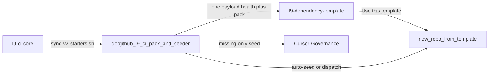

# Autonomous CI pack seed (improved l9-plan)

Supersedes the narrative-only draft at `~/.cursor/plans/autonomous_ci_pack_seed_721445f6.plan.md`.

**Depth:** deep (`route_plan.py --risk guarded --evidence conflicting`). Baseline gates all apply. **Status:** `partial` — structurally ready; U1/U2 remain; product code is not mutated until you Build / execute.

**Execute via:** `@environment/program-execution` → Program Lock/Controller → `@autonomy` (`/autonomy` → `l9-bounded-autonomy`) under Program lease. `autonomous_merge: false` in the packet; merge only after green+mergeable on this L4 plan stack.

**Machine SSOT:** PLAN_DOCUMENT JSON (schema 1.0.0) authored this turn. Workspace shell write was denied by the L4 branch-receipt gate, so `validate_plan_document.py` must be run as the first execute step after writing `.cursor/plans/autonomous_ci_pack_seed.plan.json`. Do not claim validator PASS until that command prints PASS.

## Improve.md findings on the draft (inspect-only)

Verified defects in the old plan (not applied to product code):

- Missing PLAN_DOCUMENT, PE envelope, DAG, side-effect matrix, `make pr-check`, stress/leverage, honest unknowns
- Four todos skipped preflight, proof, and converge waves
- Stale assumption that Cursor-Governance #124 is still open — **#124 merged 2026-08-13**; health files landed; `l9-analysis.yml` is still absent
- Local clone `/Users/ib-mac/quantum-l9-dotgithub` is on `fix/align-v1-tag-expected-sha`, not `origin/main` @ `002ef612c9d4187e710f18cb2c70e7ba6bc778ba`
- `repo_created` listener exists; **no org code sends it** (`gh search code org:Quantum-L9 repo_created` → only `auto-seed-new-repo.yml`)

## Bound target

- **Primary mutate repo:** [Quantum-L9/.github](https://github.com/Quantum-L9/.github) `main` @ `002ef612c9d4187e710f18cb2c70e7ba6bc778ba` (re-verify at execute start)
- **Consumers (seed only, missing-only):** [l9-dependency-template](https://github.com/Quantum-L9/l9-dependency-template) (alias of Constellation.PackageTemplate; only homemade `ci.yml` today) and [Cursor-Governance](https://github.com/Quantum-L9/Cursor-Governance) (has `l9-lint-test.yml`; no `l9-analysis.yml`)
- **Not this workspace’s current branch** for landing. KERNEL default: new branch from `.github` `origin/main`. Do not mix Cursor-Governance WIP.

## Mission

Two jobs were split; only health was automated. `ops/build-seed-payload.js` `ALL_CATEGORIES` is health-only (`codeowners`, `dependabot`, `governance`, `labels`, `community-health`, `issue-templates`, `pr-templates`, `on-org-update`). `l9-ci-pack/` already holds `l9-analysis.yml` + six governance YAMLs + lint templates, but the seeder never copies them. `docs/BOUNDARIES.md` still says this repo never writes CI callers — that blocked the hub. Correct split: **`.github` distributes the pack; Core executes.**

## Immutable baseline (reverify at execute)

- `.github` remote SHA: `002ef612c9d4187e710f18cb2c70e7ba6bc778ba`
- Pack present: `l9-ci-pack/workflows/{l9-analysis.yml,l9-lint-test.yml,l9-lint-test-node.yml}` and `l9-ci-pack/governance/{execution-profiles,promotion-policy,provider-requiredness,quality-thresholds,rule-modes,waivers}.yaml`
- Cursor-Governance workflows on main: `codeql.yml`, `l9-lint-test.yml`, `governance.yml`, `on-org-update.yml`, plus local gates — **no** `l9-analysis.yml`
- Overlap policy: `stop_if_dirty_overlaps_may_modify`
- On drift: `stop_and_replan`

## Execution envelope

- **write_allow:** `.github` paths listed in `gmp_handoff.may_modify` (payload JS, sync-org-files.sh, two seeder workflows, BOUNDARIES, DISTRIBUTION, templates/README, optional ruleset JSON exclude-only)
- **write_deny:** Cursor-Governance SSOT (`CANONICAL_LAW.md`, `AGENTS.md`), existing `l9-lint-test.yml`, template `ci.yml`, `l9-ci-core` internals, live org rulesets
- **commands allow:** git on a new `.github` branch, node payload listing, `gh workflow run` dry-run then filtered seed, `make pr-check` (or `.github` `ops/validate-starters.sh` + actionlint), `gh pr` create/merge on this stack
- **commands deny:** force-push, hard-reset, admin-merge, org-wide unfiltered live seed, `make sync-ci` as install, apply `org-required-analysis.json`
- **network:** `bounded_external_write` to GitHub (`Quantum-L9/.github`, then the two consumer repos)
- **secrets:** org `GH_TOKEN` already proven for workflow writes (PR #45); redaction required
- **autonomous_merge:** false in packet; L4 plan/Build stack merge after green+mergeable

## Payload mapping (T1)

Default-on category `l9-ci-pack` in [ops/build-seed-payload.js](https://github.com/Quantum-L9/.github/blob/main/ops/build-seed-payload.js) and the twin [ops/sync-org-files.sh](https://github.com/Quantum-L9/.github/blob/main/ops/sync-org-files.sh):

- `l9-ci-pack/workflows/l9-analysis.yml` → `.github/workflows/l9-analysis.yml` (calls Core @ `f88116503430aa18992b70d8d31063e34ff97ef1`)
- `l9-ci-pack/governance/*.yaml` → `.github/governance/`
- lint templates → `.github/workflows/` **missing-only** (do not overwrite Cursor-Governance `l9-lint-test.yml`)
- Leave template `ci.yml` in place

Mirror the category string in `seed-governance.yml` inputs help.

## Docs (T2) — same PR as payload

Rewrite the sentences that caused the split:

- [docs/BOUNDARIES.md](https://github.com/Quantum-L9/.github/blob/main/docs/BOUNDARIES.md): “a repo's CI caller is a separate file this repo never writes”
- [docs/DISTRIBUTION.md](https://github.com/Quantum-L9/.github/blob/main/docs/DISTRIBUTION.md): “CI execution workflows are never seeded”
- Seeder / auto-seed PR bodies: “No CI execution workflows”

New contract: this repo **ships** `l9-ci-pack` callers; it does **not** run ruff/pytest/semgrep. Optionally drop the Cursor-Governance exclude in `rulesets/org-required-analysis.json` so the declaration matches “every consumer.” **Do not apply that ruleset live** (`repository_id: 0` is broken).

## Create trigger (T3) — probe, not invent

Verified: only `auto-seed-new-repo.yml` listens for `repository_dispatch` / `repo_created`. Nothing in the org sends it.

- If a durable sender exists without a new human App install, add it
- If the only path needs a new App/webhook click, **stop T3** and keep template-first inherit + `workflow_dispatch` backfill
- Do not invent a second seeder

## DAG / waves

- **W0** T0-preflight (no mutate until SHA lock)
- **W1** T1-payload-pack → T2-docs-boundaries; T3-create-trigger after T1; T4-prove-dotgithub after T1+T2
- **W2** T5-converge-dotgithub
- **W3** T6-seed-consumers → T7-prove-inherit

**Critical path:** T0 → T1 → T2 → T4 → T5 → T6 → T7

**Leverage order:** T1 (shared payload) > T2 (docs that blocked the hub) > T4 (proof) > T3 (blank-repo path) > T0 > T5 > T6 > T7

**First live seed filter only:** `l9-dependency-template` and `Cursor-Governance`. No org-wide unfiltered seed in this program.

## Success properties (blocking)

- SP-01: execute-start `git rev-parse HEAD` on `.github` matches locked origin/main SHA
- SP-02: `buildSeedPayload` keys include `.github/workflows/l9-analysis.yml` and `.github/governance/execution-profiles.yaml`
- SP-03: dry-run for Cursor-Governance would-seed those pack files and does not propose overwrite of `l9-lint-test.yml`
- SP-04: after T6, `l9-dependency-template` default branch has `l9-analysis.yml`
- SP-05: Cursor-Governance `l9-lint-test.yml` blob SHA unchanged
- SP-06: `make pr-check` PASS on `.github` if present; else `ops/validate-starters.sh` + actionlint PASS

## Stress / rollback

Disconfirm: template copy omits workflows; missing-only overwrites lint; leftover BOUNDARIES text causes a later agent to strip the pack; `repo_created` never fires; analysis.yml seeds without governance YAMLs.

Rollback: close unmerged seed PRs; revert the `.github` merge on a new PR; scoped restore on the feature branch. No force-push. No ruleset apply/un-apply as rollback.

## Unknowns (honest)

- **U1 (probe):** durable `repo_created` sender without a new App install
- **U2 (probe):** whether GitHub “Use this template” copies `.github/workflows` and `.github/governance`

Neither blocks T1–T2–T5–T6. U2 failing makes auto-seed mandatory for every new repo — replan then, do not infer.

## Out of scope

Apply live org analysis ruleset; overwrite CG `l9-lint-test.yml`; retire template `ci.yml`; change Core internals; `make sync-ci` as install; edit Cursor-Governance law/AGENTS; force-push / admin-merge / second PAT.

## Convergence

- **current_state:** `partial`
- **implementation_ready:** false until execute-start reverify + JSON validator PASS
- **next:** `l9-ynp` then PE + `/autonomy` when you Build
- **stop_reason:** planning-only; `.github` product code untouched this turn
