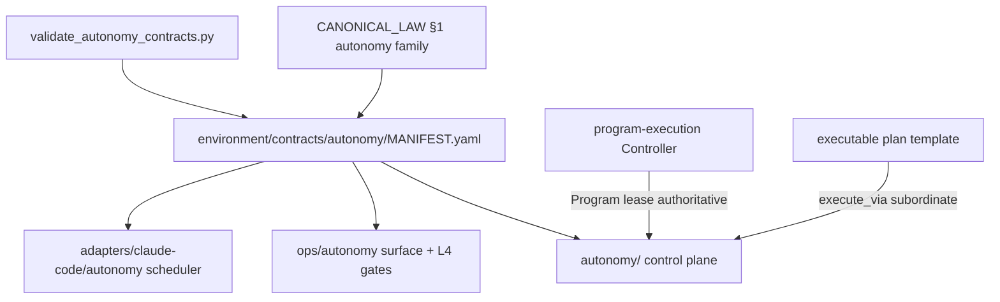

# Elevate Autonomy to First-Class Primitive

## Template / execute confirmation (authoritative)

| Claim | Status |
|-------|--------|
| Was this file filled from [`.cursor/plans/_TEMPLATE.plan.md`](.cursor/plans/_TEMPLATE.plan.md) / first-class SSOT [`canonical.template.executable_plan.v1.plan.md`](environment/contracts/execution/templates/canonical.template.executable_plan.v1.plan.md)? | **No** — it was produced by Cursor `CreatePlan` (short governance draft). `_TEMPLATE.plan.md` is only a local mirror of the SSOT; neither was the fill source. |
| Will Build/execute flow through `@environment/program-execution` with **max authorized `@autonomy`**? | **Yes — binding.** Free-form mutation from this draft alone is forbidden. `todo-00-reproject-pe-template` must complete first; then PE Controller is authoritative and `@autonomy` / `l9-bounded-autonomy` runs at full packet + L4 ceiling under the Program lease. |

**Rename rule:** after reproject, deliverable plan instance is `autonomy_first_class_<8hex>.plan.md` (not `_TEMPLATE.plan.md`, not this CreatePlan filename as SSOT).

### Execute via @environment/program-execution + max @autonomy (required)

```text
reprojected .plan.md  (intent / envelope / DAG / success properties)
        │ project
        ▼
@environment/program-execution   HOW work executes (authoritative)
  Blueprint → Program Lock → Controller admit/claim/render/verify/handoff
        │ lease (narrow-never-widen)
        ▼
root autonomy/  +  @autonomy (/autonomy → l9-bounded-autonomy)
  MAY the leased agent act?  (packet, lanes, PR poll) — owns_program_state: false
        │
        ▼
PE adapter (Cursor: cursor-foreground | cursor-background)
```

**Max autonomy (authorized ceiling — not widen-beyond-PE):**

1. Attach PE + `/autonomy`; campaign authorization **packet** (`A4_CAMPAIGN_BOUNDED_EXTERNAL_WRITE`, profile `pr-convergence`, `autonomous_merge: false` unless L4 plan-Build stack merge path applies after green).
2. Phase-0 action table with `work` + `poll` kinds; lane budget per skill (max 4 / 2 mutation).
3. Protocol A: spawn ready `work` Tasks in one message.
4. Protocol B: each `poll` as `Task` with `run_in_background: true`; main continues (no `AwaitShell` on poll).
5. L4 local autonomy: local commits through mutate/prove; **no mid-execution push**; kernels → `l4_local.py record-kernels` → `authorize-release` → `make pr`.
6. Protocol C/D: join + PICKUP; `l9-pr-remediation` Converge ≤3 cycles; resolve review threads; merge on this plan-Build stack; older open PRs bottom-up first.
7. Never force-push, admin-merge, expand scope past envelope, or let autonomy lease outlive Program lease.

## Decision lock (structured reasoning)

| Question | Choice | Why |
|----------|--------|-----|
| Scope | **1a — whole family registry** | Triple-home cognitive load needs one MANIFEST of SSOTs per concern. |
| Depth | **2a — registry + law + validators** | Plan-template elevation pattern; Phase-0 rail stays WIP for a later program. |

**Invariant retained:** PE owns program state; root autonomy `owns_program_state: false`.

```yaml
evidence_quality: high
decision_risk: guarded
action: proceed_with_validation
reconsider_if: family MANIFEST cannot name distinct SSOTs without inventing a fourth home; or Phase-0 is required for any registry check to pass
```

## Target architecture



## Mutation deliverables (envelope for todo-02)

### A. Family contract home

Create [`environment/contracts/autonomy/`](environment/contracts/autonomy/):

- `MANIFEST.yaml` registering:
  - `root-autonomy-control-plane` → `autonomy/`
  - `autonomy-surface-profile` → `ops/autonomy/surface_profile.yaml`
  - `l4-local-autonomy` → L4 CLI/gate/receipt paths from profile
  - `claude-code-bounded-autonomy-scheduler` → `environment/agents/adapters/claude-code/autonomy/`
- `README.md` + meta sidecars (`first_class_artifact: true`)
- Do **not** relocate runtime code into contracts/

### B. Law and discovery

- Append [`CANONICAL_LAW.md`](CANONICAL_LAW.md) §1 autonomy family row
- Update root README, PEER_EXECUTION, `commands/autonomy.md`, `l9-bounded-autonomy`, execution contracts README
- Fix stale `environment/claude-code/autonomy` cites only where this stack touches

### C. Fail-closed enforcement

- `ops/scripts/validate_autonomy_contracts.py` + `make autonomy-contracts-validate`
- Wire into `make autonomy-validate` and/or `program-execution-conformance`
- Add `environment/contracts/**` to `ORG_INVARIANTS.yaml` `protected_paths`

### D. Out of scope

- WIP Phase-0 autonomy rail promotion
- Rewriting root Wave runtime or Claude scheduler
- Cursor ask-free A4 velocity change
- Overturning PE lease authority
- Merging the three trees into one package

## Stress / blast radius

- **Blast:** law, contracts registry, Makefile/CI, discovery docs — high visibility, low runtime mutation if code stays put
- **Disconfirm:** “first-class” misread as peer-to-PE — mitigate with loud `owns_program_state: false`
- **Rollback:** revert contracts + law + validator commits

## Property evidence (todo-03)

- `validate_autonomy_contracts.py` PASS
- `make autonomy-validate` PASS
- `make program-execution-conformance` PASS
- `make pr-check` PASS
- Reprojected plan instance exists and cites SSOT + execute_via PE + `@autonomy`
