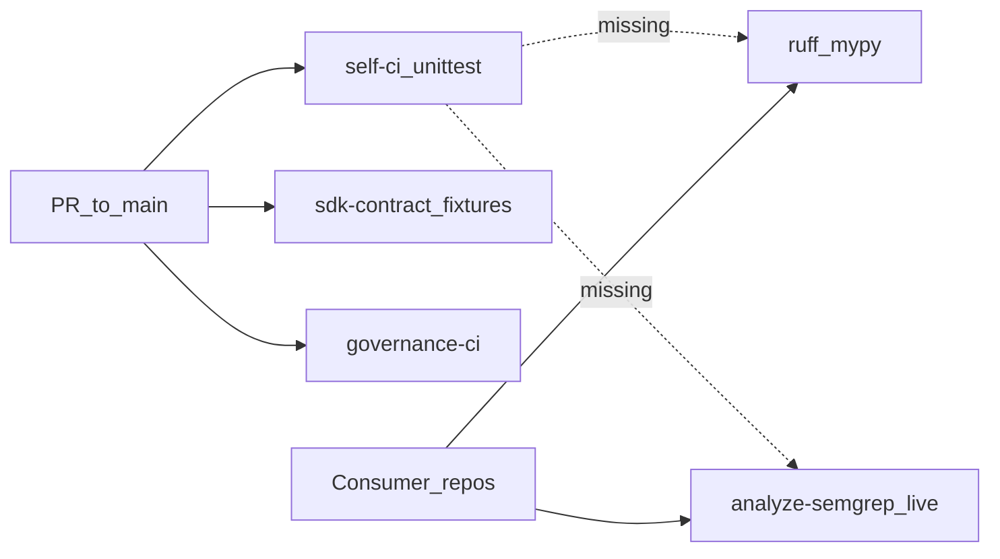

## PLAN: Beef up l9-ci-core self-CI (PR → main)

### Objective
Make this repo's PR CI dogfood the same quality surfaces Core ships to consumers (hygiene + governed Semgrep), without turning Core into a consumer of v1 kernels or inventing a parallel analysis stack.

**Success:** On a PR to `main` in `Quantum-L9/l9-ci-core`, GitHub runs (at minimum) unittest + ruff + mypy + live `analyze-semgrep` (SDK `semgrep run` + `gate evaluate` + publish), and AGENTS/`test_phase_scope` describe the real workflow set.

### Confirmed today — what runs on PRs to THIS repo

Only these three files auto-trigger on `pull_request` / `push` to `main`:

| Workflow `name:` | File | What it does |
|---|---|---|
| Core Phase 1 self-validation | [`.github/workflows/self-ci.yml`](.github/workflows/self-ci.yml) | `python3 -m unittest discover tests` only |
| SDK v2 contract validation | [`.github/workflows/sdk-contract-check.yml`](.github/workflows/sdk-contract-check.yml) | Provision pinned SDK + fixture CLI smoke (`semgrep normalize` / validate / `gate evaluate` / project) — **no live scan** |
| Phase 3 governance validation | [`.github/workflows/governance-ci.yml`](.github/workflows/governance-ci.yml) | `validate-governance` + `tests/governance/` |

Everything else under `.github/workflows/` is `workflow_call`-only (consumers/v1), or tag/schedule/dispatch (`release-validation.yml`, `regenerate-identity-maps.yml`).



Local agent runtime already expects hygiene ([`.l9/repo-workflow.json`](.l9/repo-workflow.json) `commands.check` = ruff + mypy); [`requirements-ci.txt`](requirements-ci.txt) even comments that a lint-test workflow installs it — but **no GitHub workflow on Core runs that path**.

### Gap matrix (consumer surfaces vs Core PR CI)

| Surface | Offered to consumers | On Core PRs today | Plan |
|---|---|---|---|
| unittest / contract / governance | N/A (Core-only) | Yes | Keep |
| ruff + mypy | `docs/templates/l9-lint-test.yml`, v1 `pr-pipeline.yml`, local `make` check | **No** | Wire into `self-ci.yml` |
| pytest | consumer lint templates | No (Core uses unittest) | Out — keep unittest as Core test SSOT |
| Live Semgrep + SDK gate + publish | `analyze-semgrep.yml` (new kernel) | **No** (fixtures only in sdk-contract) | Thin self caller |
| Legacy normalize-only template | `docs/templates/l9-analysis.yml`, presets still on external `semgrep scan` | N/A | Companion SSOT cutover (not self-CI) |
| Biome / Node lint | TS presets / `l9-lint-test-node.yml` | N/A (Python control plane) | Out |
| gitleaks / pip-audit | v1 `security.yml` | No | Optional Phase 3 thin caller (read-only) |
| Scorecard / SBOM / CodeQL / Semgrep Cloud | v1 scorecard/sbom; CodeQL absent in-tree | No | Out of this plan (scorecard SARIF is artifact-only; no analysis SARIF actions found despite earlier PR titles) |
| Org required-check names | draft ruleset for consumers | Core explicitly excluded ([`docs/governance/org-ruleset/README.md`](docs/governance/org-ruleset/README.md)) | Document Core check names; optional Core ruleset later |

**Default approach (locked):** hygiene-in-`self-ci` + dogfood `analyze-semgrep` + docs/tests alignment. Not max v1 parity.

### Scope
**In:**
- Extend [`.github/workflows/self-ci.yml`](.github/workflows/self-ci.yml) with blocking ruff/mypy (match repo-workflow `check`)
- Add self-only PR caller for [`.github/workflows/analyze-semgrep.yml`](.github/workflows/analyze-semgrep.yml) (Python language)
- Audited trust-boundary update in [`tests/workflows/test_workflow_permissions.py`](tests/workflows/test_workflow_permissions.py) for that caller's `checks: write`
- Update workflow inventory tests + [`AGENTS.md`](AGENTS.md) (frozen-seven / dormant-ops / callable table are stale vs [`tests/workflows/test_phase_scope.py`](tests/workflows/test_phase_scope.py))
- Ensure Core [`.github/governance/`](.github/governance/) is sufficient for live analysis (add `semgrep-policy.yaml` / identity-map only if resolve/run fails without them)

**Out:**
- Calling v1 kernels as Core's primary CI (`pr-pipeline`, scorecard, sbom, nightly)
- Node/Biome CI on Core
- Changing consumer org ruleset membership
- Rewriting all presets/templates to `analyze-semgrep` in the same GMP (schedule as companion milestone only)
- Force-adding CodeQL/Semgrep Cloud (not in-tree deliverables)

### Pre-Validation (mandatory)
| Check | Command / action | Pass criteria |
|-------|------------------|---------------|
| P0 Target bind | This repo: `/Users/ib-mac/l9-ci-core` | Single authorized target |
| P1 Baseline inventory | This plan's "Confirmed today" + gap matrix | Gap list complete |
| P2 Clean gate | `make pr-check` (or `make agent-check` / unittest discover) before edits | PASS; **no commit/push** from plan mode |
| P3 Hook/env | Shell merge-gate hook was broken during planning (`merge_gate_wrap.py` missing) | Re-run Pre-Validation after governance wire; do not edit until green |

### TODO Plan
| # | Task | Files | Effort | Risk |
|---|------|-------|--------|------|
| T1 | Add `lint` job (or steps) to self-ci: install `requirements-ci.txt` + `requirements-repo-runtime.txt`, run `ruff check .`, `ruff format --check .`, `mypy` — keep existing unittest job | [`.github/workflows/self-ci.yml`](.github/workflows/self-ci.yml), possibly [`requirements-ci.txt`](requirements-ci.txt) comment accuracy | M | Med — first-time CI mypy may surface existing debt |
| T2 | Create thin self caller `self-analysis.yml`: `on: pull_request` + `push: main`; `uses: ./.github/workflows/analyze-semgrep.yml` with `profile: pr_fast`, `language: python`, `matrix-id: self-semgrep`; job-level `checks: write` only on the calling job that needs it | [`.github/workflows/self-analysis.yml`](.github/workflows/self-analysis.yml) (new) | M | High — trust boundary + finding noise |
| T3 | Extend `WRITE_EXCEPTIONS` + PR-trigger policy for `self-analysis.yml` (audited comment: dogfood caller; fork PRs still get read-only token from GitHub) | [`tests/workflows/test_workflow_permissions.py`](tests/workflows/test_workflow_permissions.py), [`tests/workflows/test_phase_scope.py`](tests/workflows/test_phase_scope.py) | S | High — explicit trust-boundary change |
| T4 | Governance completeness for live analysis on Core (probe resolve + `semgrep run`; add preset-parity policy/identity-map under `.github/governance/` only if required) | [`.github/governance/`](.github/governance/), maybe copy from [`presets/python/.github/governance/`](presets/python/.github/governance/) | S–M | Med — wrong mode could block all PRs |
| T5 | Rollout mode: land analysis in **advisory** first (override in Core `rule-modes.yaml` for `pr_fast`/semgrep), one green week, then restore **blocking** | [`.github/governance/rule-modes.yaml`](.github/governance/rule-modes.yaml) | S | Med — product judgment on when to block |
| T6 | Doc alignment: AGENTS frozen list → real inventory; mark `analyze-semgrep` as the consumer kernel; fix §7 dormant table (`semgrep run` / `gate evaluate` are live in analyze path); clarify self vs consumer callable table | [`AGENTS.md`](AGENTS.md) | S | Low |
| T7 | Optional Phase 3: thin read-only `self-security.yml` calling [`security.yml`](.github/workflows/security.yml) (gitleaks + pip-audit) | new workflow + phase_scope test | S | Low |
| T8 | Companion (separate GMP): cut `docs/templates/` + presets from external `semgrep scan` to `analyze-semgrep` + refresh stale `L9_CORE_REF` pins (`f881165…` → current) | [`docs/templates/l9-analysis.yml`](docs/templates/l9-analysis.yml), [`presets/*/`](presets/) | L | Med — consumer blast radius |

### Depth
- **Do not expand `invoke-sdk` allowlist** for this work — `analyze-semgrep.yml` already runs `semgrep run` / `gate evaluate` via the provisioned executable (by design).
- **Do not add an 8th reusable analysis kernel** — reuse `analyze-semgrep.yml`; only add a self-only trigger stub (authorized by this plan; update phase_scope expected set).
- Preserve Core ownership: orchestration/publication only; no provider parsers in Core.
- First mypy/ruff failures are **codebase** debt — fix in the same GMP rather than weakening gates.
- Live Semgrep findings: prefer fixing code or governance waivers/policy; no NOSONAR-style suppressions.

### Doc / Root Surface Impact (mandatory)
| Surface | Action | Files / notes |
|---------|--------|---------------|
| [`AGENTS.md`](AGENTS.md) | Update | T6 — frozen workflows, callable table, §7 dormant ops |
| [`README.md`](README.md) | Update if it claims self-CI = unittest-only | T6 |
| [`docs/governance/org-ruleset/README.md`](docs/governance/org-ruleset/README.md) | Update | Note Core check names after beef-up (still separate from consumer ruleset) |
| [`docs/consumer-lint-test.md`](docs/consumer-lint-test.md) | N/A | Consumer-facing; Core dogfoods same tools via self-ci, not this doc |
| `CHANGELOG.md` / `CLAUDE.md` / `ARCHITECTURE.md` | N/A | Not present / not required for this change |
| Root-file protection | N/A | No new root files |

### Dependencies
```
T1 (hygiene) ──────────────┐
T4 (gov pack) → T2 (caller) → T3 (permission tests) → T5 (advisory→blocking)
T6 (docs) after T2 shape known
T7 optional after T1–T5 green
T8 companion GMP after Core dogfood proves analyze-semgrep
```

### Milestones
| Milestone | Outcome | Unlocks |
|-----------|---------|---------|
| M1 Hygiene on PR | ruff+mypy required on Core PRs | Trust that local `make check` ≡ CI |
| M2 Live analysis dogfood | `self-analysis` green in advisory | Confidence to block on SDK gate |
| M3 Blocking + docs | Blocking mode + AGENTS accurate | Honest control-plane CI story |
| M4 Optional security | gitleaks/pip-audit on Core | Supply-chain hygiene without v1-as-primary |
| M5 Companion SSOT | Templates/presets call analyze-semgrep | Consumers match what Core dogfoods |

### Checkpoints
| CP | After | Evidence | No-go |
|----|-------|----------|-------|
| CP1 | M1 | PR check shows ruff+mypy; unittest still green | Revert lint job; fix debt offline |
| CP2 | M2 | Artifact upload + check/advisory publish on a Core PR; no permission-test failures | Keep advisory; do not block merge on analysis |
| CP3 | M3 | `rule-modes` blocking + AGENTS matches `test_phase_scope` | Stay advisory until finding rate acceptable |

### Checklist
- [ ] Pre-Validation recorded (`make pr-check` / unittest) after hook fix
- [ ] T1 self-ci lint/type wired and green
- [ ] T2/T3 self-analysis + WRITE_EXCEPTIONS authorized and tested
- [ ] T4/T5 governance mode rollout complete
- [ ] T6 AGENTS/org-ruleset notes updated
- [ ] Doc / Root Surface Impact closed
- [ ] Final Validation PASS
- [ ] No commit/push unless user requests

### Risks
| Risk | Mitigation |
|------|------------|
| Existing ruff/mypy debt fails first PR | Run locally first; fix codebase in same GMP |
| Live Semgrep floods blocking failures | Advisory first (T5); tune policy/waivers |
| `checks: write` on PR caller | Audited WRITE_EXCEPTIONS; job-scoped perms; never `pull_request_target` |
| phase_scope / AGENTS drift again | Single inventory SSOT = `test_phase_scope.py`; AGENTS must mirror it |
| Confusing self-ci with consumer orchestration | Keep reusable kernels `workflow_call`-only; self stubs are trigger-only |

### Estimate
**Total:** ~1–2 GMPs for M1–M3; optional M4 half-day; M5 separate consumer-facing GMP.
**GMPs:** 2 (Core self-CI) + 1 companion (template cutover).

### Final Validation (mandatory)
| Check | Command | Pass criteria |
|-------|---------|---------------|
| V1 Plan completeness | Review vs plan-workflow template | All required sections present |
| V2 Local gates | `make pr-check` + `python3 -m unittest discover tests` | PASS; no scanner weakening |
| V3 Doc surfaces | AGENTS + org-ruleset note | Update TODOs done or N/A justified |
| V4 Remote | Open/observe a Core PR | New checks visible; advisory/blocking per T5 |

### Recommend next
After approval → `l9-ynp` then `l9-gmp-protocol` starting at **T1** (hygiene), then **T2–T5** (dogfood analysis).
