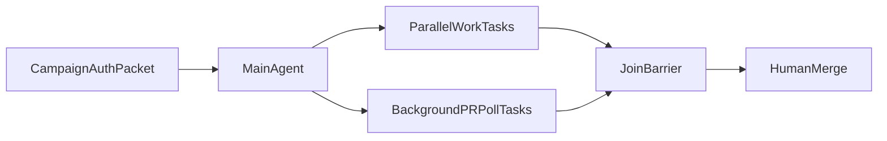

# Bounded Autonomy SOP — Improve.md hardened plan

**Improve mode:** `full_improvement` on the **plan artifact** (inspect → root-cause thinness → remediate structure → validation surface → converge).
**Invariant (user):** rename **envelope → packet** everywhere (`campaign authorization packet`).
**Sources:** subagent Claude-env inventory, chat SPEC (29 musts), ADR-0001, `settings.template.json`, `pr-convergence.json`, fail-open hooks, `l9-structured-reasoning`, `l9-recursive-optimization`.

---

## Improve pass findings (plan defects fixed this revision)

| Finding | Severity | Remediation in this plan |
|---|---|---|
| Milestones were a 5-step blur | High | Split **M0–M7** with exit checklists |
| Validation was a bullet list (no evidence statuses) | High | **Validation matrix** with Passed/Failed/Skipped/Unknown per Improve.md |
| “Envelope” collided with L9 PacketEnvelope anti-pattern language | Med | Rename to **packet**; clarify not TransportPacket wire format |
| Protocol B acceptance not checkable per file | High | Per-reference **Definition of Done** checkboxes |
| Push-authority risk under-checked | High | Packet schema + negative tests in validation |
| Claude vs Cursor edit boundaries soft | Med | Forbidden-edit gate in M0 + M6 grep |

---

## Locked terminology

| Term | Meaning |
|---|---|
| **Campaign authorization packet** | Phase-0 structured authority object created by `/autonomy` (or explicit user campaign phrase). Grants scoped remediation commit/push on declared PR branches only. **Not** a TransportPacket / PacketEnvelope wire object. |
| **Action** | Row in Phase-0 graph: `id`, `depends_on[]`, `mutation`, `lock_keys[]`, `isolation_key`, `kind` (`work`\|`poll`) |
| **Poll worker** | Background `Task` with `run_in_background: true` owning `pr:<n>` |
| **Join** | Fan-in before merge-ready claim |
| **Merge gate** | Report-only eligibility; human merges |

**Forbidden synonym in shipped artifacts:** `envelope` (use `packet`).

---

## Acceptance criteria (user-recognizable done)

1. Demo: poll PR in background while main continues other Phase-0 work (no main CI block / no `AwaitShell` on poll).
2. Skill+rule text make main CI-watch while poll could own PR a **protocol violation**.
3. ≥2 independent ready actions launch as parallel Tasks in one message.
4. Poll ≤3 remediation cycles then escalate; never merges; notify-on-state-change only.
5. Human merge gate stops at checklist.
6. Artifacts thick (Protocol B + templates + packet), not file-list-only.
7. Skill explicit-only; Graphiti-primary handoff (#43); `/autonomy` registered (#39).
8. `validate_autonomy.py` PASS; Claude `autonomy/*.py` / hooks / settings permissions **unchanged**.

---

## Dual-surface model (unchanged substance)

- **Claude:** machine law = permissions + `autonomy/*.py`. This ship: README cross-link only.
- **Cursor:** SOP = skill + `/autonomy` + agent_requested rule mapping law onto Task/background poll.
- Hooks remain fail-open; do not invent Cursor PreToolUse merge enforcement this ship.



---

## Campaign authorization packet (was envelope)

### Packet schema (must appear in Phase-0 and `references/campaign-authorization-packet.md`)

```yaml
packet_id: string          # e.g. autonomy-2026-08-02-1
authority: A4_CAMPAIGN_BOUNDED_EXTERNAL_WRITE
profile: pr-convergence
autonomous_merge: false
declared_prs: [number]     # lock keys pr:<n>
declared_branches: [string]
allowed_inside_packet:
  - remediate_until_green   # ≤3 fix-push cycles per PR
  - commit_scoped_on_declared_branch
  - push_non_force_declared_branch
  - inspect_ci_and_comments
forbidden_inside_packet:
  - merge_pull_request
  - force_push
  - admin_merge
  - expand_scope
  - commit_secrets
  - weaken_tests_for_green
created_by: "/autonomy" | "explicit_user_phrase"
```

### Rules

1. `/autonomy` or explicit campaign phrase **creates** the packet (documented in Phase-0).
2. Inside packet: poll/remediation **may** commit+push only to declared PR branches (ADR remediation-ON).
3. Outside packet: normal Cursor commit/push approval; poll is **watch-only** + escalate.
4. Packet is stated on first screen of `/autonomy` — not a silent waiver of `99-no-auto-commit`.

---

## Doctrine → Cursor map (implement in `doctrine-map.md`)

| Law | Cursor mechanism |
|---|---|
| Dependency readiness | Phase-0 `depends_on[]` |
| Locks / isolation | `lock_keys` + `isolation_key` |
| 4 / 2 lanes | Max 4 Tasks / 2 mutation |
| waiting_external releases compute | `kind:poll` + `run_in_background:true`; main continues |
| waiting_external preserves locks | Poll owns `pr:<n>`; main must not push same PR |
| Join barrier | All Tasks terminal + evidence |
| merge_coordinator | Checklist only; no merge without user |
| Remediation skill | Packet + `l9-pr-remediation` / `babysit` |
| Forbidden actions | Copied into skill+rule |
| subscribe_pr_activity | Prefer if MCP; else backoff 30s→2m; idle escalate 30m |
| #41 routing | Explicit-only; ≤2 supporting |
| #43 handoff | Graphiti-primary PICKUP |
| Fail-open hooks | Rule `agent_requested` via `/autonomy` |

---

## Protocols (substance retained; DoD added)

### Protocol A — Parallel non-dependent fan-out

- Phase-0 before any Task; locks; single-message multi-Task for all ready work.
- Return schema: `status`, `files_touched`, `evidence`, `blockers`.

### Protocol B — PR-poll while main continues (centerpiece)

```text
Task: run_in_background: true
      subagent_type: generalPurpose
      description: "PR #<n> poll/remediate"
      prompt: includes campaign authorization packet fields
```

- Loop: status → checks → comments → conflicts.
- Remediate under packet ≤3 cycles; never merge/force-push.
- Notify only on state change / terminal / escalate.
- Main **immediately continues**; must not `AwaitShell` / CI-watch that PR.
- Cadence: 30s→60s→120s or event-driven; 30m idle → notify main.

### Protocol C — Join + merge gate

Exact-SHA, required checks, no conflicts, no blocking threads, deps merged, proof note → human only.

### Protocol D — Routing + handoff

Explicit-only skill; Graphiti-primary campaign close.

---

## Milestones M0–M7 (granular)

### M0 — Freeze (no product files yet)

**Exit checklist**

- [ ] Packet terminology locked; zero plan use of “envelope”
- [ ] Forbidden edit list acknowledged (settings permissions/hooks/`autonomy/*.py` / #42)
- [ ] Lane budget 4/2 and autonomous_merge=false restated
- [ ] Branch strategy noted: implement on branch from `origin/main` (not mix with #44/#45 unless stacking)

### M1 — Doctrine + protocol references

**Create**

- `skills/l9-bounded-autonomy/references/doctrine-map.md`
- `.../campaign-authorization-packet.md`
- `.../parallel-nondependent.md` (A)
- `.../pr-poll-subagent.md` (B)
- `.../join-and-merge-gate.md` (C)
- `.../skill-routing.md` + `campaign-handoff.md` (D)
- `.../claude-code-bridge.md`

**Exit checklist (per file)**

- [ ] doctrine-map cites ADR-0001, settings allow/deny posture, profile parallelism flags, fail-open hooks
- [ ] packet schema YAML present; allowed/forbidden lists match profile spirit
- [ ] Protocol B contains exact Task spawn block + main-continue + anti-patterns + cadence
- [ ] Protocol A contains lock/budget/single-message rules
- [ ] Protocol C checklist mirrors `pr-convergence.json` `merge_gate`
- [ ] Bridge says: Claude surface → `autonomy/cli.py`; do not invent second scheduler
- [ ] Word `envelope` absent under `references/`

### M2 — Templates + examples

**Create:** `prompt-templates.md`, `examples.md`

**Exit checklist**

- [ ] Templates: `poll_worker`, `mutation_lane`, `readonly_lane` — each embeds packet fields
- [ ] Example 1: poll while main continues (the “especially” ask)
- [ ] Example 2: parallel CI jobs + background poll
- [ ] Notify-on-state-change contract in poll template

### M3 — Skill pack entrypoint

**Create:** `skills/l9-bounded-autonomy/SKILL.md`

**Exit checklist**

- [ ] Frontmatter: `disable-model-invocation: true`, description triggers `/autonomy` + parallel + PR poll
- [ ] Mandates Protocol B (MUST spawn background poll for PR waits)
- [ ] Mandates Protocol A (MUST multi-Task ready work)
- [ ] Links all references; forbidden list; packet creation rule
- [ ] Grep-ready phrases present: `run_in_background`, `main continues`, `campaign authorization packet`, `must not block the main turn on CI` (or equivalent AwaitShell ban)

### M4 — Slash command + rule + command manifests

**Create/edit**

- `commands/autonomy.md`
- `rules/88-bounded-session-autonomy.mdc` (agent_requested + description)
- `commands/COMMANDS_MANIFEST.yaml`, `commands/commands-index.md`

**Exit checklist**

- [ ] `/autonomy` steps: create packet → Phase-0 table → validate locks/budgets → spawn work Tasks → spawn background polls → continue → join → human merge → optional end-session fields
- [ ] Rule bullets: parallel preference; **require** background poll on PR waits; forbid main CI block; never auto-merge; explicit-only composition
- [ ] Manifest + index entries for `autonomy`
- [ ] Rule description non-empty (agent_requested gate)

### M5 — Wiring + cross-links

**Edit**

- `skills/AUTONOMY_MANIFEST.yaml` (skill + `claude_routing.routes`; **not** auto-force primary)
- Rebuild `environment/claude-code/generated/skill-registry.json`
- `environment/claude-code/autonomy/README.md` — Cursor SOP link only
- `skills/l9-pr-remediation/SKILL.md` — poll-worker under packet
- `skills/l9-end-session/SKILL.md` — campaign PICKUP fields
- `skills/l9-cli-optimization` cite if present
- `AGENTS.md` — `/autonomy` pointer
- `Makefile` — `autonomy-validate` → `validate_autonomy.py`

**Exit checklist**

- [ ] Registry hash/reconcile path consistent with manifest
- [ ] `claude_routing` route exists for `/autonomy` / PR convergence signals without putting skill in auto-force `primary_skills`
- [ ] Claude README link resolves to skill path
- [ ] No settings.template.json / hooks / autonomy/*.py diffs

### M6 — Validation matrix (Improve.md evidence statuses)

Run against **exact final tree**. Record each row: Passed | Failed | Skipped | Unknown + evidence.

| ID | Check | How | Required |
|---|---|---|---|
| V1 | Autonomy runtime untouched | `git diff --stat origin/main -- environment/claude-code/autonomy/*.py environment/claude-code/hooks environment/claude-code/settings.template.json` → empty (README-only ok) | Yes |
| V2 | `validate_autonomy.py` | `python3 environment/claude-code/autonomy/validate_autonomy.py` | Yes |
| V3 | Skill activation / registry | `make claude-skills-check` or `validate_skill_activation.py` after registry rebuild | Yes |
| V4 | Rules validate | `make rules-validate` (after rule + manifest regen if needed) | Yes |
| V5 | Phrase contract | `rg -n 'run_in_background|main continues|campaign authorization packet|must not block' skills/l9-bounded-autonomy` | Yes |
| V6 | No “envelope” leak | `rg -n 'envelope' skills/l9-bounded-autonomy commands/autonomy.md rules/88-bounded-session-autonomy.mdc` → no authority-sense hits | Yes |
| V7 | Packet schema present | File `campaign-authorization-packet.md` + YAML fields listed above | Yes |
| V8 | Protocol B spawn contract | `pr-poll-subagent.md` contains `run_in_background: true` and anti-AwaitShell/main-continue | Yes |
| V9 | Command registered | `rg autonomy commands/COMMANDS_MANIFEST.yaml commands/commands-index.md` | Yes |
| V10 | Explicit-only frontmatter | SKILL.md has `disable-model-invocation: true` | Yes |
| V11 | Supporting validators | `make claude-env` if cheap; else Skipped with reason | Prefer |
| V12 | Changed-files PR gate | `make pr` / `make -C $HOME/.cursor-governance pr WS=$(pwd)` on autonomy branch | Yes before PR |
| V13 | Manual Protocol B dry-read | Human/agent walk Example 1 against skill text (structural, not live multi-agent) | Yes |
| V14 | Live multi-agent demo | Optional; Unknown unless user authorizes live Task spawn in session | Optional |

**Halt rule (Improve):** any Required row Failed → do not claim M6 complete; remediate root cause; do not weaken checks.

### M7 — Hygiene + convergence

**Exit checklist**

- [ ] Diff scoped to allowed paths only
- [ ] No TODO/FIXME/placeholder presented as done
- [ ] Validation matrix filled (no silent skips of Required)
- [ ] Convergence block written (below)
- [ ] Ready for user-authorized commit/PR (do not commit/push unless asked)

---

## File inventory (create / edit / forbid)

### Create

`skills/l9-bounded-autonomy/` full tree listed in M1–M3; `commands/autonomy.md`; `rules/88-bounded-session-autonomy.mdc`.

### Edit (minimal)

AUTONOMY_MANIFEST, COMMANDS_MANIFEST, commands-index, Claude autonomy README (link), l9-pr-remediation, l9-end-session, AGENTS.md, Makefile (`autonomy-validate`), skill-registry.json (generated).

### Forbid this ship

`settings.template.json` permissions/hooks; `autonomy/*.py`; `hooks/*`; PR #42 pack; global Cursor waive of commit/push outside packet.

---

## Implementation order (maps to milestones)

M0 → M1 → M2 → M3 → M4 → M5 → M6 → M7

---

## Opportunity cost

Skipped: Cursor fail-closed PreToolUse merge gate; porting `state_store`/leases; copying Claude push allow-list globally; PR #42 memory contract; live V14 unless authorized.

---

## Convergence block (Improve.md / recursive-optimization)

| Field | Status |
|---|---|
| Plan thinness (milestones/validation) | **Converged** this revision |
| Packet rename | **Converged** (envelope → packet) |
| Doctrine dual-surface | **Converged** (implement Cursor SOP; Claude README-only) |
| Implementation | **Not started** — awaiting execute |
| Runtime validation evidence | **Unknown** until M6 runs |
| Live poll demo (V14) | **Unknown** until authorized |

**Stop condition for further plan passes:** only if user changes packet semantics, surface split, or adds fail-closed Claude hooks to scope.
