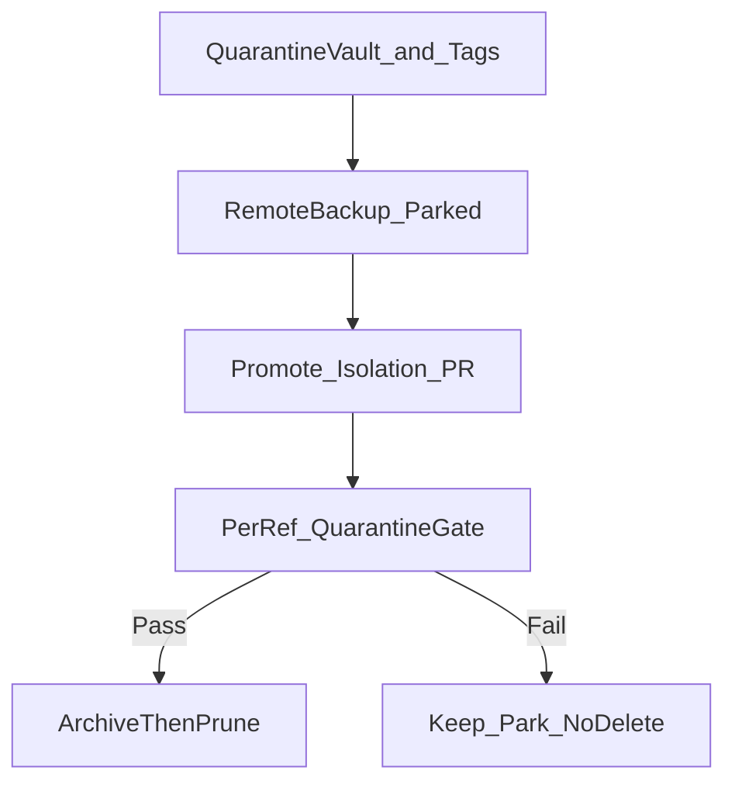

# Branch triage: quarantine-first (structured-reasoning audit)

## Decision record (l9-structured-reasoning)

```yaml
task_kind: plan
reasoning_depth: standard
epistemic_methods: [deductive, comparative, abductive]
risk_class: guarded   # remote branch delete + worktree remove are hard to undo
evidence_state: sufficient
output_profile: implementation_plan
evidence_quality: high
decision_risk: guarded
action: proceed_with_validation
objective: >
  Land only valuable unfinished work, and make prune of absorbed tips
  incapable of destroying recoverable history or dirty trees.
```

**Decision:** Replace “delete stale after isolation PR” with a **quarantine-first** pipeline: vault → tag → remote-backup parked work → promote isolation → **gated** prune.

**Why the prior prune step was weak:** tip ancestry/`git cherry` proves *commits* are on main, but does not protect (1) dirty worktrees, (2) discoverability after `branch -D`, (3) parked unpushed branches if a later agent over-prunes, (4) `/tmp` snapshots that the OS can wipe.

**Decisive evidence (re-probed):**

- All prune-candidate tips: `git cherry origin/main` empty; tips are ancestors of `origin/main`.
- `tmp/merge-103|104|pr104-*` worktrees: dirty only `?? .venv` (discardable).
- `fix/shared-worktree-isolation` worktree: **valuable dirty completion pack** still uncommitted.
- Parked valuable + unpushed: `feat/sessionend-phase-b-gha-distill` (unique vs main), `feat/l9-plan-pe-autonomy-executable-template` (unique vs main, no upstream).
- Primary L4 contract still bound to sessionend (`remote_allowed: false`) — isolation must use its own L4 begin.

**Selected option vs rejected:**

| Option | Trade-off | Result |
|---|---|---|
| A. Force-remove worktrees + `branch -D` after PR | Fast; irreversible if dirty/misclassified | Rejected |
| B. Archive tags only | Cheap; tags can be deleted; no dirty-tree capture | Insufficient alone |
| C. **Quarantine vault (outside clone) + archive tags + remote-backup parked + per-ref gate** | Slightly more steps; recoverable for months; fail-closed | **Selected** |

**Reconsideration trigger:** any prune candidate shows non-`.venv` porcelain, non-empty `git cherry`, or tip not ancestor of `origin/main` → disposition flips to `park` (no delete).

## Never-delete allowlist

These refs/worktrees are **never** pruned by this plan:

- `main`, `origin/main`
- `feat/sessionend-phase-b-gha-distill` + worktree `.../sessionend-phase-b-gha-distill`
- `feat/l9-plan-pe-autonomy-executable-template` (primary checkout)
- `fix/shared-worktree-isolation` + its worktree **until** isolation PR is open *and* vault/ledger say promote succeeded
- Any ref with unique commits vs `origin/main` or non-ignorable dirty files

## Three-tier disposition

1. **PROMOTE** — `fix/shared-worktree-isolation` completion pack → commit on tip-of-main → scoped PR.
2. **PARK_AND_REMOTE_BACKUP** — sessionend + l9-plan → `git push -u origin HEAD` (no isolation files; PR optional/later). Purpose: survival if local clones thrash.
3. **ARCHIVE_THEN_PRUNE** — absorbed tips only, after quarantine gate Pass:
   - `feat/claude-mobile-adapter-unify`, `feat/peer-runtime-bindings`, `feat/retire-memory-bank`, `fix/legacy-memory-doctrine-side-door-removal`
   - `tmp/merge-103`, `tmp/merge-104`, `tmp/pr104-remediate`, `tmp/pr104-reopen`



## Quarantine vault (brilliant protection layer)

**Root (outside the git clone so worktree remove cannot erase it):**

`~/Cursor-Governance-quarantine/2026-08-12/`

Contents:

- `ledger.json` — one row per ref/worktree:
  - `ref`, `tip_sha`, `ancestor_of_origin_main`, `cherry_unique_count`
  - `worktree_path` (if any), `porcelain_non_venv`, `disposition`
  - `archive_tag`, `bundle_path`, `dirty_snapshot_path`
- `tips.sha256` — tip SHAs listed
- `bundles/<sanitized-ref>.bundle` — `git bundle create … <tip> -- <tip>` (or range from merge-base) so tips remain fetchable without the branch
- `dirty/<worktree-name>/` — copy of **non-`.venv`** dirty/untracked files before any reset/remove
- `README.txt` — one-screen restore instructions (`git fetch <bundle>`, `git checkout -b recover/<name> <sha>`)

**In-repo recoverable pointers (secondary):**

```bash
# for every triage ref tip (prune + park + isolation pre-align):
git tag -f "archive/triage/2026-08-12/<sanitized-ref>" <tip_sha>
```

Optionally push tags: `git push origin 'refs/tags/archive/triage/2026-08-12/*'` (recovery on GitHub even if local GC). Not required for vault correctness; do it if network/auth available after L4 allows remote for that workspace.

**Isolation dirty full-tree safety (before `reset --hard`):**

In the isolation worktree, create a recoverable snapshot commit **without mixing into the promotion commit**:

```bash
# captures tracked+untracked completion state (exclude .venv)
git add -A -- . ':!.venv'
TREE=$(git write-tree)
SNAP=$(git commit-tree "$TREE" -p HEAD -m "archive(wip): fix/shared-worktree-isolation dirty pre-align")
git tag -f archive/triage/2026-08-12/fix-shared-worktree-isolation-dirty "$SNAP"
# also copy pathspecs into ~/Cursor-Governance-quarantine/2026-08-12/dirty/fix-shared-worktree-isolation/
```

Then proceed with align-to-main + selective restore of **completion pathspecs only** (brain files already on main stay untouched).

`/tmp/cg-iso-pack` is **not** the durability layer; vault + archive tag are.

## Quarantine gate (required before each delete)

For each `archive_then_prune` row, all must Pass:

1. `ref` not in never-delete allowlist
2. `git merge-base --is-ancestor <tip> origin/main`
3. `git cherry origin/main <ref>` empty
4. Worktree absent, **or** porcelain only ignorable (`.venv`, `__pycache__`, `.DS_Store`)
5. Vault has `bundle_path` existing + `archive_tag` resolving to `tip_sha`
6. Isolation promote disposition is `done` (PR URL recorded in ledger) before deleting *any* remote merged leftover
7. No `--force` on `git worktree remove` unless step 4 Pass and the only leftovers are ignorable (then remove `.venv` first, re-check porcelain empty, then remove worktree cleanly)

Remote delete (`git push origin --delete …`) only for ledger rows with `remote_still_present: true` **and** gate Pass **and** matching archive tag pushed or bundle verified.

## Promote: isolation completion (unchanged intent, safer prelude)

Workdir: `/Users/ib-mac/Cursor-Governance-worktrees/fix-shared-worktree-isolation`

**Already on main (do not recommit):** `worktree_isolation_gate.py`, isolation wiring in `local_execution_gate.py`, hook banner.

**Commit pathspecs only:**

```text
rules/88-shared-worktree-isolation.mdc
tests/ops/autonomy/test_worktree_isolation_gate.py
ops/autonomy/surface_profile.yaml
ops/scripts/check_governance_wiring.sh
rules/87-l4-local-autonomy.mdc
rules/92-learned-lessons.mdc
learning/failures/repeated-mistakes.md
rules/RULES-MANIFEST.yaml
rules/RULES-MANIFEST.json
rules/RULES-MANIFEST.md
```

Sequence after vault + dirty archive tag:

1. `git fetch origin && git reset --hard origin/main && git clean -fd` (isolation worktree only)
2. Restore completion pathspecs from vault `dirty/…` (not from ephemeral `/tmp`)
3. `python3 ops/autonomy/l4_local.py begin --contract-id "shared-worktree-isolation-completion"`
4. `python3 ops/scripts/sync_generated_artifacts.py`
5. `pytest` isolation + surface_profile — halt on fail
6. Stage exact pathspecs; commit with message about doctrine/tests (brain already shipped)
7. `record-kernels` → `authorize-release` → `make pr` from **this** worktree (`WS` = isolation path)
8. Write PR URL into vault `ledger.json`

## PARK_AND_REMOTE_BACKUP (before prune)

From each parked branch worktree/checkout (pathscoped push of existing commits only):

- `feat/sessionend-phase-b-gha-distill` — `git push -u origin HEAD` (do not open isolation PR; do not authorize via wrong L4 workspace)
- `feat/l9-plan-pe-autonomy-executable-template` — same, **after** primary hygiene so regressed gate/hook are not committed; push existing commits only (leave unrelated dirty unstaged)

If L4 on primary blocks push for sessionend/l9-plan, use that branch’s own worktree + its own `authorize-release` **or** leave park local-only but **keep** vault bundles/tags (fail closed on prune; do not delete parked refs).

## Primary hygiene

Only after vault contains isolation `88` + full test file:

```bash
cd /Users/ib-mac/Cursor-Governance
git restore --source=HEAD -- \
  ops/autonomy/local_execution_gate.py \
  ops/hooks/l4-local-execution-gate-shell.sh
rm -f rules/88-shared-worktree-isolation.mdc \
      tests/ops/autonomy/test_worktree_isolation_gate.py
```

Do not commit openclaw/TODO/manifest dirty into isolation or as “cleanup.”

## Gated prune (last)

Only rows with `disposition: archive_then_prune` and gate Pass:

- Prefer clean worktree remove (delete `.venv` first) over `--force`
- `git branch -D` local absorbed refs
- `git push origin --delete` only for remotes still present and bundled

Keep isolation worktree until PR open. Never delete allowlisted refs.

## Explicit non-goals

- Re-commit gate brain already on main
- Bundle sessionend / l9-plan / WIP / GMP reports into the isolation PR
- Force-push, hard-reset of `main`, admin-merge
- Prune on cherry/ancestry alone without vault+tag+porcelain gate
- Treat `/tmp` as durable storage

## Acceptance criteria

- Vault directory exists with ledger + bundles for every triage ref tip + dirty isolation snapshot
- Archive tags exist for those tips (local; remote tags best-effort)
- Parked branches either on `origin` or explicitly blocked from prune with bundles retained
- Isolation completion committed, tests green, PR URL in ledger
- Primary gate/hook regression restored; weak 88/test copies removed only after vault has fuller copies
- Every deleted ref had quarantine gate Pass recorded
- Allowlisted refs still present

## Residual Unknowns

- Whether primary L4/sessionend will allow `git push` for parked backup without a separate authorize-release in that worktree
- Whether `sync_generated_artifacts.py` dirty-touches llm-rules/skill-registry (stage only if required for rule 88; else restore)
- Exact `make pr` WS invocation flags in this clone — confirm from Makefile at execution

## Convergence

Converged when promote + park-backup + gated-prune meet acceptance criteria and no allowlisted ref was removed. Another plan pass only if a quarantine gate Fail appears on a ref previously classified absorbed.
