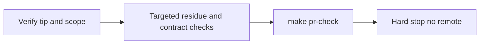

# Build envelope: local validate, no remote

## Binding constraint (overrides default L4 push path)

When Build runs on [`.cursor/plans/cursor-primary_memory_unify.plan.md`](.cursor/plans/cursor-primary_memory_unify.plan.md):

1. Execute remaining plan work locally.
2. Run `make pr-check`.
3. **STOP.** Do not `git push`, `make pr`, `OPEN_PR=1 make pr`, or `gh pr create/merge`.

L4 is already `release_authorized` at `542d858` on `fix/legacy-memory-doctrine-side-door-removal`. That authorizes a later push; it does **not** authorize push in this Build.

## Current state (do not redo A0–A5 unless pr-check fails)

- Branch tip: `542d858` — `fix(governance): remove Dropbox SSOT and HTTP memory side-door teaching` (1 commit ahead of `origin/main`).
- Scope already landed in that commit (34 files): active Dropbox/HTTP cleanup, generated llm-rules, [`ops/scripts/validate_legacy_doctrine_residue.py`](ops/scripts/validate_legacy_doctrine_residue.py) + tests, Makefile/pre-commit wiring.
- Dirty tree should stay limited to unrelated untracked `WIP/**` and stray reports — **leave them out of this Build**.
- Do not edit the plan file.

## Build steps

1. **Verify** `HEAD`, branch, L4 status, and that the tip diff vs `origin/main` stays inside plan write-envelope (no `WIP/**`, no transport redesign).
2. **Targeted validation** (plan §19):
   - `python3 ops/scripts/validate_legacy_doctrine_residue.py`
   - `python3 environment/claude-code/validate_memory_enforcement.py` (or adapter-path equivalent if that is the live entry)
   - Spot-check active surfaces still forbid Dropbox SSOT / `L9_MEMORY_HTTP_*` / `l9-shared-memory` as live contracts.
3. **Gate:** `make pr-check` (changed-files pre-commit + ruff + security). Fix only in-scope failures; re-run until PASS. Local commits allowed if fixes are required; after any new commit, re-check L4 receipt head match before considering release still valid — still **no push**.
4. **Hard stop deliverable:** report tip SHA, targeted results, `make pr-check` PASS/FAIL, and explicit `NO_REMOTE: push/PR skipped per Build envelope`. Leave remote for a later explicit push instruction.

## Denied in this Build

- `git push` / `make push` / `make pr` / `gh pr create` / merge / force-push
- Committing unrelated `WIP/**` or reports
- Modifying the plan markdown
- New memory plane / Graphiti transport changes

## Success

- Plan success properties LEG-01…LEG-11 satisfied locally where applicable
- `make pr-check` PASS on exact final tip
- Working tree clean of in-scope changes (unrelated untracked may remain)
- No remote refs updated by this Build
