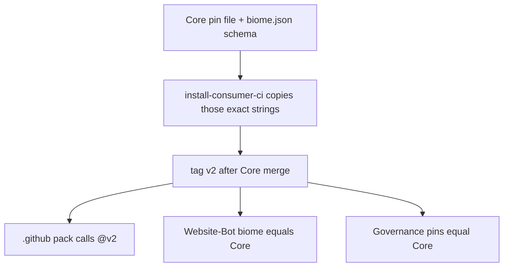

# Canonical toolchain lock and percolation

> **This is the only executable plan.** Do not Build or PE-lease:
> - [`toolchain_lock_percolation_4b59038c.plan.md`](/Users/macm2/.cursor/plans/toolchain_lock_percolation_4b59038c.plan.md) — superseded; invented `ruff==0.16.2`
> - [`core-identical_toolchain_locks_6b26d580.plan.md`](/Users/macm2/.cursor/plans/core-identical_toolchain_locks_6b26d580.plan.md) — superseded; content absorbed here
>
> Treat those files as cancelled. Their todos are not a second work queue.

> **l9-plan:** depth=`deep`. Execute via `@environment/program-execution` then `/autonomy`. `autonomous_merge: false`.

## Metadata

- plan_id: `plan.ci.core-identical-toolchain-lock.v1`
- status: `draft`
- updated_at: `2026-08-17`
- supersedes: `4b59038c`, `6b26d580`

## Authority law (fail-closed)

At execute, re-read these two Core files at `origin/main`. Those strings are the lock. If they differ from this snapshot, **use the files**.

- Python SSOT: [`requirements-consumer-ci.txt`](https://github.com/Quantum-L9/l9-ci-core/blob/main/requirements-consumer-ci.txt)
- Biome SSOT: [`presets/typescript/biome.json`](https://github.com/Quantum-L9/l9-ci-core/blob/main/presets/typescript/biome.json) `$schema`

**Snapshot at Core `0d28395428426853c44825c4645c23ee8ace23b1` (2026-08-17):**

- `ruff==0.16.1`
- `mypy==2.3.0`
- `pytest==9.1.1`
- Biome `2.5.8`

Forbidden: bumping Core because a consumer is newer; leaving Governance on `0.16.2`; writing a different lock string in any repo; copying pin files into consumers as a second SSOT.

Identity rule: after the program, every written ruff/mypy/pytest/biome lock string in R1–R4 is character-identical to those two Core files. V-IDENT fails on any mismatch.

## Drift today (align TO Core)

- Core pin file: `ruff==0.16.1`
- Core pre-commit: `rev: v0.14.5` → `v0.16.1`
- Core `pr-pipeline.yml` fallback: `0.14.5` / `1.19.0` / `8.4.2` → delete
- Core `ruff.toml` comment still says `0.14.5` (comment only)
- Governance manifests: `ruff==0.16.2` → `0.16.1`
- Governance pre-commit: `v0.16.0` + “sdk wins over core” → `v0.16.1`, drop comment
- Website-Bot `@biomejs/biome`: `2.5.8` (already equals Core; Dependabot-ignore)
- `l9-ci-sdk` schema `2.5.5` — follow-on, not this program

## Percolation



Installer path: `l9-ci-core/.github/actions/install-consumer-ci/` (`$GITHUB_ACTION_PATH` only ships that dir). Do not add a new Core workflow YAML unless `tests/workflows/test_phase_scope.py` expected set is updated. Retag via `tools/publish_consumer_ci_tag.sh`. Tag `v2` does not exist yet.

## Repo isolation

Four clones, four branches from each `origin/main`, four PRs. Never mix. Never commit Website-Bot dirty WIP.

- **R1 Core** — only place the lock is authored. Last seen `0d28395428426853c44825c4645c23ee8ace23b1`. Move pins; do not bump them.
- **R2 `Quantum-L9/.github`** — callers only. Zero version literals in `l9-ci-pack`.
- **R3 Website-Bot** — branch from `origin/main`. Biome == `CORE_BIOME`. No python pin file.
- **R4 Governance** — `~/.cursor-governance`. Manifests and pre-commit == Core pins.

Re-resolve SHAs at execute; stop_and_replan on drift.

## What goes where

### R1 Core

Create by moving existing pin bytes (not rewriting versions):

- `.github/actions/install-consumer-ci/action.yml` — `bash "${{ github.action_path }}/install.sh"`
- `install.sh` — sibling pins, else fetch same path at `${L9_CI_CORE_REF:-v2}`; refuse unpinned lines
- `requirements-consumer-ci.txt` — current root file contents
- `toolchain-lock.json` — derived from that file + biome schema
- `tests/actions/test_install_consumer_ci.py`
- `tools/publish_consumer_ci_tag.sh`

Replace:

- Root pin file → `-r .github/actions/install-consumer-ci/requirements-consumer-ci.txt`
- pre-commit `rev: v${CORE_RUFF}`
- Delete `pr-pipeline.yml` else-branch fallback
- Preset/template unpinned `pip install ruff|mypy|pytest` → `uses: …/install-consumer-ci@v2`
- Delete Dependabot `pip` / `deps(consumer-ci)`
- Rewrite `docs/consumer-lint-test.md`

Do not modify: `ruff.toml` rules, `test_phase_scope.py` expected set, analysis SHAs, `presets/typescript/biome.json` schema.

### R2 pack

May modify: `l9-ci-pack/workflows/l9-lint-test.yml`, `l9-ci-pack/README.md`, `ops/sync-v2-starters.sh` only if it copies pins.

Must not: copy `install.sh` or pin files; write version literals; rewrite Node ESLint pack; change analysis SHAs.

Start only after `v2` exists.

### R3 Website-Bot

May modify: `.github/dependabot.yml` (ignore `@biomejs/biome`); `package.json` / lock **only if** biome != `CORE_BIOME`.

Must not: add `requirements-consumer-ci.txt`; include dirty WIP; bump analysis SHA in this PR.

Branch: `git fetch origin && git checkout -b lock/dependabot-ignore-biome origin/main`.

### R4 Governance

May modify: `requirements.txt`, `pyproject.toml`, `.pre-commit-config.yaml` (all → `CORE_*`), `.github/dependabot.yml` ignore list, `skills/l9-setting-up-ci/SKILL.md`.

Must not: keep `0.16.2`; change `environment/ide/policy.json`; edit Core or Website-Bot from this clone.

## Success properties

- **SP-AUTH** Core files read and `CORE_*` recorded before any edit
- **SP-01** Action pin file at `v2` equals Core’s pre-change pin file
- **SP-02** `toolchain-lock.json` biome equals Core schema minor
- **SP-03** Core pre-commit `rev` == `v` + pin ruff
- **SP-04** No stale fallbacks / bare pip installs in Core workflows
- **SP-05** Core Dependabot has no pip consumer-ci block
- **SP-06** Pack is `@v2` caller with no version literals
- **SP-07** Website-Bot biome == `CORE_BIOME`; Dependabot ignores it
- **SP-08** Governance lock strings == Core pin file
- **SP-09** Core `make agent-check`; Governance `make pr-check`
- **SP-IDENT** V-IDENT: all written locks identical to Core authority files

## Execution DAG

- W0: todo-01
- W1: 02 → 03 → 04 → 05 → 06 (06 needs human merge)
- W2: 07 → 08 (after 06)
- W3: 09 and 10 in parallel (after 06)
- W4: 11 (after 08, 09, 10)

Critical path: 01 → 02 → 03 → 04 → 05 → 06 → 07 → 08 → 11.

## Validation (fail-closed)

**V-AUTH** (before edits):

```bash
gh api repos/Quantum-L9/l9-ci-core/contents/requirements-consumer-ci.txt?ref=main --jq .content | base64 -d
gh api repos/Quantum-L9/l9-ci-core/contents/presets/typescript/biome.json?ref=main --jq .content | base64 -d | rg 'biomejs.dev/schemas/'
```

Record `CORE_RUFF` `CORE_MYPY` `CORE_PYTEST` `CORE_BIOME`. All writes use these.

**V-CORE:**

```bash
make agent-check
python3 -m unittest tests.actions.test_install_consumer_ci tests.workflows.test_phase_scope
rg -n 'ruff==0\.14\.5|pip install ruff$|pip install mypy$|pip install pytest$' .github presets docs || true
```

**V-TAG:**

```bash
gh api repos/Quantum-L9/l9-ci-core/git/ref/tags/v2 --jq .object.sha
curl -fsSL https://raw.githubusercontent.com/Quantum-L9/l9-ci-core/v2/.github/actions/install-consumer-ci/requirements-consumer-ci.txt
```

**V-PACK:**

```bash
rg -n 'install-consumer-ci@v2' l9-ci-pack/workflows/l9-lint-test.yml
rg -n 'pip install ruff$|ruff==|mypy==|pytest==' l9-ci-pack && echo FAIL || echo PASS
```

**V-WB:**

```bash
rg -n "\"@biomejs/biome\": \"${CORE_BIOME}\"" package.json
rg -n '@biomejs/biome' .github/dependabot.yml
test ! -f requirements-consumer-ci.txt
```

**V-GOV:**

```bash
make pr-check
rg -n "ruff==${CORE_RUFF#ruff==}" requirements.txt pyproject.toml
rg -n "rev: v${CORE_RUFF#ruff==}" .pre-commit-config.yaml
```

**V-IDENT:** extracted lock strings from R1 action, R3 package.json, R4 requirements/pyproject/pre-commit equal the Core authority files. Pack has no version literals.

## Side effects, rollback, stress

- Moving `v2` is the percolation event. Record previous SHA in the Core PR body before retag.
- Rollback: revert each PR independently; `git tag -f v2 <previous-sha>` (never delete `v2`).
- Seeder is missing-only: already-seeded consumers keep old copies until they adopt the caller.
- Disconfirm: SHA-pinning the action prevents percolation; adding a workflow YAML without updating `test_phase_scope.py` fails Core CI; calling `@v2` before the tag exists 404s new seeds; leaving Core Dependabot `pip` re-opens drift; keeping Governance at `0.16.2` fails V-IDENT.

## Out of scope

- Choosing a “better” ruff than Core’s pin file
- Stamping `ruff.toml`
- Mass fan-out PRs / pack Node ESLint→Biome / SDK 2.5.5
- Auto-merge / `@main` / Website-Bot dirty WIP

## Doc surfaces

- Update: Core `docs/consumer-lint-test.md`, Core `AGENTS.md` if it still says Dependabot owns pins, pack README, Governance `l9-setting-up-ci`
- N/A: Website-Bot `AGENTS.md` / README

## Unknowns

- **U-01** Push/tag rights — probe at execute
- **U-02** Core pin file may change before execute — use the file
- **U-03** SDK Biome 2.5.5 — accept_bounded follow-on
- **U-04** Website-Bot dirty tree — branch from `origin/main`

## GMP / PE handoff

- **may_modify:** R1 action dir, root include, pre-commit, `pr-pipeline.yml`, python preset + docs templates, Core dependabot, `docs/consumer-lint-test.md`, `tests/actions/*`, `tools/publish_consumer_ci_tag.sh`; R2 pack python workflow + README + sync script if needed; R3 dependabot.yml and biome pin only if mismatched; R4 requirements, pyproject, pre-commit, dependabot, `l9-setting-up-ci`
- **must_not_modify:** Core `ruff.toml` rules, `test_phase_scope.py` expected set, analysis SHAs, Website-Bot product/WIP, pack Node ESLint rewrite, `l9-ci-sdk`, secrets
- **preserved_contracts:** Astro+Vercel+npm; Core frozen workflow filename set; Biome owns JS/TS/JSON config; Ruff owns Python config

## Execute via @environment/program-execution + autonomy

1. Attach PE + autonomy. Blueprint under `$HOME/.l9/programs/pes-toolchain-lock/`.
2. Bind to re-resolved SHAs; stop_and_replan on drift.
3. One Task Card per todo; ceiling = that repo’s `may_modify`.
4. Human merges Core first, tags `v2`, then pack, then WB+Governance.
5. Export handoff with V-IDENT receipts.

```yaml
packet_id: autonomy-2026-08-17-toolchain-lock
authority: A4_CAMPAIGN_BOUNDED_EXTERNAL_WRITE
autonomous_merge: false
plan_id: plan.ci.core-identical-toolchain-lock.v1
declared_branches:
  - lock/consumer-ci-action
  - lock/pack-install-caller
  - lock/dependabot-ignore-biome
  - lock/align-core-toolchain
forbidden_inside_packet:
  - mix_files_across_repos
  - invent_newer_than_core_pins
  - add_core_workflow_yml_without_phase_scope_update
  - copy_install_sh_into_pack_or_website_bot
  - stamp_ruff_toml
  - commit_website_bot_wip
  - execute_superseded_plan_4b59038c
  - execute_superseded_plan_6b26d580
```
