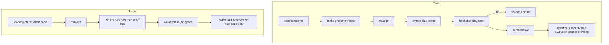

# Ceremony friction cut (audit kernels, Cursor Build)

Apply [kernels/Diagnose First Kernel.md](kernels/Diagnose First Kernel.md) and [kernels/Maximize Leverage + Minimize Friction.md](kernels/Maximize Leverage + Minimize Friction.md) as **audit kernels**, then land the remaining cuts with **l9-plan-simple** (Build on an isolated worktree). Do not run `make campaign`. Do not admit a Program Lock.

This is not a KERNEL-pack landing of those two files. Do not mix onto dirty `main` or onto [PR #389](https://github.com/Quantum-L9/Cursor-Governance/pull/389).

## Diagnose First — verified vs Unknown

**Verified context**

- Publish graph: `make pr` = `pr-preflight` → `pr-check` ([ops/scripts/run_pr_gate.sh](ops/scripts/run_pr_gate.sh)) → [ops/scripts/open_pr_after_gate.sh](ops/scripts/open_pr_after_gate.sh). Makefile comment already forbids a Make prereq that double-runs `precommit-repo` ([Makefile](Makefile) ~538–550).
- Changed-file resolver: [ops/scripts/resolve_changed_files.sh](ops/scripts/resolve_changed_files.sh) (scratch `WIP/` excluded). Gate SKIP list in [ops/scripts/run_pr_precommit.sh](ops/scripts/run_pr_precommit.sh) `_CORPUS_SKIP` (repo-hygiene, residue, rules/skills, symlinks, pre-commit ruff). Corpus lives on `make pr-full`. Domain-gated: workflow pins, capability-contract, uv-lock, skill-activation, pytest (`.py` only), secrets pytest ignore.
- Writers then readers inside the gate: writers (kernel + eof/whitespace + locked ruff) → serialized generated heal → parallel reader wave. Do **not** merge those pre-commit passes (formatter dirt used to hide until after pytest; built [docs/plans/built/precommit_before_pr_408895ec.plan.md](docs/plans/built/precommit_before_pr_408895ec.plan.md) / [docs/plans/ceremony_speed_f8580fa5.plan.md](docs/plans/ceremony_speed_f8580fa5.plan.md)).
- Already landed from ceremony_speed: `.l9/pr/gate-timing.json`, local pytest `-n auto` (≥2 files), fetch-receipt reuse, `PR_CHANGED_FILE` into security. CI `pull_request` already uses `--profile local --changed-file` ([.github/workflows/l9-lint-test.yml](.github/workflows/l9-lint-test.yml)).
- Cursor hooks SSOT: [ops/hooks/hooks.json.template](ops/hooks/hooks.json.template). `beforeShellExecution` is three sequential processes (graphiti, L4, plan-kernel). `sessionStart` is 60s (activate_fresh + wiring + Graphiti + pipeline audit). `sessionEnd` is three hooks (30s + 120s + 90s timeouts).
- Measured 2026-08-29 publish ([.l9/pr/gate-timing.json](/Users/ib-mac/.l9/gov-worktrees/cursor__deprecate-cap-broker/.l9/pr/gate-timing.json) on the broker worktree): **total 183526 ms**, writers **1386 ms**, digest **23 ms**. Reader-wave entries are all ~173s except readers/uv-lock ~3s.

**Observed symptoms**

- Agents still run `make precommit-repo` after every commit, then `make pr`, which runs writers again (AGENTS `PRECOMMIT_REPO_OWNS_RUFF_V1` vs Makefile “gate owns precommit once”). Unbuilt teaching plan: [docs/plans/publish_ceremony_once_d08758b6.plan.md](docs/plans/publish_ceremony_once_d08758b6.plan.md) — absorb **tests-once + finish→make pr only**; do **not** absorb its `PR_REMEDIATE=1` default (conflicts with current campaign / remediator-speed doctrine).
- Generated heal runs **after** writers’ dirty-stop, so `sync_generated_artifacts` / `claude_projection` rewrites force a second commit ([PR #389](https://github.com/Quantum-L9/Cursor-Governance/pull/389) extra `.mcp.json` commit).
- `_gate_run_projection_check`, `_gate_run_wiring`, `_gate_run_root_protect` are **not** changed-file gated (always-on locally). Heal + `--check` both run in one `make pr`.
- `commit-verification-contract` is not in `_CORPUS_SKIP`; on this repo it runs every reader pass with `pass_filenames: false`.
- Worktree `make pr` binds UV toolchain to the **primary** clone (`OK: isolate toolchain bound to /Users/ib-mac/Cursor-Governance`) — observed ruff wrap oscillation.

**Root cause (confidence: high for teaching/heal-order; medium for the 173s wall)**

The remaining wall is the **parallel reader wave**, not writers or fetch. Wave job timings are **not trusted**: [ops/scripts/run_pr_gate.sh](ops/scripts/run_pr_gate.sh) records elapsed at sequential `wait`, so every job that started with pytest inherits ~173s. Competing causes for the max: scoped pytest still too wide (`tests_naming_path` / suite union in [ops/scripts/select_pr_pytest_paths.py](ops/scripts/select_pr_pytest_paths.py)), or gitleaks/semgrep on ~70 paths. **Unknown until honest in-job spans.**

**Unknown**

- Contents of `WIP/8-29-26/l9-runtime-velocity` were not readable from this session (directory exists; files not in the search index, likely gitignored). Insights taken from the tracked sibling plans above instead.
- Which wave job is actually the max (pytest vs security vs projection vs wiring).

## Maximize Leverage — ranked moves

1. **Honest spans** — record each wave job’s duration inside the subshell. Without this, every later cut is a guess. Leverage 5.
2. **One publish command in teaching** — append-only AGENTS fragment: after finished work, `make pr` is the ceremony; `make precommit-repo` is optional local autofix, not a prerequisite. Receipt skip already prevents double pytest on an unchanged tree. Do not add `precommit-repo` as a Make prereq. Leverage 5.
3. **Heal before dirty-stop** — run `_gate_run_sync` + `_gate_run_projection_heal` in the **writer** stage; one dirty-stop. Skip the later `--check` in the same process (heal just wrote). Domain-gate heal when no generated sources changed. Leverage 4.
4. **Always-on local jobs** — skip projection `--check`, wiring, and root-protect unless the change set (or workspace kind) requires them. Keep security. Leverage 3 (wall-clock only if they are the max; still kills token/lock contention).
5. **Pytest selector proof** — replay the last 70-file list through `select_pr_pytest_paths.py`; cut over-union (`tests_naming_path` whole-tree scan, directory fallback). Do not weaken assertions. Leverage 4 if pytest is the max.
6. **One `beforeShellExecution` process** — [ops/hooks/hooks.json.template](ops/hooks/hooks.json.template) already has a single L4 resolver pattern; fold graphiti-shell + plan-kernel-execute into that one python invocation (same denies). Do not add hooks. Do not install a git commit hook. Leverage 3 for agent latency, not `make pr` wall.
7. **Isolate toolchain** — pin UV/ruff to the worktree or a single GOV toolchain so isolate `UV_PROJECT` cannot re-wrap vs the worktree formatter. Leverage 3 for worktree publish.

**What not to do yet**

- Restore corpus scans on `make pr`.
- Merge writer and reader **pre-commit** passes.
- Flip `PR_REMEDIATE` default to 1 (publish_ceremony_once leftover; out of scope).
- Rebuild ceremony_speed (xdist, prefetch, `PR_CHANGED_FILE` — already in tree).
- Slim sessionStart in this PR (in flight on #389).
- `pre-commit install` or a commit hook.

## Changed-file coverage (comprehensive check)

Already scoped: pre-commit `--files`, locked ruff, security (gitleaks/bandit/semgrep/pip-audit), pytest selector, uv-lock, skill-activation, workflow pins, capability-contract.

**Gaps (still full or always-on on the velocity path)**

- Claude projection `--check` and local-activation heal (whole SSOT projection).
- `check_governance_wiring.sh` (machine + workspace).
- `validate_root_file_protection.py` vs `PR_BASE...HEAD` (cheap, but always).
- `commit-verification-contract` every ssot reader pass.
- Kernel hook still invoked then skips on Cursor (cheap; leave unless spans prove otherwise).
- `tests_naming_path` can pull many tests for a non-Python or popular stem.

## Doc / root surface

- [AGENTS.md](AGENTS.md) `additive_only`: append a named fragment (tests-once + `make pr` is the ceremony). Do not fold `PRECOMMIT_REPO_OWNS_RUFF_V1`.
- [Makefile](Makefile) `additive_only`: prefer comment-only / new help echo. No recipe rewrite unless a one-line skip is required and `ALLOW-ROOT-DELETION` is justified.
- Hook catalog remains [.pre-commit-config.yaml](.pre-commit-config.yaml); SKIP list owner remains [ops/scripts/run_pr_precommit.sh](ops/scripts/run_pr_precommit.sh).
- Protected-root PR template if AGENTS/Makefile are in the range.

## Execute via Cursor Build

Press **Build**. Isolated worktree of this repo (primary clone is dirty / write_deny for unrelated WIP). New branch from `origin/main` (ff-only), or stack after #389 if that is the unique open tip.

- Do not run `make campaign`.
- Do not write `Lock: origin/main = <sha>`.
- On Build, emit PLAN_DOCUMENT JSON, `validate_plan_document.py` PASS, project `--execute-via=cursor-build` into `docs/plans/`.
