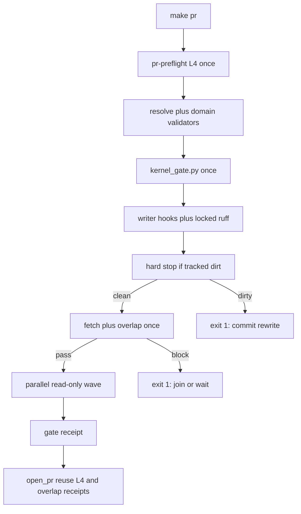

# Publish ceremony phase 2 — once-only pipeline

## What went wrong last run

Phase 1 used `PR_OVERLAP=ignore` to open [PR 347](https://github.com/Quantum-L9/Cursor-Governance/pull/347) against [PR 345](https://github.com/Quantum-L9/Cursor-Governance/pull/345) on `AGENTS.md`. That is breakglass. The same env leaked into [`ops/scripts/tests/test_pr_overlap_check.py`](ops/scripts/tests/test_pr_overlap_check.py): [`pr_overlap_check.py`](ops/scripts/pr_overlap_check.py) reads `PR_OVERLAP` at process start and skips the gate on `ignore`. `_gate()` forcing `block` is belt-only. Tests that do not call `_gate()` still skip.

The ceremony itself also burned the run:

1. [`run_pr_precommit.sh`](ops/scripts/run_pr_precommit.sh) runs pre-commit `ruff --fix`, then locked-venv `ruff check` + `ruff format --check` on the same files ([`test_pr_lifecycle.py`](tests/ops/scripts/test_pr_lifecycle.py) `test_gate_does_not_rerun_ruff` currently requires that second pass).
2. Writer dirt prints "commit the rewrite", then [`run_pr_gate.sh`](ops/scripts/run_pr_gate.sh) treats a non-`exit code:` failure as classifiable dirt, **rewrites `status_before`**, retries every hook, and continues into pytest.
3. Overlap lives only in [`open_pr_after_gate.sh`](ops/scripts/open_pr_after_gate.sh) after pytest, security, and L4. A known `AGENTS.md` collision still paid the full suite.
4. [`pr_preflight.sh`](ops/scripts/pr_preflight.sh) and `open_pr_after_gate.sh` both run `l4_local.py check-remote` on the same HEAD.
5. `claude_projection.py` apply then `--check` is two invocations. `symlinks-check` plus `check_governance_wiring.sh` both assert desktop wiring.

Rule 53 + `pr_stacking.pr_overlap`: keep **`block`**. Routing is join the same-agent PR, stack only from a tip you started on, or wait. Phase 2 **joins 347** and **waits to `make pr` until 345 no longer conflicts**.

## Locked contracts

- **`PR_OVERLAP=block`.** No `ignore` / `warn` on the Phase 2 publish path.
- **No `AGENTS.md` / `CANONICAL_LAW.md` / `INVARIANTS.md`.** 345 still owns a conflicting `AGENTS.md` tail.
- **Isolation at pytest spawn**, not only in `_gate()`. Host `PR_OVERLAP=ignore make pr` still runs the real overlap tests.
- **Overlap stays out of Diagnose.** `make pr-check` / `OPEN_PR=0` does not grow a required overlap step.
- **One overlap decision per unchanged input set.** Early probe on `make pr` writes a receipt. `open_pr_after_gate.sh` reuses it when the post-fetch inputs match. A moved `origin/main` or a new open-PR set is a new input, not a re-run.
- **One kernel hook.** [`ops/autonomy/kernel_gate.py`](ops/autonomy/kernel_gate.py) stays first in `run_pr_precommit.sh`. Receipt already binds kernel file SHAs so a rewrite commit does not force a second apply. Do not also treat L4 `record-kernels` as the apply path.
- **Each pre-commit hook id runs at most once** per `make pr`. Complementary `SKIP` lists. No `PR_GATE_RETRY` rebase.
- **Makefile is additive_only.** Do not rewrite the `pr:` / `pr-check:` recipes. Append `pr: PR_EARLY_OVERLAP = 1`.
- **Same PR 347**, worktree `/Users/ib-mac/.l9/gov-worktrees/publish-ceremony-once`. Local scoped-commits now. **`make pr` only after 345 is merged or closed.**
- No `make campaign`. No Program Lock. No restack of 347 onto 345.

## Target pipeline

Linear stages. Concurrent only inside the read-only wave. Zero re-entry of a completed stage.



### Stage 0 — preflight (already a Make prereq)

Keep [`pr-preflight.sh`](ops/scripts/pr_preflight.sh). Write `.l9/pr/l4-preflight.json` with HEAD + check-remote result. `open_pr_after_gate.sh` reuses it when HEAD is unchanged. Do not call `check-remote` a second time on the same HEAD.

Resolve + domain validators stay where they already are in `run_pr_gate.sh` (after `$changed_file`, before precommit). They are cheap, read-only, and do not belong in the parallel wave.

### Stage 1 — kernel once

Unchanged owner: `kernel_gate.py precommit` at the top of `run_pr_precommit.sh` when `PR_PRECOMMIT_STAGE` is unset or `writers`. Fail closed before writers. Do not invoke it from `run_pr_gate.sh`. The reader invocation sets `PR_PRECOMMIT_STAGE=readers` and skips the kernel.

Standalone `make precommit-repo` (unset stage) runs kernel, writers, dirty-stop, then readers in series. Same hook ids, once each. No parallel required on that leaf.

### Stage 2 — writers once, then stop

In `run_pr_precommit.sh` (`PR_PRECOMMIT_STAGE=writers` from the gate):

Writer hook ids (only these mutate the tree):

- `end-of-file-fixer`
- `trailing-whitespace`
- locked-venv `ruff check --fix` + `ruff format` on changed `*.py` / `*.pyi` (not the pre-commit `ruff` / `ruff-format` hooks)

Skip on this pass: `ruff`, `ruff-format`, `sync-generated-artifacts`, `repo-hygiene`, `legacy-doctrine-residue`, `rules-check`, `skills-check`, `symlinks-check`, and every remaining read-only hook.

After writers: if tracked non-generated dirt remains, **exit 1**. Do not auto-stage. Do not refresh `status_before`. Delete the `--- quiescing and retrying pre-commit once ---` block in `run_pr_gate.sh` (lines that rewrite `status_before` and call `_gate_run_precommit` again). Attribution may still print. Transient concurrent writers fail closed; the operator re-runs `make pr` after the tree is clean.

### Stage 3 — overlap once (`make pr` only)

Append to [`Makefile`](Makefile):

```make
pr: PR_EARLY_OVERLAP = 1
```

In `run_pr_gate.sh`, after the dirty hard-stop and **before** the reader wave, if `PR_EARLY_OVERLAP=1`:

1. `git fetch` of `PR_BASE` (the E5 refresh, moved earlier).
2. `pr_overlap_check.py` once.
3. Write `.l9/pr/overlap-receipt.json` keyed on fetched base sha, HEAD, changed-file digest, `PR_STACK`, `PR_OVERLAP`, and the open-PR number list the checker already retrieved.

`block` → exit 1 (no pytest, no gitleaks). `make pr-check` alone does not set the var.

In `open_pr_after_gate.sh`: fetch again (world can move). If the receipt keys still match, print reuse and skip the checker. If they do not match, run the checker **once** on the new inputs and honor `STACK_BASE`.

### Stage 4 — one parallel read-only wave

After overlap, `run_pr_gate.sh` starts these as background jobs (bash 3.2: `&` + `wait`, one log file each, fail if any rc ≠ 0):

- Remaining **read-only** pre-commit hooks only: `check-merge-conflict`, `check-added-large-files`, `check-yaml`, `no-hardcoded-paths`, `gh-package-deps-preflight`. Skip list must include every writer id plus corpus + `sync-generated-artifacts` + `symlinks-check`.
- `uv lock --check` when a dependency manifest is in `$changed_file`.
- `validate_root_file_protection.py`
- skill-activation when skills/routing changed
- `sync_generated_artifacts.py --check`
- hermetic pytest (`--profile local --changed-file`)
- `run_pr_security.sh --mode gate`
- `check_governance_wiring.sh` (the one wiring check; hook skipped)
- `claude_projection.py --check` (no apply)

`claude_projection.py`: `--check` once. No apply-then-check. Drift fails with the existing re-run command.

Pytest spawn unsets (do not export empty-as-ignore): `PR_OVERLAP`, `PR_OVERLAP_TELEMETRY`, `PR_STACK`, `PR_REMEDIATE`. Same keys dropped in `_suite_env`.

Do not start this wave until Stages 1–3 have passed. Jobs in the wave do not call each other.

### Stage 5 — receipts, then open

Existing content-digest gate receipt stays. `open_pr_after_gate.sh` consumes L4 + overlap receipts. Remediates stays 1 (Phase 1 law).

## Implementation map

| File | Change |
|---|---|
| [`ops/scripts/run_pr_gate.sh`](ops/scripts/run_pr_gate.sh) | Dirty-stop without retry; early overlap + receipt; hermetic pytest env; parallel reader wave; projection `--check` only |
| [`ops/scripts/run_pr_precommit.sh`](ops/scripts/run_pr_precommit.sh) | `PR_PRECOMMIT_STAGE` writers vs readers; complementary SKIP lists; drop second ruff; kernel only on writers/unset |
| [`ops/scripts/run_python_test_suites.py`](ops/scripts/run_python_test_suites.py) | `_suite_env` drops ceremony knobs |
| [`ops/scripts/open_pr_after_gate.sh`](ops/scripts/open_pr_after_gate.sh) | Reuse overlap + L4 receipts |
| [`ops/scripts/pr_preflight.sh`](ops/scripts/pr_preflight.sh) | Write L4 preflight receipt |
| [`Makefile`](Makefile) | Append `pr: PR_EARLY_OVERLAP = 1` only |

## Tests

- [`ops/scripts/tests/test_pr_overlap_check.py`](ops/scripts/tests/test_pr_overlap_check.py) — inherited `ignore` without `_gate()` still detects; keep `_gate()` default-`block`.
- [`tests/ops/scripts/test_pr_lifecycle.py`](tests/ops/scripts/test_pr_lifecycle.py) — rewrite `test_gate_does_not_rerun_ruff` to assert ruff appears once (locked writer) and not in the reader wave; assert retry block is gone; assert `PR_EARLY_OVERLAP` only on the `pr` goal.
- Pin dirty-stop: a fixture where a writer rewrites a tracked file never reaches `--- pytest ---`.
- Pin overlap-once: `PR_EARLY_OVERLAP=1` + blocking filename overlap exits before the reader wave; `make pr-check` has no overlap step; `open_pr_after_gate.sh` contains a receipt-reuse branch.

## Out of scope

- AGENTS §4.1 “fail-open on missing gh” vs rule 53 fail-closed (later append, after 345).
- Gitleaks per-file banners, poll-worker hook, L4 receipt-on-HEAD rewrite, protected-root body fill.
- Changing remediates back to 0.
- Lint-job full-tree ruff / `peer-execution.yml`.
- A second pre-commit hook id for overlap (overlap needs fetch; it is a ceremony stage, not a hook).

## Success (falsifiable)

- `PR_OVERLAP=ignore` in the parent environment + `pytest ops/scripts/tests/test_pr_overlap_check.py` runs real detection.
- A ruff rewrite during `make pr` exits before the reader wave. No second pre-commit invocation appears in the log.
- `rg -n 'ruff' ops/scripts/run_pr_precommit.sh` shows one locked-venv writer path; pre-commit `ruff` / `ruff-format` are on the writer-pass SKIP list.
- `PR_EARLY_OVERLAP=1` + a blocking filename overlap exits before `--- pytest ---`.
- `make pr-check` has no overlap step.
- `open_pr_after_gate.sh` does not invoke `pr_overlap_check.py` when the overlap receipt keys match.
- `l4_local.py check-remote` is not invoked from `open_pr_after_gate.sh` when the preflight receipt HEAD matches.
- Phase 2 diff does not include `AGENTS.md` or `CANONICAL_LAW.md`.
- No `PR_OVERLAP=ignore` on the Phase 2 `make pr`. That `make pr` happens only after 345 is gone.

## Stress / leverage

- If complementary SKIP lists share a hook id, that hook is silent forever — pin the two lists as disjoint in a test.
- If overlap receipt keys omit the open-PR set, a new conflicting PR opened during pytest would be missed — key the receipt on the fetched base sha **and** the open-PR number list the checker already retrieved.
- If the parallel wave starts before dirty-stop, writers race tests — Stage 4 is gated on Stage 2 exit 0.
- Blast radius: `make pr` / `make pr-check` / `make precommit-repo` only. `make pr-full` / nightly corpus unchanged.
- Rollback: revert the six files above on 347.

## Validation

- Targeted pytest on overlap + lifecycle + gate-scope tests.
- Local scoped-commit on 347.
- `make pr` deferred until 345 is merged or closed; then `PR_OVERLAP=block` `PR_STACK=` (347 is already the main-bound sibling).

## Execute via Cursor Build

Work on the existing `feat/publish-ceremony-once` worktree. Commit into 347. Do not open a sibling. Do not `ignore`. Do not merge.
