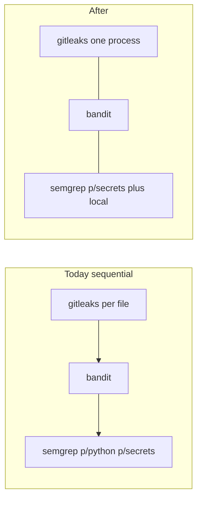

# Speed local make pr security and pytest selector

## Constraint: stack on the newest PR

Other PRs will open and land while this is built. Do **not** use `PR_STACK=` (that was last time, when the board was empty).

- Start in a dedicated worktree from the **current unique open-PR chain tip** (`PR_STACK=auto` / `agent_worktree_start.sh`). Do not fork `origin/main` if a unique chain exists.
- Sibling open-PR chains still fail closed — stop and name them; do not invent a restack.
- Before `make pr`, fetch and re-resolve the tip. If the parent moved, rebase this branch onto the new tip (`git rebase --onto <new-tip> <old-parent-tip>`). Do not merge `main` into a child.
- Publish with `PR_STACK=auto PR_REMEDIATE=0 make pr` from the worktree. Pathspecs only. Do not scoop the primary clone.

## What was slow (evidence)

Last successful gate ([`.l9/pr/gate-timing.json`](/Users/ib-mac/.l9/gov-worktrees/cursor__pec-repair-w0-w7/.l9/pr/gate-timing.json) on the W0–W7 worktree): **security 142s** vs pytest 79s in the same parallel wave. Security today is sequential in [`ops/scripts/run_pr_security.sh`](ops/scripts/run_pr_security.sh): one `gitleaks detect --no-git` **per changed path** (53 process starts), then bandit, then Semgrep `p/python p/secrets`.

`make pr-full` does **not** run this script today (Makefile NOTE: corpus security is nightly CI). CI Semgrep stays [`p/python` (+ JS/TS)](.github/workflows/l9-analysis.yml). This plan does not edit workflows.

## 1. One gitleaks process

In `run_gitleaks`:

- Keep `--no-git` (or `gitleaks dir`). **Never** default `detect` without `--no-git` — that scans git history.
- Prefer one invocation over the changed set. Verify during Build: `gitleaks dir --redact -c .gitleaks.toml -- "${CHANGED[@]}"` from `$WS` (Context7: `dir` takes a directory or file). If this version only accepts one `--source`, fall back to a temp tree of the changed files (hardlink/copy) and one `detect --no-git --source "$tmp"`.
- Do not switch to “scan the whole worktree + allowlist” unless the multi-file/`dir` path is impossible — that changes which files are in scope.
- Pass `--no-banner` if the installed binary supports it (PATH may be 8.30.0 vs pin 8.24.3; keep the existing version WARN).

## 2. Parallel gitleaks / bandit / semgrep

Replace the sequential `run_gitleaks; run_bandit; run_semgrep` with three background jobs, wait, then aggregate. `set -e` must not swallow a scanner fail: write each job’s exit code to a temp file.

- `pip-audit` stays after the wave (almost always SKIP; rare and cheap).
- Gate mode still FAILs if a required binary is missing (existing [`ops/scripts/tests/test_pr_security_modes.sh`](ops/scripts/tests/test_pr_security_modes.sh) T1–T5 stay).
- `SEMGREP_APP_TOKEN` remains scrubbed in the Semgrep child. `--error` stays.

## 3. Velocity Semgrep vs full

There is **no live** repo-root `.semgrep/` ruleset. Add a thin committed file, e.g. [`.semgrep/l9-pr.yml`](.semgrep/l9-pr.yml) (a few L9-local rules only — do not import WIP copies or invent a second AppSec program).

| Path | Configs |
|------|---------|
| `make pr` / `make pr-check` / default `make pr-security` | `p/secrets` + `.semgrep/l9-pr.yml` |
| `PR_SECURITY_PROFILE=full make pr-security` and new Makefile target `pr-security-full` | today’s `p/python p/secrets` + the local file |
| CI `l9-analysis.yml` | unchanged (`p/python` / JS / TS) |

Implementation: `PR_SECURITY_PROFILE=velocity|full` (default **velocity**). `SEMGREP_CONFIGS` override still wins. Pass `--metrics=off`.

Makefile is `additive_only`: **append** `pr-security-full` and an optional `pr-full: pr-security-full` prereq line. Do not rewrite the existing `pr-full` NOTE without `ALLOW-ROOT-DELETION`. Append a short AGENTS fragment (velocity vs full). Do not edit `CANONICAL_LAW.md` or `surface_profile.yaml`.

## 4. Tighter pytest selector (safe cuts only)

[`ops/scripts/select_pr_pytest_paths.py`](ops/scripts/select_pr_pytest_paths.py) already refuses repo-root `.` and drops uncollectable PE adapter paths. The 75s / 469-test W0–W7 run was a **wide named set** (new conformance tests + `test_run_campaign.py`), not a catalog dump.

Tighten only over-select:

- Add fixture/generated basenames to `_GENERIC_BASENAMES` (or a sibling set): `expect.yaml`, `source.yaml`, `MANIFEST.yaml`, `MANIFEST.json` so those files cannot basename-union the catalog. Full-path matches still count.
- Do **not** select a whole non-dot `owned_paths` directory when `infer_test_path` or `tests_referencing` already found a named test (the owner-directory append is the remaining blunt instrument).
- Do **not** drop `test_run_campaign.py` when `campaign_input.py` / `run_campaign.py` / that test file is in the change set (existing stem contract).
- Extend [`ops/scripts/tests/test_select_pr_pytest_paths.py`](ops/scripts/tests/test_select_pr_pytest_paths.py): a compiler-only / fixture-only change set must stay smaller than a set that includes `test_run_campaign.py`.

No `PR_SKIP_PYTEST`. No catalog skip.

## 5. Tests and publish hygiene

- Security: assert gitleaks is invoked **once** for N files (mock or wrap); assert one failing parallel scanner still FAILs the gate; assert velocity configs omit `p/python` unless `PROFILE=full` or `SEMGREP_CONFIGS` override.
- Selector: new cases above; keep existing shell-name and never-`.` tests.
- Before first `make pr`: `ruff format` on touched Python + `sync_generated_artifacts.py` if PE manifests are in play, then one scoped commit. Do not pay the “dirty after heal → re-run gate” tax again.

## Out of scope

- Workflow / Semgrep App / token changes
- Weakening `--error`, advisory-as-pass, or missing-binary SKIP on the publish path
- Pytest catalog or `make pr-full` suite rewrite
- W8–W10 PEC work
