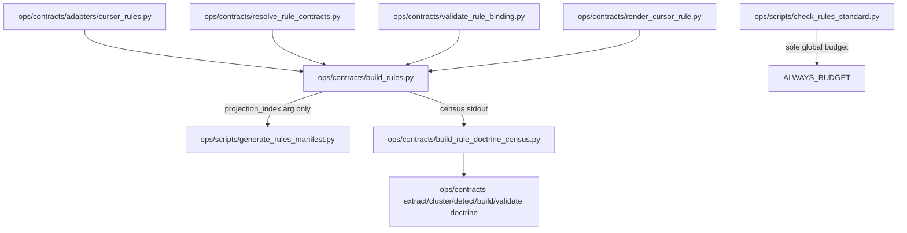

# Complete both CG prompts under GMP

## Improve-kernel result (plan artifact)

Target: this plan file. Mode: patch. Status: **Succeeded** for plan readiness (implementation not started).

Verified plan defects that this revision remediates:

| ID | Severity | Defect | Root-cause fix |
|---|---|---|---|
| P-01 | critical | Worktree from `origin/main` will not contain untracked `WIP/CG` | Copy staging into the worktree from the dirty clone path before Phase 1 READY |
| P-02 | critical | `build_rules.py check` → `_manifest_outputs` can demand v3-shaped manifests with 0 bindings | Lock `check()` to skip `RULES-MANIFEST.*` when no generated/contract_bound bindings exist |
| P-03 | high | Plan never forbade `build_rules.py build` (writes rules/manifests) | Must-not-run during Foundation/Shadow |
| P-04 | high | Makefile shadow that calls `build_rule_doctrine_census.py` writes a tracked-path file (`generated/` is not gitignored) | Make targets are stdout-only; file census is Prompt 2 only |
| P-05 | medium | One CREATE todo mixed schemas/ADRs/compiler | Split golden → create → merge → build_rules |
| P-06 | medium | “Exact v2” had no oracle | Pre-merge golden hashes of stripped manifests |
| P-07 | medium | PE presented as primary execute path; user required GMP | GMP is the execute protocol; PE/autonomy is optional lease wrapper |
| P-08 | low | Todos lacked `depends_on` / phases | Encoded in frontmatter DAG |

Entropy removed: ceremonial “emit PLAN_DOCUMENT JSON during execute” as a READY gate (this `.plan.md` is the lock). Optional later; must not block install.

## Skill / depth

`l9-plan` is already installed (`skills/l9-plan`). This plan uses it. It does not rewire the skill pack.

Depth: **deep**. Planning-only until the user explicitly executes.

Primary execute protocol: **`l9-gmp-protocol` phases 0–6**. `@environment/program-execution` + `/autonomy` may wrap the same lock under a Program lease (`autonomous_merge: false`) but must not widen this envelope.

## Immutable baseline (re-lock at execute)

- Do **not** land on dirty `fix/ci-required-contexts-wip-only`.
- New worktree + branch from `origin/main` (re-resolve SHA at execute; last observed `72ff9d4`).
- Branch name: `feat/cursor-rules-contract-foundation`.
- Staging lives only in the current clone as untracked [`WIP/CG/`](WIP/CG/) (36 files: 34 mapped + 2 prompts). After `git worktree add`, **copy** `WIP/CG/` into the worktree. Do not add `WIP/CG` to `sys.path`. Do not commit the two prompt files.

## Objective

Install Prompt 1 at exact canonical paths, then run Prompt 2 so the new architecture can **observe** `rules/*.mdc` without governing it.

## Locked contracts (do not reinterpret)

1. Production manifest schema remains `l9.cursor-rules-manifest/v2`.
2. Sole global always-on budget owner: [`ops/scripts/check_rules_standard.py`](ops/scripts/check_rules_standard.py) `ALWAYS_BUDGET` / `181203`.
3. Zero production Rule Activation Bindings. Do not create `contracts/projections/rules/`.
4. Zero production `WIP/CG` references.
5. `ops/config/doctrine-baseline.rules.yaml` stays `status: bootstrap_required`.
6. `build_rules.py` must **not** define or enforce `GLOBAL_ALWAYS_BUDGET`, `RULES_ALWAYS_BUDGET`, or `181203`.
7. `generate_rules_manifest.py` must **not** import `build_rules`.
8. Do **not** run `python3 ops/contracts/build_rules.py build`.
9. Do **not** pass `--bootstrap-baseline`, `--tighten-baseline`, or `--check-baseline`.
10. Makefile: append-only. CI and `.pre-commit-config.yaml`: unchanged.
11. ADR files use the **specified slugs** even though numbers collide with existing `docs/decisions/ADR-0007-*.md` … `ADR-0014-*.md`. Do not renumber. Report the collision.
12. New root **directory** `contracts/` is allowed (root-file-protection registers root *files*, not this tree). Only root-file edit is append-only [`Makefile`](Makefile).

## Architecture (after install)



`check()` with zero generated/contract_bound bindings: validate bindings/conflicts only; **do not** include `rules/RULES-MANIFEST.*` in `expected_outputs`. That is the P-02 contract.

## Prompt 1 — exact CREATE inventory

Copy `WIP/CG/<rel>` → `<rel>` for every row. All CREATE unless noted MERGE.

**Schemas (11)** → `contracts/schemas/`

- `canonical.schema.governance_contract.v1.yaml`
- `canonical.schema.invariant_contract.v1.yaml`
- `canonical.schema.policy_contract.v1.yaml`
- `canonical.schema.capability_contract.v1.yaml`
- `canonical.schema.workflow_contract.v1.yaml`
- `canonical.schema.evidence_contract.v1.yaml`
- `canonical.schema.contract_extraction_record.v1.yaml`
- `canonical.schema.contract_projection_binding.v1.yaml`
- `canonical.schema.contract_registry.v1.yaml`
- `canonical.schema.rule_activation_binding.v1.yaml`
- `canonical.schema.cursor_rules_manifest.v3.yaml` (schema only; writer stays v2)

**ADRs (8)** → `docs/decisions/` specified slugs `ADR-0007-contracts-own-rule-semantics.md` … `ADR-0014-rules-strangler-migration-and-doctrine-ratchet.md`

**Doctrine (5)** → `ops/contracts/`: `extract_doctrine.py`, `cluster_doctrine.py`, `detect_hidden_doctrine.py`, `build_doctrine_census.py`, `validate_doctrine_ratchet.py`

**Adapter (1)** → `ops/contracts/adapters/cursor_rules.py`

**Compiler (5 CREATE + 1 CREATE-with-strip)** → `ops/contracts/`: `resolve_rule_contracts.py`, `validate_rule_binding.py`, `render_cursor_rule.py`, `validate_rule_projections.py`, `build_rule_doctrine_census.py`, `build_rules.py` (strip global budget + P-02 `check()`)

**Baseline** → `ops/config/doctrine-baseline.rules.yaml` (`bootstrap_required`)

**Test** → `tests/contracts/test_rules_contract_compiler.py`

**MERGE** → [`ops/scripts/generate_rules_manifest.py`](ops/scripts/generate_rules_manifest.py) only:

- Keep `SCHEMA = "l9.cursor-rules-manifest/v2"`
- Optional `projection_index`; no `_load_projection_index`
- Absent/empty index → **exact golden v2 keys**
- Matching index entry may overlay projection fields
- Add `serialize_manifest` for downward use
- Keep `generated_utc` / `_strip_volatile` stability

**Unmapped (leave in staging):** `WIP/CG/Cursor Prompt.md`, `WIP/CG/Cursor Prompt 2.md`

**Do not create:** `contracts/projections/rules/`, `rules/generated/`, `RULES-MANIFEST.v3.yaml`

**Do not wire:** [`ops/scripts/sync_generated_artifacts.py`](ops/scripts/sync_generated_artifacts.py)

## Makefile (append-only, read-only)

After the existing `rules-check` block, append only:

```makefile
.PHONY: rules-contract-shadow rules-contract-check
## Foundation shadow: stdout only. Does not write rules or census files.
rules-contract-shadow:
	python3 ops/contracts/build_rules.py census
rules-contract-check:
	python3 ops/contracts/build_rules.py check
```

File-writing census (`build_rule_doctrine_census.py` default `--output`) runs only in Prompt 2, not from Make.

## Prompt 2 — shadow sequence

Observational. After install, in order:

1. Import the 12 modules from canonical paths. Fail on WIP imports, circular imports, duplicate implementations.
2. `pytest -q tests/contracts/test_rules_contract_compiler.py` — fix tooling only.
3. `python3 ops/contracts/build_rule_doctrine_census.py` (may write `generated/governance/rule-doctrine-census.yaml`; observational, not semantic authority) and `python3 ops/contracts/build_rules.py census` (stdout).
4. Census twice; semantic digest identical (fix tooling if wall-clock is in equality).
5. `python3 ops/contracts/build_rules.py check` — 0 bindings must PASS without manifest rewrite.
6. `python3 ops/scripts/check_rules_standard.py` — warnings stay warnings.
7. `python3 ops/scripts/sync_generated_artifacts.py --force --check` — CURRENT.
8. Prove `rules/*.mdc` unchanged; golden v2 still matches; `$schema` is v2.
9. Report census counts, top 15, pilots 70/93/03 from scanner evidence only.
10. Prove baseline still `bootstrap_required`.
11. STOP. No Pilot 70. No bootstrap.

## Execution envelope

- FS write: only modification-lock paths below, inside the new worktree.
- Commands: python3/pytest/make pr-check/git worktree; no `build_rules.py build`; no bootstrap flags; no push until L4 release.
- Network: Graphiti phase-lock only; no GitHub publish in Foundation.
- Secrets: none.
- `autonomous_merge: false`.

## Side effects / idempotency

- CREATE copies are overwrite-identical if re-run on empty destinations.
- Manifest MERGE is the only in-place production edit; golden hash must match after.
- Census file write is Prompt 2–only and idempotent if tooling is deterministic.
- Makefile append is not idempotent; apply once; do not rewrite existing lines.

## GMP modification lock

**May modify:** `contracts/schemas/**`; specified new ADR slugs; `ops/contracts/**`; `ops/config/doctrine-baseline.rules.yaml` (create only); `tests/contracts/test_rules_contract_compiler.py`; `ops/scripts/generate_rules_manifest.py` (v2 merge); `Makefile` (append); `generated/governance/rule-doctrine-census.yaml` (Prompt 2); `reports/GMP-Report-*-cursor-rules-foundation.md`.

**Must not modify:** `rules/*.mdc`; `rules/RULES-MANIFEST.*` semantics/schema; `check_rules_standard.py`; `sync_generated_artifacts.py`; `.pre-commit-config.yaml`; `.github/workflows/**`; baseline status after create; `WIP/CG/**` as production; `pyproject.toml`; `AGENTS.md`; `CANONICAL_LAW.md`; unrelated dirty WIP.

**Must not run:** `build_rules.py build`; `--bootstrap-baseline`; `--tighten-baseline`; `--check-baseline`.

**Preserved:** v2 manifest; one budget owner; zero bindings; zero WIP refs; Makefile additive-only; human merge only.

## Property evidence

| ID | Property | Evidence |
|---|---|---|
| SP-01 | Foundation modules exist at canonical paths | inventory table + import probe |
| SP-02 | No WIP/CG in production | `rg -n 'WIP/CG' --glob '!WIP/**'` empty |
| SP-03 | Manifest still v2 and golden-identical | stripped JSON/YAML/MD hashes == pre-merge golden |
| SP-04 | `check()` PASS with 0 bindings | `build_rules.py check` exit 0; no manifest diff |
| SP-05 | Global budget owner == 1 | only `check_rules_standard.py` defines `181203` |
| SP-06 | Baseline dormant | `status: bootstrap_required` |
| SP-07 | Rules corpus unchanged | `git diff -- rules/*.mdc` empty |
| SP-08 | Shadow integrity | dual census digest match; compiler pytest PASS |
| SP-09 | Gate | `make pr-check` PASS |

## Success criteria

- Prompt 1 verification items 1–11 complete, including ADR number-collision report.
- SP-01 … SP-09 all Passed.
- Shadow acceptance (Prompt 2 §12) required zeros / v2 / `bootstrap_required`.
- GMP report written with verbatim final declaration.

## Stress / disconfirm

1. If `check()` still calls `_manifest_outputs`, will `make pr-check` rewrite manifests? Locked: skip manifests when binding set is empty.
2. If the worktree is created without copying `WIP/CG`, Phase 1 will report ABSENT again. Locked: copy first.
3. If Makefile invokes file-writing census, shadow dirties `generated/`. Locked: stdout-only Make.
4. ADR slug collision vs inventing ADR-0023+: specified slugs win.

**Assumed false if:** SCHEMA flipped to v3; `build` command run; bootstrap flags used; install on dirty current branch; manifest imports `build_rules`.

**Blast radius:** v3 writer rewrite fails `make pr`; second budget owner; bootstrap ratchets live corpus; dirty-branch mix of legal WIP.

**Rollback:** remove worktree + delete feature branch. `origin/main` untouched.

## Doc / root surface

- `Makefile`: update (append only).
- `AGENTS.md`, `CANONICAL_LAW.md`, `README.md`, `pyproject.toml`: n_a — dormant foundation.
- New ADRs: create specified files.

## Out of scope

- Baseline bootstrap; Pilot 70/93/03 bindings; v3 cutover; pre-commit/CI changes; wiring sync → `build_rules`; renumbering existing ADRs; installing the two prompt markdowns; `__pycache__` product changes; rewriting `l9-plan`; running `build_rules.py build`.

## GMP execute path

0. Phase 0: memory lock + worktree + WIP copy + this modification lock.
1. Phase 1: inventory READY (34 mapped sources present).
2. Phase 2: golden → CREATE → MERGE v2 → strip-budget `build_rules` + P-02 `check()` → Makefile append.
3. Phase 3: import-graph + compiler pytest.
4. Phase 4: Prompt 2 shadow + `make pr-check`.
5. Phase 5: diff vs this plan only.
6. Phase 6: `reports/GMP-Report-*-cursor-rules-foundation.md`.

Next skill after plan acceptance: `l9-gmp-protocol`.
