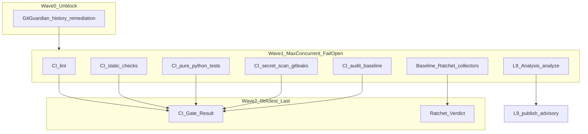

## PLAN: CI fail-slow pipeline (max concurrent → aggregator last)

### Decision (structured reasoning)

**Objective:** One PR push must surface every failing check in one settled run; merge still fails closed if any required collector failed. Strictest gates are aggregator verdicts last—not serialized workflow chains.

**Decisive evidence (PR [#141](https://github.com/cryptoxdog/IB-Odoo_19/pull/141)):**
- Feature branch [`fix/install-smoke-runtime-gate`](https://github.com/cryptoxdog/IB-Odoo_19/tree/fix/install-smoke-runtime-gate) already implements fail-slow inside [`.github/workflows/ci.yml`](.github/workflows/ci.yml): Phase 1 jobs (`lint`, `static-checks`, `pure-python-tests`, `secret-scan`, `audit-baseline`) have **no** `needs:`; Phase 2 `ci-gate-result` uses `needs: [...]` + `if: always()` and fails if any Phase 1 ≠ `success`. Enforced by [`ci/check_github_actions_kernel.sh`](ci/check_github_actions_kernel.sh).
- Local/workspace Staging copy of `ci.yml` is still the **old** lint→static→tests chain (`needs: lint` / `needs: static-checks`) and rule [`.cursor/rules/86-ci-github-actions.mdc`](.cursor/rules/86-ci-github-actions.mdc) still says “Never remove `needs:` … fail-fast” — **docs/SSOT drift**.
- **GitGuardian does not cancel GHA.** It is an external app check (`details_url: dashboard.gitguardian.com`, title: “1 secret uncovered!”). GHA `CANCELLED` jobs on HEAD are from `concurrency.cancel-in-progress: true` after rapid re-pushes. On earlier PR commits, **CI Gate = SUCCESS** while **GitGuardian = FAILURE** and **L9 Analysis = FAILURE** — GG is not the GHA cancel trigger.
- Remediation commit `ff07274e` removed hardcoded `POSTGRES_PASSWORD` from `scripts/install_smoke.sh`, but GG still fails on HEAD because it scans **all commits in the PR** (historical occurrence remains).

**Selected approach (locked):** Keep independent workflows concurrent (no `workflow_run` chaining). Make fail-slow CI Gate the durable SSOT. Treat aggregators as required merge gates. Remediate GG history as a separate Wave-0 unblocker. Keep L9 Analysis advisory-first until governance promotes it.

**Rejected:** Serializing CI Gate → Ratchet → L9 via `workflow_run` (kills “max runs first”). Weakening scanners to get green.



### Objective
**Success:** (1) One settled push on a PR shows all Phase-1 failures without tier short-circuit; (2) `CI Gate Result` / Ratchet Verdict still fail the run if any collector failed; (3) GitGuardian on PR #141 is green or occurrence is resolved after history purge; (4) `AGENTS.md` + rule 86 match the fail-slow contract (no “preserve fail-fast `needs:`”).

### Scope
**In:**
- Align workspace/Staging SSOT with PR-branch fail-slow `ci.yml` + kernel contract
- Cross-workflow concurrency policy (CI Gate || Baseline Ratchet || L9 Analysis)
- Required-check recommendation (aggregators + GitGuardian)
- PR #141 GitGuardian historical-secret remediation procedure
- Doc/rule updates that currently teach fail-fast

**Out:**
- Re-enabling deprecated `pr-gate.yml` / `odoo-audit.yml` / `module-check.yml` / `test-quality.yml`
- Adding Odoo runtime to GHA
- Promoting L9 Analysis from advisory → blocking (governance decision later)
- Force-push to `Staging`/`Production`

### Pre-Validation (mandatory)
| Check | Command / action | Pass criteria |
|-------|------------------|---------------|
| P0 Target bind | Work on `fix/install-smoke-runtime-gate` (or branch from it) for CI SSOT sync | Single feature branch; PR base `Staging` |
| P1 Baseline inventory | Diff PR-branch vs local [`.github/workflows/ci.yml`](.github/workflows/ci.yml), [`86-ci-github-actions.mdc`](.cursor/rules/86-ci-github-actions.mdc), `AGENTS.md` CI section | Gap list: fail-slow vs fail-fast drift documented |
| P2 GG evidence | Confirm GG finding type in dashboard; verify tip vs history (`gh pr view 141`, commit `ff07274e` message) | Know whether tip is clean and only history remains |
| P3 Kernel contract | `bash ci/check_github_actions_kernel.sh` on branch with fail-slow `ci.yml` | PASS merge_gate_logic |
| P4 Clean gate | `PR_CHECK_SKIP_REMOTE=1 make pr-check` before edits that touch workflows/docs | PASS or documented baseline FAIL unrelated |

### TODO Plan
| # | Task | Files | Effort | Risk |
|---|------|-------|--------|------|
| T1 | **Wave 0 — clear GitGuardian on PR #141** | `scripts/install_smoke.sh` (already fixed at tip); git history of PR branch; GG dashboard occurrence | M | High — history rewrite or mark resolved |
| T2 | **SSOT: ensure fail-slow `ci.yml` is the only gating topology** | [`.github/workflows/ci.yml`](.github/workflows/ci.yml), [`ci/check_github_actions_kernel.sh`](ci/check_github_actions_kernel.sh) | S | Med — must not regress Phase-1 parallelism |
| T3 | **Cross-workflow policy: max concurrent, no `workflow_run` chains** | [`.github/workflows/baseline-ratchet.yml`](.github/workflows/baseline-ratchet.yml), [`.github/workflows/l9-analysis.yml`](.github/workflows/l9-analysis.yml), [`.github/governance/README.md`](.github/governance/README.md) | S | Low |
| T4 | **Concurrency hygiene for readable PR checks** | same workflows’ `concurrency:` blocks | S | Med — trade cost vs cancelled-noise |
| T5 | **Update agent/CI docs that still mandate fail-fast `needs:`** | [`.cursor/rules/86-ci-github-actions.mdc`](.cursor/rules/86-ci-github-actions.mdc), [`AGENTS.md`](AGENTS.md) CI Architecture | S | Low |
| T6 | **Settle HEAD run + verify L9 separately** | L9 pin already bumped in `ff07274e`; confirm latest non-cancelled L9 run | S | Med — may still need publish/governance fix |

### Depth

**Fail-open vs fail-closed (definitions used in this plan):**
- **Fail-open collectors:** jobs/steps continue siblings and sibling checks; report every error; job exit ≠ 0 still marks that collector failed.
- **Fail-closed aggregators:** `ci-gate-result` / Ratchet Verdict run with `if: always()` after collectors finish; overall workflow fails if any required collector ≠ `success`.
- **Not fail-open:** `continue-on-error: true` that greenwashes required security (PR-branch correctly made `secret-scan` blocking).

**Within CI Gate (already on PR branch — preserve):**
1. Phase 1 parallel: lint, static (internal `run_check` / `run_advisory` aggregation), pure-python-tests, secret-scan (gitleaks, blocking), audit-baseline.
2. Phase 2 last: `ci-gate-result` only.

**Across workflows (policy to lock in docs):**
| Wave | What runs | Behavior |
|------|-----------|----------|
| 1 | CI Gate Phase 1 \|\| Baseline Ratchet collectors \|\| L9 `analyze` | Max concurrency; each surfaces own failures |
| 2 | `CI Gate Result`, `Ratchet Verdict` | Strictest merge-relevant verdicts last |
| External | GitGuardian app | Independent; cannot be ordered in YAML; must be green separately |

**Do not** add `workflow_run` ordering between CI Gate / Ratchet / L9 — that serializes and contradicts max-concurrent-first.

**GitGuardian remediation (T1) — concrete path:**
1. Confirm tip has no hardcoded DB password (post-`ff07274e`).
2. Because GG scans the **PR commit range**, either: interactive rebase / filter-repo to drop the secret from early commits on the feature branch, **or** resolve/ignore the occurrence in GitGuardian if policy allows after rotation (password was a local smoke default — still treat as secret hygiene).
3. Force-push **only** the feature branch after rewrite (user-approved); re-check GG on new HEAD.
4. Do not “optimize GG away” with `continue-on-error` in GHA — GG is outside workflows.

**Cancel-in-progress (T4):** Keep `cancel-in-progress: true` per workflow (cost), but treat **only the latest non-cancelled run on HEAD** as signal. Optional small improvement: ensure L9 / Ratchet concurrency groups do not accidentally share a group that cancels unrelated workflows (today groups are per-workflow — keep it). Document that stacked pushes during diagnosis create false “fail” rows that are actually `cancelled`.

**L9 Analysis:** Remains concurrent Wave 1; publish stays dependent on `analyze`. Fix pin/governance mismatches separately; do not make L9 a merge blocker in this plan.

### Doc / Root Surface Impact (mandatory)
| Surface | Action | Files / notes |
|---------|--------|---------------|
| `AGENTS.md` | Update | CI Architecture / tier description → Phase 1 parallel + Phase 2 aggregator; remove “Tier 2 needs lint” narrative |
| `CLAUDE.md` | N/A | Points at AGENTS.md; no duplicate CI topology |
| `.cursor/rules/86-ci-github-actions.mdc` | Update | Replace “Never remove `needs:` fail-fast” with fail-slow Phase 1 + aggregator contract |
| `.github/governance/README.md` | Update | One paragraph: cross-workflow concurrency + required checks list |
| `README.md` / `INVARIANTS.md` / `CHANGELOG.md` | N/A | No CI topology SSOT there today |
| Root-file protection | N/A | No new root files |

### Dependencies
```
T1 (GG history) ──blocks──► merge of PR #141
T2 (ci.yml SSOT) ──► T5 (docs must match)
T3 (cross-workflow policy) ──► T5
T4 (concurrency docs/tweaks) ── parallel with T3
T6 (L9 settle) ── parallel; not merge-blocker under this plan
```

### Milestones
| Milestone | Outcome | Unlocks |
|-----------|---------|---------|
| M0 | GG green (or explicitly resolved) on PR #141 HEAD | Merge path no longer blocked by secret check |
| M1 | Fail-slow CI Gate SSOT + kernel PASS; rule 86/AGENTS updated | No future agent “restores” fail-fast tiers |
| M2 | Cross-workflow policy documented; one settled HEAD run shows all collector results | Operators stop misreading cancel/GG as GHA short-circuit |

### Checkpoints
| CP | After | Evidence required | No-go action |
|----|-------|-------------------|--------------|
| CP0 | T1 | GG check SUCCESS (or dashboard occurrence closed + tip clean) | Do not merge #141 |
| CP1 | T2 | Kernel `merge_gate_logic` PASS; Phase 1 jobs have no `needs:` | Revert topology drift |
| CP2 | T5 | Doc grep: no “fail-fast needs: lint” as required policy | Fix docs before merge |
| CP3 | M2 | Latest HEAD CI Gate run: Phase 1 jobs completed (not cancelled), aggregator correct | Wait for settle / avoid push spam |

### Checklist
- [ ] T1: GG historical secret cleared or occurrence resolved; tip still secret-free
- [ ] T2: Fail-slow `ci.yml` + kernel contract present on the branch that will merge
- [ ] T3: No `workflow_run` chaining added between CI Gate / Ratchet / L9
- [ ] T4: Concurrency groups remain per-workflow; cancel-noise documented
- [ ] T5: `86-ci-github-actions.mdc` + `AGENTS.md` teach fail-slow + aggregator-last
- [ ] T6: Latest non-cancelled L9 run inspected (fix or explicitly defer)
- [ ] Pre-Validation recorded at implementation start
- [ ] Final Validation: `PR_CHECK_SKIP_REMOTE=1 make pr-check` PASS after edits
- [ ] No commit/push unless user explicitly requests

### Risks
| Risk | Mitigation |
|------|------------|
| GG keeps failing after tip fix (history) | Rewrite feature-branch history or resolve occurrence; re-scan PR range |
| Force-push rewrites confuse reviewers | Announce; only feature branch; never Staging/Production |
| Docs still teach fail-fast → agents reintroduce `needs: lint` | T5 + kernel hard-fail if Phase 1 gains `needs:` |
| Cancel-in-progress misread as “GG blocked pipeline” | Document evidence: GG independent; use settled HEAD run |
| Making L9 blocking too early | Keep advisory; out of scope |

### Estimate
**Total:** ~0.5–1 day (GG history is the long pole)
**GMPs:** 1 (CI/docs SSOT) + optional tiny follow-up if L9 still red

### Final Validation (mandatory)
| Check | Command | Pass criteria |
|-------|---------|---------------|
| V1 Plan completeness | Review vs l9-plan template | Pre-Validation, Doc impact, Milestones, Checkpoints, Checklist present |
| V2 Kernel | `bash ci/check_github_actions_kernel.sh` | FAIL-SLOW merge_gate_logic PASS |
| V3 Local scanners | `PR_CHECK_SKIP_REMOTE=1 make pr-check` | PASS after code/doc edits; no commit/push |
| V4 PR checks | `gh pr checks 141` on settled HEAD | GG green; CI Gate Result reflects real collector outcomes (not all-cancelled) |
| V5 Doc honesty | Grep rules/AGENTS for fail-fast tier language | Only historical mentions or explicitly superseded |

### Next skill
After approval: implement via `l9-gmp-protocol` (CI/docs change set). YNP: **T1 GitGuardian history remediation first** — highest leverage unblock for PR #141; T2–T5 can ship in the same GMP if the branch already carries fail-slow `ci.yml`.
