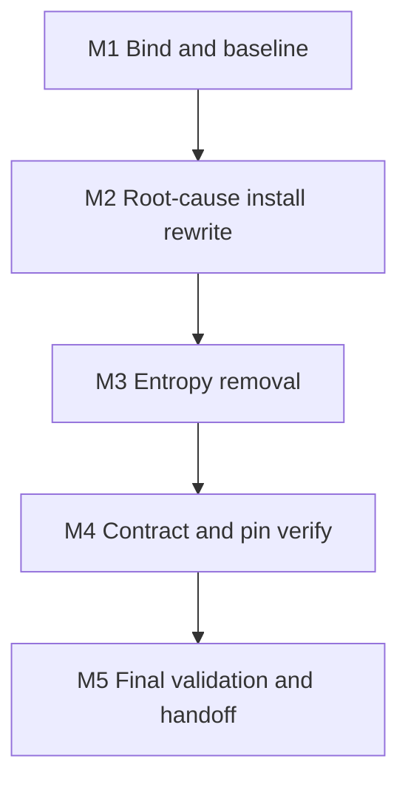

## PLAN: Fix CI missing project deps for pec.py tests (Improve ×2)

### Objective

Restore green GitHub Actions **Test Suite**. Controller tests spawn `pec.py` → `jsonschema`; CI never installs `[project.dependencies]` because `pip install -e` fails (`[tool.uv] package = false`).

**Root cause:** Test Suite installs pytest tooling only. Per-package wheel fallbacks (`langgraph`, drafted `jsonschema`) are symptom patches.

**Success criteria:**
- All `[project.dependencies]` installed from [`uv.lock`](uv.lock) on the Test Suite runner
- `import jsonschema` succeeds in the same env as pytest / `pec.py` subprocesses
- No `ModuleNotFoundError: No module named 'jsonschema'` in Test Suite logs
- Zero one-off dependency fallback lines remain
- Lint job unchanged; scanners unchanged
- Final Validation section completed with honest Passed/Failed/Unknown results

### Scope

**In:** Rewrite `test` → `Install test tools` in [`.github/workflows/l9-lint-test.yml`](.github/workflows/l9-lint-test.yml) to `uv sync --locked --extra dev` (same as [`Makefile`](Makefile) `venv`), put `.venv/bin` on `GITHUB_PATH`, keep ad-hoc only `pytest-xdist` / `pytest-timeout`, replace workaround comments with lockfile-contract comment.

**Out:** Installable package flip; controller/test code edits; adding xdist/timeout to lock; Lint pin hardening; CI security job; commit/push without explicit authorization.

### Scanner / requirements.txt (summary)

- Scanners (gitleaks/bandit/semgrep/pip-audit), CodeQL, Sonar: **NotAffected** — different install path (`uvx`/brew/actions).
- [`requirements.txt`](requirements.txt) ↔ `pyproject` `dev` ↔ `uv.lock`: **internally consistent**. Runtime deps belong in `[project.dependencies]`; CI never consumed either correctly (dead `requirements-ci.txt` check).

### Issue inventory

| ID | Sev | Finding | Plan disposition |
|----|-----|---------|------------------|
| I1 | High | CI missing `jsonschema` at pec.py runtime | Fix via M2 |
| I2 | High | `[project.dependencies]` never installed | Fix via M2 |
| I3 | Med | Per-dep fallback recurrence | Fix via M3 |
| I4 | Low | Local `uv run` vs CI bare pip | Fix via M2 PATH |
| I5 | Med | CI ignores `requirements.txt` | Fix via M2 `uv sync --extra dev` |
| I6 | Low | Lint unpinned ruff/mypy | **Out** |
| I7 | Low | xdist/timeout unpinned | Residual ad-hoc in M2 |

**Rejected:** jsonschema-only wheel fallback (symptom).

---

### Depth milestones (Improve recursive depth → execution)

Execute in order. Do not claim a later milestone complete if an earlier one is Failed/Unknown without an explicit blocker.



#### M1 — Bind and baseline (Improve pass 1–2)

**Depth:** Inventory only; no repo edits required if evidence already held.

- Bind target: [`.github/workflows/l9-lint-test.yml`](.github/workflows/l9-lint-test.yml) `test` job `Install test tools` only
- Confirm baseline: Test Suite Failed with `ModuleNotFoundError: jsonschema`; Lint Passed
- Confirm exclusions: scanners NotAffected; Lint soft-drift Out
- **Exit gate:** Target path unambiguous; I1/I2 accepted as verified

#### M2 — Root-cause remediation (Improve pass 3–4)

**Depth:** Single authoritative install contract.

Implement Install step as:

1. Ensure `uv` (`pip install uv` if missing)
2. `uv sync --locked --extra dev`
3. `echo "$PWD/.venv/bin" >> "$GITHUB_PATH"`
4. Import-or-install `pytest-xdist` and `pytest-timeout` into the active env only

Do **not** keep `pip install -e` or langgraph/jsonschema fallbacks in the final step (removal lands in M3 if staged).

**Exit gate:** Workflow YAML encodes sync → PATH → CI plugins; pytest step left structurally unchanged (`PYTHONPATH` / split suites)

#### M3 — Entropy reduction (Improve pass 5)

**Depth:** Delete dead paths; one comment block.

- Remove: `pip install -e ".[dev]" || …`, langgraph fallback, jsonschema fallback (including working-tree draft)
- Remove: comments that justify the old workaround model
- Add: one comment — editable install impossible (`package = false`); lockfile owns project + dev deps; xdist/timeout remain CI-only ad-hoc
- Optionally drop dead `requirements-ci.txt` branch in Test Suite install (no-op today); do not touch Lint unless necessary for consistency in the same file edit

**Exit gate:** `rg -n "pip install -e|langgraph==|jsonschema==" .github/workflows/l9-lint-test.yml` finds no Test Suite install fallbacks

#### M4 — Pin / contract verify (Improve pass 3 residual)

**Depth:** No dependency churn.

- `jsonschema` in lock = `4.26.0`; `langgraph` = `1.2.9`
- [`pyproject.toml`](pyproject.toml) ranges unchanged; [`requirements.txt`](requirements.txt) unchanged; no `uv.lock` edit in the change set
- Diff touches only the workflow (plus nothing else accidental)

**Exit gate:** `git diff --name-only` is workflow-only (or explicitly justified extras); lock/pyproject/requirements untouched

#### M5 — Final validation and handoff (Improve pass 6–7)

**Depth:** Mandatory — see **Final Validation** below. No Succeeded claim without it.

---

### Implementation checklist

Use during execution; every box must be checked or marked N/A with reason before M5 pass.

**Pre-edit**
- [ ] M1 exit gate satisfied (target + baseline + exclusions)
- [ ] Working tree unrelated changes identified so they are not staged by mistake

**Edit**
- [ ] `Install test tools` calls `uv sync --locked --extra dev`
- [ ] `.venv/bin` appended to `GITHUB_PATH` in the same job before pytest
- [ ] `pytest-xdist` and `pytest-timeout` still ensured after sync
- [ ] No `pip install -e` in Test Suite install
- [ ] No `langgraph==` / `jsonschema==` one-off installs in Test Suite install
- [ ] Comment block states lockfile contract (not the old fallback story)
- [ ] Pytest step (`PYTHONPATH`, suite split, coverage flags) unchanged

**Contract**
- [ ] `uv.lock` still has `jsonschema` 4.26.0 and `langgraph` 1.2.9
- [ ] No edits to `pyproject.toml` / `requirements.txt` / `uv.lock`
- [ ] Change set limited to `.github/workflows/l9-lint-test.yml`

**Authorize**
- [ ] User explicitly authorized commit (and push, if needed) before any git write of commit/push

---

### Risks

| Risk | Mitigation |
|------|------------|
| Cold `uv sync` slower on GHA | Accept; correct; optional cache follow-up Out |
| PATH not updated → system pytest without deps | Checklist item + M5 import probe |
| xdist/timeout unpinned | Explicit residual I7; do not expand lock this change |
| Unrelated WIP staged | Pre-edit checklist + name-only diff gate |

### Estimate

**Total:** ~30–45 minutes implementation + CI wait
**GMPs:** 1

---

### Final Validation (mandatory end step)

Run after M2–M4 edits exist in the working tree (and again on the post-push CI revision). Record each result as **Passed / Failed / Skipped / NotApplicable / Unknown** with evidence. Do not claim overall Succeeded if any Critical row is Failed or Unknown.

#### V1 — Structural (local, pre-push)

| Check | Command / method | Critical? |
|-------|------------------|-----------|
| Workflow contains `uv sync --locked --extra dev` | `rg -n "uv sync --locked --extra dev" .github/workflows/l9-lint-test.yml` | Yes |
| PATH wiring present | `rg -n "GITHUB_PATH" .github/workflows/l9-lint-test.yml` in test job | Yes |
| No editable-install / per-dep fallbacks in Test Suite install | `rg -n "pip install -e|langgraph==|jsonschema==" .github/workflows/l9-lint-test.yml` → empty for install block | Yes |
| Diff scope | `git diff --name-only` → workflow only | Yes |
| Lock pins unchanged | Inspect `uv.lock` names/versions for jsonschema/langgraph; `git diff uv.lock` empty | Yes |

#### V2 — Local behavioral smoke (optional but preferred)

| Check | Command / method | Critical? |
|-------|------------------|-----------|
| Sync matches Makefile | `uv sync --locked --extra dev` exits 0 | Preferred |
| jsonschema import in synced env | `uv run python -c "import jsonschema; print(jsonschema.__version__)"` | Preferred |
| Targeted pec path still importable | `uv run python -c "import sys; sys.path.insert(0,'environment/program-execution/core/program-execution-controller-template/scripts'); import pec"` or run one controller test via `uv run pytest …/test_controller_success.py -q` | Preferred |

If V2 cannot run: mark **Unknown** with reason (missing uv/network); do not invent Passed.

#### V3 — CI evidence (post-push; blocking for handoff Succeeded)

| Check | Evidence | Critical? |
|-------|----------|-----------|
| Install test tools step conclusion = success | Actions job log | Yes |
| No `ModuleNotFoundError: No module named 'jsonschema'` in pytest log | Actions log search | Yes |
| Test Suite job conclusion = success **or** residual failures documented as unrelated to missing deps | Actions conclusion + failure signatures | Yes |
| Lint job still success (unchanged path) | Actions | Preferred |

#### V4 — Convergence / residual

| Item | Status to record |
|------|------------------|
| I1–I5 | Resolved or Blocked (with reason) |
| I6 Lint pin drift | Explicitly residual Out |
| I7 xdist/timeout unpinned | Explicitly residual accepted |
| Another Improve pass needed? | No, unless V3 Failed on install/import |

#### Validation sign-off template (fill at end of execution)

```text
Final Validation
  V1 structural:     ______  evidence: ______
  V2 local smoke:    ______  evidence: ______
  V3 CI Test Suite:  ______  evidence: ______
  V3 CI Lint:        ______  evidence: ______
  V4 residuals:      I6 Out; I7 accepted; other: ______
  Overall readiness: Succeeded | PartiallySucceeded | Blocked | Failed
  Blocker (if any):  ______
```

**Handoff rule:** Overall **Succeeded** only when V1 Critical = Passed, V3 Critical = Passed, and no remediable High issue remains. Commit/push remain user-gated even when validation is green.

### Convergence

**Plan status:** Converged for implementation — root cause fixed at install boundary; depth milestones M1–M5 ordered; checklist + Final Validation are the completion contract.

**Next action after approval:** Execute M1→M5; stop before commit until authorized.
