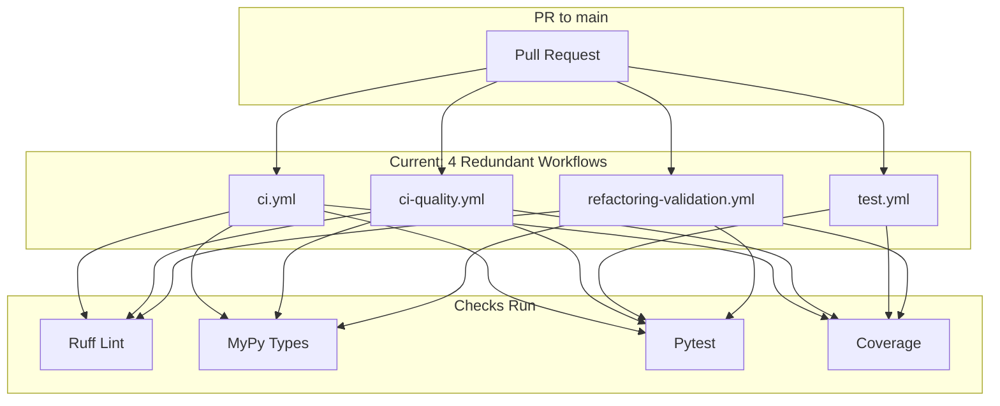
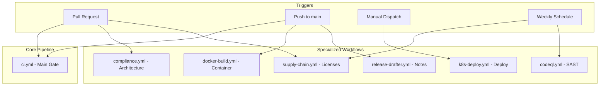

# CI/Hooks/Pre-commit Pipeline Realignment Plan

## Current State Summary

The audit identified **4 critical issues** and **significant duplication**:
- Tool version mismatches between pre-commit and CI
- Coverage threshold conflicts (80% vs 60%)
- 3-4 workflows running identical tests on every PR
- Missing release-drafter configuration file

---

## Phase 1: Version Alignment (Single Source of Truth)

**Goal:** All tools use identical versions across pre-commit, pyproject.toml, requirements-ci.txt, and workflows.

### 1.1 Update Pre-commit Hook Versions

File: [.pre-commit-config.yaml](.pre-commit-config.yaml)

| Hook | Current | Target |
|------|---------|--------|
| ruff-pre-commit | `v0.15.5` | `v0.15.8` |
| mirrors-mypy | `v1.14.0` | `v1.19.1` |

Changes:
- Line 36: `rev: v0.15.5` → `rev: v0.15.8`
- Line 53: `rev: v1.14.0` → `rev: v1.19.1`

### 1.2 Fix Hardcoded Version in ci-quality.yml

File: [.github/workflows/ci-quality.yml](.github/workflows/ci-quality.yml)

- Line 68: `pip install "ruff==0.15.5" mypy` → `pip install -r requirements-ci.txt`

This ensures CI uses the same versions as requirements-ci.txt (single source of truth).

---

## Phase 2: Coverage Threshold Alignment

**Goal:** Single coverage threshold (60%) across all configurations.

### 2.1 Fix pytest.ini

File: [pytest.ini](pytest.ini)

- Line 14: `--cov-fail-under=80` → `--cov-fail-under=60`

### 2.2 Verify Alignment

After fix, all locations will use 60%:
- `pytest.ini`: 60%
- `pyproject.toml`: 60%
- `Makefile`: 60%
- `ci.yml`: 60% (via `COVERAGE_THRESHOLD`)

---

## Phase 3: Workflow Consolidation (Remove Duplication)

**Goal:** Eliminate redundant test/lint runs. Each check runs exactly once.

### Current Duplication Map



### Target Architecture



### 3.1 Delete Redundant Workflow: test.yml

File: [.github/workflows/test.yml](.github/workflows/test.yml)

**Action:** DELETE this file entirely.

**Rationale:**
- `ci.yml` already runs the same tests with more features (services, coverage upload, parallel execution)
- `test.yml` uses outdated pytest version (`8.3.5` vs `9.0.2`)
- Removing eliminates redundant test runs

### 3.2 Consolidate ci-quality.yml into ci.yml

File: [.github/workflows/ci-quality.yml](.github/workflows/ci-quality.yml)

**Action:** DELETE this file and merge unique jobs into ci.yml.

**Jobs to migrate to ci.yml:**
- `semgrep` - Add as new job in ci.yml
- `secrets-scan` (GitGuardian) - Add as new job in ci.yml
- `yaml-validate` - Already covered by ci.yml validate phase
- `l9-contract-audit` - Already in ci.yml (via compliance)
- `architecture-guard` - Already in compliance.yml

**Jobs already covered (no migration needed):**
- `lint-format` - ci.yml has identical job
- `sonarcloud` - ci.yml has coverage upload to Codecov (sufficient)
- `coverage` - ci.yml has identical job

### 3.3 Scope Refactoring Workflow

File: [.github/workflows/refactoring-validation.yml](.github/workflows/refactoring-validation.yml)

**Action:** Modify to only run on `refactor/*` branches, not all PRs.

Change trigger from:
```yaml
on:
  pull_request:
    branches:
      - main
      - develop
    paths:
      - '**/*.py'
```

To:
```yaml
on:
  pull_request:
    branches:
      - main
      - develop
    paths:
      - '**/*.py'
  push:
    branches:
      - 'refactor/**'
```

Add condition to job:
```yaml
if: startsWith(github.head_ref, 'refactor/') || startsWith(github.ref, 'refs/heads/refactor/')
```

---

## Phase 4: Add Missing Configuration

### 4.1 Create Release Drafter Config

File: `.github/release-drafter.yml` (NEW)

```yaml
name-template: 'v$RESOLVED_VERSION'
tag-template: 'v$RESOLVED_VERSION'
categories:
  - title: 'Features'
    labels:
      - 'feature'
      - 'enhancement'
  - title: 'Bug Fixes'
    labels:
      - 'fix'
      - 'bugfix'
      - 'bug'
  - title: 'Maintenance'
    labels:
      - 'chore'
      - 'dependencies'
change-template: '- $TITLE @$AUTHOR (#$NUMBER)'
version-resolver:
  major:
    labels:
      - 'major'
  minor:
    labels:
      - 'minor'
      - 'feature'
  patch:
    labels:
      - 'patch'
      - 'fix'
  default: patch
template: |
  ## Changes

  $CHANGES
```

---

## Phase 5: Update ci.yml with Migrated Jobs

### 5.1 Add Semgrep Job

Add to [.github/workflows/ci.yml](.github/workflows/ci.yml) after the `lint` job:

```yaml
  semgrep:
    name: Semgrep Policy Check
    runs-on: ubuntu-latest
    timeout-minutes: 10
    needs: validate

    steps:
      - name: Checkout code
        uses: actions/checkout@v6

      - name: Run Semgrep
        uses: returntocorp/semgrep-action@v1
        with:
          config: '.semgrep/'
```

### 5.2 Add Secrets Scan Job (Optional)

Add GitGuardian scan if `GITGUARDIAN_API_KEY` secret is configured:

```yaml
  secrets-scan:
    name: Secrets Scan
    runs-on: ubuntu-latest
    timeout-minutes: 10
    needs: validate
    if: ${{ secrets.GITGUARDIAN_API_KEY != '' }}

    steps:
      - name: Checkout code
        uses: actions/checkout@v6
        with:
          fetch-depth: 0

      - name: GitGuardian scan
        uses: GitGuardian/ggshield-action@v1
        env:
          GITGUARDIAN_API_KEY: ${{ secrets.GITGUARDIAN_API_KEY }}
```

### 5.3 Update ci-gate Dependencies

Update the `ci-gate` job to include new jobs:

```yaml
  ci-gate:
    needs:
      - validate
      - lint
      - semgrep        # NEW
      - test
      - security
      - sbom
      - scorecard
```

---

## Phase 6: Update Documentation

### 6.1 Update CICD_PIPELINE.md

File: [readme/CICD_PIPELINE.md](readme/CICD_PIPELINE.md)

Update the workflow summary table to reflect consolidated structure:

| Workflow | Trigger | Purpose | Blocking |
|----------|---------|---------|----------|
| `ci.yml` | Push, PR | Main pipeline (validate, lint, semgrep, test, security, SBOM, scorecard) | Yes |
| `compliance.yml` | PR (Python changes) | Architecture compliance | Yes |
| `supply-chain.yml` | PR, push, weekly | License compliance | Partial |
| `codeql.yml` | PR, push, weekly | CodeQL analysis | No |
| `docker-build.yml` | Push to main, tags | Container build | No |
| `k8s-deploy.yml` | Manual | Deployment | No |
| `pr-review-enforcement.yml` | PR | Size limits | Yes (>1000 lines) |
| `release-drafter.yml` | Push to main | Release notes | No |
| `docs-sync.yml` | Docs changes | Link validation | No |

Remove from table:
- `ci-quality.yml` (deleted)
- `test.yml` (deleted)
- `refactoring-validation.yml` (scoped to refactor branches only)

---

## Final Workflow Structure

After consolidation:

```
.github/workflows/
├── ci.yml                      # Main CI gate (lint, semgrep, test, security, SBOM)
├── compliance.yml              # Architecture compliance
├── supply-chain.yml            # License & dependency review
├── codeql.yml                  # CodeQL SAST
├── docker-build.yml            # Container build & scan
├── k8s-deploy.yml              # K8s deployment
├── pr-review-enforcement.yml   # PR size policy
├── release-drafter.yml         # Auto release notes
├── refactoring-validation.yml  # Refactor branch gate (scoped)
├── docs-sync.yml               # Documentation validation
└── coderabbit-notify.yml       # Review notifications
```

Deleted:
- `test.yml` (redundant with ci.yml)
- `ci-quality.yml` (merged into ci.yml)

---

## Verification Checklist

After implementation, verify:

- [ ] `pre-commit run --all-files` passes
- [ ] Ruff version matches across all configs (`0.15.8`)
- [ ] MyPy version matches across all configs (`1.19.1`)
- [ ] Coverage threshold is 60% everywhere
- [ ] Only `ci.yml` runs tests on PRs (no duplicates)
- [ ] Semgrep runs in ci.yml
- [ ] Release drafter config exists and works
- [ ] `make agent-check` passes locally
