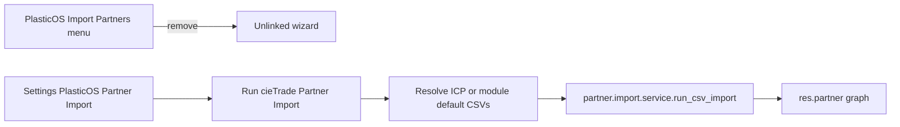

# PLAN: cieTrade Partner Import → Settings (mechanical)

### Objective

Stop advertising **Import Partners** on the PlasticOS top banner (and Contacts). Operators run a **one-shot, server-side** cieTrade partner load from **Settings**, using fixed CSV paths (module defaults or ICP overrides)—not ad-hoc browser uploads that corrupt mid-transfer on large files.

**Success (falsifiable):**

1. After upgrade, PlasticOS root and Contacts have **no** “Import Partners” / “Import Partners (CSV)” menuitems.
2. **Settings → PlasticOS Partner Import** (system group) shows **Run cieTrade Partner Import** that calls `plasticos.partner.import.service.run_csv_import` with resolved server paths.
3. Browser Binary upload is **not** the Settings path (wizard remains unlinked for emergency Technical use only).
4. cieTrade partner CSV semantics and `validate_partner_graph` behavior unchanged except entrypoint/UX.

### Chosen approach (concrete)

There is **no cieTrade live API** in-repo. “Mechanical like VanillaSoft” here means:

- Same **UX ownership**: Settings-only, admin, forgettable after one use.
- Same **operator contract**: button → deterministic backend → result; no menu clutter.
- **Data plane**: server filesystem CSVs already used by `use_default_files` / `post_init_hook` / ICP keys `plasticos_partner_import.default_corporate_csv` and `.default_facility_csv` ([`partner_import_wizard.py`](plasticos_partner_import/wizards/partner_import_wizard.py)).

### Scope

**In:**

- Remove menus in [`plasticos_partner_import/views/partner_import_wizard_views.xml`](plasticos_partner_import/views/partner_import_wizard_views.xml); `<delete>` + post-migrate cleanup (pattern from CRM lead menus / [`migrations/19.0.2.7.1`](plasticos_partner_import/migrations/19.0.2.7.1/post-migrate.py)).
- Add [`res_config_settings.py`](plasticos_partner_import/models/res_config_settings.py) + [`res_config_settings_views.xml`](plasticos_partner_import/views/res_config_settings_views.xml) (mirror [`plasticos_crm_sync/views/res_config_settings_views.xml`](plasticos_crm_sync/views/res_config_settings_views.xml)).
- Extract path resolution onto service (or shared helper) so Settings and wizard share one SSOT for default CSV paths.
- Manifest: add `base_setup`; bump `19.0.2.7.2` → `19.0.2.7.3`; wire new XML.
- README / docs alignment; wizard deprecation banner.

**Out:**

- cieTrade HTTP/API client (does not exist).
- Rewriting CSV parsers, facility_role graph validation rules, or `post_init_hook` auto-import wipe logic.
- Bulk-update wizard redesign.
- Commit / push / Staging deploy unless separately authorized.

### Pre-Validation (mandatory)

| Check | Command / action | Pass criteria | Status |
|-------|------------------|---------------|--------|
| P0 Target bind | Menus in partner_import_wizard_views; Settings pattern in crm_sync | Single write root `plasticos_partner_import/` (+ docs) | Pending at execute |
| P1 Baseline | Confirm banner menu `menu_partner_import_wizard_plasticos` parent `plasticos_base.plasticos_root_menu` | Gap = wrong UX ownership | Pending |
| P2 Clean gate | `PR_CHECK_SKIP_REMOTE=1 make pr-check` before first edit | PASS or document baseline FAIL | Pending |
| P3 Module | `plasticos_partner_import` installed locally/Staging | PASS or Skipped with reason | Pending |

### TODO Plan

| # | Task | Files | Effort | Risk | Deps | Leverage |
|---|------|-------|--------|------|------|----------|
| 1 | Pre-Validation | — | S | Dirty tree | — | High |
| 2 | Path SSOT helper on import service | [`partner_import_service.py`](plasticos_partner_import/models/partner_import_service.py), wizard uses it | S | Path drift | 1 | High |
| 3 | Settings model + XML button | `res_config_settings.py`, `res_config_settings_views.xml`, `__init__`, manifest | M | Timeout on full import | 2 | High |
| 4 | Remove menus + delete + post-migrate 19.0.2.7.3 | wizard views XML, `migrations/19.0.2.7.3/post-migrate.py` | S | Leftover menu | 1 | High |
| 5 | Wizard banner / README / docs README | wizard XML, READMEs | S | Doc drift | 3–4 | Med |
| 6 | Final Validation | `make pr-check`, `make update m=plasticos_partner_import` | M | Docker flaky | 3–5 | High |

### Critical path

`pre-validate → path-ssot → settings-button → remove-menus → docs → final-validate`

### Depth — contracts

**Settings button `action_plasticos_partner_import_run_cietrade`:**

1. `ensure_one()`; `set_values()` (persist ICP path overrides).
2. Resolve corporate + facility paths: ICP absolute file if exists, else module default filenames (`1. Counterparties - Parent - CORPORATE-Ready To Import.csv`, `2. Counterparties - Child - FACILITY LOCATIONS.csv`).
3. `UserError` if either file missing.
4. Call `env["plasticos.partner.import.service"].run_csv_import(corporate, facility)` — **not** Binary upload.
5. Return success notification with counts (or `UserError` on service failure); do not open a banner wizard.
6. `groups="base.group_system"` on Settings app/button.

**Preserved:** import service logic, validation, post_init auto-import marker behavior, cieTrade partner CSV column mapping.

### Stress test

- **Disconfirming:** Staging still shows Import Partners after upgrade → menu xmlids not deleted; need `<delete>` + post-migrate.
- **Assumed false if:** Operator still needs frequent re-import with new uploads — then Settings path ICP overrides must be documented (re-export → replace files on server → click again).
- **Blast radius:** Settings UX + menu visibility only; partner data only if button clicked.
- **Rollback:** Restore menuitems; remove Settings app inherit; revert manifest version.

### Leverage

1. Remove banner menus (immediate Staging clutter win).
2. Settings button reusing `run_csv_import` (no new import engine).
3. Path SSOT (stops wizard vs Settings divergence).

### Doc / Root Surface Impact (mandatory)

| Surface | Action | Notes |
|---------|--------|-------|
| Repo `README.md` / `AGENTS.md` / `ARCHITECTURE.md` | N/A | No module inventory change |
| [`plasticos_partner_import/README.md`](plasticos_partner_import/README.md) | Update | Settings path; banner removed |
| [`docs/README_plasticos_partner_import.md`](docs/README_plasticos_partner_import.md) | Update | Same |
| Runbook | N/A unless one exists for partner import | None required |

### Milestones / Checkpoints

| Milestone | Outcome |
|-----------|---------|
| M1 | Settings action runs server CSV import |
| M2 | Banner/Contacts menus gone in DB after upgrade |
| M3 | pr-check green |

| CP | Evidence | No-go |
|----|----------|-------|
| CP1 | Settings method has no Binary fields | Revert if upload sneaks in |
| CP2 | `ir_model_data` has 0 `menu_partner_import_wizard*` | Fix delete/migrate |
| CP3 | `make pr-check` PASS | Do not claim ready |

### Risks

| Risk | Mitigation |
|------|------------|
| Full import HTTP timeout | Document; keep shell `scripts/run_import.py` for ops |
| Graph validation ERROR noise on import | Pre-existing; do not expand scope unless button fails closed incorrectly |
| ICP paths wrong on Odoo.sh | Help text: absolute paths on server filestore/addons; default = module CSVs |

### Unknowns

| ID | Question | Resolution |
|----|----------|------------|
| U1 | Whether Staging already ran post_init auto-import | N/A for UX move; button remains re-runnable |

### Final Validation (mandatory)

| Check | Command | Pass criteria |
|-------|---------|---------------|
| V1 | Plan sections complete | This document |
| V2 | `PR_CHECK_SKIP_REMOTE=1 make pr-check` | PASS; no commit/push |
| V3 | `make update m=plasticos_partner_import` | Module `installed` at `19.0.2.7.3` |
| V4 | DB: no partner import menus; Settings button present in view XML | Observed |

### Convergence / GMP handoff

- **status:** implementation-ready plan (awaiting user approve → Agent / `l9-gmp-protocol`)
- **may_modify:** `plasticos_partner_import/**`, listed docs
- **must_not_modify:** plan file after approval execution, `pipeline_v2`, cieTrade API invention
- **next_skill:** `l9-gmp-protocol` or direct Agent execute
