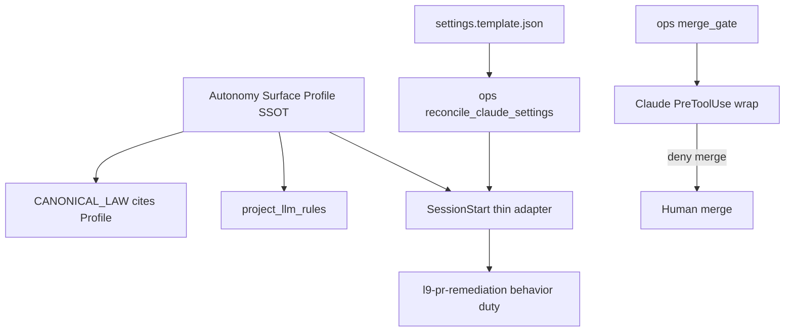

# PLAN: Autonomy Surface Parity (Claude → Peers)

## Kernel audit (Improve → Leverage)

```yaml
execution_mode: plan_iteration_only
kernels: [Improve.md, Leverage.md]
target: /Users/ib-mac/.cursor/plans/claude_autonomy_parity_3122b791.plan.md
architecture_adapter:
  name: CANONICAL_LAW_2_1_cursor_primary
  governing_source: ~/.cursor-governance/CANONICAL_LAW.md
  mandatory:
    - shared_capability_lives_in_ops_rules_skills
    - adapters_are_thin_wrappers
    - no_new_brain_under_environment_claude_code
  prohibited:
    - speculative_shared_boot_core_before_two_callers
    - flipping_skillOverrides_to_fake_auto_invoke
    - autonomous_merge
single_ingress:
  status: Applicable_for_authority_only
  reason: >
    Multiple hooks exist (SessionStart, UserPromptSubmit, PreToolUse).
    Authority/normalization belongs in one Autonomy Surface Profile loaded at
    SessionStart and enforced at PreToolUse — not one mega-hook.
convergence_plan_artifact: Converged
```

### Leverage matrix (ranked)

| Rank | Move | Leverage type | Why it compounds | Reject if |
|------|------|---------------|------------------|-----------|
| **L1** | Durable `reconcile_claude_settings` | reuse + determinism | Ends forever the root outage (template≠live); every consumer + user re-run is one command | Hand-copying settings each repo |
| **L2** | **Autonomy Surface Profile** SSOT fragment | contract + reuse | One file feeds law text, llm-rules override, SessionStart block, peer boots — no triple-edit drift | Duplicating doctrine prose in CANONICAL_LAW / ADR / SessionStart / README |
| **L3** | `ops/` merge_gate + thin Claude wrap | §2.1 + reuse | Hard bound once; peers call same gate later | Claude-only merge script under `environment/claude-code/hooks/` as the brain |
| **L4** | Install Gate_SDK triad via reconcile | efficiency | One-shot consumer proof | Separate bespoke Gate_SDK wiring |
| **L5** | SESSION_START_SPEC → Claude one rewrite | efficiency | Avoid Cursor rewriting script twice | Optional Cursor “minimal patch” then Claude full rewrite of same file |
| ~~L−~~ | Extract `session_boot_core.sh` now | false leverage | Only one proven caller after deploy; Cursor already works | **Deferred** until Claude SessionStart + Cursor both call it |
| ~~L−~~ | Peer ADAPTER_CONTRACT before prove | false leverage | No consumer yet; Profile is the extension point | **Phase-2 after dry-run** |
| ~~L−~~ | Auto-init Python campaign every session | false leverage / risk | Single-lane velocity needs doctrine+permissions, not scheduler noise | Keep `/autonomy` for multi-lane only |

### Entropy removed from prior plan

- Merged M2 doctrine + projection into **Profile** (one artifact).
- Merged M4 boot-spec + M5 prove; dropped optional boot-core from critical path.
- Collapsed Improve issue log into this leverage matrix (no dual audit sections).
- Dropped T7 “minimal SessionStart patch then full rewrite” — Profile inject string is data; Claude does the only script rewrite from SPEC.
- Peers renumbered to post-prove only.

---

## Objective

Governed adapter sessions run A4 velocity by default: **commit → push → PR → remediate → human merge**, with law outranking ask-first and agent-invented refusals.

**Success:**
1. `reconcile_claude_settings --check` PASS on gov + `~/.claude` + Gate_SDK.
2. Claude SessionStart emits Profile doctrine + gov rev (no manual hook install).
3. Dry-run: commit+PR+remediation cycle without user ask; merge blocked by **ops merge_gate** via PreToolUse.
4. llm-rules contain Profile override after 99/96; `validate_skill_activation` PASS (remediation stays explicit-only).
5. Peers not started until (1–4) true.

## Scope

**In:** L1–L5 above; skill-routing WIP only to keep validators green; acceptance dry-run.

**Out:** Autonomous merge; skillOverrides flip; rewriting `autonomy/*.py`; Gate_SDK product code; boot-core extract; peers before prove; Cursor silent-commit default.

## Architecture (locked)



### Autonomy Surface Profile (new SSOT — highest contract leverage)

Single file, e.g. `environment/agents/autonomy_surface_profile.yaml` (or `ops/autonomy/surface_profile.yaml`):

```yaml
schema_version: 1
when:
  L9_AUTONOMY_ENABLED: true
  L9_GOVERNANCE_SURFACE: [claude-code, codex, gemini, manus]  # not cursor
authorize:
  - scoped_commit_push
  - create_update_pr
  - remediation_after_pr   # agent MUST load l9-pr-remediation; skill stays explicit_only
forbid:
  - merge_pull_request
  - gh_pr_merge
  - force_push
  - hard_reset
  - secrets_exfil
authority_order:
  - CANONICAL_LAW.autonomy_velocity  # cites this profile
  - ADR-0001
  - settings.allow_deny + merge_gate
  - AGENTS.md
  - skills
  - agent_invented_contracts  # lowest
session_start_block: |
  <canonical doctrine text injected verbatim>
llm_rules_override: |
  <canonical override appended after 99/96>
```

**Consumers (must not fork text):** CANONICAL_LAW (reference), `project_llm_rules.py`, SessionStart, peer boot carriers (later), ADR addendum (pointer).

### Settings reconcile (highest automation leverage)

One ops script (extend `setup_claude_code_plugins.sh` **or** add `ops/scripts/reconcile_claude_settings.py`):

1. Render/sync gov committed `.claude/settings.json` + hooks from `settings.template.json`
2. Merge-patch `~/.claude/settings.json`: hooks/env/permissions/skillOverrides from template; **preserve** `enabledPlugins` and unrelated user keys
3. Install consumer `<repo>/.claude/{settings.json,hooks/*}` as **committed files** (Mobile law)
4. `--check` mode for CI / `make claude-env`

This is the single ingress for **deploy correctness**.

### Merge gate (§2.1)

- Brain: `ops/hooks/merge_gate.py` (or `ops/autonomy/merge_gate.py`) — deny merge/force/admin unless human auth present
- Claude: PreToolUse wrapper one-liner calling ops
- Cursor: optional later bind; not required for M1–M4

### Standing A4 (one mechanism)

Profile `session_start_block` + template `L9_AUTONOMY_*` env. No auto-`autonomy/cli.py init` for ordinary sessions. Multi-lane still `/autonomy`.

### Remediation vs skillOverrides

Keep `l9-pr-remediation` explicit-only + user-invocable-only. Profile makes post-PR remediation a **mandatory behavior**. Do not weaken validators.

## Pre-Validation

| Check | Action | Pass |
|-------|--------|------|
| P0 | Bind gov + Gate_SDK | Unambiguous |
| P1 | Diff `~/.claude/settings.json` vs template | Gap listed |
| P2 | Gov git quarantine | Clean program branch |
| P3–P4 | `make claude-env` + `autonomy-validate` | Baseline recorded |
| P5 | Gate_SDK `.claude` inventory | Matches |

## TODO (dependency-ordered)

| # | Task | Files | Leverage |
|---|------|-------|----------|
| T0 | Quarantine WIP + baselines | gov branch | hygiene |
| T1 | **Author Autonomy Surface Profile** | `ops/autonomy/surface_profile.yaml` (or agents/) | **L2** |
| T2 | **Implement `reconcile_claude_settings`** + `--check`; wire `make claude-env` | `ops/scripts/…`, Makefile | **L1** |
| T3 | Run reconcile: gov `.claude` + `~/.claude` + Gate_SDK | outputs of T2 | **L4** |
| T4 | CANONICAL_LAW / AGENTS / ADR cite Profile (no forked doctrine prose) | law docs | **L2** |
| T5 | 99/96 waiver clauses; projector appends `llm_rules_override` from Profile | rules + `project_llm_rules.py` | **L2** |
| T6 | ops `merge_gate` + Claude PreToolUse registration in template | `ops/…`, settings.template | **L3** |
| T7 | `SESSION_START_SPEC.md`: inject Profile block; call reconcile optionally; Claude writes script once | hooks/SPEC | **L5** |
| T8 | Skill-routing WIP → green only | ops/skill_routing leftovers | unblock |
| T9 | Acceptance: reconcile --check + dry-run PR path + merge_gate unit test | tests | **L4** |
| T10 | Phase-2: peers mount Profile | adapter contract | after prove |

## Milestones

| M | Outcome | Unlock |
|---|---------|--------|
| M0 | Baselines + branch | Safe edit |
| M1 | Reconcile exists; triad installed | Live Claude governed |
| M2 | Profile → law + llm-rules + SessionStart data | Prompt stack coherent |
| M3 | merge_gate enforces forbid list | Hard bound |
| M4 | SPEC + Claude script + dry-run PASS | Velocity evidenced |
| M5 | Peers adapt Profile | Cross-LLM |

## Checkpoints

| CP | Evidence | No-go |
|----|----------|-------|
| CP1 | Reconcile `--check` PASS; plugins preserved | Hand-edited `~/.claude/settings.json` only |
| CP2 | SessionStart contains Profile `session_start_block` checksum/text | Forked doctrine strings |
| CP3 | merge_gate denies merge in unit test | Prompt-only “don’t merge” |
| CP4 | Dry-run commit+PR+remediate; merge blocked | Ask-first returns |
| CP5 | Peer work only if CP4 PASS | Premature peer abstraction |

## Checklist

- [ ] Pre-Validation recorded
- [ ] Autonomy Surface Profile SSOT exists; sole doctrine text source
- [ ] `reconcile_claude_settings` + `--check` + make target
- [ ] Gov / user / Gate_SDK triad installed via reconcile
- [ ] llm-rules override projected from Profile
- [ ] ops merge_gate + Claude PreToolUse wrap
- [ ] skillOverrides/validator unchanged PASS
- [ ] SESSION_START_SPEC; Claude one rewrite
- [ ] No boot-core extract on this critical path
- [ ] Dry-run PASS; peers gated
- [ ] No autonomous merge

## Risks

| Risk | Mitigation |
|------|------------|
| Settings merge drops plugins | Deep merge + fixture test; `--check` before write |
| Doctrine text forks again | Profile is only writer; docs cite path |
| merge_gate under claude-code by mistake | §2.1 review; lives in `ops/` |
| Cursor gets silent commits | Profile `when.surface` excludes cursor |
| Claude ignores Profile (model manners) | Dry-run; permissions allow; SessionStart first in context |

## Known unknowns

| Unknown | Resolve |
|---------|---------|
| Claude user-settings merge field semantics | Probe in T2 with copy |
| Web/Mobile 30s SessionStart budget | SPEC: reconcile is install-time; SessionStart only injects Profile + light probes |
| Cursor user_rules visible to Claude | M4 dry-run; Profile block states adapter surface wins |
| Gate_SDK commit authorization | Separate user ask for consumer commit |

## Estimate

**M0–M4:** 1–2 sessions (reconcile+Profile+gate is the core)
**M5 peers:** later
**Next skill on execute:** `l9-gmp-protocol` → T0–T3 first (Profile + reconcile before prose)

## Final Validation

| V | Check | Pass |
|---|-------|------|
| V1 | `make pr-check` (gov) | PASS |
| V2 | `reconcile_claude_settings --check` + `claude-env` + `autonomy-validate` | PASS |
| V3 | Live hooks: SessionStart, UserPromptSubmit, PreToolUse→merge_gate | Present |
| V4 | Profile text == SessionStart block == llm-rules override (hash equal) | No fork |
| V5 | Dry-run disposable PR | Velocity + merge deny |
| V6 | `validate_skill_activation` | PASS |

## Claude handoff (script only)

After Profile + SPEC exist:
1. SPEC + Profile `session_start_block`
2. Current SSOT SessionStart baseline
3. Constraints: fail-open; Mobile-safe committed copy; inject Profile; no new brains under `environment/claude-code/`; optional call to reconcile is install-time not SessionStart-critical
4. Accept: JSON envelope; exit 0; Profile strings present when gov found

## Residual

- Plan-only; no implementation until you authorize execute.
- Cursor ask-first preserved by Profile surface filter.
