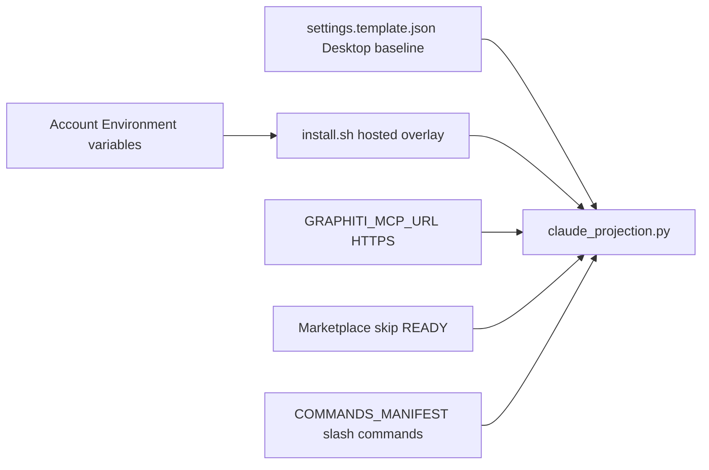

# Claude Code hosted environment remainder

## Objective

Make hosted Claude Code (Web / Mobile / `--cloud`) report the truth and enable the capabilities this architecture still intends: **Graphiti over HTTPS**, **projected skills/rules/commands/hooks**, **optional Desktop marketplace extras**, and **Context7 via a closable path when the marketplace is skipped**. Do not restore the capability broker. Do not fork a second settings tree.

Execute via **Cursor Build on this checkout** (`agent/cursor/cc-hosted-remainder`). Do not run `make campaign`. Do not admit a Program Lock. Do not require a new worktree from `origin/main`.

After this plan is approved, the first Build step is to emit a schema-valid `PLAN_DOCUMENT` JSON and project it with `--execute-via=cursor-build` into the repo plans store ([`docs/plans/`](docs/plans/) → `~/.cursor/plans`).

## Binding (Pre-Validate)

- **Workspace:** `/Users/ib-mac/.l9/gov-worktrees/cursor__cc-hosted-remainder`
- **Branch:** `agent/cursor/cc-hosted-remainder` @ `8e2ec8de` (base `origin/main` @ `a2f78b53`)
- **Hook catalog:** [`.pre-commit-config.yaml`](.pre-commit-config.yaml)
- **Do not write** `Lock: origin/main = <sha>`
- **Sibling (do not mutate):** `agent/cursor/unwire-cc-broker` owns broker retirement in `mcp.template.json` / `setup.bootstrap.sh`. Rebase after it lands; do not duplicate that Graphiti URL edit unless it is still absent after rebase.

## New architecture (operator 2026-08-29) — keep

- One adapter: [`settings.template.json`](environment/agents/adapters/claude-code/settings.template.json) is the committed baseline.
- Mobile wrap: account env + [`overlay_hosted_settings_env.py`](environment/agents/adapters/claude-code/overlay_hosted_settings_env.py) for **autonomy ceilings only**. Surface id stays `claude-code`.
- Same secrets/capability delivery on Desktop and Mobile; **no pasted tokens**. Authenticated Sonar / Semgrep AppSec stay off hosted.
- Marketplace skip is **not** a defect. Slash commands are **not** plugins.

## Donors audited (not re-executed as-is)

| Donor | Use |
|---|---|
| [`WIP/8-26-26-Claude Environment/environment_experience_improvement_pack_p307_revised/`](WIP/8-26-26-Claude Environment/environment_experience_improvement_pack_p307_revised/) | Keep CI-004 residual (per-component reason/log), CI-005 (memory.cli vs memory.mcp, CLI health via `graphiti_memory_client.py`), CI-012 (rule 22 when MCP absent), CI-015 (two-clone banner), CI-021 (skill-usage log path). Bound to `main@59f03a5d` + PR#360; **re-judge against this branch**. |
| [`docs/plans/claude-code/mobile-bootstrap-fixes`](docs/plans/claude-code/mobile-bootstrap-fixes.plan.md) | Keep T2/T3 (loadable skills + STALE workspace), T4 (cloud git hook removal), T7 (`validate_claude_env` from install), T8 (MCP inventory scan). **Drop T5 6-server broker template, T9 command reconciler (already projected), T11 deploy broker.** |
| [`docs/plans/claude-code/contract-v31-fixes`](docs/plans/claude-code/contract-v31-fixes.plan.md) | Contract-only; **reshape** C11 to Graphiti allowlist + Context7 skill/MCP honesty, not broker deployment. |
| [`claude-code-mobile-remediation.contract.v3.1.yaml`](WIP/8-26-26-Claude Environment/claude-code-mobile-environment/claude-code-mobile-remediation.contract.v3.1.yaml) | Live execution contract; update broker/marketplace clauses to match architecture. Do not treat 2026-08-20 snapshots as SSOT. |

## Already implemented — do not redo

On this branch (`8e2ec8de`):

- Hosted `SKIP_PLUGIN_MARKETPLACE=true` → plugins **READY** ([`install.sh`](environment/agents/adapters/claude-code/install.sh), [`emit_claude_readiness.py`](ops/scripts/emit_claude_readiness.py))
- `desktop_only` vs `core` in [`plugins.desired.json`](environment/agents/adapters/claude-code/plugins.desired.json)
- Slash commands classified on the bootstrap receipt; projection proven with marketplace skipped
- `--check` remaps to live SSOT (`$HOME/.cursor-governance`) so the doctor does not false-DEGRADE skills/rules
- Hosted autonomy overlay; `L9_GOVERNANCE_SURFACE` forced to `claude-code`

Already on `main` (do not re-plan as if missing):

- SessionStart one-shot installer repair keyed on governance revision ([`session_start_claude_governance.sh`](environment/agents/adapters/claude-code/hooks/session_start_claude_governance.sh) ~288–319)
- Receipt revision-bind vs TTL in [`claude_bootstrap_receipt.py`](ops/scripts/claude_bootstrap_receipt.py) (CI-004 IMP-03 / I-BF-01 largely landed)
- Command projection via [`claude_projection.py`](ops/scripts/claude_projection.py) `commands` domain (old T9)
- `.mcp.json` is a projection of `mcp.template.json` (old T5 first half — **URL still brokered on this branch until unwire merges**)

## Remaining work (aligned only)

### T1 — Graphiti health without the broker (CI-005 / I-BS-05 + CI-010 reshape)

[`emit_claude_readiness.py`](ops/scripts/emit_claude_readiness.py) still calls `probe_broker.py` for `Graphiti_authenticated_health`. [`install.sh`](environment/agents/adapters/claude-code/install.sh) still downgrades capabilities/memory/mcp when the broker URL is unset.

- Probe **CLI** with locked `.venv` + `ops/graphiti/graphiti_memory_client.py health`.
- Probe **MCP** as HTTP to `${GRAPHITI_MCP_URL}` (default `https://memory.quantumaipartners.com/graphiti/mcp`) — connect vs 401 vs 403 allowlist as distinct reasons.
- Split receipt `memory` into `memory.cli` / `memory.mcp` (CI-005). A working CLI + missing MCP tools is not one word `DEGRADED`.
- After sibling unwire: drop `broker.quantumaipartners.com` from [`web/network-policy.md`](environment/agents/adapters/claude-code/web/network-policy.md) and stop listing it as the Graphiti front door. Keep `memory.quantumaipartners.com` (operator paste; 403 allowlist was the live Mobile audit).
- Do **not** paste `GRAPHITI_MCP_TOKEN`. Empty hydrate is honest, not a write-gate.

### T2 — Context7 closable on hosted (CI-012)

[`rules/22-context7-auto-invoke.mdc`](rules/22-context7-auto-invoke.mdc) still mandates MCP `resolve-library-id` / `query-docs`. Hosted has **no** `mcp__context7__*` tools when the marketplace is skipped.

- Extend rule 22: if Context7 MCP tools are absent, the obligation is **skill `l9-context7-docs`** (or official docs GET), not an unmatchable MCP call.
- Annotate projected Claude rules when `SKIP_PLUGIN_MARKETPLACE=true` (I-BS-12).
- Update [`context7_stack_pretool.py`](environment/agents/adapters/claude-code/hooks/context7_stack_pretool.py) deny text: it already accepts `l9-context7-docs` in skill-usage.jsonl, but the deny string still says “Call Context7 MCP”, which is unclosable on Mobile.
- Do **not** register a credential-bearing Context7 HTTP MCP in `mcp.template.json`. Do **not** DEGRADE plugins to “fix” this.

### T3 — Per-component reason + log (CI-004 residual I-BF-03)

Bootstrap receipt still stores one word per component. SessionStart repair writes a log file but the receipt does not point at it.

- Add `reasons` / `log_path` maps on `l9.claude-bootstrap.v1` (additive JSON).
- Banner prints the reason, not archaeology of `bootstrap-state.json`.

### T4 — SessionStart truth (old mobile T2/T3)

- Loadable-skill probe over real `.claude/skills` discovery paths vs “55 projected”.
- Mark receipt-derived lines **STALE** when `receipt.workspace` ≠ session project dir (wrong-workspace class).

### T5 — Cloud hook hygiene (old T4)

SessionStart: if `SKIP_PLUGIN_MARKETPLACE=true` or `CLAUDE_CODE_REMOTE`, remove a raw `.git/hooks/pre-commit` (forbidden install). Fail-open.

### T6 — Doctor invokes structural validator (old T7)

`install.sh` does not run [`validate_claude_env.py`](environment/agents/adapters/claude-code/validate_claude_env.py). Downgrade a receipt dimension on non-zero; `--check` stays read-only of the session receipt.

### T7 — Two-clone banner (CI-015 I-BS-13)

When workspace clone ≠ live SSOT, SessionStart prints both paths + SHAs and which tree rules resolve from (same topology as the `--check` remap already in `install.sh`).

### T8 — Skill-usage observability (CI-021)

Hosted skill-usage logger matcher/path: SessionStart names the log file and entry count so “no Context7” is distinguishable from “logger never wrote”. Unblocks T2’s skill-fallback proof.

### T9 — Tests + docs/contract alignment

- Tests: marketplace skip READY (exists); Graphiti health without broker; rule/hook Context7 fallback; receipt reasons; STALE workspace; check-mode SSOT (exists).
- Mark [`docs/plans/claude-code/README.md`](docs/plans/claude-code/README.md): `mobile-bootstrap-fixes` T5-broker / T9 / T11 **superseded**; this plan is the remainder.
- Update v3.1 contract broker/C11 clauses to Graphiti HTTPS + marketplace-skip READY. Do not deploy a broker.
- Regenerated [`docs/ACCOUNT_FIELDS.md`](docs/ACCOUNT_FIELDS.md) only after env-example broker URL is gone (sibling unwire or this rebase).

## Scope out

- Deploying `broker.quantumaipartners.com` or `CLAUDE_SESSION_JWT` (CI-010 / OD-003 / OD-004 / old T11)
- Six-server brokered `.mcp.json` (old T5)
- Authenticated Sonar / Semgrep AppSec / GitGuardian on hosted
- Making marketplace plugins required on Web/Mobile
- OD-002 local-Makefile-first vs governance Makefile (doctrine; not this adapter)
- CI-007 `L9_PUBLISH_PATH_OVERRIDE` receipt (autonomy gate, not Claude bootstrap)
- CI-008 consumer pre-commit path, CI-019 concurrent writers, CI-017/CI-032 other-repo artifacts
- Makefile rewrite of `claude-install-check` (`additive_only`); live-SSOT remap already in `install.sh`
- Mutating the sibling unwire-cc-broker worktree

## Critical path

T1 → T2 → T3 → T4 → T5 → T6 → T7 → T8 → T9

T1 unblocks honest memory/MCP. T2 unblocks hosted coding (rule 22). T3–T8 are truth/hygiene. T9 locks it.

## Leverage

1. **T1** — one false DEGRADED (missing broker) currently poisons capabilities, memory, and MCP.
2. **T2** — rule 22 + PreToolUse matcher are unenforceable on Mobile today.
3. **T3** — same coarse-state seam the r2 pack named (CI-004/CI-005).
4. **T8** — makes T2’s skill fallback observable.

Shared cause: **coarse READY/DEGRADED hiding transport and ownership.** Deletions: broker probes, broker allowlist host, “call Context7 MCP or fail” on hosted.

## Stress

- **Disconfirming:** After T1, does Graphiti CLI health still fail solely because of 403 allowlist (operator paste), not code? If yes, do not “fix” with a token. Does rule 22 skill fallback still fail CI that grep for `mcp__context7`? Then update those tests, not restore marketplace.
- **Assumed false if:** Sibling unwire never merges and this branch re-edits `mcp.template.json` Graphiti URL → conflict. Rebase first. Settings overlay overwrites a Desktop user’s local autonomy? Overlay only runs when `SKIP_PLUGIN_MARKETPLACE` or `CLAUDE_CODE_REMOTE`.
- **Blast radius:** SessionStart banner, readiness JSON, rule 22, one PreToolUse hook, install receipt schema (additive keys).
- **Rollback:** revert this branch’s follow-on commits; receipts remain additive; do not restore broker routing.

## Doc / root surface

- Adapter README + `web/network-policy.md` + `docs/CLAUDE_SURFACE_PARITY.md` as needed.
- Avoid rewriting [`AGENTS.md`](AGENTS.md) / [`Makefile`](Makefile) (`additive_only`). Append-only fragment only if a doctor command string in CLAUDE.md is wrong.
- Regenerated `ACCOUNT_FIELDS.md` is generated — run `verify_account_env.py --emit-fields` after env-example is broker-free.

## Validation

- `python3 skills/l9-plan/scripts/validate_plan_document.py` PASS on the emitted JSON
- `.plan.md` has **Execute via Cursor Build** (no live `make campaign`)
- Targeted pytest on adapter + `emit_claude_readiness` + projection; `validate_claude_env.py` STRUCTURAL_PASS
- No whole-catalog pytest locally
