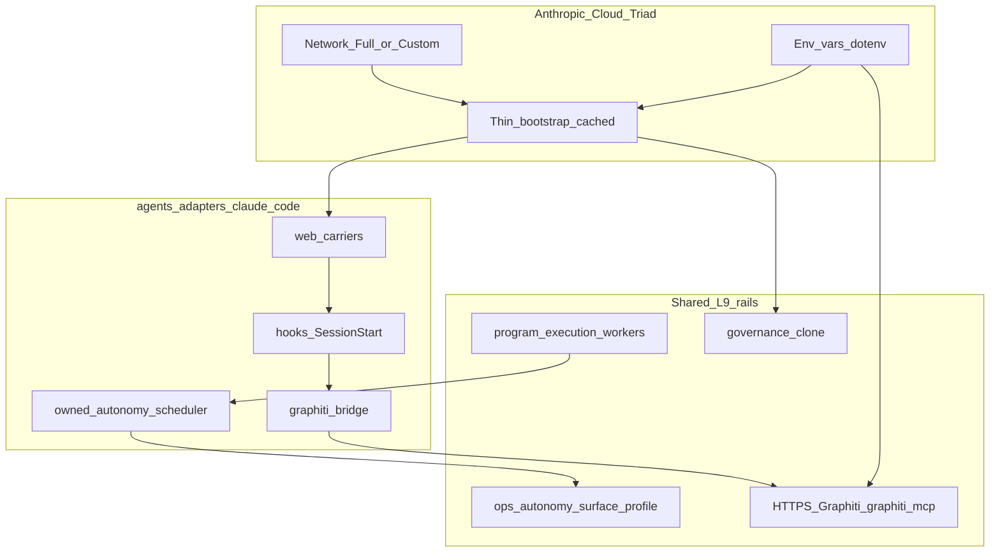

# Claude Code Mobile Adapter Unification (Improved)

## Mission

Make Claude Code Mobile (shared Anthropic account environment with Web) a first-class L9 peer: Anthropic triad compliance, shared Graphiti store with Cursor, A4 autonomy leverage, and zero adapter-layout drift by relocating the gold-standard pack under [`environment/agents/adapters/`](environment/agents/adapters/).

**Plan class:** `migration_plan` + `integration_plan`
**Schema:** [`WIP/Execution Schemas/environment/contracts/execution/schemas/canonical.schema.plan_document.v1.yaml`](WIP/Execution%20Schemas/environment/contracts/execution/schemas/canonical.schema.plan_document.v1.yaml)
**Baseline SHA:** `fcbd5ed73f102b9f4f34e28858630b3a434f6085` (re-verify at execution start)
**Kernels applied to this plan:** `kernels/Improve.md` + `kernels/Recursive Alignment.md` (audit → improve in place; no execution yet)

## Alignment audit (Recursive Alignment → plan defects)

| ID | Sev | Conf | Domain | Finding | Root cause | Smallest plan correction |
|---|---|---|---|---|---|---|
| A1 | Critical | Confirmed | security / SoT | WIP `variables.md` embeds a live Graphiti bearer | Secrets treated as paste convenience | Wave 0: rotate token; Wave 1: placeholders only in any retained WIP; UI holds live values |
| A2 | High | Confirmed | communication contracts | Plan URL host is `memory.quantumaipartners.com`, but [`test_graphiti_front_door.py`](environment/claude-code/tests/test_graphiti_front_door.py) forbids that substring and requires loopback in `mcp.template.json` | ADR-0006 banned the *HTTP side door*; tests over-banned the *hostname* | Wave 0 contract: forbid `L9_MEMORY_HTTP_*` / `memory_client`; allow Graphiti HTTPS via `${GRAPHITI_MCP_URL}`; update tests/validators *before* SSOT paste |
| A3 | High | Confirmed | ownership | [`ADAPTER_CONTRACT.md`](environment/agents/adapters/ADAPTER_CONTRACT.md) still requires thin adapters to use `L9_MEMORY_HTTP_URL` + `L9_MEMORY_CLIENT_TOKEN`, while Claude gold standard uses Graphiti | Dual memory eras left in one contract | Split carriers: **Graphiti env** (`GRAPHITI_MCP_URL`/`TOKEN`) for all cloud-capable adapters; retire HTTP token vars from contract examples in same realignment wave |
| A4 | High | Confirmed | ownership / routing | PE binds only `claude-cli`; registry lists `claude-web`/`claude-mobile` without executable bindings | Surface identity without worker binding | Wave 3: bind both surfaces → `claude-code-direct` (+ bounded-autonomy where CLI already has it) |
| A5 | High | Confirmed | structure / SoT | Wave 1 “promote into adapters/…” before Wave 2 move creates two paste SSOTs | Wave ordering by narrative not dependency | WIP-only in Wave 1; promote only after move+symlink |
| A6 | Medium | Confirmed | config / Anthropic | Fat `script.md` as account Setup invalidates Anthropic env cache on every edit | Setup field treated as full validator | Account paste = thin bootstrap (`CLAUDE_CODE_REMOTE` + clone + exec `setup.sh`); heavy probes live in SSOT `setup.sh` / SessionStart |
| A7 | Medium | Confirmed | schema | Plan cited canonical schema but omitted required instance sections | Markdown projection ≠ PLAN_DOCUMENT | Wave 0 emits full PLAN_DOCUMENT YAML with envelope, rollback, DAG, evidence, unknowns, convergence |
| A8 | Medium | Confirmed | security | Anthropic docs: cloud env has no secret store; credentials visible to env users | Ignored in success criteria | Explicit AcceptedRisk + bot least-privilege + rotation runbook as P0 gate |
| A9 | Medium | Confirmed | validation | `validate_claude_env.py` / front-door tests will FAIL after HTTPS template change if not sequenced | Validation lag | Contract+tests in Wave 0/2 before claiming P6 |
| A10 | Low | Probable | extinguishment | Transitional symlink has no kill criteria | Migration incompleteness | Symlink remove follow-on only after zero hardcoded `environment/claude-code/` refs in CI |

**Conflict resolved in plan (was Unknown):** Graphiti shared server bearer vs “Claude must not reuse Cursor’s token.”
**Lock:** Graphiti MCP auth = shared plane token (`GRAPHITI_MCP_TOKEN`); writer attribution = distinct `USER_ID` / `L9_MEMORY_AGENT_ID` / `L9_MEMORY_SOURCE`. Do **not** reintroduce `L9_MEMORY_CLIENT_TOKEN` for Claude lifecycle.

**Authority adapters applied:** CANONICAL_LAW §2.1 (Cursor-primary Graphiti), §8 (memory), ADR-0006 (single front door), Anthropic cloud-environments triad, ADAPTER_CONTRACT (carriers), PEER_EXECUTION (executable peer), AGENTS.md root append-only.

## First-order leverage (Improve)

1. **One memory-carrier rewrite** unblocks Mobile, WIP, network-policy, mcp.template, validators, and thin-adapter contract drift (A2+A3).
2. **Thin bootstrap + SSOT setup.sh** removes WIP/SSOT duplication and Anthropic cache thrash (A5+A6).
3. **Layout move once** with symlink + same-commit path/E14 updates beats piecemeal doc edits (structure).
4. **Delete/forbid** retired HTTP memory vars from Claude cloud examples rather than documenting both eras.

## Locked decisions

1. **Layout:** `environment/claude-code/` → `environment/agents/adapters/claude-code/`; transitional symlink at old path; extinguish after CI greps clean.
2. **Mobile ≠ second adapter tree.** Anthropic: Web/Mobile/Desktop/`--cloud` share one cloud environment. Surfaces `claude-web` / `claude-mobile` stay registry IDs; carriers under `adapters/claude-code/web/`.
3. **Cloud Graphiti reachability:** `GRAPHITI_MCP_URL=https://memory.quantumaipartners.com/graphiti/mcp` (no trailing slash). Same Neo4j as Cursor tunnel via C1 Caddy `/graphiti/*` → `:8100`. Not the retired L9 HTTP tool plane.
4. **CLI default:** loopback tunnel `http://127.0.0.1:8100/mcp` via host secrets; cloud never defaults to loopback.
5. **mcp.template.json:** URL = `${GRAPHITI_MCP_URL}` (or equivalent env expansion); no hardcoded loopback *or* hostname in the committed template used for cloud copy.
6. **WIP → SSOT order:** revise WIP triad first for human paste; promote into `web/` only after pack move.
7. **Sonar defaults (account env for gov work):** `SONAR_ORG_KEY=quantum-l9`, `SONAR_PROJECT_KEY=Quantum-L9_Cursor-Governance`; setup overrides from workspace `sonar-project.properties` when present.
8. **Secrets:** rotate exposed bearer in Wave 0; templates use `REPLACE_WITH_*` only; UI holds live values; AcceptedRisk recorded for Anthropic plaintext env store.
9. **PE namespaces stay separate:** `environment/program-execution/adapters/claude-code*` = worker_host; do not merge into agents surface adapters.
10. **E14:** exempt `adapters/claude-code/autonomy/` as owned Claude scheduler (same commit as move); never copy root `autonomy/`.

## Architecture (target)

## Capability preflight (must pass before mutation)

| Probe | Pass |
|---|---|
| Baseline SHA matches or re-lock | `git rev-parse HEAD` |
| Graphiti path health | `GET https://memory.quantumaipartners.com/graphiti/health` → 200 |
| Graphiti MCP | `initialize` + `tools/list` with bearer over HTTPS `/graphiti/mcp` |
| AWS refs check-only | `github#token`, `sonarcloud#token` → OK |
| Token rotation receipt | old WIP-exposed bearer invalidated or scheduled with owner ack |
| Schema validator available | plan to emit PLAN_DOCUMENT instance; structural section completeness |

## Execution envelope

**write_allow:**
- `WIP/claude code environment/**`
- `environment/claude-code/**` → `environment/agents/adapters/claude-code/**` (+ symlink)
- `environment/agents/{adapters/ADAPTER_CONTRACT.md,agent_registry.yaml,PEER_RUNTIME_BINDINGS.yaml,docs/**,README.md,DESIGN.md,HANDOFF.md,tools/validate_agents.py}`
- `environment/program-execution/{integrations/claude-code-bounded-autonomy/**,OWNERSHIP.md,COMPATIBILITY.yaml}`
- `environment/claude-code/tests/**` (front-door / validate) via new path
- `Makefile` claude/autonomy targets; selected `ops/scripts/*` path refs
- Append-only: `AGENTS.md`, ADR under `docs/decisions/`

**write_deny / prohibited:**
- Rewrite root `autonomy/`
- Force-push / hard-reset
- Second memory store or `memory_client.py` restoration
- `L9_MEMORY_HTTP_*` lifecycle reintroduction
- Copying root autonomy into any adapter
- Merging PE worker adapters into agents adapters
- Committing live tokens in templates

**overlap_policy:** `stop_if_dirty_overlaps_may_modify`
**on_drift:** `stop_and_replan`

## Rollback

| Failure | Compensation |
|---|---|
| Move breaks consumers | Restore via symlink target + revert path commits; keep old tree recoverable from git |
| HTTPS Graphiti down | Fail-closed Mobile memory; do not fall back to L9 HTTP side door |
| E14 false fail | Exemption landed with move; revert move if exemption contested |
| Front-door tests red | Revert mcp.template/test changes as a unit |
| Secrets leaked in WIP | Rotate bearer; scrub WIP; do not commit WIP secrets |

## Complexity / uncertainty

- complexity: **high** | uncertainty: **medium** | blast_radius: **high**
- architectural_boundaries_crossed: 4 (agents adapters, claude pack, PE bindings, memory doctrine/tests)
- external_systems_touched: 3 (Anthropic cloud env, C1 Caddy/Graphiti, AWS secrets check)
- migration_required: true
- unknown_dependency_count: 2 (listed below)

## Unknown register

| ID | Unknown | Resolution gate |
|---|---|---|
| U1 | Whether Anthropic `.mcp.json` HTTP egress uses session allowlist or connector channel for custom URLs | Prove with Custom network session + deny-all except memory host; document result in network-policy |
| U2 | Whether org will use personal vs org-shared cloud environment for secrets visibility | Owner chooses; plan assumes personal L9 env with bot credentials |

## Waves (dependency-ordered)

### Wave 0 — Align lock + memory contract (blocker for everything)

- Emit `WIP/claude code environment/PLAN_DOCUMENT.claude-mobile-unify.v1.yaml` with required schema sections.
- Rotate Graphiti bearer exposed in WIP; stop treating live secrets as plan artifacts.
- Land **memory-carrier contract delta** (docs + tests + `validate_claude_env.py`):
  - Allowed: `GRAPHITI_MCP_URL` / `GRAPHITI_MCP_TOKEN` (HTTPS for cloud).
  - Forbidden: `L9_MEMORY_HTTP_URL`, `L9_MEMORY_CLIENT_TOKEN`, `memory_client`, lifecycle side door.
  - Tests assert env-ref MCP URL and absence of HTTP side door — not “hostname never appears in repo.”
- Confirm C1 `/graphiti` health + MCP initialize.

### Wave 1 — WIP cloud triad only (human paste now)

Targets: [`variables.md`](WIP/claude%20code%20environment/variables.md), [`script.md`](WIP/claude%20code%20environment/script.md), WIP network note.

**variables.md**
- `GH_TOKEN=REPLACE_WITH_BOT_USER_FINE_GRAINED_PAT`
- Identity + `L9_GOVERNANCE_SURFACE=claude-code-mobile`
- `GRAPHITI_MCP_URL=https://memory.quantumaipartners.com/graphiti/mcp` + `GRAPHITI_MCP_TOKEN=REPLACE_WITH_…`
- Sonar: `SONAR_ORG_KEY=quantum-l9`, `SONAR_PROJECT_KEY=Quantum-L9_Cursor-Governance`, `SONAR_TOKEN=REPLACE_WITH_…`
- A4/M4 block; merge=false; Anthropic plaintext + new-sessions-only header
- No live secrets in file once rotated

**script.md**
- Thin: `CLAUDE_CODE_REMOTE` guard → clone/refresh governance → exec SSOT `web/setup.sh` (via symlink-stable path)
- Optional: append durable exports to `$CLAUDE_ENV_FILE` when set
- Do **not** duplicate full toolchain/validator fat script in the account field; keep probes in SSOT setup/SessionStart
- Anti-patterns unchanged: no global `GRAPHITI_GROUP_ID`, no `L9_MEMORY_HTTP_*`, merge=false
- Sonar key override from workspace `sonar-project.properties` when present

**Network:** Custom adds `memory.quantumaipartners.com`, `sonarcloud.io`, `*.sonarcloud.io` (Full OK for proof).

### Wave 2 — Unify pack + promote SSOT

- `git mv environment/claude-code environment/agents/adapters/claude-code`
- Symlink `environment/claude-code` → `agents/adapters/claude-code`
- Flip ADAPTER_CONTRACT / agents README/DESIGN/DEPLOY: Claude is gold-standard **adapter**, not external peer-of-ide exception
- E14 exemption + OWNERSHIP/COMPATIBILITY path updates **same commit**
- Rewrite PE bridge, Makefile, settings.template hook paths, validators
- Promote WIP triad → `adapters/claude-code/web/*`; `mcp.template.json` uses `${GRAPHITI_MCP_URL}`

### Wave 3 — PE surfaces + topology docs

- `PEER_RUNTIME_BINDINGS.yaml`: add `claude-web` + `claude-mobile` → `claude-code-direct` (bounded-autonomy only where runtime-valid)
- Readiness probes for new bindings
- MEMORY_TOPOLOGY + append-only ADR: cloud Graphiti path is reachability, not second store
- `validate_agents.py`: thicker-adapter profile for claude-code (hooks/memory/autonomy allowed; HTTP memory vars forbidden)

### Wave 4 — Validate + converge

- `make claude-env`, agents validate, PE conformance, `make pr-check`
- Cloud smoke: `gh auth status`, governance clone, Graphiti initialize/tools, SessionStart L9 banner, autonomy profile
- Record symlink extinguishment checklist (follow-on milestone, not silent scope creep)
- L4 local: commit on feature branch → Recursive Alignment + Validate & Repair on finished tree → `l4_local.py` record-kernels → authorize-release → `make pr` (no mid-execution push)

## Critical path

`wave0-align-lock` → `wave0-memory-contract` → `wave1-wip-triad` → `wave2-move-symlink` → `wave2-path-consumers` → `wave2-promote-ssot` → `wave3-pe-surfaces` → `wave4-validate-converge`

## Doc / Root Surface Impact

| Surface | Action |
|---|---|
| `ADAPTER_CONTRACT.md`, agents README/DESIGN/DEPLOY/HANDOFF | Rewrite Claude placement + memory carrier |
| `MEMORY_TOPOLOGY.md`, network-allowlist | HTTPS Graphiti `/graphiti` for cloud |
| `docs/decisions/` ADR append | Cloud reachability note (append-only) |
| `AGENTS.md` | Append pointer to adapters/claude-code if needed (append-only) |
| `pyproject.toml` | No change expected |
| Root other | None unless Makefile path only |

## Stress / disconfirm

- MCP custom URL bypasses allowlist → U1 experiment; keep hosts anyway for setup curl probes.
- Caddy `/graphiti` regression → fail-closed; no HTTP side-door fallback.
- Symlink removed early → PE bridge break; extinguish only after CI clean.
- E14 without exemption → false FAIL; same-commit exemption required.
- Treating hostname ban as ADR-0006 → blocks Mobile forever; contract split is mandatory.

## Out of scope

- Rewriting Claude scheduler algorithms
- Manus/Codex/Gemini feature builds beyond inheriting updated Graphiti carrier contract
- Claude Tag org-shared admin environments
- Self-hosted CCR / base-image replacement
- Merging PE worker adapter dirs into agents adapters
- Immediate symlink deletion (follow-on milestone)

## Follow-on milestone

- Remove transitional symlink after zero remaining hardcoded `environment/claude-code/` refs in governed scripts/CI
- Optionally migrate thin adapters’ env examples from `L9_MEMORY_HTTP_*` to Graphiti HTTPS vars (contract already flipped in Wave 0/3)

## Success properties

| ID | Property | Evidence type | Proof |
|---|---|---|---|
| P0 | Exposed Graphiti bearer rotated; WIP has no live secrets | proof_receipt | rotation ack + file grep |
| P1 | WIP variables: GH_TOKEN + Sonar keys + HTTPS Graphiti placeholders | filesystem | file content |
| P2 | WIP script is thin Anthropic bootstrap (remote guard, clone, exec setup, optional CLAUDE_ENV_FILE) | structural | script review |
| P3 | Pack at `environment/agents/adapters/claude-code` + working symlink | filesystem | path checks |
| P4 | PE bindings include claude-web + claude-mobile | repository_state | YAML + readiness |
| P5 | Cloud session Graphiti initialize + tools/list on shared store | network_observation | session smoke |
| P6 | Front-door tests + `make claude-env` + agents/PE validate + `make pr-check` PASS | quality_gate | command receipts |
| P7 | PLAN_DOCUMENT instance validates against canonical schema sections | structural | YAML completeness / validator |

## Convergence

- **status (plan artifact):** `executable` after Wave 0 PLAN_DOCUMENT emit; implementation convergence only when P0–P7 pass
- **stop if:** A1 unresolved (live secret), A2 tests not updated before SSOT HTTPS, baseline drift on may_modify, or U1 proves HTTPS MCP impossible under Custom (then replan network/MCP strategy—not revive HTTP side door)

## Minimum safe next action

Execute **Wave 0 only**: emit PLAN_DOCUMENT, rotate exposed token, land memory-carrier contract/test delta, confirm `/graphiti` MCP—then Wave 1 WIP triad for immediate Mobile paste.
