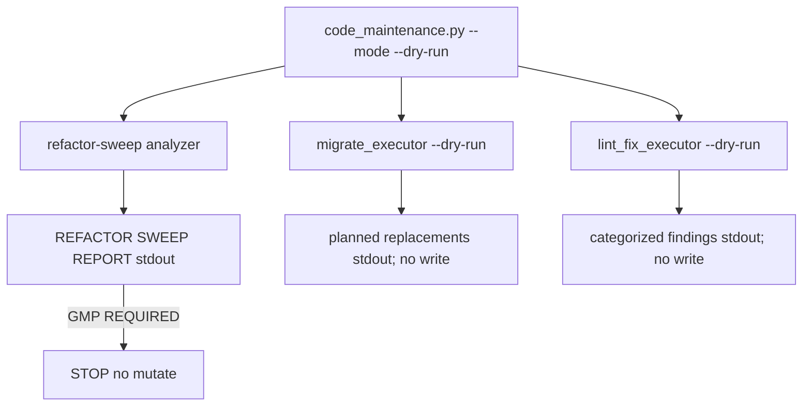

## PLAN: Optimize l9-code-maintenance + add --dry-run

### Objective
Hard-compile [`skills/l9-code-maintenance`](skills/l9-code-maintenance) so agents get a **machine dry-run** (not “pretend refactor-sweep in chat”), then retest the same campaign-master layout intent and emit a deterministic REFACTOR SWEEP REPORT.

**Success:**
1. `python3 skills/l9-code-maintenance/scripts/code_maintenance.py --mode refactor-sweep --dry-run "<intent>"` exits 0, writes **no** repo files, prints a report with Summary / Impact / Governance Decision.
2. `scripts/self_test.py` PASS (parity with `SKILL.md` Validation list).
3. Same intent dry-run decides **GMP REQUIRED** (non-mechanical + protected paths), matching the prior manual sweep.
4. Skill rewired via `l9-wire-skill-into-repo`; `AUTONOMY_MANIFEST` stays **explicit**.

### Scope
**In:**
- Rebuild/optimize pack under [`skills/l9-code-maintenance/`](skills/l9-code-maintenance/) via `l9-skill-compiler` (analyze → rebuild)
- New CLI [`skills/l9-code-maintenance/scripts/code_maintenance.py`](skills/l9-code-maintenance/scripts/code_maintenance.py) with `--mode` + `--dry-run`
- `--dry-run` on [`workflows/migrate_executor.py`](workflows/migrate_executor.py) and [`workflows/lint_fix_executor.py`](workflows/lint_fix_executor.py) (scan/plan only; skip apply/commit/state mutation that writes trees)
- Align [`commands/refactor-sweep.md`](commands/refactor-sweep.md) to invoke the CLI
- Sync mirror [`.claude/skills/l9-code-maintenance/`](.claude/skills/l9-code-maintenance/) to match SSOT `skills/` (or replace with symlink policy if repo already uses that elsewhere — prefer content sync to match current dual-tree)
- Wire registries via `l9-wire-skill-into-repo`
- Retest campaign intent

**Out:**
- Actually relocating `coding/campaigns/...` or renaming program→campaign in PES
- Moving root [`autonomy/`](autonomy/)
- Changing sealed PES schema `$id`s
- Mutating lint/migrate on the live tree during retest

### Pre-Validation (mandatory)
| Check | Command / action | Pass criteria |
|-------|------------------|---------------|
| P0 Target bind | Write root = this repo; pack = `skills/l9-code-maintenance` | Single authorized target |
| P1 Baseline inventory | Read current SKILL + workflows; note no `--dry-run` today | Gap list complete |
| P2 Clean gate | `make pr-check` | PASS on **this change’s** files; quarantine unrelated `WIP/` / untracked reports — do not claim whole-tree clean if WIP dirty |
| P3 Skill wiring | Confirm `AUTONOMY_MANIFEST` lists `l9-code-maintenance` as explicit | Present |

### Chosen design (concrete)

- **Single entry CLI** owns modes: `refactor-sweep` | `migrate` | `lint-fix` | `status`.
- `--dry-run` is **required default for `refactor-sweep`** (analysis-only). For `migrate` / `lint-fix`, `--dry-run` skips apply/commit; omitting it keeps today’s mutating behavior.
- Sweep analyzer: deterministic `rg` discovery over intent tokens + path/layer heuristics + protected-file set (include `CANONICAL_LAW.md`, `AGENTS.md`, `ORG_INVARIANTS.yaml`, `environment/program-execution/core/shared/*`, schema `$id` paths). Classification rules mirror [`commands/refactor-sweep.md`](commands/refactor-sweep.md) Phase 3–4. Emit markdown report to stdout; optional `--json` for machine consumers.
- Skill compiler rebuild: lean `SKILL.md` control plane; move workflow detail into `references/`; add `scripts/`; add `scripts/self_test.py`; no stubs.

### TODO Plan
| # | Task | Files | Effort | Risk |
|---|------|-------|--------|------|
| 1 | Compiler analyze pack vs skill-pack-contract; list gaps (no scripts, no dry-run, dual SKILL trees, command/skill drift) | `skills/l9-code-maintenance/*`, compiler refs | S | Low |
| 2 | Rebuild pack: SKILL.md + refs (workflows, dry-run contract, report template, protected paths) | `skills/l9-code-maintenance/SKILL.md`, `references/*` | M | Med |
| 3 | Implement `code_maintenance.py` + sweep analyzer | `skills/l9-code-maintenance/scripts/code_maintenance.py`, `scripts/refactor_sweep.py` (or package modules under scripts/) | M | Med |
| 4 | Add `--dry-run` to migrate + lint executors | `workflows/migrate_executor.py`, `workflows/lint_fix_executor.py` | M | Med |
| 5 | `self_test.py`: dry-run writes nothing; report contains Governance Decision; migrate dry-run no tree diff; Validation↔invoked parity | `skills/l9-code-maintenance/scripts/self_test.py` | M | Low |
| 6 | Point `/refactor-sweep` at CLI; update maintenance-workflows | `commands/refactor-sweep.md`, `references/maintenance-workflows.md` | S | Low |
| 7 | Sync `.claude/skills/l9-code-maintenance` to `skills/` SSOT | `.claude/skills/l9-code-maintenance/**` | S | Low |
| 8 | Wire skill (`l9-wire-skill-into-repo`): registries, description, explicit tier | `skills/AUTONOMY_MANIFEST.yaml`, agent docs / skill registry as adapter requires | S | Med |
| 9 | Retest same intent via CLI dry-run; capture report in chat (and optional `reports/` only if user asks) | CLI invocation | S | Low |
| 10 | Final Validation: `make pr-check` on changed files | — | S | Low |

### Depth
- **Contract preserved:** Mutating executors remain the only writers; dry-run never commits; PlasticOS “local commit no push” unchanged when not dry-run.
- **Campaign intent fixture** (retest string, fixed):
  > Campaign is master; keep root `autonomy/` callable; relocate PES → `coding/campaigns/execution`; fold `execution-governance` → `coding/campaigns/governance`; move generated-data → `coding/campaigns/signals`; add thin `coding/campaigns/autonomy` bridge that calls root `autonomy/`; rename program→campaign in PES contracts.
- Expected dry-run verdict: **GMP REQUIRED** / non-mechanical / protected files present / not sed-eligible.
- Root `autonomy/` must be classified as **do-not-move** in the report’s impact notes when intent mentions it.

### Dependencies
1 → 2 → 3 → 5; 4 parallel with 3; 6–8 after 2–5; 9 after 3+5; 10 last.

### Milestones
| Milestone | Outcome | Unlocks |
|-----------|---------|---------|
| M1 Pack contract | Rebuilt skill + dry-run CLI + self_test green | Retest + wire |
| M2 Executor dry-run | migrate/lint refuse writes under flag | Safe agent invocation |
| M3 Retest + wire | Same-intent report + registries updated | GMP for real campaign move (separate) |

### Checkpoints
| CP | After | Evidence | No-go |
|----|-------|----------|-------|
| CP1 | M1 | `self_test.py` PASS; dry-run on toy fixture leaves `git status` unchanged for tracked files | Fix analyzer/writers |
| CP2 | M2 | migrate `--dry-run` prints plan; tree unmodified | Do not ship |
| CP3 | M3 | Campaign-intent report says GMP REQUIRED; wire validation PASS | Do not claim success |

### Checklist
- [ ] Pre-Validation recorded (P0–P3)
- [ ] Skill compiler analyze + rebuild complete (zero-stub)
- [ ] `--dry-run` on CLI + migrate + lint_fix
- [ ] `self_test.py` PASS + Validation parity
- [ ] `/refactor-sweep` documents CLI
- [ ] `.claude` mirror synced
- [ ] `l9-wire-skill-into-repo` PASS
- [ ] Campaign-intent dry-run retested; GMP REQUIRED
- [ ] `make pr-check` PASS on changed files
- [ ] No commit/push unless user asks

### Risks
| Risk | Mitigation |
|------|------------|
| Sweep heuristics under/over-count | Prefer fail-closed: any protected hit or non-mechanical marker → GMP REQUIRED |
| Dual `skills/` vs `.claude/skills/` drift | SSOT = `skills/`; sync mirror in same PR |
| Executor dry-run still writes state JSON | Under `--dry-run`, skip STATE_FILE writes and commits |
| Dirty WIP tree blinds `make pr` | Scope scanners to maintenance change set; leave WIP untouched |

### Estimate
**Total:** ~0.5–1 day
**GMPs:** 1 (this skill/workflow change); campaign relocation remains a **separate** GMP after dry-run

### Final Validation (mandatory)
| Check | Command | Pass criteria |
|-------|---------|---------------|
| V1 Pack | `python3 skills/l9-code-maintenance/scripts/self_test.py` | PASS |
| V2 Dry-run retest | CLI with campaign intent + `--dry-run` | Report + no file mutations + GMP REQUIRED |
| V3 Scanners | `make pr-check` | PASS on changed files; no commit/push |
| V4 Wire | `l9-wire-skill-into-repo` checklist | Discoverable; explicit tier |

### Recommend next
After plan approval: execute under **`l9-gmp-protocol`** (RUNTIME tier) — compiler rebuild + dry-run + retest in one locked change. Do not start the `coding/campaigns/` move until this dry-run CLI exists and retest confirms GMP REQUIRED.
