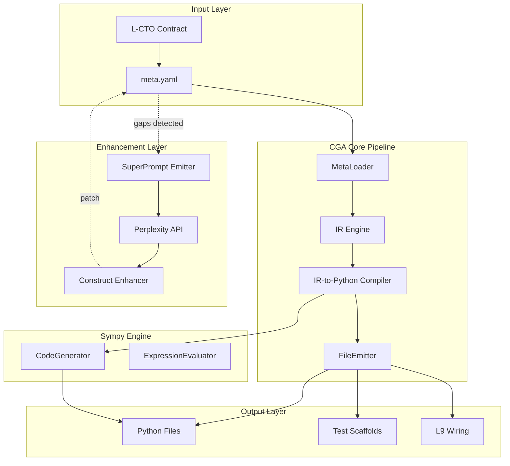

# CodeGenAgent Weaponization Plan

## Strategic Context

Three documentation packs are **complementary, not overlapping**:

1. **AI-OS Strategy** = VISION (what revolutionary agents look like)
2. **QPF Factory Strategy** = METHOD (YAML-to-code pipeline patterns)
3. **CGA Spec Library** = FRAGMENTS (81 YAML specs for implementation)
4. **sympy module** = ENGINE (symbolic computation for code generation)

## Architecture




## Implementation Phases

### Phase 1: IR Engine Foundation

Create the MetaContract intermediate representation that bridges YAML specs to code:**Files:**

- [`ir_engine/meta_ir.py`](ir_engine/meta_ir.py) - MetaContract Pydantic model (exists as spec, needs implementation)
- [`ir_engine/compile_meta_to_ir.py`](ir_engine/compile_meta_to_ir.py) - YAML parser to MetaContract

**Key classes:**

```python
class MetaContract(BaseModel):
    name: str
    type: Literal["agent", "module", "tool", "api"]
    description: str
    wiring: WiringSpec
    code: Optional[str]  # inline code blocks
    construct_features: ConstructFeatures
```


### Phase 2: Meta Loader

Parse meta.yaml files with validation and gap detection:**Files:**

- [`agents/codegen_agent/meta_loader.py`](agents/codegen_agent/meta_loader.py) - Load and validate meta.yaml

**Integration with QPF:**

- Use Tensor Layer Schema patterns from QPF for validation
- Emit gap reports for SuperPrompt enrichment

### Phase 3: IR-to-Python Compiler (sympy Bridge)

This is the critical new component that bridges the spec library to actual code generation:**Files:**

- `ir_engine/ir_to_python.py` - **NEW**: Convert IR to Python using sympy + Jinja2

**sympy integration:**

```python
from codegen.sympy.symbolic_computation_core import CodeGenerator

class IRToPythonCompiler:
    def __init__(self):
        self.sympy_codegen = CodeGenerator()
        self.template_engine = jinja2.Environment(...)

    def compile(self, ir: MetaContract) -> Dict[str, str]:
        # 1. Extract symbolic expressions -> sympy
        # 2. Extract structural code -> Jinja templates
        # 3. Merge into complete Python module
```


### Phase 4: File Emitter with Wiring

Write generated code to L9 repo with proper wiring:**Files:**

- [`agents/codegen_agent/file_emitter.py`](agents/codegen_agent/file_emitter.py) - Write files + update registries

**Auto-wiring targets:**

- AgentRegistry (`core/agents/registry.py`)
- ToolGraph (`core/tools/toolgraph.py`)
- API routes (`api/routes/`)
- Test scaffolds (`tests/`)

### Phase 5: CodeGenAgent Orchestrator

Main entry point that chains all components:**Files:**

- [`agents/codegen_agent/codegen_agent.py`](agents/codegen_agent/codegen_agent.py) - Orchestrator class

**API surface:**

```python
class CodeGenAgent:
    async def generate_from_contract(self, contract: Contract) -> GenerationResult
    async def generate_from_meta(self, meta_path: str) -> GenerationResult
    async def preview(self, meta_path: str) -> DryRunResult  # no file writes
```


### Phase 6: SuperPrompt Enrichment (Future)

Enable LLM-based spec enhancement via Perplexity:**Files:**

- [`runtime/perplexity/SuperPrompt_Emitter.py`](runtime/perplexity/SuperPrompt_Emitter.py)
- [`runtime/perplexity/Construct_Enhancer_From_PPX.py`](runtime/perplexity/Construct_Enhancer_From_PPX.py)

## Key Design Decisions

1. **sympy for math, Jinja for structure** - Use sympy's CodeGenerator only for symbolic expressions; use Jinja2 templates for structural Python code (classes, methods, imports)
2. **Pydantic models throughout** - Mirror sympy's model patterns (ComputationRequest, CodeGenResult) for CGA's MetaContract and GenerationResult
3. **Async-first** - Follow sympy's async patterns for all I/O operations
4. **Construct features drive output** - QPF's construct_features dict controls what gets emitted (tests, routes, WM hooks, etc.)

## File Organization

```javascript
agents/codegen_agent/
  __init__.py
  codegen_agent.py      # Main orchestrator
  meta_loader.py        # YAML parsing
  file_emitter.py       # Write + wire
  rollback_hook.py      # Revert capability
  telemetry_codegen.py  # Metrics

ir_engine/
  __init__.py
  meta_ir.py            # MetaContract model
  compile_meta_to_ir.py # YAML -> IR
  ir_to_python.py       # IR -> Python (NEW, uses sympy)

runtime/perplexity/     # Phase 6
  SuperPrompt_Emitter.py
  Construct_Enhancer_From_PPX.py
```


## Success Criteria

- [ ] MetaContract IR model validates all 81 existing YAML specs
- [ ] IR-to-Python produces syntactically valid Python for all spec types
