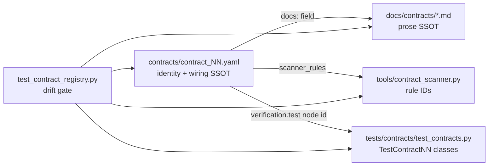

# Contract Alignment Plan

## Decision: split SSOT by concern

- `contracts/*.yaml` is SSOT for **identity and wiring**: `id`, `name`, `layer`, `level`, `scope.paths`, `verification.scanner_rules`, `verification.test`, and a new `docs:` pointer.
- `docs/contracts/*.md` remains SSOT for **prose**. Not generated. Not moved.
- A single new test, `tests/contracts/test_contract_registry.py`, enforces that the two agree.

Why this over the alternatives: generating docs from YAML would destroy hand-written prose; merging folders would break `.cursorrules` @-references, the `verify_contracts.py` wiring check, and CODEOWNERS. This option is additive-only.



## Regression controls (apply to every phase)

- **No changes under `engine/` or `chassis/`.** Zero runtime surface.
- **No file moves or renames.** Both folders stay where they are.
- **`verify_contracts.py` is extended, never rewritten** — CI job id `contract-files` and exit-code semantics preserved; the existing 20-file assertion stays as a hard floor so the old guarantee cannot weaken.
- **New gates land advisory-first** (print + `exit 0`), flipped to blocking only in the final phase once the repo is already clean.
- **Baseline to hold green after every phase:**
  - `python3 tools/verify_contracts.py` → exit 0
  - `python3 tools/contract_scanner.py` → exit 0
  - `python3 -m pytest tests/contracts/ -q` → no new failures (xfails only)
  - `python3 tools/contract_report.py` → coverage counts must be monotonically non-decreasing (today: scanner 6/24, contract tests 0/24)

## Phase 1 — Repair YAML pointers (additive keys only)

For each `contracts/contract_NN.yaml`:

- Replace the 16 dead `verification.test` paths with real pytest node IDs, e.g. `tests/contracts/test_contracts.py::TestContract01SingleIngress`. Contracts 10/11/14/15/17/18/19/20 that point at directories keep working but get a node ID where one exists.
- Add a `docs:` list field pointing at the covering markdown file(s) in [docs/contracts](docs/contracts).
- Populate the empty `scanner_rules` on the 18 contracts that have `[]` where a rule genuinely exists (`ERR-001/002` → contract 04-adjacent error handling, `DI-001` → 02, `NAME-001` → 12, `PKT-001` → 06, `ENV-001` → 05).
- Fix two semantic mismatches: `contract_07.yaml` lists `MEM-001/002` (memory substrate) for "Immutability + Content Hash", and `contract_08.yaml` lists `DEL-001/002` (delegation) for "Lineage + Audit". Reassign or drop.

Paired tool fix in the same commit — [tools/contract_report.py](tools/contract_report.py) `check_test_exists()` does `repo_root / test_path` and will report a false negative on a `::` node ID:

```python
full_path = repo_root / test_path        # breaks on "file.py::TestClass"
```

Split on `::` before the existence check.

## Phase 2 — Fill the real test hole (contracts 21–24)

[tests/contracts/test_contracts.py](tests/contracts/test_contracts.py) has exactly 20 `TestContract*` classes, stopping at `TestContract20KGEEmbeddings` (line 649). Contracts 21–24 (Feature Flag Discipline, Scoring Weight Ceiling, Admin Subaction Registration, Resilience Patterns) have **no test at all**. Add four classes following the existing AST/grep style so the Phase 1 node IDs resolve.

## Phase 3 — Add the drift gate

New `tests/contracts/test_contract_registry.py` asserting:

1. `contracts/*.yaml` IDs are contiguous `CONTRACT-01`..`CONTRACT-24`, no duplicates, no gaps.
2. Every YAML has all required keys with the same schema (catches the `level`/`test`-shape inconsistencies).
3. Every `docs:` path exists on disk.
4. Every `scanner_rules` entry actually appears as a rule ID in [tools/contract_scanner.py](tools/contract_scanner.py).
5. Every `verification.test` node ID collects under pytest.
6. Every file in `REQUIRED_CONTRACTS` is referenced by at least one YAML `docs:` field — the reverse direction, which nothing checks today.

Land it marked advisory/xfail if Phases 1–2 leave any residue; flip to hard in Phase 6.

## Phase 4 — Write the 7 missing contract docs

No markdown coverage exists for contracts **10, 11, 15, 18, 20, 21, 22**. Add to [docs/contracts](docs/contracts):

- `PROHIBITED_FACTORS.md` (C-10) — compile-time blocking, `audit_on_violation`
- `PII_HANDLING.md` (C-11) — hash / encrypt / redact / tokenize modes, key sources
- `BIDIRECTIONAL_MATCHING.md` (C-15) — `invertible: true`, `match_directions`
- `L9_META_HEADERS.md` (C-18) — header schema per filetype
- `KGE_EMBEDDINGS.md` (C-20) — CompoundE3D, cross-tenant isolation
- `FEATURE_FLAG_DISCIPLINE.md` (C-21) — flag-in-`settings.py` requirement
- `SCORING_WEIGHT_CEILING.md` (C-22) — weight sum ≤ 1.0, startup assertion

Each carries an L9_META header and a `CONTRACT-NN` back-reference. Then add all seven to `REQUIRED_CONTRACTS` in [tools/verify_contracts.py](tools/verify_contracts.py) and to the load lists in `.cursorrules` / `CLAUDE.md` so the wiring check passes (it requires each doc be referenced in an agent file). This moves the floor 20 → 27.

Also thinly expand the 10 partial-coverage docs (03, 05, 06, 13, 14, 16, 17, 19, 23, 24) with the specific missing rule sentences rather than new files.

## Phase 5 — Fix stale content

Legacy `l9.*` monorepo paths that do not exist in this repo:

- [docs/contracts/SHARED_MODELS.md](docs/contracts/SHARED_MODELS.md) lines 65–68 — `from l9.core.envelope/contract/delegation/types`
- [docs/contracts/MEMORY_SUBSTRATE_ACCESS.md](docs/contracts/MEMORY_SUBSTRATE_ACCESS.md) lines 25, 51 — `l9.memory.*`
- [docs/contracts/DELEGATION_PROTOCOL.md](docs/contracts/DELEGATION_PROTOCOL.md) line 70 — `from l9.chassis.contract import delegate_to_node`
- [docs/contracts/PACKET_TYPE_REGISTRY.md](docs/contracts/PACKET_TYPE_REGISTRY.md) line 67 — `l9/packet/envelope.py`
- [docs/contracts/OBSERVABILITY.md](docs/contracts/OBSERVABILITY.md) line 73 — `from chassis.metrics import register_histogram`; `chassis/metrics.py` does not exist

Two content contradictions to resolve (needs your call at execution time, flagged not guessed):

- `OBSERVABILITY.md` shows `logging.getLogger(__name__)` as correct, while CONTRACT-04 and `AGENTS.md` mandate `structlog.get_logger(__name__)`.
- `.cursorrules` line 127 asserts GateType = 14 values; `test_contracts.py` line 399 asserts 10 gate types; `.claude/rules/contracts.md` says 10. Three-way drift.

Correct the false claim in `contracts/README.md` that `contract_report.py` generates the coverage matrix — `artifacts/coverage_matrix.json` is written by [tools/spec_extract.py](tools/spec_extract.py) and is domain-spec coverage, not contract coverage.

## Phase 6 — Reconcile counts and harden gates

Update the "20 contracts" wording to the reconciled model (24 invariants / 27 docs) in: [tools/verify_contracts.py](tools/verify_contracts.py) (lines 14, 76), [tools/contract_scanner.py](tools/contract_scanner.py) (line 14), [.pre-commit-config.yaml](.pre-commit-config.yaml) (line 82), [.github/workflows/contracts.yml](.github/workflows/contracts.yml) (line 10), `.cursorrules` (71, 87, 139, 457), [docs/L9_Contract_Enforcement_System.md](docs/L9_Contract_Enforcement_System.md), `TESTING.md`, `ARCHITECTURE.md` (line 59 overstates what `verify_contracts.py` does), `TODO.md`, `docs/contracts/README.md` (line 68), `agents/cursor/cursor_workflow_kernel.yaml`.

Then:

- Extend `verify_contracts.py` with a YAML-driven pass layered **on top of** the literal list (list stays as the ratchet floor).
- Add `AGENTS.md` to `AGENT_FILES` (currently only `.cursorrules` and `CLAUDE.md`).
- Flip `test_contract_registry.py` to hard-fail.
- Add `make contracts-report` and wire `contract_report.py` into `make agent-check` as step 7 (currently it runs nowhere).
- Decide `STUB-001/002/003`: documented in `.cursorrules` lines 432–445 but **not implemented** in the scanner — either implement or delete the claim. Recommend implement; they are simple greps.

## Sequencing

Phases 1–2 first (make reality true), then 3 (lock it), then 4–5 (fill and clean), then 6 (harden). Each phase is a separate commit with the four baseline checks re-run before moving on. Suggested branch: `docs/contract-alignment`.