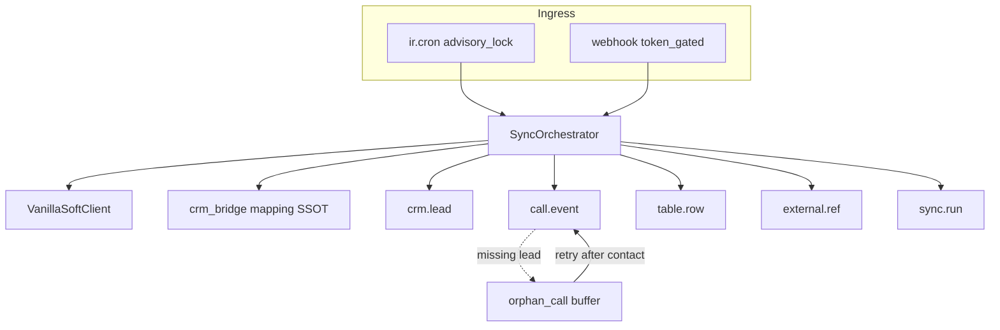

# plasticos_crm_sync — VanillaSoft live API sync (improved)

## Improve-kernel status (plan artifact)

| Gate | Result |
|---|---|
| Target bound | Passed — this plan file |
| Issue inventory | Passed — defects below remediated in-plan |
| Contracts precise | Passed — DTOs, watermarks, auth, idempotency |
| Other CRM stubs | Passed — explicit stub adapters per user request (VS only live) |
| Validation honesty | Passed — live smoke = Unknown until secrets |
| Convergence | Converged for planning; execution not started |

## Security (mandatory)

- Project Integration Key was exposed in chat → **rotate in VanillaSoft after first successful VerifyKey**, then store only in ICP / `.env.local` / secret resolver.
- Never commit keys, never log Authorization headers or key values (lazy `%s` logging with redaction).
- ICP keys (no defaults in XML seed):
  - `plasticos_crm_sync.vanillasoft_api_key` (write-only settings field)
  - `plasticos_crm_sync.vanillasoft_root_endpoint` (default display hint `https://vanillasoft.net` only in UI placeholder, not seed)
  - `plasticos_crm_sync.vanillasoft_project_id` = `139705` (Scrap Management)
  - `plasticos_crm_sync.webhook_token` (shared secret for Outgoing Web Lead URL)
- Normalize base URL: strip trailing `/`, ensure scheme, append `/WSPubAPI` → `https://vanillasoft.net/WSPubAPI`.
- Webhook route: `auth='public'` **only** with constant-time token check (`?token=` or header); reject missing/invalid token with 401; no CSRF token required for machine POST.

## Verified API constraints (from Public API PDF)

| Constraint | Impact on design |
|---|---|
| Contacts `modified_after` **max 31 days** | Cannot list “all contacts ever” via GetMultipleContacts alone |
| Contacts sorted by `modified_date_time_utc`; `partial_fulfillment` + `batch_end` | Watermark = last successfully committed `batch_end`, not wall clock |
| CallHistory `start`/`end` (UTC) + `limit` ≤ 20000 | Full call backfill is windowed; no 31-day cap documented |
| Auth `Authorization: APIKey=…` | Client header exact match |
| `deleted` on contact | Soft-archive lead / mark inactive; do not hard-unlink |

**Contact history honesty:** v1 **ongoing + rolling 31-day catch-up** for contacts. Full historical contact population is **not claimed** via list API. Coverage grows via (1) rolling windows on active records, (2) Outgoing Web Lead webhook for resulted contacts, (3) optional Search by known keys later. Call history **is** fully backfillable via `start`/`end` batches.

## Locked design choices

| Concern | Choice | Why |
|---|---|---|
| Contacts | Upsert `crm.lead` (`type=lead`) | Native CRM |
| External id | `plasticos.crm.external.ref` unique`(provider, external_id, model)` + write `vanillasoft_id` | Multi-CRM; keep bridge field |
| Call history (~354k) | `plasticos.crm.call.event` → `crm.lead` | Minimal extension; chatter cannot hold volume |
| Custom tables | `plasticos.crm.external.table.row` (table_id/name + JSON) → lead | Unknown/variable schema |
| Contact sync | Rolling ≤31d windows + webhook | API reality |
| Call sync | Contiguous `start`/`end` backfill from watermark / project-created floor | API allows range |
| Other CRMs | Stub adapter classes (HubSpot, Salesforce, Zoho) registered beside VS | User-requested scaffold slots; only VanillaSoft is live in v1 |
| UI fallback | [`l9-ui-operator`](.claude/skills/l9-ui-operator/SKILL.md) **only** on VerifyKey 401/403 after endpoint normalize | API-first |
| CSV | Fence VS CRM-lead CSV only; keep cieTrade (ADR-003) | Remove human VS import path |
| Client source | Port patterns from `~/Downloads/vanillasoft-mcp` into Python | No Node MCP in Odoo load path |

## Architecture



## Module scaffold

Layer 3. Follow [`plasticos-new-odoo-module`](.claude/skills/plasticos-new-odoo-module/SKILL.md).

- `installable: True`, `auto_install: False`
- **Depends:** `crm`, `mail`, `utm`, `plasticos_base`, `plasticos_security_base`, `plasticos_crm_bridge`, `plasticos_facility_profile`
- Register in [`config/odoo_module_order.yaml`](config/odoo_module_order.yaml) after `plasticos_crm_bridge` (not in `excluded_modules`)

```
plasticos_crm_sync/
  __manifest__.py                 # 19.0.1.0.0
  adapters/
    base.py                       # Protocol + Canonical* DTOs
    registry.py                   # provider → adapter class (VS live; others stubs)
    vanillasoft/
      client.py                   # urllib/requests; timeouts; no secrets in logs
      adapter.py                  # live CrmAdapter
    hubspot.py                    # stub adapter (scaffold)
    salesforce.py                 # stub adapter (scaffold)
    zoho.py                       # stub adapter (scaffold)
  models/
    crm_connection.py             # provider, project_id, watermarks, enabled, last_error
    crm_sync_run.py               # status, counters, error excerpt
    crm_external_ref.py           # UniqueConstraint(provider, external_id, res_model)
    crm_call_event.py             # UniqueConstraint(provider, external_id)
    crm_external_table_row.py     # UniqueConstraint(provider, table_id, external_row_id)
    crm_sync_orphan.py            # buffered call/table rows awaiting lead
    crm_lead_sync.py              # _inherit: One2many pages
    res_config_settings.py
  controllers/webhook.py
  services/orchestrator.py        # lazy import of adapters (no top-level cross-addon)
  data/ir_cron_data.xml           # active=False; plasticos_base.user_system_cron
  security/ir.model.access.csv
  views/
  tests/
docs/runbooks/CRM_SYNC_VANILLASOFT.md
```

### Mapping SSOT (entropy fix)

Move `STAGE_MAPPING` / company-type maps from [`plasticos_partner_import/models/crm_lead_import_service.py`](plasticos_partner_import/models/crm_lead_import_service.py) into [`plasticos_crm_bridge`](plasticos_crm_bridge/) (e.g. `models/crm_mapping.py` or `services/lead_mapping.py`). Sync and partner_import both import that owner. Keep `LEAD_SOURCE_MAPPING` in [`plasticos_facility_profile/models/lead_source.py`](plasticos_facility_profile/models/lead_source.py).

## Canonical DTOs (contracts)

```text
CanonicalLead:
  provider, external_id, company, first_name, last_name, email,
  phone, mobile, street, street2, city, state_code, zip, country_code,
  lead_status_raw, lead_source_raw, owner_name, modified_utc, deleted,
  custom_fields: dict[str, str]

CanonicalCall:
  provider, external_id, contact_external_id, call_datetime_utc,
  duration_seconds, user_name, result_code, comment

CanonicalTableRow:
  provider, contact_external_id, table_id, table_name,
  external_row_id, fields: dict[str, str]
```

Adapters map provider JSON → DTOs only. Orchestrator maps DTOs → ORM (single write path = idempotent).

## Orchestrator rules

1. **Advisory lock** per connection id for cron/manual sync.
2. **Watermarks advance only after successful commit** of that page/window.
3. **Contacts:** page size default 200 (cap 1000); never request 20000 into ORM in one shot.
4. **Calls:** batch size default 500 create_multi; commit every batch; unique on `(provider, external_id)`.
5. **Orphans:** if call/table references unknown `contact_id`, store in `crm.sync.orphan` and resolve after contact upsert (same run end + next cron).
6. **Custom tables:** fetch per contact **after** lead upsert for that contact (or for webhook single-id path); do not N+1 the entire project in one HTTP storm — bound concurrency / sequential with timeout.
7. **Idempotency:** search `external.ref` then `vanillasoft_id`; update existing lead; create otherwise.
8. **Deleted contacts:** set lead `active=False` (or stage Dead Lead if mapped); do not unlink.
9. **Failures:** set `sync.run` = failed, set `connection.last_error`, **do not** advance watermark; retry next cron.
10. **HTTP:** timeouts (connect/read), 429/5xx retry with bounded backoff; treat 401/403 as connection unhealthy → stop run (UI operator eligible).

## VanillaSoft client surface

| Method | Use |
|---|---|
| `GET /VerifyKey` | Health; confirm project 139705 in `projects[]` |
| `GET /Contacts?…` | Rolling contact sync |
| `GET /Contacts/{id}?custom_fields=1&phone_numbers=1` | Webhook / enrich |
| `GET /Projects/{id}/Contacts/Search` | Optional dedupe assist |
| CallHistory batch | Call backfill / incremental |
| `GET …/CustomTables` | Per-contact tables |

Port from Public API PDF + [`vanillasoft-mcp` client](/Users/ib-mac/Downloads/vanillasoft-mcp/src/index.ts) (Python stdlib or `requests` in `external_dependencies` if already used repo-wide — prefer stdlib/`urllib` to avoid new deps unless required).

## Webhook (Outgoing Web Lead)

- URL pattern: `/plasticos/crm_sync/vanillasoft/weblead?token=<ICP webhook_token>`
- Accept JSON; map ContactID → fetch full contact via API → upsert → pull tables for that id
- Response body must match VS “Expected Response on Success” (configure runbook string, e.g. `OK`)
- Runbook documents VS Admin: Integration → Outgoing Web Lead → JSON → result codes → field map → Posting URL

## Deprecations

- VS CRM CSV wizard/service path: UI banner + log warning pointing to `plasticos_crm_sync`
- Do not remove cieTrade partner CSV (ADR-003)
- Keep [`crm_lead_vanillasoft.py`](plasticos_crm_bridge/models/crm_lead_vanillasoft.py); sync writes it

## Validation (honest)

| Check | When | Classification until run |
|---|---|---|
| `ruff check/format`, wiring, circular deps, ACL | After scaffold | Unknown → must Pass before merge |
| Pure pytest client mocks (VerifyKey, page, call batch, watermark non-advance on fail) | After client | Unknown |
| TransactionCase upsert idempotency + orphan resolve | After orchestrator | Unknown |
| Live VerifyKey + 1 contact page + 1 call page | After secrets on local Docker | Unknown (skipped without secrets) |
| l9-ui-operator | Only if live VerifyKey 401/403 | NotApplicable if API healthy |

No claim of full ~354k import in one session; cron/backfill job is the volume path.

## Implementation sequence

1. Scaffold module + models + ACL + settings (no secret seeds).
2. Extract mapping SSOT into `plasticos_crm_bridge`; rewire partner_import imports.
3. VanillaSoft client + live adapter; HubSpot/Salesforce/Zoho stub adapters + registry.
4. Orchestrator: contacts rolling sync + sync.run + watermarks (VS only selectable/enabled in v1).
5. Call history backfill + orphan buffer + table rows + lead notebook.
6. Cron (off) + webhook + runbook.
7. Fence VS CSV; tests; `make update m=plasticos_crm_sync`.

## Out of scope (v1)

- Odoo→VS `UpdateContact` writes
- AI/LLM field normalization
- Implementing HubSpot/Salesforce/Zoho beyond stub adapter scaffolds
- Claiming complete historical **contact** census via list API
- Committing or logging the Project Integration Key

## Stub adapter contract (non-VS)

Explicit scaffold files (as originally requested), not silent omissions:

```python
class HubSpotAdapter:  # same shape for Salesforce, Zoho
    provider = "hubspot"
    live = False

    def healthcheck(self): ...
    def iter_contacts(self, **kwargs): ...
    def iter_calls(self, **kwargs): ...
    def iter_table_rows(self, **kwargs): ...
```

- Methods raise a single clear `UserError` / `CrmAdapterStubError`: `"HubSpot adapter is a stub — not implemented in v1"`.
- Connection UI may list providers; enabling a stub provider fails closed at sync start with that message.
- Cron/default connection seeds **only** VanillaSoft.
- Stubs are intentional deferred slots (user-authorized); do not pretend they sync.

## Residual risks

- Stale contacts never modified in 31d remain unsynced until webhook/Search strategy — accepted v1 limit.
- 354k call rows: DB growth and first backfill duration — mitigate with batch size + cron; monitor `sync.run`.
- Key rotation required after chat exposure.
- Stub adapters are incomplete by design until a later phase implements them.
