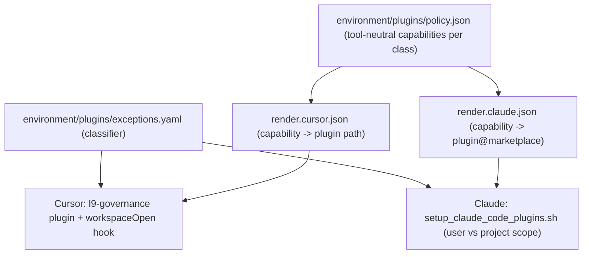

# Cursor-Governance plugin unification

## Scope and target repo

Every file touched by this plan lives in `$HOME/.cursor-governance` (git remote `Quantum-L9/Cursor-Governance`) — a **separate git repository** from `l9-ci-sdk-1`. Nothing in this plan modifies `l9-ci-sdk-1` itself; it changes the wiring that every governed repo (including this one) receives at session start. Git operations in the governance repo (`add`/`commit`/`push`) still require your explicit approval, same as any repo, and are not part of this plan's execution — they happen after you review the diff.

Confirmed decisions from this session:
- Full rollout (all pieces below), not a phased minimal fix.
- Rule 84 is superseded by the Cursor-plugin model, not implemented literally as "real dir + selective symlinks."

## Current state (verified this session)

- `.cursor/rules` in every governed workspace is a whole-directory symlink to `$GLOBAL_COMMANDS/rules` ([ops/scripts/setup_workspace_symlinks.sh:181](/Users/macm2/.cursor-governance/ops/scripts/setup_workspace_symlinks.sh) — `link_or_update "$WORKSPACE_DIR/.cursor/rules" "$GLOBAL_COMMANDS/rules" ".cursor/rules"`), and the same whole-directory pattern is used for `$HOME/.cursor/{rules,skills,commands}` (lines 175-177).
- [rules/84-cursor-governance-wiring.mdc](/Users/macm2/.cursor-governance/rules/84-cursor-governance-wiring.mdc) (v2.0.0, updated yesterday) forbids exactly this and calls for "real `.cursor/rules/` directory + selected individual file symlinks" — the script was never updated to match, so every governed repo is currently in violation of its own governance rule.
- `GLOBAL_COMMANDS` root already has the exact shape Cursor's plugin system expects for automatic discovery: `rules/` (58 `.mdc` + 2 `.md`), `skills/` (39 `SKILL.md` subdirs), `commands/` (7 `.md`) — verified via `find`.
- `setup_claude_code_plugins.sh` hardcodes `claude plugin install -s user` for all 6 plugins (`context7`, `aws-core`, `hookify`, `pr-review-toolkit`, `desktop-commander`, `building-with-zep`), so every governed repo — including this pure-Python CI SDK repo with zero AWS or Zep surface — gets `aws-core` and `building-with-zep` installed anyway.
- `claude plugin install --help` confirms `-s, --scope <scope>` accepts `user`, `project`, or `local` — project scoping is fully supported by the CLI today, the script just never uses it.
- Cursor's `workspaceOpen` hook (confirmed via `cursor.com/docs/hooks`) takes `{"hook_event_name", "cursor_version", "workspace_roots", "user_email"}` on stdin and returns `{"pluginPaths": ["<absolute path>", ...]}` on stdout — this is the exact mechanism for per-repo-class Cursor plugin loading. **Known risk:** a Cursor forum bug report (build 3.7.27/3.8.11, Linux) shows `workspaceOpen` hooks registered and requested but never actually executed. Must be empirically verified on this machine's Cursor build before being relied on (Phase 6).
- Existing hooks (`session_end_governance_backup.sh`, the graphiti hook family) are all installed at **user scope** (`$HOME/.cursor/hooks/*.sh` + `$HOME/.cursor/hooks.json`), merged idempotently via the Python block at the end of `install_session_end_governance_hook()`. The new `workspaceOpen` hook follows the same pattern for consistency, and to avoid a separate known project-scope-hooks discovery bug.
- Live evidence that per-class gating has real value beyond the AWS/Zep example: this session's own always-applied rules for `l9-ci-sdk-1` (a pure Python CI SDK repo) currently include `30-odoo-native.mdc`, `95-plasticos-equipment-policy.mdc`, `98-odoo-sh-staging.mdc` — all Odoo/PlasticOS-specific, loaded here only because of the whole-directory symlink, with zero relevance to this repo.

## Design

Capability classes (grounded in what actually exists today — no fabricated bundles):

| Class | Cursor artifact | Claude artifact |
|---|---|---|
| `core_default` (every repo) | `l9-governance` plugin: all of `rules/`, `skills/`, `commands/` minus the addon files below, loaded via `~/.cursor/plugins/local/l9-governance` | `context7`, `desktop-commander`, `hookify`, `pr-review-toolkit` at `-s user` |
| `odoo_plasticos` (repo path/name matches Odoo/PlasticOS heuristics) | new addon plugin bundling `30-odoo-native.mdc`, `95-plasticos-equipment-policy.mdc`, `98-odoo-sh-staging.mdc`, returned via `workspaceOpen` | not modeled (no Claude-side equivalent needed) |
| `aws_infra` (repo matches AWS/CDK/IaC heuristics) | **no Cursor artifact exists today — explicitly documented as a gap, not fabricated** | `aws-core@claude-plugins-official` at `-s project` |
| `zep_memory` (repo integrates Zep) | **no Cursor artifact exists today — explicitly documented as a gap** | `building-with-zep@zep` at `-s project` |

`l9-ci-sdk-1` classifies as `core_default` only — it gets the governance core plugin and the four generic Claude plugins; it does not get `aws-core`, `building-with-zep`, or the Odoo addon.

## Phases

### Phase 1 — Contract layer: `environment/plugins/`

New files in `$HOME/.cursor-governance/environment/plugins/`:
- `policy.json` — the table above, tool-neutral (no extension IDs, no marketplace ids — same separation of concerns as `environment/ide/policy.json`).
- `exceptions.yaml` — classifier for `odoo_plasticos` / `aws_infra` / `zep_memory`, same detection-order pattern as `environment/ide/exceptions.yaml` (explicit repo list -> path segment match -> marker-file heuristic, first match wins, else `core_default`).
- `render.cursor.json` — capability -> plugin directory path (or `null` documented as "not yet implemented for Cursor").
- `render.claude.json` — capability -> `plugin@marketplace` id + desired scope.
- `README.md` — same "policy vs rendering" explanation style as `environment/ide/README.md`.

### Phase 2 — Rule 84 v3.0.0 (supersede)

Rewrite `rules/84-cursor-governance-wiring.mdc`: replace "real `.cursor/rules/` directory + selected individual file symlinks" with the Cursor-plugin model — governance content loads via the `l9-governance` plugin at `~/.cursor/plugins/local/l9-governance`, `.cursor/rules/` in each repo stays reserved for genuinely repo-owned rules (there are none currently, so it stays empty/absent), and per-class content loads via `workspaceOpen`. Bump `version` in the frontmatter and note supersession of v2.0.0 explicitly in the body per the Graphiti "Supersedes" convention (`99-graphiti-temporal.mdc`).

### Phase 3 — GlobalCommands -> Cursor plugin

- Add `.cursor-plugin/plugin.json` at `$HOME/.cursor-governance` root: `{"name": "l9-governance", ...}`. Default folder discovery already matches (`rules/`, `skills/`, `commands/`); no explicit path overrides needed except excluding the 3 Odoo/PlasticOS files (Phase 5).
- No `marketplace.json` needed — this is local-only, not published.

### Phase 4 — Wiring script changes (`ops/scripts/setup_workspace_symlinks.sh`)

- Remove the three whole-directory symlink lines: `$HOME/.cursor/rules`, `$HOME/.cursor/skills`, `$HOME/.cursor/commands` (lines 175-177), and `$WORKSPACE_DIR/.cursor/rules` (line 181).
- Add: `link_or_update "$HOME/.cursor/plugins/local/l9-governance" "$GLOBAL_COMMANDS" "~/.cursor/plugins/local/l9-governance"` — this is Cursor's own documented local-plugin pattern (`ln -s /path/to/my-plugin ~/.cursor/plugins/local/my-plugin`), at the location Cursor actually scans, not an ad hoc repo-local symlink.
- Existing `link_or_update`/`remove_repo_duplicate` functions already back up anything unexpected found at the target path (`mv "$link" "${link}.backup.$(date +%Y%m%d_%H%M%S)"`) — reused as-is, no new backup logic needed.

### Phase 5 — Odoo/PlasticOS addon plugin (concrete pilot)

- `git mv rules/30-odoo-native.mdc rules/95-plasticos-equipment-policy.mdc rules/98-odoo-sh-staging.mdc` into a new `plugins/odoo-plasticos-addon/rules/` directory, with its own minimal `.cursor-plugin/plugin.json`.
- Before moving: grep the whole governance repo (and note in the GMP report) for any hardcoded reference to these three filenames/paths, to confirm nothing else points at their old location.
- This is what makes `core_default`'s plugin genuinely smaller for non-Odoo repos like `l9-ci-sdk-1` — otherwise the gating mechanism has no real content to prove itself against.

### Phase 6 — New `workspaceOpen` hook

- New script `ops/hooks/workspace_open_plugin_loader.py` (or `.sh`): reads the `workspace_roots` JSON from stdin, classifies each root against `environment/plugins/exceptions.yaml`, emits `{"pluginPaths": [...]}` with the addon plugin path when classified `odoo_plasticos` (empty array otherwise — core plugin already covers everyone via Phase 4's static symlink, independent of this hook).
- Register in `ops/hooks/hooks.json.template` under `"workspaceOpen"`, installed the same way existing hooks are (copy/link to `$HOME/.cursor/hooks/`, merge into `$HOME/.cursor/hooks.json` via the existing Python merge block).

### Phase 7 — Claude Code script (`ops/scripts/setup_claude_code_plugins.sh`)

- Split `PLUGINS` into `CORE_PLUGINS` (`context7`, `desktop-commander`, `hookify`, `pr-review-toolkit` — installed `-s user`, unchanged behavior) and a new class-gated map (`aws-core@claude-plugins-official` -> `aws_infra`, `building-with-zep@zep` -> `zep_memory`).
- For class-gated entries: read the current workspace's classification (same `exceptions.yaml` logic, invoked from bash or via a small shared Python helper), and only run `claude plugin install -s project "$plugin"` when the running workspace matches that class. This writes to `<repo>/.claude/settings.json` (small, git-trackable) rather than the user-wide config.
- Update the header comment that currently conflates "cache is local and large" with "enablement must be user-scoped" — clarify that only the marketplace cache stays local; enablement is now per-class.
- Keep the existing `STAMP_FILE`/`DESIRED_HASH` idempotency mechanism, extended to account for per-class state so repeated runs on an already-correct repo remain a no-op.

### Phase 8 — Validation (before considering this done)

- Restart Cursor; confirm **Customize -> Plugins** shows `l9-governance` as an installed local plugin (not a raw rules folder), scoped appropriately.
- Open `l9-ci-sdk-1`; confirm the always-applied rules list no longer includes the three Odoo/PlasticOS files, and still includes everything else (no accidental content loss from the discovery-folder change).
- Empirically verify the `workspaceOpen` hook actually fires and its script runs (check Cursor's Output -> Hooks log) given the documented reliability bug — if it does not fire on this Cursor build, document that the addon plugin falls back to being unloaded (safe default) and file this as a known limitation rather than silently claiming it works.
- In an Odoo/PlasticOS-classified repo, confirm the addon plugin's rules do load.
- Run `setup_claude_code_plugins.sh` in `l9-ci-sdk-1` and in an AWS-classified repo; `claude plugin list` should differ between the two (`aws-core` present only in the latter), and `<repo>/.claude/settings.json` should reflect it in the AWS repo.
- Confirm `git status` in `$HOME/.cursor-governance` shows the expected diff only, and nothing unrelated changed.

## Risks and open items

- `workspaceOpen` hook reliability is unverified on this Cursor build — treated as best-effort, with the static core-plugin symlink as the guaranteed baseline that does not depend on it.
- Rule-file discovery recursion behavior for plugin `rules/` folders is not fully documented by Cursor — verified empirically in Phase 8, not assumed.
- No Cursor-side artifact exists yet for `aws_infra`/`zep_memory` — explicitly left as a documented gap rather than fabricated, per the no-placeholder rule.
- This plan changes machine-wide wiring behavior for every governed repo, not just `l9-ci-sdk-1` — worth a final read-through of the diff before you commit/push in the governance repo.
