# Legacy Memory Doctrine and Side-Door Removal

## 1. Mission

Bring all **active Cursor-Governance memory doctrine and executable behavior**
into strict alignment with the accepted single-memory-plane architecture.

The final active contract must teach:

```text
Governance checkout:
  canonical source = GitHub-backed ~/.cursor-governance

Episodic memory:
  canonical source = Graphiti

Deprecated:
  Dropbox governance fallback
  L9_MEMORY_HTTP_URL
  L9_MEMORY_HTTP_TOKEN
  CLIENT_TOKEN as retired shared-memory transport credential
  l9-shared-memory
  retired HTTP memory client/control-plane paths

```

Historical records may continue to state that Dropbox or the retired HTTP plane
existed.

This plan corrects live doctrine. It does not rewrite history.

Source plan:
Architecture-alignment kernel:
Validation/repair kernel:

## 2. Architectural decision

This plan does **not** redesign memory.

It preserves:

```yaml
memory_plane:
  durable_store: Graphiti
  implementation_root: ops/graphiti
  hydration_root: ops/graphiti/hydration
  canonical_client: ops/graphiti/graphiti_memory_client.py
  second_memory_plane_allowed: false

governance_source:
  runtime_checkout: $HOME/.cursor-governance
  authoritative_remote: Cursor-Governance Git repository

adapter_model:
  cursor: consumer
  claude: thin_consumer
  other_agents: thin_consumers

preserved_behavior:
  session_start_hydration: fail_open
  governed_memory_writes: fail_closed_by_existing_write_gate

```

No `ops/memory/` package is authorized.

## 3. Plan class

```yaml
plan_class: architecture_reconciliation
redesign_allowed: false
transport_change_allowed: false
memory_store_change_allowed: false
historical_rewrite_allowed: false
generated_output_direct_edit_allowed: false
autonomous_merge_allowed: false

```

## 4. Authority order

Execution must bind and inspect the actual current versions of:

1. applicable system/security/organization requirements;
2. explicit plan scope;
3. root `CANONICAL_LAW.md`;
4. `docs/decisions/ADR-0006-single-memory-front-door-graphiti.md`;
5. repo-local agent instructions;
6. executable validators/generators;
7. active skills/commands/rules;
8. implementation;
9. historical artifacts.

If CANONICAL_LAW and ADR-0006 materially conflict on an in-scope requirement,
stop the affected repair and resolve authority before mutation.

## 5. Active vs historical classification

Every located reference to Dropbox or the retired HTTP memory plane must be
classified before editing.

Allowed classifications:

```yaml
ActiveContract:
  meaning: >
    Instructions or documentation consumed as current normative guidance by an
    agent, validator, setup path, or operator.

ExecutableFallback:
  meaning: >
    Runtime code that attempts, resolves, probes, reads, writes, or falls back
    to the retired surface.

GeneratedDerivative:
  meaning: >
    Generated rule or documentation output whose authoritative source exists
    elsewhere.

HistoricalEvidence:
  meaning: >
    ADR history, failure reports, migration records, archived artifacts, or
    temporal lessons that describe prior behavior without teaching it as current.

Unknown:
  meaning: >
    Purpose or authority cannot yet be established.

```

Mutation rules:

- `ActiveContract`: repair.
- `ExecutableFallback`: repair.
- `GeneratedDerivative`: repair source, regenerate.
- `HistoricalEvidence`: preserve unless it incorrectly asserts current doctrine.
- `Unknown`: stop that item until classified.

## 6. Dropbox doctrine contract

### Forbidden active behavior

No active rule, skill, command, adapter, setup path, or executable operation may:

- describe Dropbox as governance SSOT;
- describe Dropbox as governance fallback;
- probe Dropbox as a routine fallback;
- instruct agents to retry Dropbox paths;
- use Dropbox when governance checkout resolution fails;
- teach Dropbox path discovery for current operation.

### Historical preservation

Historical artifacts may retain statements such as:

```text
A previous implementation used Dropbox and failed with ENOENT.

```

They must not be rewritten to imply the event never occurred.

If historical lessons are indexed into active doctrine, the active projection
must express:

```text
Dropbox governance fallback is retired and forbidden.

```

rather than replaying the obsolete workaround.

## 7. Retired HTTP memory contract

The following are forbidden from active memory contracts unless an unrelated
non-memory use is independently proven:

```text
L9_MEMORY_HTTP_URL
L9_MEMORY_HTTP_TOKEN
retired l9-shared-memory endpoint teaching
retired memory_client.py contract
direct alternate memory HTTP control plane

```

Do not use generic string deletion without examining context.

A historical ADR/report may retain these identifiers when documenting
deprecation.

## 8. One-memory-plane invariant

After repair, all active memory guidance must resolve conceptually to:

```text
agent lifecycle
    ↓
ops/graphiti/*
    ↓
canonical Graphiti client
    ↓
Graphiti

```

Forbidden:

```text
agent lifecycle
    ├── Graphiti
    └── retired HTTP memory service

```

Also forbidden:

```text
agent lifecycle
    ├── Graphiti
    └── Dropbox memory/governance fallback

```

## 9. Expected inspection surfaces

Inspect at minimum, when present:

```text
CANONICAL_LAW.md
docs/decisions/ADR-0006-single-memory-front-door-graphiti.md

rules/**
learning/**
skills/**
commands/**
ops/**
environment/agents/**
environment/claude-code/**
environment/generated/**

validators that inspect memory/environment contracts
generators that emit agent/LLM rules
tests covering governance-path or memory behavior

```

Do not assume this list is exhaustive.

Discover consumers/references before editing.

## 10. Known candidate surfaces

Re-verify rather than blindly editing:

```text
rules/92-learned-lessons.mdc
skills/l9-governance-symlinks/**
commands/wire.md
commands/governance-backup.md

session_init.sh
tenx_status.sh
transcript_distiller.py
operational-oversight.py

environment/agents/**
environment/claude-code/**
validate_agents.py
network guidance
generated LLM rules

```

A candidate path not present at execution time is not an error by itself.

## 11. Generated artifact ownership

If `environment/generated/llm-rules` or equivalent is generated:

1. identify authoritative source;
2. modify only authoritative source;
3. run supported generator;
4. inspect generated diff;
5. validate generated output;
6. never hand-maintain a generated correction.

Known candidate generator from the source plan:

```bash
python3 ops/scripts/project_llm_rules.py

```

Re-verify before use.

## 12. Failure-history handling

For learning/failure artifacts:

### Preserve

- date/time context;
- original symptom;
- original root cause;
- original obsolete workaround as historical fact where useful.

### Update active interpretation

Where a lesson has a live/current conclusion, make it explicit that:

```text
Current doctrine:
- Dropbox is not a fallback.
- GitHub-backed governance checkout is authoritative.
- Graphiti is the episodic memory SSOT.

```

Do not falsify temporal provenance.

## 13. Validation guard

Introduce or strengthen deterministic validation for **active surfaces**.

The validator must fail if an active surface teaches:

```text
Dropbox/Cursor Governance
Dropbox/cursor governance
L9_MEMORY_HTTP_URL
L9_MEMORY_HTTP_TOKEN
l9-shared-memory

```

as a current operational dependency.

The validator must support explicit historical exclusions rather than requiring a
repository-wide zero-string policy.

## 14. Active-surface residue gate

Determine the exact live surface set from repo ownership.

Conceptual gate:

```text
rules/
skills/
commands/
active environment docs/config
active adapter contracts
active executable ops
generated active agent rules

```

Historical exclusions may include, if actually classified that way:

```text
_archived/
reports/
historical migration docs
ADR sections explicitly recording retired behavior
immutable failure evidence

```

Do not create overly broad glob exclusions that could hide active regressions.

## 15. Write envelope

Allowed only when directly required:

```text
rules/**
learning/** current-doctrine metadata/projections
skills/**
commands/**
ops/** retired fallback removal
environment/agents/**
environment/claude-code/**
authoritative rule-generation inputs
direct residue validators/tests
generated outputs through supported regeneration
minimal active documentation alignment

```

Denied:

```text
ops/memory/**
new memory service
Graphiti transport redesign
VPS changes
tunnel retirement
autonomy scheduler
unrelated campaigns
pyproject keys unrelated to validation
WIP secret promotion
historical artifact rewriting solely to satisfy grep
force push
merge

```

## 16. Execution DAG

```mermaid
flowchart LR
  bind[Bind authority and revision] --> inventory[Inventory active and historical references]
  inventory --> classify[Classify every candidate]
  classify --> dropbox[Repair Dropbox active doctrine/fallbacks]
  dropbox --> http[Repair retired HTTP active doctrine/fallbacks]
  http --> generated[Regenerate derived active rules]
  generated --> guards[Strengthen residue validation]
  guards --> targeted[Run targeted validation]
  targeted --> full[make pr-check]
  full --> diff[Final diff and convergence audit]

```




## 17. Blocking success properties

```yaml
success_properties:
  - id: LEG-01-one-governance-source
    requirement: >
      Active governance-path doctrine contains no Dropbox fallback and resolves
      through the current GitHub-backed governance checkout contract.

  - id: LEG-02-one-memory-plane
    requirement: >
      Active memory lifecycle contracts reference Graphiti only and contain no
      alternate retired HTTP memory plane.

  - id: LEG-03-no-http-env
    requirement: >
      No active adapter/setup/validator requires or teaches L9_MEMORY_HTTP_URL or
      L9_MEMORY_HTTP_TOKEN.

  - id: LEG-04-no-runtime-dropbox
    requirement: >
      No active executable fallback probes or uses Dropbox for governance or
      memory recovery.

  - id: LEG-05-history-preserved
    requirement: >
      Historical reports/ADRs/failure evidence retain truthful temporal history
      and are not rewritten merely to satisfy text-search gates.

  - id: LEG-06-generated-owned
    requirement: >
      Generated rules are updated only through their authoritative generator.

  - id: LEG-07-regression-guard
    requirement: >
      Deterministic validation detects reintroduction of retired active doctrine.

  - id: LEG-08-no-new-plane
    requirement: >
      No ops/memory package, memory proxy, parallel client, or alternate durable
      store is introduced.

  - id: LEG-09-preserved-runtime-contract
    requirement: >
      SessionStart fail-open and existing governed write-gate behavior remain
      unchanged.

  - id: LEG-10-pr-check
    requirement: >
      Cursor-Governance mandatory validation including make pr-check passes
      against the exact final state.

  - id: LEG-11-scope
    requirement: >
      Final diff contains no unrelated transport/cloud implementation or other
      out-of-plan work.

```

## 18. Stress / disconfirm

Fail the plan if:

- Dropbox remains a current fallback in an always-applied rule;
- executable code still probes Dropbox as recovery;
- an adapter still requires `L9_MEMORY_HTTP_URL`;
- a validator teaches the retired HTTP contract;
- historical evidence is deleted merely to get zero grep output;
- generated rules are directly edited;
- a new `ops/memory/` abstraction is introduced;
- SessionStart semantics change;
- memory transport topology changes;
- mandatory validation fails or is Unknown.

## 19. Validation

Discover project-declared commands first.

Expected targeted checks include:

```bash
rg -n \
  'Dropbox/Cursor Governance|Dropbox/cursor governance|L9_MEMORY_HTTP_URL|L9_MEMORY_HTTP_TOKEN|l9-shared-memory' \
  <active-surface-set>

python3 ops/scripts/project_llm_rules.py
python3 environment/claude-code/validate_memory_enforcement.py
make pr-check

```

The final residue assertion must distinguish active contracts from permitted
historical evidence.

## 20. Convergence

Declare `Converged` only when:

- no active Dropbox fallback remains;
- no active retired HTTP memory contract remains;
- historical provenance is preserved;
- generated outputs match authoritative sources;
- deterministic regression guards pass;
- `make pr-check` passes;
- no Critical/High finding remains;
- final diff remains within cleanup scope;
- another pass has no evidence-backed high-value cleanup objective.

## 21. Handoff

Deliver:

- exact base/final SHA;
- classified residue inventory;
- changed active-contract artifacts;
- regenerated derivatives;
- validator/test changes;
- targeted validation results;
- `make pr-check` result;
- historical references deliberately preserved;
- residual Unknowns, if any.

Do not claim cloud/Mobile transport support from this plan.
