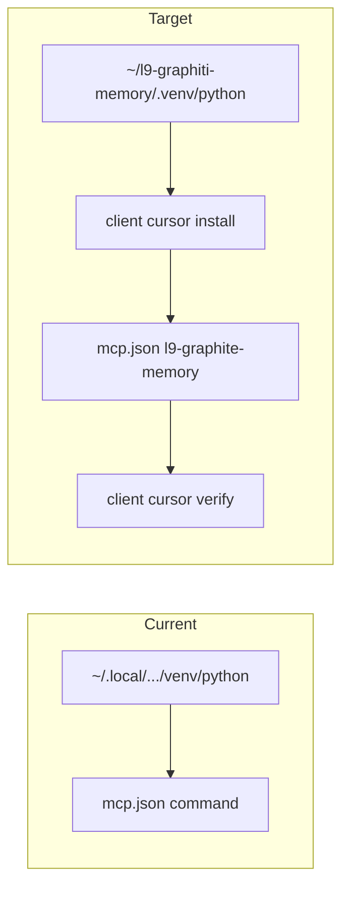

# PLAN: Governed Cursor MCP pin (ops)

**PLAN_DOCUMENT:** `/tmp/plan-cursor-mcp-ops.json` — `validate_plan_document.py` **PASS**
**Depth:** deep (conflicting evidence: “this tree” meant CG workspace; package install root is external)
**code_in_scope:** false — no Cursor-Governance code edits

## Objective

Make Cursor IDE MCP pin-authoritative by running the governed lifecycle from package SSOT [`~/l9-graphiti-memory`](/Users/ib-mac/l9-graphiti-memory) so [`~/.cursor/mcp.json`](/Users/ib-mac/.cursor/mcp.json) `l9-graphite-memory.command` is that checkout’s `.venv` interpreter — not stale `~/.local/l9-graphite-memory`.

**Default authority pin (locked):** `INTERPRETER=/Users/ib-mac/l9-graphiti-memory/.venv/bin/python`
(Live today: `~/.local/.../venv/bin/python` @ `f5b802a`; home checkout @ `e2bf040` but `.venv` cannot import the package yet.)

## Why not Cursor-Governance

Install is owned by external `Quantum-L9/l9-graphiti-memory` ([`docs/CURSOR_INSTANTIATION.md`](/Users/ib-mac/l9-graphiti-memory/docs/CURSOR_INSTANTIATION.md), ADR-064). CG does not vendor `l9-memory`. Open [#76](https://github.com/Quantum-L9/Cursor-Governance/pull/76) is Claude HTTP `l9-shared-memory` — different surface.



## Success criteria (falsifiable)

- `mcpServers.l9-graphite-memory.command` == home `.venv` python
- args exactly `-m l9_graphite_memory.server --transport stdio`; **no `env`**
- `verify --timeout 60` → ProbeReceipt `status=complete` (15 tools, `memory.health` not failed)
- `status` current under **same** interpreter
- siblings preserved; digest-bound backup; mode `0600`
- no hand-edits of `mcp.json`

## Scope

**In:** editable install into home `.venv`; inspect → dry-run → install → verify → status; secret-free receipts under `reports/cursor-mcp-pin-*`; user Cursor full restart.

**Out:** CG code / PR #76; hand-edit mcp.json; deleting `~/.local`; Graphiti tunnel; disabling HTTP `graphiti-memory` sibling; putting `l9-memory` on PATH; namespace-grant redesign (cwd residual stays).

## Critical path

| ID | Task |
|----|------|
| T1 | Freeze pin; ff-only home checkout if clean/behind (else stop — U1) |
| T2 | Editable install so home `.venv` imports `l9_graphite_memory` |
| T3 | `inspect` + `install --dry-run` with pinned interpreter |
| T4 | `install` (high risk; atomic + backup) |
| T5 | `verify --timeout 60` + `status` |
| T6 | Assert pin + write evidence receipts |
| T7 | **UserRequired:** full Cursor restart + Tools & MCP confirm |

Canonical invoke (never bare `l9-memory` until PATH is intentional):

```bash
INTERPRETER=/Users/ib-mac/l9-graphiti-memory/.venv/bin/python
$INTERPRETER -m l9_graphite_memory.cli client cursor inspect
$INTERPRETER -m l9_graphite_memory.cli client cursor install --dry-run
$INTERPRETER -m l9_graphite_memory.cli client cursor install
$INTERPRETER -m l9_graphite_memory.cli client cursor verify --timeout 60
$INTERPRETER -m l9_graphite_memory.cli client cursor status
```

## Rollback

`client cursor uninstall --restore-backup ~/.cursor/mcp.json.backup.<stamp>.<digest12>` from the T4 backup.

## Residual (explicit)

- Stdio server still inherits **workspace cwd** for local namespace resolution unless a later plan sets `L9_MEMORY_*` — pin fix ≠ grant redesign.
- Legacy `graphiti-memory` → `http://127.0.0.1:8100/mcp/` sibling remains (U2 accept_bounded).

## Next skill

After approval: execute as ops (or `l9-gmp-protocol` only if you want a locked modification envelope for `.venv` + mcp.json). No CG `make pr` unless evidence files are committed later.
