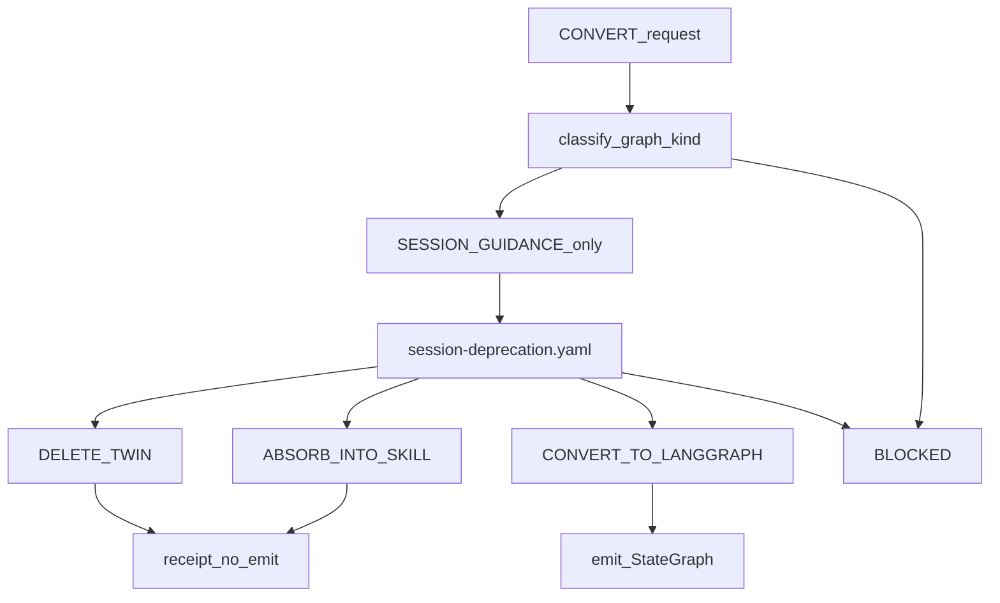

# PLAN: Add CONVERT to l9-dag-authoring

## Execute via Cursor Build

Press **Build**. Work in the **current checkout**.

This pass is the skill pack only: T02 through T10. Do not start T12 until T11 reports convert-count 1.

- Do not run `make campaign`.
- Do not admit a Program Lock or Controller lease.
- Do not write `Lock: origin/main = <sha>`.
- Do not open a new worktree from tip as a planning requirement.

## Objective

`l9-dag-authoring` owns graph lifecycle. Markdown surfaces now list CONVERT. Machine ops still need the catalog, schemas, and scripts. [`policies/graph-kinds.yaml`](skills/l9-dag-authoring/policies/graph-kinds.yaml) treats `SESSION_GUIDANCE` and `LANGGRAPH_RUNTIME` as peers.

Add **CONVERT**: a disposition gate, then one of three exits. It is not a rewrite of every SessionDAG into a `StateGraph`. SessionDAG file deletion is a follow-on plan after receipts exist.



## Exclusive envelope

write_allow:

- `skills/l9-dag-authoring/policies/session-deprecation.yaml`
- `skills/l9-dag-authoring/policies/dag-lifecycle.yaml`
- `skills/l9-dag-authoring/policies/graph-kinds.yaml`
- `skills/l9-dag-authoring/policies/ownership-boundary.yaml`
- `skills/l9-dag-authoring/references/session-to-langgraph-contract.md`
- `skills/l9-dag-authoring/references/dag-lifecycle-contract.md`
- `skills/l9-dag-authoring/contracts/dag-authoring-request.schema.json`
- `skills/l9-dag-authoring/contracts/dag-authoring-receipt.schema.json`
- `skills/l9-dag-authoring/scripts/validate_request.py`
- `skills/l9-dag-authoring/scripts/render_receipt.py`
- `skills/l9-dag-authoring/scripts/self_test.py`
- `skills/l9-dag-authoring/scripts/classify_conversion_disposition.py`
- `skills/l9-dag-authoring/scripts/convert_session_to_langgraph.py`
- `skills/l9-dag-authoring/fixtures/convert_delete_twin.json`
- `skills/l9-dag-authoring/fixtures/convert_absorb.json`
- `skills/l9-dag-authoring/fixtures/convert_langgraph.json`
- `skills/l9-dag-authoring/fixtures/convert_unknown.json`
- `skills/l9-dag-authoring/fixtures/convert_langgraph_source.py`
- `skills/l9-dag-authoring/fixtures/convert_prose_action.py`
- `skills/l9-dag-authoring/tests/test_skill.py`
- `skills/l9-dag-authoring/SKILL.md`
- `skills/l9-dag-authoring/agents/meta.yaml`
- `commands/dag-authoring.md`
- `commands/commands-index.md`
- `skills/l9-intelligence-harvest/SKILL.md`
- `skills/l9-intelligence-harvest/meta/skill-ir.json`
- `workflows/dags/intelligence_harvest/__init__.py`
- `workflows/dags/intelligence_harvest/state.py`
- `workflows/dags/intelligence_harvest/nodes.py`
- `workflows/dags/intelligence_harvest/routing.py`
- `workflows/dags/intelligence_harvest/graph.py`
- `workflows/dags/intelligence_harvest/executor.py`
- `tests/workflows/test_intelligence_harvest_langgraph.py`

write_deny:

- `workflows/dags/dag_authoring_dag.py`
- `workflows/dags/gmp_execution_dag.py`
- `workflows/dags/harvest_deploy_dag.py`
- `workflows/dags/slash_command_update_dag.py`
- `workflows/dags/readme_pipeline_dag.py`
- `workflows/dags/refactoring_dag.py`
- `workflows/dags/wire_dag.py`
- `workflows/dags/test_pipeline_dag.py`
- `workflows/dags/intelligence_harvest_dag.py`
- `workflows/dags/__init__.py`
- `workflows/__init__.py`
- `workflows/README.md`
- `workflows/session/interface.py`
- `workflows/session/registry.py`
- `tests/workflows/test_dags_discovery_boundary.py`
- `tests/workflows/test_intelligence_harvest_dag.py`
- `Makefile`
- `AGENTS.md`
- `CLAUDE.md`
- `CANONICAL_LAW.md`
- `pyproject.toml`
- `docs/plans/plan_skills_precommit_catalog_9e2b4c71.plan.md`
- `docs/plans/plan_skills_precommit_catalog_9e2b4c71.plan.json`

Overlap policy: `stop_if_dirty_overlaps_may_modify`. Pathspec commits only. Do not push.

## Catalog

Lock these rows in [`session-deprecation.yaml`](skills/l9-dag-authoring/policies/session-deprecation.yaml). Every row needs `dag_id`, `source_path`, `disposition`, `domain_owner`, `proof_path`. Missing `proof_path` on a DELETE_TWIN or ABSORB_INTO_SKILL row is BLOCKED, not convert.

| dag_id | disposition | source_path | proof_path |
|---|---|---|---|
| `gmp-execution-v1` | DELETE_TWIN | `workflows/dags/gmp_execution_dag.py` | `workflows/dags/gmp/graph.py` |
| `harvest-deploy-v1` | DELETE_TWIN | `workflows/dags/harvest_deploy_dag.py` | `workflows/harvest_deploy.py` |
| `slash-command-update-v1` | DELETE_TWIN | `workflows/dags/slash_command_update_dag.py` | `skills/l9-dag-authoring/SKILL.md` COMMAND_BIND |
| `skill-compiler-v2` | DELETE_TWIN | none | `skills/l9-skill-compiler/SKILL.md` supersedes line |
| `readme-pipeline-v1` | ABSORB_INTO_SKILL | `workflows/dags/readme_pipeline_dag.py` | `skills/l9-update-agent-docs/SKILL.md` |
| `refactoring-v1` | ABSORB_INTO_SKILL | `workflows/dags/refactoring_dag.py` | `skills/l9-code-maintenance/SKILL.md` |
| `wire-v1` | ABSORB_INTO_SKILL | `workflows/dags/wire_dag.py` | `skills/l9-governance-wiring/references/wire-executor.md` |
| `test-pipeline-v1` | ABSORB_INTO_SKILL | `workflows/dags/test_pipeline_dag.py` | `skills/l9-code-maintenance/SKILL.md` |
| `dag-authoring-v1` | ABSORB_INTO_SKILL | `workflows/dags/dag_authoring_dag.py` | `skills/l9-dag-authoring/SKILL.md` |
| `intelligence-harvest-v1` | CONVERT_TO_LANGGRAPH | `workflows/dags/intelligence_harvest_dag.py` | `skills/l9-intelligence-harvest/meta/skill-ir.json` |

Unknown id → BLOCKED. A `LANGGRAPH_RUNTIME` source → BLOCKED. Dry-run `CONVERT_TO_LANGGRAPH` count must be **1** before T12.

## CONVERT contracts

Request: `operation: CONVERT` requires `dag_id` or `dag_path`. `allow_session_retire` defaults false and is refused when true.

Classifier: run [`classify_graph_kind.py`](skills/l9-dag-authoring/scripts/classify_graph_kind.py) first. Continue only on `SESSION_GUIDANCE`. Look up the catalog. DELETE_TWIN requires `proof_path` to exist. ABSORB_INTO_SKILL requires the skill `SKILL.md` to exist. CONVERT_TO_LANGGRAPH requires `domain_owner` and fails if a twin `StateGraph` already exists for that id.

Emitter: run only after classifier returns `CONVERT_TO_LANGGRAPH`. Copy the modular shape of [`workflows/dags/gmp/`](workflows/dags/gmp/). Map IR / SessionNode ids to `add_node`. An `action` that is an existing repo script becomes a node callable. A prose `action` fails closed. Conditional edges become `add_conditional_edges`. No `register_session_dag`. Then [`validate_langgraph_source.py`](skills/l9-dag-authoring/scripts/validate_langgraph_source.py) must PASS.

IR node ids that must appear on `build_intelligence_harvest_graph()`: BIND_REQUEST, PROBE_CAPABILITIES, LOCK_SOURCE_IDENTITY, INVENTORY_DONOR, RECONSTRUCT_SYSTEM, TRACE_SURFACES, DETECT_DUPLICATION_DRIFT, EXTRACT_CONCEPT_CANDIDATES, QUALIFY_NUGGETS, COMPARE_BENEFICIARY, DISPOSITION_CONCEPTS, DERIVE_ACCEPTANCE_TESTS, RANK_NUGGETS, SAFETY_PORTABILITY_AUDIT, EVIDENCE_CLOSURE, RENDER_OUTPUT, PASS, PARTIAL, BLOCKED, FAIL.

Bounded-LLM nodes record `UNKNOWN` or terminal `BLOCKED`. They do not fabricate harvest.json fields.

`canonical_dag_registration` stays a SessionDAG-adapter obligation on [`intelligence_harvest_dag.py`](workflows/dags/intelligence_harvest_dag.py). The emitted package must not implement registration. T13 changes `authority.canonical_dag` to `workflows/dags/intelligence_harvest/graph.py` and leaves `dag_registry_id: intelligence-harvest-v1`.

`deprecated_pending_convert` lives only in [`graph-kinds.yaml`](skills/l9-dag-authoring/policies/graph-kinds.yaml). Do not put legacy-generation or fake wording in [`workflows/dags/__init__.py`](workflows/dags/__init__.py), [`workflows/__init__.py`](workflows/__init__.py), or [`workflows/README.md`](workflows/README.md). [`test_dag_authoring_alignment.py`](tests/workflows/test_dag_authoring_alignment.py) pins that wording.

Do not edit [`test_dags_discovery_boundary.py`](tests/workflows/test_dags_discovery_boundary.py). The `skill-compiler-v2` registry assertion stays until the follow-on.

## Hard stops

- Do not emit a StateGraph for absorb or twin rows.
- Do not delete any SessionDAG module.
- Do not add CONVERT nodes to [`dag_authoring_dag.py`](workflows/dags/dag_authoring_dag.py).
- Do not flip `allow_session_retire`.
- T12 is forbidden until T11 reports convert-count 1.

## Proof

```bash
python3 skills/l9-dag-authoring/scripts/self_test.py
python3 -m pytest skills/l9-dag-authoring/tests/test_skill.py \
  tests/workflows/test_dag_authoring_alignment.py \
  tests/workflows/test_intelligence_harvest_dag.py \
  tests/workflows/test_intelligence_harvest_langgraph.py
python3 skills/l9-dag-authoring/scripts/validate_langgraph_source.py \
  workflows/dags/intelligence_harvest/graph.py
OPEN_PR=0 make pr
```

`get_session_dag("intelligence-harvest-v1")` must still resolve. Do not push.

## Follow-on (not this Build)

Delete twin SessionDAGs, fold absorb-row text into the named skills, drop the stale `skill-compiler-v2` registry assertion, then retire `workflows/session/` and `dag_authoring_dag.py`. That unification wave is a separate plan. CONVERT is the machine that makes it legal.

## Rollback

`git restore --staged --worktree --` the write_allow paths. Delete only files this Build created under `workflows/dags/intelligence_harvest/`. Do not revert foreign commits on `feat/pr-check-folded`.
