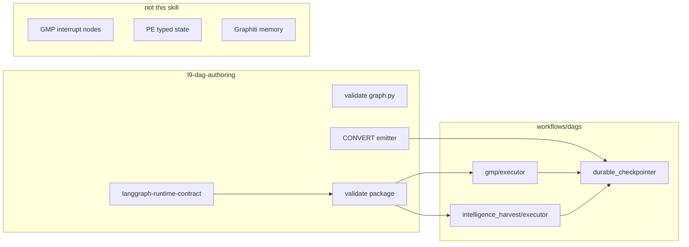

# Upgrade /dag-authoring (durable LANGGRAPH_RUNTIME)

## Metadata

- `plan_id`: dag_authoring_durability_71aeddce
- `schema_version`: executable_plan.v1 / simple
- `status`: fill (Build-ready after this Improve pass; PLAN_DOCUMENT JSON validator **Unknown** — not run this turn)
- `kind`: simple
- `execute_via`: cursor-build

## GAR / reasoning stance

```yaml
task_kind: architecture
reasoning_depth: standard
epistemic_methods: [deductive, comparative, abductive]
evidence_quality: high
decision_risk: guarded
action: proceed_with_validation
calibration_status: none
stated_probability: null
```

- Realization mode remains `MUTATION` (RM-001). Plan-mode mutation is still gated; this file is the required gate artifact.
- Integration remains `STANDALONE`.

## Improve binding (this pass)

- **Target:** this plan file only (`docs/plans/dag_authoring_durability_71aeddce.plan.md`). Implementation not started.
- **Mode:** full_improvement of the plan artifact (inspect + remediate plan defects). Not inspect_only.
- **Baseline validation of the skill pack:** Skipped (no pack mutation this turn).
- **Status of this Improve pass:** Succeeded for the plan; pack readiness remains not started.

Verified plan defects that this revision remediates:

1. Success criteria were structural-only. That repeats the false-completion the upgrade exists to kill (EP-003 / CONVERGENCE FC-003).
2. `GMPState` is a dataclass ([workflows/dags/gmp/state.py](workflows/dags/gmp/state.py)); `HarvestState` is a TypedDict. Sqlite checkpoint serde of the dataclass is **Unknown** until probed. Swapping savers without that probe can ship a durable-looking executor that throws on first `invoke`.
3. Official savers need `setup()` once. Omitted.
4. `ephemeral → PARTIAL` plus same-PR exemplar repair is a leftover grace window. It lets VALIDATE report non-FAIL for MemorySaver. Drop it: `none` and `ephemeral` are FAIL.
5. Receipt schema has `additionalProperties: false` and `version` const `2.2.0`. Adding a field or bumping the const without updating [skills/l9-dag-authoring/tests/test_skill.py](skills/l9-dag-authoring/tests/test_skill.py) (`assert data["version"] == "2.2.0"`) and [skills/l9-dag-authoring/scripts/render_receipt.py](skills/l9-dag-authoring/scripts/render_receipt.py) is a guaranteed test fail. `persistence_class` must be optional (default null) so old call sites still render.
6. `.l9/` is already in [.gitignore](.gitignore). Do not add a second ignore rule.
7. [workflows/dags/dag_authoring_dag.py](workflows/dags/dag_authoring_dag.py) `validate_langgraph` action still teaches `build_graph().compile()` and `validate_langgraph_source.py SOURCE.py`. Leaving that text makes the SessionDAG contradict the new contract.
8. [tests/workflows/test_dag_authoring_alignment.py](tests/workflows/test_dag_authoring_alignment.py) and the harvest `compile()` probe were omitted from the test todo.

## Decision (unchanged, tightened)

Do **not** add `--durable` or a seventh slash verb.

Do **not** copy `skills/l9-global-architect/` into the dag-authoring pack.

Do **not** treat `MemorySaver` as durable under any receipt status.

Selected: persistence as a LANGGRAPH_RUNTIME proof obligation — contract, package validator, CONVERT emitter, one helper, exemplar executors, discriminating resume test.

Rejected A: seventh operation. Rejected B: copied GAR runtime.



## GAR semantics to port (allow-list)

Write into [skills/l9-dag-authoring/references/langgraph-runtime-contract.md](skills/l9-dag-authoring/references/langgraph-runtime-contract.md) and [skills/l9-dag-authoring/policies/ownership-boundary.yaml](skills/l9-dag-authoring/policies/ownership-boundary.yaml). Do not import GAR YAML.

1. **False completion:** VALIDATE/CONVERT PASS requires `persistence_class=durable` observed. `MemorySaver` / `InMemorySaver` / missing saver → FAIL (`ephemeral_checkpointer` or `missing_durable_checkpointer`).
2. **Existence is not activation:** `StateGraph.compile()` is not durability.
3. **Ownership:** checkpointer = thread resume; PE = campaign authority; Graphiti = episodic memory. No LangGraph Store.
4. **Earned complexity:** no new operation; no GAR machine; no checkpoint registry.
5. **STATE / TEMPORAL / FAILURE:** caller-supplied `thread_id`; `graph.py` never `compile()`; nodes documented re-enterable (authoring does not implement domain idempotency).
6. **Typed remaining_action:** `missing_durable_checkpointer`, `ephemeral_checkpointer`, `missing_thread_id`, `builder_compiles_graph`, `compile_not_in_executor`.

## What stays out

- GMP/harvest `interrupt()` placement.
- PE `thread_id` = task id.
- Graphiti / LangGraph Store / Postgres this wave.
- SessionDAG checkpoints (except aligning the existing `validate_langgraph` **action string** so it does not teach the old compile).
- AGENTS.md.
- Copying GAR evaluators or RUN_STATE.
- A new `.gitignore` line for `.l9/langgraph/` (parent `.l9/` already covers it).

## Immutable baseline

- Plan file: `docs/plans/dag_authoring_durability_71aeddce.plan.md`
- Do **not** write `Lock: origin/main = <sha>`.
- Record HEAD at Build start for attribution only.
- Unrelated dirty tree (including Makefile protected-root advisory) is out of this change set. Pathspec only.

## Implementation (Build)

### 1. Contract and policies (2.2.0 → 2.3.0)

[skills/l9-dag-authoring/references/langgraph-runtime-contract.md](skills/l9-dag-authoring/references/langgraph-runtime-contract.md):

- `graph.py` builds only; never `compile()`.
- Executor is the only compile site: `compile(checkpointer=...)`.
- Durable = `SqliteSaver` (or equivalent file/DB saver) after `setup()`.
- Every invoke/resume/`get_state` takes `configurable.thread_id`.
- Checkpoint path is **workspace** `.l9/langgraph/<dag_id>.sqlite` (worktree-local; already ignored by `.l9/`).

[skills/l9-dag-authoring/policies/dag-lifecycle.yaml](skills/l9-dag-authoring/policies/dag-lifecycle.yaml): `LANGGRAPH_RUNTIME_requires_durable_checkpointer`.

[skills/l9-dag-authoring/policies/ownership-boundary.yaml](skills/l9-dag-authoring/policies/ownership-boundary.yaml): own `langgraph_runtime_persistence_mechanics`; do not own memory SSOT, PE authority, or domain interrupts.

[skills/l9-dag-authoring/policies/graph-kinds.yaml](skills/l9-dag-authoring/policies/graph-kinds.yaml): `compile_is_not_durability`.

Receipt: bump `version` const to `2.3.0` in [skills/l9-dag-authoring/contracts/dag-authoring-receipt.schema.json](skills/l9-dag-authoring/contracts/dag-authoring-receipt.schema.json) and renderer. Add optional `persistence_class` (`durable` | `ephemeral` | `none` | null). Do not put it in `required` (schema is `additionalProperties: false` — add the property explicitly). Update `test_receipt` / `test_convert_request_and_receipt` version asserts. Request schema version string only if it currently pins 2.2.0.

[commands/dag-authoring.md](commands/dag-authoring.md): version bump only.

### 2. Split the validator

Keep `validate(path_to_graph_py)` structural so [skills/l9-dag-authoring/tests/test_skill.py](skills/l9-dag-authoring/tests/test_skill.py) `test_langgraph_validator` and alignment tests stay valid.

Add `validate_package(dir)`:

- `graph.py`: structural + FAIL `builder_compiles_graph` if it calls `compile`.
- `executor.py`: `.compile(` with `checkpointer=`; FAIL `ephemeral_checkpointer` on MemorySaver/InMemorySaver; FAIL `missing_thread_id` if no thread_id; FAIL `compile_not_in_executor` if compile lives only on the builder.
- Status FAIL unless `persistence_class=durable`.

CONVERT calls `validate_package` on the emit dir.

VALIDATE LANGGRAPH_RUNTIME calls `validate_package` on the package directory (not only `graph.py`).

Update the CLI so a directory argument runs `validate_package`. Keep a file argument as structural `validate`.

Align [workflows/dags/dag_authoring_dag.py](workflows/dags/dag_authoring_dag.py) `validate_langgraph` action: point at package validate + `compile(checkpointer=...)`. Do not CONVERT that SessionDAG. Do not retouch other nodes.

### 3. Helper + CONVERT emitter

Add [workflows/dags/_runtime/__init__.py](workflows/dags/_runtime/__init__.py) and [workflows/dags/_runtime/durable_checkpointer.py](workflows/dags/_runtime/durable_checkpointer.py).

Contract of the helper:

- `open_checkpointer(dag_id: str, *, workspace: Path) -> BaseCheckpointSaver`
- Create `.l9/langgraph/` under **workspace**, not `$HOME`.
- Call `setup()` if the saver exposes it.
- Import `SqliteSaver` from `langgraph.checkpoint.sqlite` (confirm at Build; if the 1.2.11 extra uses a different module path, bind to the live import — do not invent).

Append `langgraph-checkpoint-sqlite` on the existing `langgraph>=0.2` line block in [pyproject.toml](pyproject.toml) (additive; do not rewrite other deps). Refresh `uv.lock` via `uv lock` / `make venv` as the repo already does. No “for later” — the helper imports it the same change.

CONVERT [skills/l9-dag-authoring/scripts/convert_session_to_langgraph.py](skills/l9-dag-authoring/scripts/convert_session_to_langgraph.py) `executor.py` template: `run` / `resume` / `get_state`, helper, caller `thread_id`. If the caller omits `thread_id`, generate **once**, return it in the executor result (`{"thread_id": ..., "state": ...}`). Do not mint a new id on resume. Do not add `thread_id` as a GMP/harvest domain state field unless serde preflight requires it.

### 4. GMPState serde preflight (blocking)

Before swapping [workflows/dags/gmp/executor.py](workflows/dags/gmp/executor.py):

1. Compile a tiny graph with `GMPState` + the helper against a temp sqlite file.
2. `invoke` once, new process or new executor instance, `get_state` / second `invoke` with the same `thread_id`.

If that probe **Passed**, swap the saver only.

If it **Failed**, smallest repair only: a checkpoint serde or a dict projection at the executor boundary. Do not rewrite `node_*` bodies. Do not convert the whole GMP graph to TypedDict unless the probe proves dataclass checkpointing is unsupported.

`HarvestState` is already a TypedDict — treat harvest serde as Passed-by-shape unless the same probe fails.

### 5. Exemplar executors

- GMP: drop `MemorySaver`; use helper; return `thread_id`.
- Harvest: wrap `compile_graph()` the same way. Change the harvest test probe that currently calls `build_intelligence_harvest_graph().compile()` so it still proves compile, but via the executor (or keep builder compile as a structural smoke **and** add executor compile — do not leave the probe as the only compile story).

No `interrupt()` in confirm nodes.

### 6. Tests (discriminating)

Must add [tests/workflows/test_langgraph_durable_resume.py](tests/workflows/test_langgraph_durable_resume.py) (or skill-pack equivalent):

- Instance A runs node 1, process ends (or executor object dropped).
- Instance B opens the same sqlite path + `thread_id`.
- `get_state` shows progress from A; resume does not re-run node 1 if a side-effect flag was set.

AST `validate_package` alone is **not** this test.

Also update:

- skill `test_skill.py` / `self_test.py` (package FAIL/PASS, receipt `2.3.0`)
- [tests/workflows/test_intelligence_harvest_langgraph.py](tests/workflows/test_intelligence_harvest_langgraph.py) (`validate(GRAPH_PATH)` stays PASS; add `validate_package`)
- [tests/workflows/test_dag_authoring_alignment.py](tests/workflows/test_dag_authoring_alignment.py) (structural validate stays; package gate covered elsewhere)

## Success properties

- SP-01: `validate_package` on a `compile()`-only executor → FAIL `missing_durable_checkpointer`. Evidence: skill unit test.
- SP-02: `validate_package` on MemorySaver executor → FAIL `ephemeral_checkpointer`. Evidence: skill unit test.
- SP-03: CONVERT emit dir → `persistence_class=durable`. Evidence: convert + validate_package.
- SP-04: Two-instance resume on the helper sqlite path restores state. Evidence: `test_langgraph_durable_resume.py`.
- SP-05: GMP serde probe Passed, or executor-boundary serde landed with that probe as the regression. Evidence: gmp-state-serde todo.
- SP-06: SessionDAG REGISTER unchanged; no `register_session_dag` in emitted runtimes.
- SP-07: Command file stays trigger-only.

## Capability / envelope

- FS: skill pack, `workflows/dags/{_runtime,gmp,intelligence_harvest,dag_authoring_dag.py}`, listed tests, `pyproject.toml` + `uv.lock`, command version.
- Commands: targeted pytest on those tests; `python3 skills/l9-dag-authoring/scripts/self_test.py`.
- Network: none required after the sqlite extra is locked.
- Secrets: none.
- `autonomous_merge`: false.

## Side effects / idempotency

- Helper `setup()` must be safe to call twice.
- Checkpoint files are machine-local; tests use `tmp_path`, never the live workspace db.
- CONVERT emit is deterministic for the same IR.
- Do not write sqlite files into git.

## Architecture impact

- New module `workflows/dags/_runtime/` is a shared mechanic (three consumers). It is not a skill and not a SessionDAG registry.
- Dependency direction: executors → helper → langgraph checkpoint sqlite. Helper must not import GMP or harvest.
- pyproject additive pin only.

## Stress test

- **Disconfirm:** If `validate(graph.py)` requires a saver, structural tests break — keep the split.
- **Disconfirm:** If GMPState cannot checkpoint and we ignore the probe, SP-04 fails or we ship a lying executor.
- **Disconfirm:** If SessionDAG action strings still say `compile()` with no saver, agents false-complete after the skill change.
- **Assume false if:** durable means any checkpointer; `.l9` needs a new gitignore; PARTIAL is an acceptable VALIDATE for MemorySaver.
- **Blast radius:** skill pack, two executors, SessionDAG action text, pyproject/lock, listed tests. SessionDAG registry and PE unchanged.
- **Rollback:** revert the pathspec commit; `uv lock` back if the extra is dropped; delete `_runtime/` and tmp sqlite.

## Leverage

Package validator + CONVERT template kill the false-completion root. Shared helper avoids three savers. Serde preflight prevents a second false completion (durable compile, unresumable state). Resume test is the only check that discriminates crash recovery.

## Doc / root surface

- In: skill refs, policies, schemas, command version, pyproject append, SessionDAG validate action string.
- N/A: AGENTS.md, Makefile, CANONICAL_LAW.md.

## Out of scope

Unchanged from the allow-list “What stays out.” Unrelated Makefile protected-root dirt is not this plan.

## Convergence

- Another Improve pass on this plan lacks a new high-severity objective.
- Pack mutation and tests are **not** Converged (not started).
- `execute_via`: cursor-build.

## Execute via Cursor Build

Press **Build**. Work in the **current checkout**.

- Do not run `make campaign`.
- Do not admit a Program Lock or Controller lease.
- Do not write `Lock: origin/main = <sha>`.
- Do not open a new worktree from tip as a planning requirement.
- After catalog + scoped commit: Cursor stops (do not `make pr` unless asked).

## Improve receipt (plan only)

```yaml
status: Succeeded
execution_mode: full_improvement
target_binding: docs/plans/dag_authoring_durability_71aeddce.plan.md
scope: plan_artifact_only
baseline: pre-Improve plan inspected; pack validation Skipped
changes_applied: plan text and todos only
validation_results:
  - action: kernels/Improve.md against this plan
    result: Passed
  - action: pack pytest / self_test
    result: Skipped
    reason: plan iteration; no pack mutation
  - action: validate_plan_document.py
    result: Unknown
    reason: PLAN_DOCUMENT JSON not emitted this turn
entropy_reduction:
  - removed PARTIAL grace for MemorySaver
  - removed redundant gitignore todo
  - collapsed AST-only success into SP-04 resume proof
convergence: Converged for the plan artifact
handoff: updated plan at docs/plans/dag_authoring_durability_71aeddce.plan.md
```
