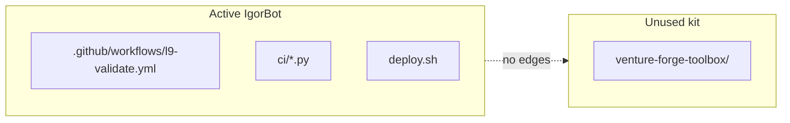

# Delete unused venture-forge-toolbox

## Findings

`venture-forge-toolbox/` is dead drift. Bootstrap was never run on this repo (no root `tools/`, `.semgrep/`, or `ci-quality.yml`). Nothing in Makefile, `deploy.sh`, or [`.github/workflows/l9-validate.yml`](.github/workflows/l9-validate.yml) executes it.

**External references (only these):**

| File | Change |
|------|--------|
| [`README.md`](README.md) line 185 | Remove tree line for `venture-forge-toolbox/` |
| [`.brv/context-tree/decisions.md`](.brv/context-tree/decisions.md) line 5 | Remove or replace the “kept as-is” bullet |

**Not referenced in:** `Makefile`, `deploy.sh`, `ci/`, `config/`, `workspace/`, `docs/`, `CLAUDE.md`, pre-commit, JSON configs.

Root already has independent equivalents: `deploy.sh`, `ci/` + `l9-validate.yml`, `ci/install-hooks.sh`, `bin/`, `Makefile`.

## Execution (after you approve)

1. **Delete** the entire folder `venture-forge-toolbox/` (requires your explicit approval for `rm -rf` — confirming this plan counts).
2. **Edit** [`README.md`](README.md): drop the tree line ending in `venture-forge-toolbox/`.
3. **Edit** [`.brv/context-tree/decisions.md`](.brv/context-tree/decisions.md): remove the kept-as-is bullet (or note it was removed as unused drift).
4. **Verify** with grep that no remaining references exist (excluding git history).
5. **Smoke-check** (optional, local): `python3 ci/validate_repo.py` — should be unaffected.

## Out of scope

- No CI workflow merges from toolbox into root (gates were never active here).
- No extract-to-separate-repo step (you said you will not use the toolbox). Content remains recoverable from git history if needed later.
- No commit/push unless you ask after the deletion.

## Risk

**Doc cleanup only.** No runtime or CI break expected.
