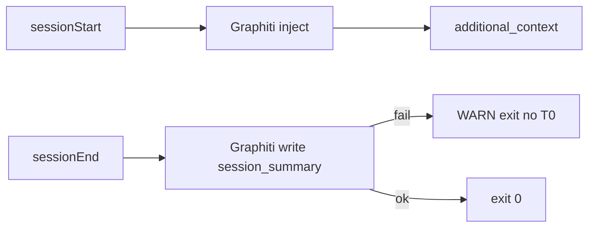

# Deprecate memory-bank from session start/end hooks

## Decision locked

- **Repo:** [Quantum-L9/Cursor-Governance](https://github.com/Quantum-L9/Cursor-Governance) via live SSOT clone [`~/.cursor-governance`](/Users/ib-mac/.cursor-governance) (`main` @ `72c6599`).
- **Cutover:** hard — hooks neither read, scaffold, nor write `memory-bank/`.
- **Resume SSOT after cutover:** Graphiti `inject` / PICKUP episodes; no T0 fallback in hooks.
- **Out of scope for this change:** Gate_SDK transport code; Quantum-L9/l9-graphiti-memory package; deleting existing consumer `memory-bank/` dirs.

## Live hook entrypoints

| Cursor hook | Installed command | SSOT to edit |
|---|---|---|
| `sessionStart` | `~/.cursor/hooks/session-start-bootstrap.sh` | [`ops/hooks/session_start_bootstrap.sh`](/Users/ib-mac/.cursor-governance/ops/hooks/session_start_bootstrap.sh) |
| `sessionEnd` | `~/.cursor/hooks/graphiti-session-end.sh` (symlink into governance) | [`ops/hooks/graphiti-session-end.sh`](/Users/ib-mac/.cursor-governance/ops/hooks/graphiti-session-end.sh) |
| start delegate | called from bootstrap | [`ops/hooks/session_start_memory_orchestrator.sh`](/Users/ib-mac/.cursor-governance/ops/hooks/session_start_memory_orchestrator.sh) |

Also stop scaffolding from the start path in [`ops/hooks/graphiti-prefetch.sh`](/Users/ib-mac/.cursor-governance/ops/hooks/graphiti-prefetch.sh) (calls `graphiti_scaffold_memory_bank`).

## sessionStart changes

In `session_start_bootstrap.sh` and `session_start_memory_orchestrator.sh`:

1. Remove `append_repo_memory_bank()` and all calls.
2. Remove `graphiti_scaffold_memory_bank` calls.
3. Keep Graphiti tunnel/health + `inject` as the only memory context.
4. Replace T0-oriented degraded strings with Graphiti-only messaging, e.g. `graphiti: prefetch degraded — resume via PICKUP search when online`.

## sessionEnd changes

In `graphiti-session-end.sh`:

1. Delete `ensure_memory_bank_trackable`, `write_memory_bank_fallback`, and `BANK=...`.
2. On Graphiti disabled / unresolvable `group_id` / write failure: log `WARN`, **do not** write `memory-bank/`, exit `0` (hooks must not break IDE close).
3. Keep distill + `python3 "$GRAPHITI_CLI" write ... --kind session_summary` as the sole persistence path.
4. Update header comment to: Graphiti-only; memory-bank deprecated.

## Shared helper

In [`ops/hooks/graphiti_common.sh`](/Users/ib-mac/.cursor-governance/ops/hooks/graphiti_common.sh): mark `graphiti_scaffold_memory_bank` deprecated (no-op or warning stub) so leftover callers cannot reintroduce T0 silently. Prefer no-op + stderr deprecation once, then remove call sites listed above.

## Minimal companion doc sync (required so agents do not re-write T0)

Hooks alone are insufficient if `/end-session` still instructs T0 fallback. Update in the same PR:

- [`ops/graphiti/MEMORY_BANK_POLICY.md`](/Users/ib-mac/.cursor-governance/ops/graphiti/MEMORY_BANK_POLICY.md) — status: **deprecated**; hooks no longer read/write; existing dirs archival only.
- [`skills/l9-graphiti-memory/SKILL.md`](/Users/ib-mac/.cursor-governance/skills/l9-graphiti-memory/SKILL.md) — Purpose + Session lifecycle: Graphiti PICKUP/`inject` as resume SSOT; remove “T0 resume SSOT” / “sessionEnd writes T0”.
- [`skills/l9-end-session/SKILL.md`](/Users/ib-mac/.cursor-governance/skills/l9-end-session/SKILL.md) + [`references/end-session-protocol.md`](/Users/ib-mac/.cursor-governance/skills/l9-end-session/references/end-session-protocol.md) — drop memory-bank fallback step; on Graphiti failure, warn and continue Redis/handoff only.

Defer broader rule churn (`85`/`87`/`03`/`97`) to a follow-up unless you want it in this PR; hooks + end-session skill are the runtime path.

## Gate_SDK note (prerequisite awareness, not this PR’s main body)

This workspace currently resolves Graphiti as `igor-workspace` **readonly** (no `group_registry.yaml` entry). After T0 removal, sessionEnd will warn-and-skip instead of writing local bank. Follow-up (separate commit unless you want it bundled): add a writable `Gate_SDK` / `constellation-node-sdk` group to [`ops/graphiti/group_registry.yaml`](/Users/ib-mac/.cursor-governance/ops/graphiti/group_registry.yaml).

## Validation

1. Shellcheck / dry-run start orchestrator with `CURSOR_PROJECT_DIR` set; assert `additional_context` has no `memory-bank:` keys.
2. Dry-run sessionEnd with Graphiti disabled: assert no files created under `$REPO/memory-bank`.
3. With Graphiti healthy + writable group: assert `write --kind session_summary` still succeeds.
4. Re-sync installed bootstrap copy if it is not a symlink (`~/.cursor/hooks/session-start-bootstrap.sh`) from the governance SSOT (same path used by existing session-start sync commits).
5. Commit/push only in Cursor-Governance when you explicitly ask.

## Non-goals

- Do not auto-delete consumer `memory-bank/` trees.
- Do not change constellation-node-sdk protocol code in Gate_SDK.
- Do not alter the Quantum-L9/l9-graphiti-memory package (already RecordStore-canonical).
