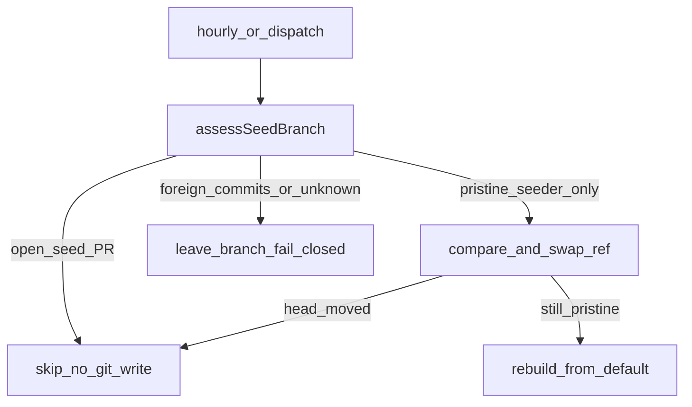

# Stop seeder clobber and residual seed lint

## Locked scope (user)

In: close [#60](https://github.com/Quantum-L9/.github/issues/60) and residual [#61](https://github.com/Quantum-L9/.github/issues/61) by changing **only** `Quantum-L9/.github`.

Out: live `mode=seed` (#20), org community-health cascade (#6), weekly advisory (#19), fleet SHA-pin (#47), consumer-repo edits, merge of the resulting PR, disabling the cron without a code merge.

Diagnose evidence (2026-08-24): `main` @ `39ebfb6096eaf5a5d17447b077d4b3342efc33a6` still has `cron: '*/15 * * * *'` and `updateRef … force: true` in [`.github/workflows/auto-seed-new-repo.yml`](https://github.com/Quantum-L9/.github/blob/main/.github/workflows/auto-seed-new-repo.yml). Last 8 scheduled runs failed/cancelled. Open consumer seed PRs still rewritten ~00:55Z: `l9-ci-sdk#71`, `l9-ci-core#113`, `l9-meta-injector#82`. `labels.yml` already yamllint-safe; both CoC copies still use Markdown hard-break trailing spaces.

Depth: **deep** (`route_plan.py --risk high`). Target repo is **not** Cursor-Governance. PE campaign target_repository_id = `Quantum-L9/.github`. New branch from that repo's `origin/main` (KERNEL/pack default). Do not mix this onto Cursor-Governance WIP.

## Why not merge the existing fix branch

`claude/github-org-config-q8l5lu` @ `74336bc` already contains the intended #60 fix (ahead 2 / behind 5; **no open PR**):

- Add [`ops/seed-branch-safety.js`](https://github.com/Quantum-L9/.github/blob/claude/github-org-config-q8l5lu/ops/seed-branch-safety.js) with `assessSeedBranch` / `moveSeedBranch`
- Tests: `ops/test-seed-branch-safety.js`, `ops/test-seed-workflow-branch-guard.js` (wired into `ops/validate-starters.sh`)
- Edit both [`.github/workflows/auto-seed-new-repo.yml`](https://github.com/Quantum-L9/.github/blob/main/.github/workflows/auto-seed-new-repo.yml) and [`.github/workflows/seed-governance.yml`](https://github.com/Quantum-L9/.github/blob/main/.github/workflows/seed-governance.yml): skip open seed PRs before any ref write; fail-closed if branch is dirty or unprovable; `force: true` only on proven-pristine rebuilds; workflows must not name `createRef` / `updateRef` / `force: true` after the refactor
- Concurrency group; cron `*/15` → hourly; per-repo failures via `core.error` + `setFailed`
- [`AGENTS.md`](https://github.com/Quantum-L9/.github/blob/main/AGENTS.md) Auto-Seeder row + non-destructive contract

PRs #58/#59/#62 landed on `main` after that branch. Cherry-picking the two commits onto stale history will fight the current `script:` body. **Port the helpers onto a fresh `origin/main` snapshot** and re-integrate the current workflow text.

## Execution envelope

- Workspace: dedicated worktree of `Quantum-L9/.github` from `origin/main` via `ops/scripts/worktree_add_wired.sh` (or clone + `ensure_workspace_wired.sh`). Isolation key: that worktree only.
- Branch: `feat/seed-branch-safety` (or `campaign/dot-github-seeder-safety-v1` if PE names it). Do not reuse `claude/github-org-config-q8l5lu`.
- `may_modify`: `.github/workflows/auto-seed-new-repo.yml`, `.github/workflows/seed-governance.yml`, `ops/seed-branch-safety.js`, `ops/test-seed-branch-safety.js`, `ops/test-seed-workflow-branch-guard.js`, `ops/validate-starters.sh`, `AGENTS.md`, `CODE_OF_CONDUCT.md`, `templates/community-health/CODE_OF_CONDUCT.md`, optional root `.yamllint.yml`.
- `must_not_modify`: `l9-ci-pack/**`, `workflow-templates/**`, already-fixed `.github/labels.yml` / `templates/labels.yml`, consumer repos, org secrets, branch protection, Cursor-Governance product files.
- Commands: `make validate` (this repo's Makefile), `node ops/test-*.js`. Publish after L4 local finish: `PR_REMEDIATE=0 make -C "$HOME/.cursor-governance" pr WS="<wt>"` if wiring holds; else stop_and_replan (do not raw `gh pr create`).
- Network: `gh` read + one sanctioned `make pr`. Secrets: none in git; seeder keeps existing `governance-distribution` / `GH_TOKEN`.
- `autonomous_merge: false`. Campaign stops at verified local commits; publish is a separate root op; merge only later via `/l9-pr-remediation` if you invoke it.

## Success properties (falsifiable)

- SP-01: execute starts at locked `.github` `origin/main` SHA; drift → stop_and_replan.
- SP-02: `ops/test-seed-workflow-branch-guard.js` fails against the pre-fix workflow body and passes against the ported body (incident scenario: open seed PR + extra commit → no `updateRef`).
- SP-03: grepping both workflow files after port finds no `createRef`, `updateRef`, or `force: true`.
- SP-04: `make validate` PASS in the `.github` worktree.
- SP-05: both CoC files have no trailing whitespace; enforcement tiers remain three separate lines (list or ` `, not deleted hard-breaks).
- SP-06: one PR open on `Quantum-L9/.github` against `main`, green + merge-ready; comments on #60 and #61; #20/#6/#19/#47 commented as out of this close-out (not closed).

## Waves / TODOs

- **W0 TASK-001** `todo-01-baseline-preflight` — Lock full SHA of `Quantum-L9/.github` `origin/main`; confirm `force: true` + `*/15` still live; confirm dual CoC trailing spaces; fetch `74336bc` as read-only donor. Mutation: false.
- **W1 TASK-002** `todo-02-port-safety-gate` — Port shared gate + both workflow integrations + validate-starters wiring + AGENTS.md contract from `74336bc` onto current main. Highest leverage. Risk: high.
- **W1 TASK-003** `todo-03-fix-coc-templates` — Same wave, independent of helper internals: restructure enforcement tiers in root `CODE_OF_CONDUCT.md` (lines 47–49) and `templates/community-health/CODE_OF_CONDUCT.md` (lines 53–55). Optional: add `.yamllint.yml` (`extends: default`) and lint labels in `validate-starters.sh`. Do not restyle `labels.yml`. Risk: low.
- **W1 TASK-004** `todo-04-local-verify` — `node` unit + workflow-guard suites; `make validate`. Blocks publish.
- **W2 TASK-005** `todo-05-publish-pr` — Kernels if L4 applies, then `PR_REMEDIATE=0 make pr` from the wired worktree. No merge.
- **W2 TASK-006** `todo-06-breadcrumb` — Canonical comments on #60/#61 (fix PR link); out-of-scope notes on #20/#6/#19/#47. Graphiti PICKUP for the cluster.

Post-merge observation of the next hourly run (does it skip `l9-ci-sdk#71`?) is **HUMAN / follow-on**, not a campaign mutate step.

## Stress / rollback

Disconfirm: (1) Is `74336bc` logic incompatible with the #58/#59/#62 payload so the guard test cannot wrap the live `script:` body? (2) Will skip-on-open-PR freeze seed updates forever on the eight open `chore/auto-seed-governance` PRs (acceptable until those merge; must be documented)? (3) Could hourly cron + 15m timeout still overlap without the concurrency group? (4) Would fixing only root CoC leave consumers still red because the seeder ships `templates/community-health/CODE_OF_CONDUCT.md`?

Assumed true: org `GH_TOKEN` stays present; donor commits remain fetchable; no second seeder exists outside these two workflows.

Blast radius: every non-archived non-fork Quantum-L9 repo. Wrong gate → continued data loss or org-wide seed halt.

Rollback: revert the `.github` PR. Emergency: `gh workflow disable auto-seed-new-repo.yml` (HUMAN). Do not force-push consumer seed branches.

## Planning artifacts (this repo, after you accept)

Planning-only writes in Cursor-Governance:

- Validated `PLAN_DOCUMENT` JSON (`skills/l9-plan/scripts/validate_plan_document.py` PASS)
- PE+autonomy projection under [`docs/plans/`](docs/plans/) via `skills/l9-plan/scripts/render_plan_pe_autonomy.py` (must keep **Execute via @environment/program-execution + autonomy**)

Then execute: `make -C "$HOME/.cursor-governance" campaign INTENT=<that-plan>` with Program Lock on `Quantum-L9/.github`, subordinate `/autonomy`. Next skill after plan files exist: `@environment/program-execution` + `l9-bounded-autonomy`. Do not free-form mutate `.github` from this chat.

## YNP after accept

Primary: emit + validate + render the PE plan, then campaign against a clean `.github` worktree starting at `todo-02-port-safety-gate`. Confidence 90%. Alternate if donor port conflicts: disable the scheduled trigger first (HUMAN) and rewrite the gate on current main without cherry-pick.
