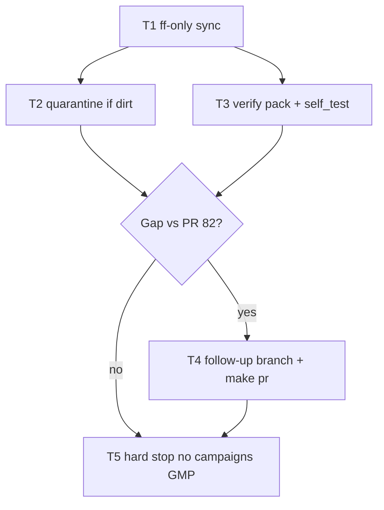

## PLAN: Close dry-run land sequence (already on main)

**PLAN_DOCUMENT:** validated PASS via `python3 skills/l9-plan/scripts/validate_plan_document.py /tmp/plan-dry-run-land.json`
**Depth:** standard (escalate-only router)

### Ground truth (pre-validation already passed)

| Fact | Evidence |
|------|----------|
| HEAD == `origin/main` | `9e89d52` both sides; working tree clean |
| Dry-run landed | commit [`5b9b541`](https://github.com/Quantum-L9/Cursor-Governance/commit/5b9b541) on `main` |
| PR opened + merged | [#82](https://github.com/Quantum-L9/Cursor-Governance/pull/82) `MERGED` |
| Pack healthy | `python3 skills/l9-code-maintenance/scripts/self_test.py` → ALL PASS (5) |
| Quarantine N/A now | no `l9-pr-remediation*` porcelain |

Chosen approach: **verification closeout**, not a second land. Commit/push/open PR only if T3 finds a real gap vs HEAD.

### Objective
Confirm the dry-run land is on `origin/main`, keep unrelated remediation out of any PR set, and stop before campaigns relocate.

**Success:**
- HEAD == `origin/main` (ff-only)
- `self_test.py` ALL PASS
- PR #82 stays MERGED; no duplicate dry-run PR unless gap
- No `coding/campaigns` GMP started

### Scope
**In:** ff-only sync; quarantine `skills/l9-pr-remediation*` if dirt returns; verify dry-run paths (`skills/l9-code-maintenance/**`, [`workflows/migrate_executor.py`](workflows/migrate_executor.py), [`workflows/lint_fix_executor.py`](workflows/lint_fix_executor.py), [`commands/refactor-sweep.md`](commands/refactor-sweep.md), [`skills/AUTONOMY_MANIFEST.yaml`](skills/AUTONOMY_MANIFEST.yaml), [`environment/claude-code/generated/skill-registry.json`](environment/claude-code/generated/skill-registry.json)); gap-only follow-up via [`ops/scripts/open_pr_after_gate.sh`](ops/scripts/open_pr_after_gate.sh) / `make pr`

**Out:** `coding/campaigns` relocate; program→campaign vocab; move root `autonomy/`; PES `$id` renames; hard-reset; unrelated open PRs #76/#77/#79/#81

### TODO Plan
| ID | Task | Risk |
|----|------|------|
| T1 | `git fetch` + `git pull --ff-only` if behind; never hard-reset | low |
| T2 | Stash `l9-pr-remediation*` if porcelain reappears (`quarantine/pr-remediation-out-of-dry-run-set`) | low |
| T3 | Confirm pack on HEAD + `self_test.py` | low |
| T4 | **Gap-only:** branch `feat/l9-code-maintenance-dry-run-followup` → `make pr-check` → commit → `make pr` / open PR; **no-op** when #82 covers HEAD | medium |
| T5 | Hard stop; next skill `l9-ynp` (campaigns GMP later) | low |

Critical path: T1 → T3 → T4 → T5

### Stress / leverage
- Disconfirming: missing from remote? duplicate PR? ff-only blocked? manifest/registry text present outside `5b9b541` file list?
- Rollback: delete mistaken follow-up branch/PR; `stash pop` quarantine; leave `main` at `origin/main`
- Highest leverage: T3 proves land already done → avoid rework

### Doc / root surface
All N/A this turn (verify-only; [`commands/refactor-sweep.md`](commands/refactor-sweep.md) already in #82)

### Final Validation
| ID | Command | Status |
|----|---------|--------|
| V1 | HEAD == `origin/main`, clean/stashed | passed |
| V2 | `self_test.py` | passed |
| V3 | `gh pr view 82` → MERGED | passed |
| V4 | `make pr-check` | N/A unless T4 gap |

### Convergence
**converged** — land sequence complete on main via PR #82.
**next_skill:** `l9-ynp` (campaigns relocate GMP is a later turn).
**GMP handoff may_modify:** only T4 gap paths listed above. **must_not_modify:** `environment/program-execution/`, `autonomy/`, `coding/`, `CANONICAL_LAW.md`, pr-remediation trees.
