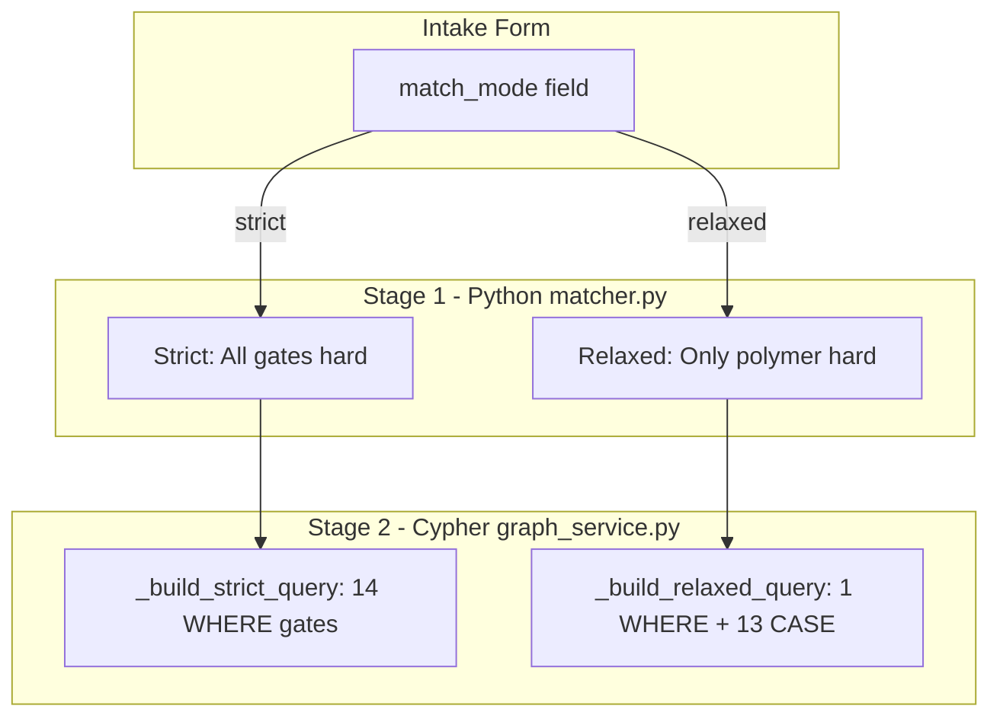

# Dual-Mode Buyer Matching Architecture

## Architecture Overview




## Phase 0: Pre-requisites (Debt Removal)

### 0.1 Remove duplicate MatchResult class

- **File:** [plasticos_buyer_match_engine/models/matcher.py](plasticos_buyer_match_engine/models/matcher.py)
- **Action:** Delete lines 273-294 (duplicate `plasticos.match.result` class)
- **Reason:** Conflicts with canonical model in `plasticos_matching/models/match_result.py`

### 0.2 Add MFI fields to Neo4j sync

- **File:** [plasticos_buyer_match_engine/models/graph_service.py](plasticos_buyer_match_engine/models/graph_service.py)
- **Action:** Add `mfi`, `mfi_min`, `mfi_max` to `_build_material_payloads()` and `sync_material_nodes()` Cypher
- **Source fields:** `plasticos.material.profile.melt_flow_index`, `melt_index_min`, `melt_index_max`

---

## Phase 1: Add Mode Selection to Intake

### 1.1 Add `match_mode` field to intake model

- **File:** [plasticos_intake/models/intake.py](plasticos_intake/models/intake.py)
- **Action:** Add Selection field

```python
match_mode = fields.Selection([
    ('strict', 'Strict (All gates enforced)'),
    ('relaxed', 'Relaxed (Polymer only, wider net)'),
], string='Match Mode', default='strict',
   help='Strict: All 14 gates are hard exclusions. Relaxed: Only polymer is hard, others become scoring signals.')
```

### 1.2 Add field to intake form view

- **File:** Find intake form XML (likely `plasticos_intake/views/intake_views.xml`)
- **Action:** Add `match_mode` field near the "Match to Buyers" button

---

## Phase 2: Revise Stage 1 (Python Matcher)

### 2.1 Update `find_matches_for_supplier()` signature

- **File:** [plasticos_buyer_match_engine/models/matcher.py](plasticos_buyer_match_engine/models/matcher.py)
- **Action:** Add `mode` parameter, default to `'strict'`

```python
def find_matches_for_supplier(self, supplier_partner_id, intake_id=None, max_results=20, mode='strict'):
```

### 2.2 Create mode-aware gate checking

- **File:** [plasticos_buyer_match_engine/models/matcher.py](plasticos_buyer_match_engine/models/matcher.py)
- **Action:** Split `_check_all_gates()` into two methods:


| Method                   | Behavior                                       |
| ------------------------ | ---------------------------------------------- |
| `_check_gates_strict()`  | All gates hard (current behavior)              |
| `_check_gates_relaxed()` | Only polymer hard, return all others as passed |


### 2.3 Collect facility_ids for Stage 2

- **Action:** After gate filtering, collect `facility_ids` from survivors to pass to graph service

```python
# After gate filtering
facility_ids = [b['profile'].id for b in passed_buyers]
```

### 2.4 Update entry point to pass mode

- **File:** [plasticos_buyer_match_engine/models/intake_extension.py](plasticos_buyer_match_engine/models/intake_extension.py)
- **Action:** Pass `record.match_mode` to matcher

```python
matches = matcher.find_matches_for_supplier(
    supplier_partner_id=record.partner_id.id,
    intake_id=record.id,
    max_results=20,
    mode=record.match_mode or 'strict'
)
```

---

## Phase 3: Implement Dual Cypher Queries

### 3.1 Add `_build_strict_query()` method

- **File:** [plasticos_buyer_match_engine/models/graph_service.py](plasticos_buyer_match_engine/models/graph_service.py)
- **All 14 gates as WHERE predicates:**


| Gate               | Property Location                  | Cypher Pattern                 |
| ------------------ | ---------------------------------- | ------------------------------ |
| 1. Polymer         | `m.polymer`                        | `m.polymer = $polymer`         |
| 2. Density         | `m.min_density`, `m.max_density`   | Range check on MaterialProfile |
| 3. MFI Range       | `m.mfi_min`, `m.mfi_max`           | Range check on MaterialProfile |
| 4. MFI-Process     | `f.process_type`                   | CASE on Facility process_type  |
| 5. Contamination   | `m.contamination_tolerance`        | `>= $contamination_pct`        |
| 6. Moisture        | `m.moisture_tolerance`             | `>= $moisture_pct`             |
| 7. Metal Removal   | `f.has_metal_detection`            | Boolean check                  |
| 8. FR Filtering    | `f.has_fr_filtering`               | Boolean check                  |
| 9. Wash Line       | `f.has_wash_line`                  | Boolean check                  |
| 10. Form-Equipment | `f.equipment_types`                | List contains check            |
| 11. PVC Gate       | `m.pvc_tolerance`                  | Boolean/threshold              |
| 12. Filler Gate    | `m.filler_tolerance`               | Boolean/threshold              |
| 13. Lot Size       | `f.min_lot_size`, `f.max_lot_size` | Range check                    |
| 14. Certifications | `f.certifications`                 | All-of check                   |


### 3.2 Add `_build_relaxed_query()` method

- **Only polymer as WHERE predicate**
- **All other gates as CASE statements with multiplicative penalties:**


| Gate           | Penalty on Fail                   |
| -------------- | --------------------------------- |
| Density        | x0.3                              |
| MFI Range      | x0.3                              |
| MFI-Process    | x0.1 (heavy - physics constraint) |
| Contamination  | x0.3                              |
| Moisture       | x0.3                              |
| Metal Removal  | x0.5                              |
| FR Filtering   | x0.5                              |
| Wash Line      | x0.5                              |
| Form-Equipment | x0.3                              |
| PVC/Filler     | x0.3                              |
| Lot Size       | x0.5                              |
| Certifications | x0.5                              |


**Final score:** `100.0 * density_mult * mfi_mult * mfi_process_mult * ... AS total_score`

### 3.3 Add `match_buyers()` orchestrator method

- **File:** [plasticos_buyer_match_engine/models/graph_service.py](plasticos_buyer_match_engine/models/graph_service.py)

```python
def match_buyers(self, intake, facility_ids, mode='strict'):
    """Run Stage 2 matching with mode-appropriate query.
    
    Args:
        intake: plasticos.intake record
        facility_ids: List of facility IDs from Stage 1 survivors
        mode: 'strict' or 'relaxed'
    
    Returns:
        List of match results with scores
    """
    params = self._intake_to_match_params(intake)
    params['facility_ids'] = facility_ids
    
    if mode == 'strict':
        query = self._build_strict_query()
        run_id = 'strict_v1'
    else:
        query = self._build_relaxed_query()
        run_id = 'relaxed_v1'
    
    rows = self._execute_cypher(query, params)
    self._persist_match_results(intake, rows, l9_run_id=run_id)
    return rows
```

---

## Phase 4: Update Partner Type Data

### 4.1 Update existing gate_mode values

- **File:** [plasticos_facility_profile/data/partner_type_data.xml](plasticos_facility_profile/data/partner_type_data.xml)


| Partner Type | Current  | New                  |
| ------------ | -------- | -------------------- |
| broker       | ?        | optimistic           |
| mrf          | ?        | flexible             |
| recycler     | ?        | flexible             |
| processor    | flexible | flexible (unchanged) |


### 4.2 Add new partner types

- **File:** [plasticos_facility_profile/data/partner_type_data.xml](plasticos_facility_profile/data/partner_type_data.xml)


| New Type       | gate_mode |
| -------------- | --------- |
| end_user       | strict    |
| grinder        | flexible  |
| toll_processor | flexible  |
| converter      | strict    |


---

## Out of Scope

- `buyer.capability` model (removed in v2.0)
- `l9_` prefixes (except `l9_run_id` field)
- `is_buyer` filtering in Cypher (handled in Python Stage 1)
- `f.active` filtering in Cypher (handled in Python Stage 1)

---

## Validation Checklist

- Mode field visible on intake form
- Strict mode: Stage 1 filters on all gates, Stage 2 uses WHERE predicates
- Relaxed mode: Stage 1 filters only on polymer, Stage 2 uses CASE penalties
- MFI fields synced to MaterialProfile nodes
- Match results tagged with `l9_run_id` = `strict_v1` or `relaxed_v1`
- No duplicate MatchResult class

