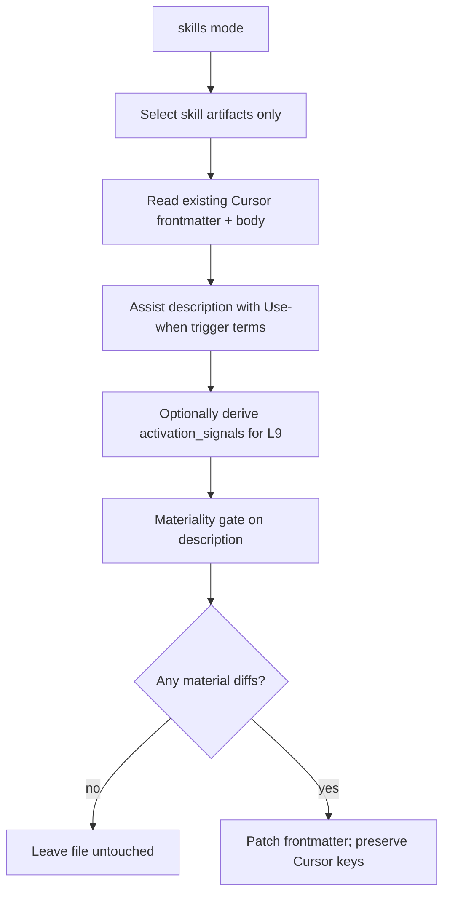

# Edge filetypes, omit rules, SKILL.md protection, and skills mode

## Overview

Three related gaps from the l9-ci-core run and skill-mutation risk:

1. **Unknown edge filetypes** — classify / ignore / header / sidecar optimally.
2. **No real omit mechanism** — inventory only has dirname `--ignore`; pipeline/action cannot protect files like `SKILL.md`.
3. **Skills need a dedicated mode** — existing inventory/pipeline must never mutate `SKILL.md`; a new `skills` mode may improve Cursor-native skill frontmatter only when it materially helps.

## Locked policies

### A. Edge filetype handling (from prior plan)

| Case | Classification | Injection |
|---|---|---|
| `__pycache__/`, `.pyc`/`.pyo`/`.pyd`, `.log` | ignore entirely | none |
| `.gitignore` | `config` | line-comment `#` (already) |
| `CODEOWNERS` | `config` | line-comment `#` |
| `.ql`, `.qls` | `code` | line-comment `#` |
| `LICENSE*` / `NOTICE` / `COPYING` | `documentation` | sidecar |
| `*.sha256` / `.sha1` / `.md5` | `config` | sidecar |

Also fix inventory: write sidecars **only** when `strategy === "sidecar"`, never for `skip-binary`.

### B. Omit / protect (gitignore-like) — missing today, add it

Today:

- Inventory: dirname-only `ignore[]` / `--ignore` ([`src/inventory.ts`](src/inventory.ts), [`scripts/inventory.js`](scripts/inventory.js)).
- Pipeline / retrieval: hardcoded skip of dotdirs, `node_modules`, binaries, generated `*.l9meta.yaml` / `*.inject.log` — **no user omit API**.
- Action: no ignore input.

Add a shared omit layer used by **all mutating modes**:

| Source | Role |
|---|---|
| Built-in defaults | Always on: `**/SKILL.md`, `**/skill.md`, plus noise (`__pycache__/`, `*.pyc`, `*.pyo`, `*.pyd`, `*.log`) |
| Optional `.l9metaignore` at scan root | gitignore-style patterns (one per line, `#` comments, `!` negation) |
| CLI `--omit <pattern>` (repeatable) / `--omit-file <path>` | Extra patterns for one run |
| Inventory keeps `--ignore` dirnames | Backward compatible; also feed into the same matcher as dirname patterns |

Implementation sketch:

- New [`src/omit.ts`](src/omit.ts): load patterns → matcher `shouldOmit(relPath): boolean` (use a small gitignore matcher; prefer adding the `ignore` package as a **direct** dependency rather than relying on transitive eslint copies).
- Wire into inventory `walk` and pipeline [`findFiles`](src/retrieval.ts) (and any action CLI invocation).
- **Mutating paths** respect omit. Dry-run inventory may still *list* omitted files as skipped/omitted in the manifest for observability (`omitted: N` / `skippedPaths`), but must not inject headers or sidecars for them.
- Case-insensitive match for `SKILL.md` / `skill.md` (enforce via lowercasing the basename check in built-ins even if the matcher is case-sensitive).

### C. Hard rule: existing modes never mutate SKILL.md

Applies to **inventory** (when not dry-run), **pipeline**, and the GitHub Action’s `inventory` / `pipeline` modes:

- Basename `SKILL.md` / `skill.md` (any directory) is **omit-protected** by default.
- No frontmatter rewrite, no comment block, no sidecar beside the skill file from these modes.
- Tests must prove: a tree containing `skills/foo/SKILL.md` with existing frontmatter is byte-identical after inventory inject and after pipeline inject.

Agent-skill definitions are operator-authored; L9 inventory headers (`artifact_type: source`, …) and blind pipeline injects corrupt them.

### D. New mode: `skills` (Cursor-native — locked)

Dedicated surface that **is** allowed to touch skill files. Activation for Cursor lives in prose **`description`**, not a `triggers:` key and not primarily in L9 `activation_signals`.

**Selection (skill artifacts only):**

- Basename `SKILL.md` / `skill.md`, or
- Path under `/skills/` / `/skill/` with markdown, or
- `*.skill.*` dot-convention

Non-skills are never mutated in this mode.

**Field authority (locked):**

| Field | Role in skills mode |
|---|---|
| `description` | **Primary.** Cursor discovery string: what the skill does + “Use when …” trigger language (≤1024 chars, third person). Material-improve / add-if-missing. |
| `name` | Preserve if present; never invent a conflicting rename. |
| `activation_signals` | **Optional L9 metadata only.** May be added or lightly filled when missing/empty as a structured twin of trigger phrases derived from the improved description/body. Never invent a Cursor `triggers:` key. Never replace a good Cursor `description` with L9-only stamps. |
| Other L9 identity stamps (`artifact_type`, `mcp_primitive`, inventory headers, …) | **Do not inject** into Cursor `SKILL.md` frontmatter. |
| Hand-authored `triggers` / `anti_triggers` | Leave untouched if present; do not promote as the Cursor contract. |

**Mutation rules (skills mode only):**

| Situation | Behavior |
|---|---|
| `description` missing / empty / too weak (no clear “use when” signal) | Assist from body; write a Cursor-style description (what + when); **add** if good |
| `description` present | Propose improved description; **LLM materiality** vs existing (`buildMaterialityPrompt` / `parseMaterialityReply`); apply only if materially better. No LLM → existing size/heuristic fallback |
| `activation_signals` missing | Optional: derive short phrase list from body/improved description; add only if good and does not require rewriting Cursor keys |
| `activation_signals` present | Keep unless materiality says a proposed list is better; no blind list-union bloat |
| No material diffs | **Do not write the file** (byte/mtime stable) |

**Assist prompt (skills-specific):** rewrite/extend the description assist for this mode to match Cursor skill guidance — third person, ≤1024 chars, include explicit “Use when …” trigger terms — rather than the generic ≤20-word L9 description prompt.

**Reconcile:** reuse description materiality path already in [`reconcile_fields.ts`](src/reconcile_fields.ts); skills mode does **not** need list-materiality as the primary path. Optional `activation_signals` can use add-if-missing + materiality (not unconditional union).

**Surfaces:**

- Library: e.g. `runSkillsPipelineAsync(config)` on root export (update [`docs/public-api-contract.json`](docs/public-api-contract.json)).
- CLI: `scripts/skills-cli.js` + `npm run skills -- <root> […]` (mirrors pipeline-cli; enables `--llm`, omit overrides, `--dry-run`).
- Action: `mode: skills` in [`action.yml`](action.yml) (LLM inputs reused).
- README: `inventory`/`pipeline` protect `SKILL.md`; `skills` is the only mutating skill path; documents Cursor-native `description` focus.

**ADR:** required — new mode + omit contract + protect-by-default + Cursor-native field policy (next sequential ADR under [`docs/decisions/`](docs/decisions/)).

## Implementation order

1. **Shared omit matcher** (`src/omit.ts`) + built-in `SKILL.md` / noise patterns; wire inventory + retrieval; CLI/action flags.
2. **Tests for non-mutation** of `SKILL.md` under inventory + pipeline (byte-identical).
3. **Edge filetype** classify/strategy/sidecar-leak fixes (prior plan items).
4. **Skills mode (Cursor-native):** selection → assist/improve `description` → optional `activation_signals` → write-only-on-diff; CLI + action + public API + ADR.
5. Rebuild `dist/`, `npm run lint`, `npm run validate`, `npm run manifest:update` if authority docs change.

## Key files

- [`src/omit.ts`](src/omit.ts) (new)
- [`src/inventory.ts`](src/inventory.ts), [`src/retrieval.ts`](src/retrieval.ts), [`src/comment.ts`](src/comment.ts)
- [`src/reconcile_fields.ts`](src/reconcile_fields.ts), [`src/assist.ts`](src/assist.ts), new `src/skills_pipeline.ts` (preferred over overloading pipeline)
- [`scripts/inventory.js`](scripts/inventory.js), [`scripts/pipeline-cli.js`](scripts/pipeline-cli.js), new `scripts/skills-cli.js`
- [`action.yml`](action.yml), [`README.md`](README.md), [`docs/public-api-contract.json`](docs/public-api-contract.json), new ADR under [`docs/decisions/`](docs/decisions/)
- Tests: omit, SKILL.md protect, edge filetypes, skills-mode material `description` improve (+ optional `activation_signals`)

## Out of scope

- Inventing a Cursor `triggers:` frontmatter key (not part of Cursor’s SKILL.md contract).
- Making `activation_signals` the primary discovery field for skills mode.
- Parsing consumer `.gitignore` as the omit source (use `.l9metaignore` / `--omit` instead).
- Moving/renaming skill files (placement remains advisory).
- Re-running against `/Users/ib-mac/l9-ci-core` (manual follow-up).
