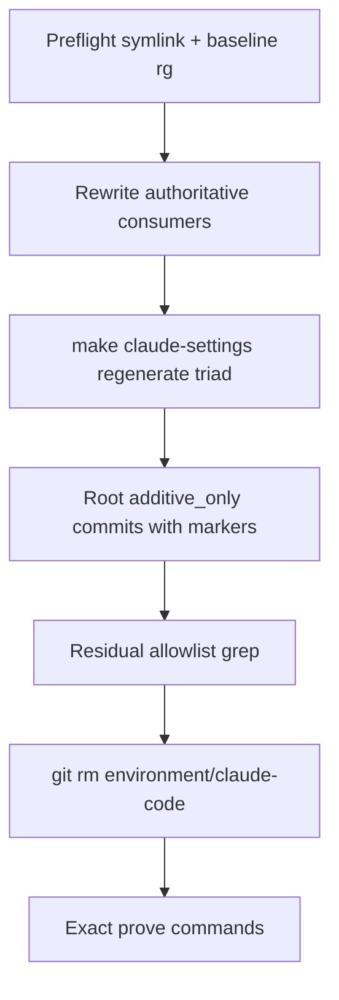

# Extinguish `environment/claude-code` symlink

## Intent (preserved)

Remove the transitional alias so the Claude Code pack has **one** filesystem home: [`environment/agents/adapters/claude-code/`](environment/agents/adapters/claude-code/). Live wiring already points settings hooks there; remaining work is string/Path-join rewiring + symlink delete.

## Invariants (MUST / MUST NOT)

| Rule | Binding |
|---|---|
| Canonical pack path | `environment/agents/adapters/claude-code/` |
| Symlink delete order | MUST rewrite live consumers **before** `git rm environment/claude-code` |
| No second tree | MUST NOT copy the pack back to `environment/claude-code/` |
| No PE collision | MUST NOT edit [`environment/program-execution/adapters/claude-code/`](environment/program-execution/adapters/claude-code/) |
| Ownership guard | MUST keep both old and new hook-path forbid markers in [`validate_skill_activation.py`](environment/agents/adapters/claude-code/validate_skill_activation.py) `check_ownership_guard` |
| Generated triad | [`.claude/settings.json`](.claude/settings.json) + [`.claude/hooks/*`](.claude/hooks/) are **derived** via [`reconcile_claude_settings.py`](ops/scripts/reconcile_claude_settings.py); edit pack source + `TEMPLATE_REL`/`HOOKS_SRC_REL`, then regenerate — MUST NOT hand-maintain divergent copies |
| Historical reports | MUST NOT rewrite [`reports/**`](reports/) for this change |
| Validation honesty | MUST NOT weaken validators, skip root-file markers, or delete the symlink while residual **live** consumers remain |



## Canonical path forms

Use these replacements uniformly:

- String: `environment/claude-code` → `environment/agents/adapters/claude-code`
- Path join: `Path("environment") / "claude-code"` → `Path("environment") / "agents" / "adapters" / "claude-code"`
- Env-style: `$GOV/environment/claude-code` → `$GOV/environment/agents/adapters/claude-code`

---

## Phase 0 — Preflight

1. Confirm `environment/claude-code` is still git mode `120000` → `agents/adapters/claude-code`.
2. Record `git rev-parse HEAD`.
3. Baseline inventory (both forms):

```bash
rg -n 'environment/claude-code' --glob '!reports/**' --glob '!**/.git/**'
rg -n '["'\'']environment["'\''].*/.*["'\'']claude-code["'\'']|"environment"\s*/\s*"claude-code"' \
  --glob '!reports/**' --glob '!**/.git/**'
```

Stop if the symlink is already gone or points elsewhere (re-plan).

---

## Phase 1 — Authoritative consumers (delete blockers)

Rewrite these **sources** (not generated triad copies):

### Gates / Makefile / CI

| File | MUST change |
|---|---|
| [`Makefile`](Makefile) | `claude-skills-check`, `claude-skills-test`, `claude-env`, `autonomy-validate` recipes + comment ~227 |
| [`.pre-commit-config.yaml`](.pre-commit-config.yaml) | `sync-generated-artifacts` `files:` glob → `environment/agents/adapters/claude-code/` |
| [`ops/scripts/reconcile_claude_settings.py`](ops/scripts/reconcile_claude_settings.py) | `TEMPLATE_REL`, `HOOKS_SRC_REL` (lines 23–24 today) |
| [`ops/scripts/sync_generated_artifacts.py`](ops/scripts/sync_generated_artifacts.py) | docstring, string list, Path joins (~205, ~447), activation path |
| [`ops/scripts/run_pr_gate.sh`](ops/scripts/run_pr_gate.sh) | exists-check, changed-file regex, validator path |
| [`ops/scripts/validate_legacy_doctrine_residue.py`](ops/scripts/validate_legacy_doctrine_residue.py) | `ACTIVE_ROOTS` entry → adapters path |
| [`conftest.py`](conftest.py) | Remove `environment/claude-code/autonomy` ignore; keep adapters autonomy ignore |
| [`ops/autonomy/acceptance_dry_run.py`](ops/autonomy/acceptance_dry_run.py) | Path join to hooks |
| [`ops/autonomy/merge_gate.py`](ops/autonomy/merge_gate.py), [`local_execution_gate.py`](ops/autonomy/local_execution_gate.py) | Docstring pointers |

### Pack (authoritative Claude adapter)

| File | MUST change |
|---|---|
| [`hooks/session_start_claude_governance.sh`](environment/agents/adapters/claude-code/hooks/session_start_claude_governance.sh) | Bootstrap + skill-registry paths → adapters; remove “legacy environment/claude-code/generated…” branch (dead after delete) |
| [`web/setup.sh`](environment/agents/adapters/claude-code/web/setup.sh) | `CC_ENV` |
| [`web/setup.bootstrap.sh`](environment/agents/adapters/claude-code/web/setup.bootstrap.sh) | Adapters path only; delete old-path fallback |
| [`hooks/memory_prefetch.py`](environment/agents/adapters/claude-code/hooks/memory_prefetch.py), [`hooks/memory_gate.py`](environment/agents/adapters/claude-code/hooks/memory_gate.py) | Operator help command strings |
| Pack READMEs / `SESSION_START_SPEC.md` / `adapters/claude-code.md` | Live path prose |

### Skills / living agent docs / peers

| File | MUST change |
|---|---|
| [`skills/l9-bounded-autonomy/`](skills/l9-bounded-autonomy/) SKILL + references | CLI / bridge / doctrine-map paths |
| [`skills/l9-code-maintenance/scripts/refactor_sweep.py`](skills/l9-code-maintenance/scripts/refactor_sweep.py) | `PROTECTED_PREFIXES` |
| [`skills/l9-code-maintenance/references/protected-paths.md`](skills/l9-code-maintenance/references/protected-paths.md) | autonomy path |
| [`rules/88-bounded-session-autonomy.mdc`](rules/88-bounded-session-autonomy.mdc) | autonomy home |
| [`environment/agents/docs/DEPLOY.md`](environment/agents/docs/DEPLOY.md), peer adapter READMEs still saying pack “stays at environment/claude-code” | Live placement |
| [`environment/agents/tools/validate_executable_peers.py`](environment/agents/tools/validate_executable_peers.py) | Drop transitional symlink Path from E14; keep adapters Path |

### Fixture tests

MUST retarget Path fixtures:

- [`tests/ops/autonomy/test_surface_profile.py`](tests/ops/autonomy/test_surface_profile.py)
- [`tests/ops/scripts/test_reconcile_claude_settings.py`](tests/ops/scripts/test_reconcile_claude_settings.py)
- [`tests/ops/scripts/test_sync_generated_artifacts.py`](tests/ops/scripts/test_sync_generated_artifacts.py)

### Keepers (MUST NOT “clean up”)

| Location | Why residual old string is required |
|---|---|
| `validate_skill_activation.py` forbid list | Detects Cursor loading Claude hooks at **either** historical or current path |
| `ops/skill_routing/__init__.py` + CANONICAL_LAW anti-pattern rows | Forbid examples naming the old placement; append adapters-path forbid for shared-brain ownership if missing |
| `reports/**` | Historical evidence |
| ADR bodies (0001–0006) | Historical decision text; only ADR-0007 extinguishment sentence updates |

### Already correct (skip)

- Pack [`settings.template.json`](environment/agents/adapters/claude-code/settings.template.json) hook commands
- [`memory-enforcement.contract.json`](environment/agents/adapters/claude-code/memory/memory-enforcement.contract.json)
- Suite paths in [`ops/config/python-contract.json`](ops/config/python-contract.json) (rationale comment MAY lag)

### Arbitrary test strings (not FS lookups)

[`tests/test_memory_enforcement.py`](environment/agents/adapters/claude-code/tests/test_memory_enforcement.py) uses `file_path: "environment/claude-code/x.py"` as a gated path token. Leave as-is (counts as residual forbid-style / synthetic path) **or** change to adapters path for greppability — either is PASS; prefer adapters path only if it does not change assertion meaning.

---

## Phase 2 — Regenerate Claude triad

After Phase 1 updates `TEMPLATE_REL` / `HOOKS_SRC_REL` and pack hooks:

```bash
make claude-settings WS="$(pwd)"
make claude-settings-check WS="$(pwd)"
```

Acceptance: committed `.claude/hooks/session_start_claude_governance.sh` contains **zero** `$GOV/environment/claude-code` live bootstrap paths (only residual forbid text if any). Do not hand-patch `.claude/` instead of regenerating.

---

## Phase 3 — Additive-only root files

From [`ops/config/root-file-protection.json`](ops/config/root-file-protection.json), these rewrites FAIL CI without markers:

```
ALLOW-ROOT-DELETION: Makefile — extinguish environment/claude-code symlink; recipes retargeted to agents/adapters/claude-code
ALLOW-ROOT-DELETION: .pre-commit-config.yaml — sync-generated-artifacts files glob retargeted to agents/adapters/claude-code
ALLOW-ROOT-DELETION: conftest.py — remove dead symlink autonomy collect_ignore
ALLOW-ROOT-DELETION: CANONICAL_LAW.md — live SSOT location cells retargeted to agents/adapters/claude-code; anti-pattern forbid rows preserved/appended
```

Doctrine policy (locked):

- [`CANONICAL_LAW.md`](CANONICAL_LAW.md): rewrite **live SSOT location** cells (~50, ~102) with marker; keep/append anti-pattern forbid text.
- [`AGENTS.md`](AGENTS.md): **append** extinguishment confirmation (placement append already exists); rewrite only if a live SOP bullet still teaches `environment/claude-code/autonomy/` as the runtime home — then include `ALLOW-ROOT-DELETION: AGENTS.md — …`.
- [`ORG_INVARIANTS.yaml`](ORG_INVARIANTS.yaml): no FS-path change required.

---

## Phase 4 — Residual allowlist gate, then delete

### Allowed residual hits (exhaustive)

A remaining `environment/claude-code` match is PASS only if it is one of:

1. Forbid/anti-pattern marker (ownership guard, skill_routing doctrine, CANONICAL_LAW anti-pattern table)
2. Historical ADR body (not live install instructions) or `reports/**`
3. [`WIP/claude code environment/SYMLINK_EXTINGUISHMENT.md`](WIP/claude%20code%20environment/SYMLINK_EXTINGUISHMENT.md) until closed in this phase
4. Synthetic test tokens that are not filesystem open paths (memory enforcement fixtures), if left unchanged

Any other hit (Makefile, reconcile, sync, sessionStart bootstrap, web setup, skills CLI, living README/DEPLOY, pre-commit glob, ACTIVE_ROOTS, fixture Path trees) is FAIL — fix before delete.

### Grep gate (MUST PASS before `git rm`)

```bash
# Live consumers must be empty outside allowlist files.
rg -n 'environment/claude-code' \
  --glob '!reports/**' \
  --glob '!docs/decisions/ADR-0001*' \
  --glob '!docs/decisions/ADR-0002*' \
  --glob '!docs/decisions/ADR-0003*' \
  --glob '!docs/decisions/ADR-0004*' \
  --glob '!docs/decisions/ADR-0006*' \
  --glob '!**/validate_skill_activation.py' \
  --glob '!ops/skill_routing/__init__.py' \
  --glob '!CANONICAL_LAW.md' \
  --glob '!WIP/claude code environment/SYMLINK_EXTINGUISHMENT.md' \
  --glob '!**/.git/**'

rg -n '"environment"\s*/\s*"claude-code"' \
  --glob '!reports/**' --glob '!**/.git/**'
```

Second command MUST return empty (all Path joins retargeted).

### Delete + close notes

1. `git rm environment/claude-code`
2. Rewrite [`WIP/claude code environment/SYMLINK_EXTINGUISHMENT.md`](WIP/claude%20code%20environment/SYMLINK_EXTINGUISHMENT.md) to past tense (“extinguished &lt;date&gt;; pack sole home is adapters/claude-code”) or delete the note.
3. Update [`ADAPTER_CONTRACT.md`](environment/agents/adapters/ADAPTER_CONTRACT.md) and [`docs/decisions/ADR-0007-cloud-graphiti-https-reachability.md`](docs/decisions/ADR-0007-cloud-graphiti-https-reachability.md) extinguishment sentences to past tense.

---

## Phase 5 — Prove (exact commands)

```bash
test ! -e environment/claude-code
test -d environment/agents/adapters/claude-code
make claude-settings-check WS="$(pwd)"
make claude-env
make claude-skills-check
make claude-skills-test
make autonomy-validate
python3 -m pytest \
  tests/ops/scripts/test_reconcile_claude_settings.py \
  tests/ops/scripts/test_sync_generated_artifacts.py \
  tests/ops/autonomy/test_surface_profile.py -q
make pr-check
```

| Check | PASS means |
|---|---|
| Symlink gone | `test ! -e environment/claude-code` |
| Pack present | directory exists at adapters path |
| Reconcile | `claude-settings-check` exit 0 against adapters `TEMPLATE_REL` |
| Env / skills / autonomy | Makefile targets resolve adapters scripts |
| Fixture tests | exit 0 |
| PR gate | `make pr-check` exit 0 including root-file-protection with markers |

### Failure modes (fail closed)

| Failure | Action |
|---|---|
| Symlink deleted while Makefile still points old path | Restore symlink from git; finish Phase 1; retry |
| Root-file-protection FAIL | Add missing `ALLOW-ROOT-DELETION` lines; do not bypass gate |
| Ownership guard FAIL | Restore forbid markers; do not delete them to silence grep |
| `claude-settings-check` drift | Regenerate via `make claude-settings`; do not hand-edit triad only |
| Path-join grep still hits | Fix `Path("environment") / "claude-code"` leftovers |

---

## Commit / PR posture

- Feature branch; L4 local commits until Recursive Alignment + Validate & Repair, then `l4_local.py begin` → `record-kernels` → `authorize-release` → `make pr`.
- Commits that rewrite additive_only root files MUST include the `ALLOW-ROOT-DELETION` lines above.
- Launching Build / `/autonomy` on this plan is merge authorization for this stack after green + mergeable (bottom-up older PRs first).
- MUST NOT force-push, admin-merge, or weaken tests for green.

## Non-goals (unchanged)

- No pack duplication
- No `reports/**` rewrite
- No PE adapter edits
- No shared-brain move into/out of the Claude adapter (ownership law unchanged)
