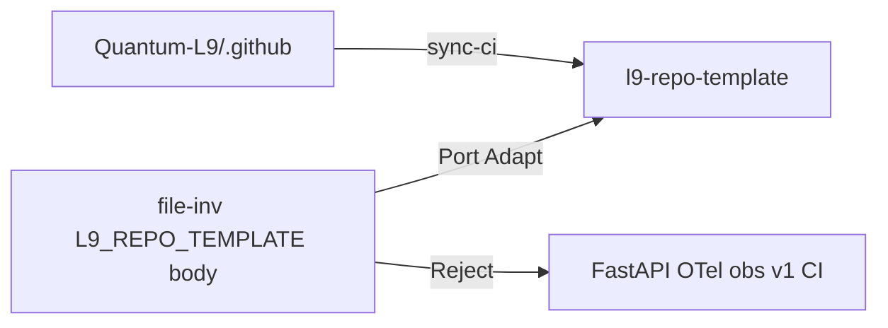

## PLAN: Port DX from constellation-file-inventory → l9-repo-template

**PLAN_DOCUMENT:** validated PASS (`/tmp/l9-plan-file-inv-port.json`, `validate_plan_document.py` semantic OK). Convergence: **partial** (U1/U2 bounded).

### Finding (ground truth)

[cryptoxdog/constellation-file-inventory](https://github.com/cryptoxdog/constellation-file-inventory) is **not** a Gate/TransportPacket file-inventory worker despite description/topics. Tree + `MANIFEST.md` identify it as **`L9_REPO_TEMPLATE` body**: FastAPI `src/l9_service`, OTel Fix-B, obs docker stack, parametric Cursor rules, hatchling+pyright, private CI (`ci.yml` / `pr-pipeline.yml`).

Destination (locked): [Quantum-L9/l9-repo-template](https://github.com/Quantum-L9/l9-repo-template) — keep thin museum + org `sync-ci`.

### Candidate matrix

| Candidate | Verdict | Rationale |
|-----------|---------|-----------|
| `scripts/render_cursor_rules.py` + `.cursor/rules/templates/*` + `plugin-config.yaml` | **Port (adapt)** | Highest leverage; drift gate (`--check`); strip FastAPI cartridge |
| Makefile `help` / `setup` / `render-rules` / `check-rules` | **Port (adapt)** | Wire onto existing `verify` / `sync-ci` / `rename` — do not replace |
| AGENTS validation ladder + protected paths | **Port (adapt)** | Museum commands (`make verify`, sync-ci), not pyright/obs |
| `.vscode/*` | **Port (adapt)** | Ruff-first; typecheck stays mypy |
| `.devcontainer/devcontainer.json` | **Port (thin)** | Python 3.12 + uv + pre-commit; no obs/FastAPI ports |
| pre-commit `check-toml` / `detect-private-key` | **Port** | Keep mypy hook; no pyright |
| `docs/PARAMETRIC_CURSOR_RULES.md` | **Port** | Usage for render/check |
| `MANIFEST.md` checksum table | **Reject (consolidate)** | Extend [TEMPLATE_INVENTORY.md](TEMPLATE_INVENTORY.md) Source column |
| Justfile | **Reject this pass** | Makefile covers targets |
| FastAPI `src/l9_service` + OTel Fix-B + tests | **Reject** | Recreates golden kitchen-sink; museum is thin pkg |
| `observability/` compose stack | **Reject** | Museum deny-class fat DX |
| `ci.yml` / `pr-pipeline.yml` / gitleaks / dependency-review / auto-merge | **Reject** | Org pack + `make sync-ci` only |
| ISSUE/PR templates | **Reject** | Org inherit |
| hatchling / pyright / cov-fail 70 | **Reject** | Museum: setuptools + mypy + org lint-test `COVERAGE_THRESHOLD=0` |
| `fastapi.mdc.template` | **Reject default** | Optional later service profile, not museum |

### Objective / success

Cherry-pick thin DX into museum without FastAPI/OTel or v1 CI.

**Success:** `make verify` PASS; `make check-rules` PASS; no `observability/` / FastAPI / `pr-pipeline.yml`; `sync-ci` still owns `.github` from org pin.

### Scope

**In:** renderer + thin templates; Makefile wiring; vscode/devcontainer; AGENTS; pre-commit; inventory/docs; file-inv honesty banner.

**Out:** FastAPI/OTel/obs; pyright/hatchling; v1 CI; org health forks; Gate_SDK; second fat service template; Justfile; archive of file-inv unless asked (U1).

### Todos (critical path T1→T2→T7→T4→T6)

1. **T1** — Port/adapt `render_cursor_rules.py`, museum `plugin-config.yaml`, templates (global/domain/agents only), docs.
2. **T2** — Makefile: `help`, `setup`, `render-rules`, `check-rules`; keep `verify`/`sync-ci`/`rename`.
3. **T3** — Thin `.vscode` + `.devcontainer`.
4. **T4** — AGENTS ladder for museum gates.
5. **T5** — pre-commit additions (toml/private-key).
6. **T6** — TEMPLATE_INVENTORY / README / ARCHITECTURE Source + Reject list.
7. **T7** — `tests/test_render_cursor_rules.py`.
8. **T8** — Honesty banner on file-inv README → museum as thin SSOT.

### Stress / leverage

- Disconfirm: FastAPI port = golden redux; dual CI vs org pack; worker description ≠ missing code to build here.
- Assume false: museum must ship HTTP; pyright mandatory; tree has Gate worker logic.
- Leverage order: **T1 > T2 > T4**; delete MANIFEST duplication, Justfile, fastapi template default.
- Rollback: revert museum DX commits; sync-ci/org pack untouched.

### Doc impact

Update museum README, AGENTS, ARCHITECTURE, TEMPLATE_INVENTORY. N/A: LICENSE, CONTRIBUTING/SECURITY (inherit).

### Final validation

`make verify` · `make check-rules` · no FastAPI/obs · `make sync-ci` · `make pr-check` N/A on museum (use verify + Actions).

### Handoff

Next skill: `l9-gmp-protocol`. May modify museum DX surfaces + file-inv README banner only. Must not modify org `.github` SSOT, Gate_SDK contracts, or import FastAPI/OTel as museum defaults.
