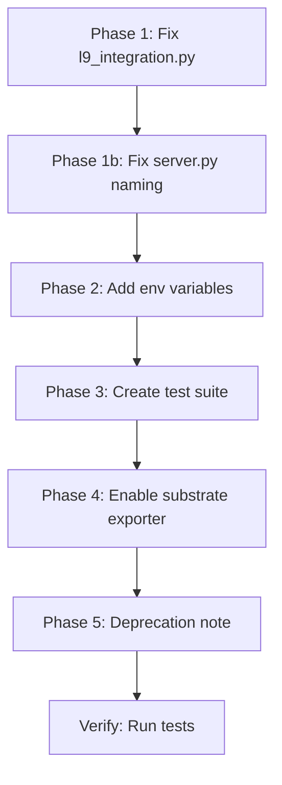

# GMP-OBS-ACTIVATION: Five-Tier Observability Complete Activation

## Current State Analysis

The Five-Tier Observability Pack was deployed to `core/observability/` with 10 files and 2092 lines. The module is wired into `api/server.py` lifespan, but **critical integration mismatches** prevent actual instrumentation from working.

## Identified Gaps

### Gap 1: Method Name Mismatches in `l9_integration.py`

| Service | Expected Method | Actual Method | Status |

|---------|-----------------|---------------|--------|

| `MemorySubstrateService` | `write(key, ...)` | `write_packet(packet_in, ...)` | MISMATCH |

| `MemorySubstrateService` | `read(key, ...)` | `semantic_search(request)` / `query_packets(...)` | MISMATCH |

| `GovernanceEngineService` | `check_policy(policy_name, ...)` | `evaluate(request: EvaluationRequest)` | MISMATCH |

| `ExecutorToolRegistry` | `execute(tool_name, ...)` | `dispatch_tool_call(tool_id, args, ctx)` | MISMATCH |

| `AgentExecutorService` | `step(...)` | N/A (no step method exists) | MISMATCH |

### Gap 2: app.state Naming Bug in `server.py`

Line 1258 looks for `app.state.executor_service` but executor is stored as `app.state.agent_executor` (line 606).

### Gap 3: No Tests for `core/observability/`

The `tests/core/observability/` directory does not exist. Need comprehensive test coverage.

### Gap 4: No OBS_ Environment Variables in `.env.example`

No documentation of `OBS_*` variables for users/operators.

### Gap 5: Only Console Exporter Active

Default config uses only `["console"]`. Substrate exporter should be enabled when substrate is available.

### Gap 6: Relationship to Existing `phase_2_observability.py`

The existing `l9/upgrades/packet_envelope/phase_2_observability.py` (OpenTelemetry-based) is separate and not wired. Decision needed on consolidation vs coexistence.---

## Implementation Plan

### Phase 1: Fix Integration Layer (HIGH PRIORITY)

**Files:**

- [`core/observability/l9_integration.py`](core/observability/l9_integration.py)
- [`api/server.py`](api/server.py)

**Changes:**

1. **Fix `instrument_agent_executor()`**:

- Replace `executor_service.step` with `executor_service._execute_step` (or remove if no such method exists)
- The `start_agent_task` method exists and is correct

2. **Fix `instrument_tool_registry()`**:

- Replace `tool_registry.execute` with `tool_registry.dispatch_tool_call`
- Update function signature to match `dispatch_tool_call(tool_id, arguments, context)`

3. **Fix `instrument_governance_engine()`**:

- Replace `governance_engine.check_policy` with `governance_engine.evaluate`
- Update to accept `EvaluationRequest` and return `EvaluationResult`

4. **Fix `instrument_memory_substrate()`**:

- Replace `substrate_service.write` with `substrate_service.write_packet`
- Replace `substrate_service.read` with `substrate_service.semantic_search` or remove (or use `get_packet`)

5. **Fix `server.py` naming**:

- Change `app.state.executor_service` to `app.state.agent_executor` (line 1258)

### Phase 2: Add Environment Variables

**Files:**

- `.env.example` (or create `docs/ENV_VARIABLES.md`)

**Add:**

```javascript
# Observability Configuration
OBS_ENABLED=true
OBS_SAMPLING_RATE=0.10
OBS_ERROR_SAMPLING_RATE=1.0
OBS_EXPORTERS=console,substrate
OBS_BATCH_SIZE=100
OBS_BATCH_TIMEOUT_SEC=10
OBS_LOG_LEVEL=INFO
OBS_SUBSTRATE_ENABLED=true
OBS_CONTEXT_STRATEGY_DEFAULT=recency_biased_window
OBS_CONTEXT_MAX_TOKENS=8000
OBS_ENABLE_CIRCUIT_BREAKER=true
OBS_ENABLE_BACKOFF_RETRY=true
```


### Phase 3: Create Test Suite

**New File:**

- `tests/core/observability/test_observability_integration.py`

**Test Cases:**

1. `test_initialize_observability_creates_service`
2. `test_trace_span_decorator_creates_span`
3. `test_trace_llm_call_records_metrics`
4. `test_trace_tool_call_captures_execution`
5. `test_failure_detector_identifies_failures`
6. `test_recovery_executor_triggers_actions`
7. `test_console_exporter_outputs_spans`
8. `test_substrate_exporter_writes_packets`
9. `test_metrics_aggregator_computes_sre_metrics`
10. `test_context_strategy_selection`

### Phase 4: Enable Substrate Exporter

**Files:**

- [`core/observability/config.py`](core/observability/config.py)

**Change:**

- Default `exporters` from `["console"]` to `["console", "substrate"]` when `OBS_SUBSTRATE_ENABLED=true`

### Phase 5: Deprecation Path for `phase_2_observability.py`

**Decision:** The existing `l9/upgrades/packet_envelope/phase_2_observability.py` uses OpenTelemetry/Jaeger which is **complementary** to the new module.**Recommendation:**

- Keep `phase_2_observability.py` for now (OpenTelemetry integration for external APM)
- Add a note in the docstring that `core/observability/` is the primary L9-native observability
- Future consolidation: Port OpenTelemetry export to `core/observability/exporters.py` as `OTLPExporter`

---

## Execution Order



---

## Validation Gates

1. `python -m py_compile core/observability/l9_integration.py` - PASS
2. `python -m py_compile api/server.py` - PASS
3. `pytest tests/core/observability/ -v` - ALL PASS
4. Manual: Start server, verify observability logs show instrumentation
5. Manual: Verify spans appear in console output during API calls

---

## Risk Assessment

| Risk | Likelihood | Impact | Mitigation |

|------|------------|--------|------------|

| Breaking existing functionality | LOW | HIGH | Feature flag `L9_OBSERVABILITY` allows disable |

| Performance overhead | LOW | MEDIUM | Sampling rate default 10%, configurable |

| Test failures | MEDIUM | LOW | Isolated test module |---

## Definition of Done

- [ ] All 4 `instrument_*` functions correctly wrap actual L9 service methods
- [ ] `server.py` uses correct `app.state.agent_executor` naming
- [ ] `.env.example` contains all `OBS_*` variables with documentation
- [ ] `tests/core/observability/test_observability_integration.py` exists with 10+ tests
- [ ] Substrate exporter enabled by default when substrate available
- [ ] Server starts without errors with `L9_OBSERVABILITY=true`