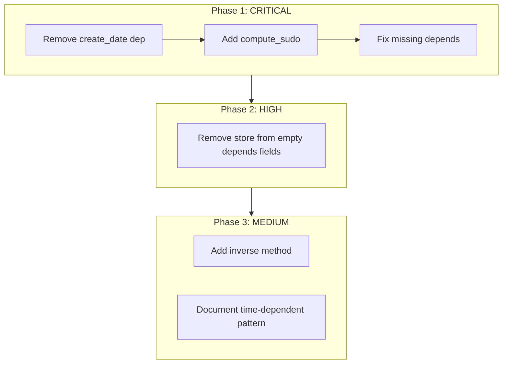

# Fix Computed Field Issues in PlasticOS

## Problem Summary

The audit identified 21 computed field issues across 8 modules:
- **6 CRITICAL**: Breaks on recompute, access errors, performance traps
- **8 HIGH**: Silent bugs, missing recompute triggers
- **7 MEDIUM**: Best practice violations

## Fix Strategy by Category

### Phase 1: CRITICAL Fixes (Must Fix First)

#### 1.1 Remove `create_date` Dependency (Performance Trap)

**File:** [`plasticos_transaction/models/transaction.py`](plasticos_transaction/models/transaction.py)

**Problem:** `@api.depends("create_date")` on `_compute_compliance` triggers on every write.

**Fix:** Remove `create_date` from depends. The compliance check is document-based, so it should depend on document changes (already handled by bridge module).

```python
# Line 693 - Change from:
@api.depends("create_date")
def _compute_compliance(self):

# To:
@api.depends()  # Triggered by bridge module's document_ids depends
def _compute_compliance(self):
```

#### 1.2 Add `compute_sudo=True` for Restricted Model Access

**Files to modify:**

| File | Field(s) | Accesses |
|------|----------|----------|
| [`plasticos_transaction/models/transaction.py`](plasticos_transaction/models/transaction.py) | `revenue_total`, `purchase_cost_total`, `freight_cost_total`, `cost_total`, `gross_margin` | `account.move` |
| [`plasticos_transaction/models/transaction.py`](plasticos_transaction/models/transaction.py) | `commission_amount` | `plasticos.commission.service` |
| [`plasticos_documents/models/transaction_docs.py`](plasticos_documents/models/transaction_docs.py) | `missing_supplier_docs`, `missing_carrier_docs`, `missing_buyer_docs` | `plasticos.compliance.service` |

**Fix Pattern:**
```python
# Add compute_sudo=True to field definitions
revenue_total = fields.Float(
    compute="_compute_financials",
    store=True,
    compute_sudo=True,  # ADD THIS
)
```

#### 1.3 Fix Missing Dependencies in `@api.depends`

**File:** [`plasticos_crm_bridge/models/material_profile.py`](plasticos_crm_bridge/models/material_profile.py)

**Problem:** `_compute_match_stats` and `_compute_tx_stats` search related models but don't depend on them.

**Fix Strategy:** These are "rollup" fields that aggregate data from other models. Two options:

**Option A (Recommended):** Remove `store=True` - compute on-the-fly
```python
match_count = fields.Integer(
    compute="_compute_match_stats",
    # Remove store=True - compute on read
)
```

**Option B:** Add One2many fields and proper depends (more complex)
```python
# Would require adding reverse One2many fields from intake/match_result
# Not recommended due to complexity
```

**File:** [`plasticos_crm_bridge/models/crm_lead.py`](plasticos_crm_bridge/models/crm_lead.py)

**Same fix:** Remove `store=True` from `_compute_profile_summary` fields since they aggregate from profiles.

---

### Phase 2: HIGH Fixes (Empty @api.depends)

#### 2.1 Pattern: Convert Empty Depends to Non-Stored

For fields that search other models and have no valid depends, convert to non-stored computed fields:

| File | Field | Current | Fix |
|------|-------|---------|-----|
| [`plasticos_material_profile/models/material_profile.py`](plasticos_material_profile/models/material_profile.py) | `po_line_count`, `so_line_count` | `store=True, @api.depends()` | Remove `store=True` |
| [`plasticos_material_profile/models/res_partner.py`](plasticos_material_profile/models/res_partner.py) | `material_profile_count` | `store=True, @api.depends()` | Remove `store=True` |
| [`plasticos_intake/models/material_profile_intake.py`](plasticos_intake/models/material_profile_intake.py) | `intake_count` | `store=True, @api.depends()` | Remove `store=True` |
| [`plasticos_intake/models/res_partner_intake.py`](plasticos_intake/models/res_partner_intake.py) | `intake_count` | `store=True, @api.depends()` | Remove `store=True` |
| [`plasticos_logistics/models/load.py`](plasticos_logistics/models/load.py) | `transaction_id` | `store=False, @api.depends()` | Already non-stored, OK |

**Fix Pattern:**
```python
# Change from:
po_line_count = fields.Integer(
    compute="_compute_po_line_count",
    store=True,  # REMOVE THIS
)

@api.depends()  # Empty depends = never recomputes when stored
def _compute_po_line_count(self):
    ...

# To:
po_line_count = fields.Integer(
    compute="_compute_po_line_count",
    # No store=True - computed on read
)

def _compute_po_line_count(self):  # No @api.depends needed for non-stored
    ...
```

#### 2.2 Special Case: Base Fallback Method

**File:** [`plasticos_transaction/models/transaction.py`](plasticos_transaction/models/transaction.py)

The `_compute_chargebacks_penalties` base method with empty `@api.depends()` is intentional - it's a fallback when `plasticos_claims` is not installed. The override in [`plasticos_claims/models/transaction_claims.py`](plasticos_claims/models/transaction_claims.py) has proper depends. **No fix needed.**

---

### Phase 3: MEDIUM Fixes (Best Practices)

#### 3.1 Add Inverse Method for Editable Stored Computed Field

**File:** [`plasticos_transaction/models/transaction.py`](plasticos_transaction/models/transaction.py)

**Problem:** `tare_per_unit` has `store=True, readonly=False` but no `inverse=`.

**Fix:**
```python
tare_per_unit = fields.Float(
    compute="_compute_tare_per_unit",
    inverse="_inverse_tare_per_unit",  # ADD THIS
    store=True,
    readonly=False,
)

def _inverse_tare_per_unit(self):
    """Allow manual override of tare_per_unit."""
    pass  # No-op - just allows the value to be saved
```

#### 3.2 Time-Dependent Fields (Document Only)

**Files:** `plasticos_claims/models/claim.py`, `plasticos_offer/models/offer.py`

These fields (`days_open`, `is_overdue`, `days_until_expiry`) depend on current time. The cron jobs already handle recomputation. **Document this pattern, no code fix needed.**

---

## Implementation Order



## Files to Modify

1. [`plasticos_transaction/models/transaction.py`](plasticos_transaction/models/transaction.py) - 4 changes
2. [`plasticos_documents/models/transaction_docs.py`](plasticos_documents/models/transaction_docs.py) - 1 change
3. [`plasticos_crm_bridge/models/material_profile.py`](plasticos_crm_bridge/models/material_profile.py) - 2 changes
4. [`plasticos_crm_bridge/models/crm_lead.py`](plasticos_crm_bridge/models/crm_lead.py) - 1 change
5. [`plasticos_material_profile/models/material_profile.py`](plasticos_material_profile/models/material_profile.py) - 1 change
6. [`plasticos_material_profile/models/res_partner.py`](plasticos_material_profile/models/res_partner.py) - 1 change
7. [`plasticos_intake/models/material_profile_intake.py`](plasticos_intake/models/material_profile_intake.py) - 1 change
8. [`plasticos_intake/models/res_partner_intake.py`](plasticos_intake/models/res_partner_intake.py) - 1 change

## Testing Strategy

After each phase:
1. Run existing unit tests: `pytest tests/`
2. Verify computed fields recompute correctly in Odoo shell
3. Test as non-admin user to verify `compute_sudo` fixes work

## Risk Assessment

- **Low Risk:** Removing `store=True` from count fields - only affects performance (computed on read instead of stored)
- **Medium Risk:** Adding `compute_sudo=True` - verify no security implications
- **Low Risk:** Removing `create_date` dependency - compliance already triggered by document bridge
