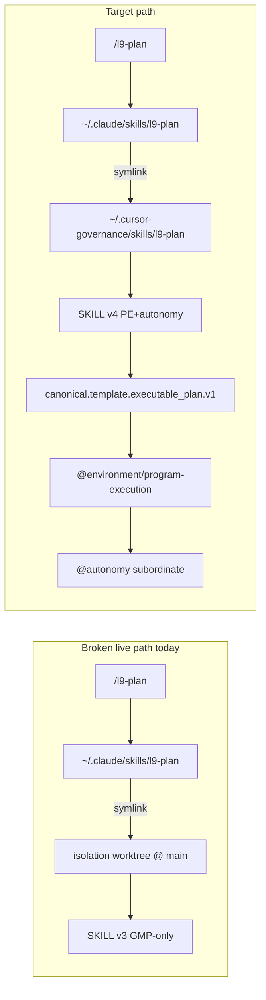

# Fix l9-plan: PE+autonomy live end-to-end

## Intent (user)

`/l9-plan` must produce Cursor `.plan.md` from the first-class executable template and hand off to `@environment/program-execution` with max subordinate `@autonomy` — not legacy GMP-only `plan-workflow.md`. Attached skill content is still v3; that is a **live wiring defect**, not missing product design.

## Recursive Alignment findings (root causes)

| Finding | Evidence | Severity |
|---|---|---|
| **Wrong skill ingress** | `~/.claude/skills/l9-plan` → symlink to `…/fix-shared-worktree-isolation/skills/l9-plan` (at `origin/main`, **v3.0.0**) | Release-blocking |
| **SSOT tip stale** | `~/.cursor-governance/skills/l9-plan` = **v3.0.0**; PE commit `cd26759` **not** on `origin/main` | Release-blocking |
| **No open PR** | `gh pr list --head feat/l9-plan-pe-autonomy-executable-template` → `[]` | Release-blocking |
| **Branch pollution** | Feature tip also carries WIP/docs commits (`a422c5f`, `52ef577`, `61c1806`) — must **not** merge as one blob | High |
| **`_TEMPLATE` drift** | [`.cursor/plans/_TEMPLATE.plan.md`](.cursor/plans/_TEMPLATE.plan.md) (569) ≠ SSOT [`canonical.template.executable_plan.v1.plan.md`](environment/contracts/execution/templates/canonical.template.executable_plan.v1.plan.md) (582); stripped `depends_on` / phase / evidence refs | High |
| **Workspace has truth** | Clone [`skills/l9-plan/SKILL.md`](skills/l9-plan/SKILL.md) **v4.0.0** + [`commands/l9-plan.md`](commands/l9-plan.md) already PE+autonomy; symlink `executable-plan.pe-autonomy.template.md` → SSOT | Preserve |

## Recursive Leverage (smallest move that fixes future moves)

1. **Ship only the PE skill delta to main** (cherry-pick / clean branch from `cd26759`, not the WIP tip).
2. **Single ingress for adapter skills** — Claude/Cursor L9 skills MUST resolve to governance SSOT `skills/`, never a consumer worktree.
3. **Mirror law** — `_TEMPLATE.plan.md` regenerated from SSOT (byte-identical body); document “mirror only” stays true.
4. **Fail-closed drift checks** — pack + reconcile assert `version >= 4.0.0`, PE workflow markers, and symlink target under SSOT git root.

## Scope

**In**

- Clean branch from `origin/main` + cherry-pick `cd26759` (and any follow-up hardening commits made in this work).
- Harden [`skills/l9-plan/`](skills/l9-plan/) pack (refs versions, `expertise_model` / checklist PE language, `validate_pack_structure` asserts).
- Re-mirror [`.cursor/plans/_TEMPLATE.plan.md`](.cursor/plans/_TEMPLATE.plan.md) from SSOT (if tracked/generated policy allows; else document sync command in skill).
- Fix [`ops/scripts/reconcile_claude_l9_skills.py`](ops/scripts/reconcile_claude_l9_skills.py) / adapter reconcile so L9 skill links target **SSOT** (`$GOV/skills` / `~/.cursor-governance/skills`), refuse worktree targets outside SSOT.
- Open PR → L4 authorize → push → green → merge (plan Build / L4 stack).
- Post-merge: `governance_activate_fresh` + `reconcile_claude_l9_skills` + verify `~/.claude/skills/l9-plan` → SSOT v4.

**Out**

- WIP sacred-backlog / reports-ignore commits on current tip.
- Rewriting Program Execution core templates.
- Changing PE Controller runtime beyond skill handoff text.

## Execution todos

1. **baseline-preflight** — Record `origin/main` SHA; confirm `cd26759` file list; confirm Claude link currently resolves to isolation WT (reproduce v3).
2. **split-clean-branch** — `git fetch`; create `fix/l9-plan-pe-autonomy-live` from `origin/main`; cherry-pick `cd26759` only; resolve conflicts if main moved.
3. **harden-skill-pack** — Bump/align reference META to 4.0.0 where still 3.0.0; update `expertise_model.yaml` / `validation-checklist.md` / `skill_intelligence_report.yaml` so default deliverable = PE `.plan.md` + PE execute path; keep PLAN_DOCUMENT JSON as depth-gate machine artifact (dual-artifact law already in v4).
4. **harden-reconcile** — In `reconcile_claude_l9_skills.py` (and multi-adapter path if shared): when creating/replacing `l9-*` skill links, resolve source only from governance SSOT root; detect+replace links into other worktrees; add `--check` drift for “symlink outside SSOT”.
5. **mirror-template** — Copy SSOT → `.cursor/plans/_TEMPLATE.plan.md` (or generate via documented sync); add pack/self_test check that mirror matches SSOT hash when both present in workspace.
6. **validate** — `cd skills/l9-plan && python3 scripts/validate_pack_structure.py . && python3 scripts/self_test.py`; `make pr-check` on changed files.
7. **ship** — L4 begin/record-kernels/authorize-release in dedicated worktree; `make pr`; remediate CI; merge bottom-up if older PRs exist.
8. **activate-live** — After merge: tip-activate SSOT; run reconcile; **prove** `readlink ~/.claude/skills/l9-plan` → `~/.cursor-governance/skills/l9-plan` and `version: 4.0.0` + PE markers in SKILL.md.

## Acceptance (falsifiable)

- `origin/main` contains `skills/l9-plan` v4.0.0 and `environment/contracts/execution/templates/canonical.template.executable_plan.v1.plan.md`.
- `~/.cursor-governance/skills/l9-plan/SKILL.md` shows `version: 4.0.0` and `plan-workflow-pe-autonomy`.
- `~/.claude/skills/l9-plan` is a symlink into SSOT (not any `worktrees/*` path).
- Invoking `/l9-plan` attached skill text includes PE+autonomy execute pipeline (not GMP-only step 10 `render_plan_markdown.py` as default).
- `_TEMPLATE.plan.md` matches SSOT (diff empty) or CI/self_test fails if drifted.
- Reconcile `--check` fails if an L9 skill link points outside SSOT.

## Risks / rollback

- Cherry-pick conflict with main tip → resolve in clean branch only; never reset main.
- Reconcile changing consumer skill links → only L9-named managed entries; leave unmanaged skills.
- Rollback: revert merge commit; re-run reconcile (returns to previous SSOT tip).

## Non-goals

- Free-form “plan chat executes mutations” (still forbidden).
- Deleting legacy `plan-workflow.md` (kept, non-default).
- Merging scratch-hold / WIP tip into main.
