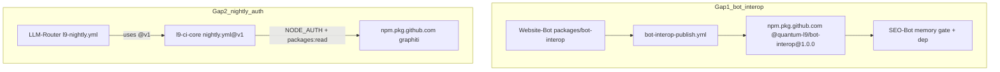

# PLAN: Fix SEO-Bot bot-interop + LLM-Router nightly auth

### Objective

Clear the two remaining failures after Graphiti package access was unlocked:

1. **SEO-Bot memory gate** fails because `@quantum-l9/bot-interop@1.0.0` is **not published** (source exists only as `file:packages/bot-interop` in Website-Bot).
2. **LLM-Router L9 Nightly** fails with **E401** because [`l9-ci-core` `.github/workflows/nightly.yml`](https://github.com/Quantum-L9/l9-ci-core/blob/v1/.github/workflows/nightly.yml) Node install has no `registry-url` / `NODE_AUTH_TOKEN` / `packages: read`.

**Success:**

- `npm view @quantum-l9/bot-interop@1.0.0 version` returns `1.0.0` with `GITHUB_TOKEN` from SEO-Bot.
- SEO-Bot PR [#41](https://github.com/Quantum-L9/SEO-Bot/pull/41) memory-stack gate passes the bot-interop step (or full gate green if other pins already match).
- LLM-Router `L9 Nightly` rerun completes Node install **without** `E401` for `@quantum-l9/graphiti-memory-client`.
- No PAT created; consumers keep `secrets.GITHUB_TOKEN` only.

### Scope

**In:**

- Publish `@quantum-l9/bot-interop@1.0.0` from [Quantum-L9/Website-Bot](https://github.com/Quantum-L9/Website-Bot) via existing [`bot-interop-publish.yml`](https://github.com/Quantum-L9/Website-Bot/blob/main/.github/workflows/bot-interop-publish.yml) (`bot-interop-v*` tag or `workflow_dispatch` + `release` environment approval).
- After publish: grant **Manage Actions access = Read** on the new `bot-interop` package to `SEO-Bot` (and any other confirmed registry consumers); leave Website-Bot as publisher/source.
- Patch [Quantum-L9/l9-ci-core](https://github.com/Quantum-L9/l9-ci-core) reusable `nightly.yml` Node path for GH Packages auth; advance floating `v1` tag so LLM-Router’s `@v1` caller picks it up.
- Re-run / verify SEO-Bot memory gate and LLM-Router nightly.

**Out:**

- Reworking SEO-Bot product features on PR #41 beyond gate/deps needed for green auth.
- Changing LLM-Router thin [`l9-nightly.yml`](https://github.com/Quantum-L9/LLM-Router/blob/main/.github/workflows/l9-nightly.yml) to embed install logic (caller contract: “do not add logic here”).
- Publishing unrelated packages; inventing PATs; weakening gates to skip checks.
- Auto-removing the extra Graphiti Manage Actions grants the operator added earlier.

### Pre-Validation (mandatory)

| Check | Command / action | Pass criteria |
|-------|------------------|---------------|
| P0 Target bind | Gap1 = Website-Bot publish + bot-interop package access; Gap2 = l9-ci-core nightly.yml (+ `v1` tag) | Two write roots named; SEO-Bot verify-only unless gate pin drift needs a PR #41 tweak |
| P1 Baseline inventory | Confirm org package `bot-interop` 404; Website-Bot has `packages/bot-interop` @ `1.0.0` + publish workflow; SEO-Bot PR #41 gate requires bot-interop; l9-ci-core nightly Node block lacks registry auth; LLM-Router memory gate already PASS | Matches evidence below |
| P2 Clean gate | In each repo that receives code edits: `make pr` / `make pr-check` (or repo-equivalent) on the change branch | PASS on changed files; **no commit/push unless asked** |
| P3 Auth / env | Actor can approve Website-Bot `release` environment; can move `l9-ci-core` `v1` tag; can edit package Manage Actions for `bot-interop` after first publish | Confirmed before mutation |

**Evidence already captured:**

- SEO-Bot gate (PR branch) resolves `graphiti-memory-client@2.0.0`, then `E404` on `bot-interop`.
- Website-Bot depends on bot-interop via `file:packages/bot-interop` (local); SEO-Bot PR depends on registry `^1.0.0`.
- No `bot-interop-v*` tags / no org npm package yet; publish workflow is ready.
- Nightly reusable workflow: `permissions: contents: read` only; `setup-node` without `registry-url`; install step with no `NODE_AUTH_TOKEN`.



### TODO Plan

| # | Task | Files | Effort | Risk |
|---|------|-------|--------|------|
| 1 | Preflight: confirm Website-Bot `release` env + publish workflow; dry-check `packages/bot-interop` `verify:all` locally or via existing `bot-interop.yml` CI if present | Website-Bot `packages/bot-interop/**`, `.github/workflows/bot-interop*.yml` | S | Low |
| 2 | Publish `@quantum-l9/bot-interop@1.0.0`: push tag `bot-interop-v1.0.0` **or** `workflow_dispatch` on `bot-interop-publish.yml`; approve `release` environment | Website-Bot tag / Actions only (no source change if package already at 1.0.0) | S | Med — human approval gate |
| 3 | Post-publish: verify package exists; under package settings Manage Actions access, add `Quantum-L9/SEO-Bot` **Read** (mirror Graphiti grant pattern); keep visibility unchanged | GitHub package UI for `bot-interop` | S | Low |
| 4 | Align SEO-Bot PR #41 gate pins if needed (gate currently checks `llm-router@1.1.0` while `package.json` has `1.1.1`); re-run memory gate | SEO-Bot `.github/workflows/memory-stack-dependency-gate.yml` on PR branch | S | Low |
| 5 | Patch l9-ci-core `nightly.yml`: `permissions.packages: read`; Node `setup-node` `registry-url: https://npm.pkg.github.com`; install step `env.NODE_AUTH_TOKEN: ${{ secrets.GITHUB_TOKEN }}` | [`l9-ci-core/.github/workflows/nightly.yml`](https://github.com/Quantum-L9/l9-ci-core/blob/main/.github/workflows/nightly.yml) | M | Med — shared by all `@v1` nightly callers |
| 6 | Land l9-ci-core change on default branch; move floating tag `v1` to the new commit (same model as today) | `refs/tags/v1` on l9-ci-core | S | Med — org-wide nightly consumers |
| 7 | Re-run LLM-Router `L9 Nightly` + SEO-Bot memory gate; record evidence | Actions reruns only | S | Low |

### Depth

**Gap 1 root cause:** Runbook already required “publish `@quantum-l9/bot-interop@1.0.0` after Website-Bot merge.” Website-Bot kept interop as a workspace `file:` dependency (its memory gate correctly skips registry check). SEO-Bot PR #41 treats interop as a **registry** dependency and gates on it — so the missing publish is a release-sequence gap, not a Graphiti access gap.

**Gap 2 root cause:** Manage Actions Read for Graphiti is already proven (LLM-Router memory gate PASS). Nightly E401 is a **workflow auth wiring** bug in the shared Node install path. Fix belongs in `l9-ci-core`, not a PAT and not logic in the thin LLM-Router wrapper.

**Contracts preserved:**

- Consumers: `contents: read` + `packages: read` + `NODE_AUTH_TOKEN: ${{ secrets.GITHUB_TOKEN }}`.
- Publisher (bot-interop): Website-Bot `packages: write` under `release` env (already in publish workflow).
- LLM-Router nightly remains a one-job `uses:` wrapper.

### Dependencies

```text
T1 → T2 → T3 → T4 → T7(SEO)
T5 → T6 → T7(LLM-Router nightly)
T2 and T5 are independent and can run in parallel
```

### Milestones

| Milestone | Outcome | Unlocks |
|-----------|---------|---------|
| M1 bot-interop on registry | Package `1.0.0` visible; SEO-Bot has Actions Read | SEO-Bot gate can pass bot-interop step |
| M2 nightly auth fixed | `l9-ci-core` nightly Node installs private GH packages with `GITHUB_TOKEN` | LLM-Router nightly green on package auth |
| M3 verified | Both reruns evidence-backed | Close remaining gaps from access execution report |

### Checkpoints

| CP | After | Evidence required | No-go action |
|----|-------|-------------------|--------------|
| CP1 | T2 | `gh api orgs/Quantum-L9/packages/npm/bot-interop` 200; version `1.0.0` | Do not change SEO-Bot gate expectations; unblock `release` approval / fix publish logs |
| CP2 | T3 | SEO-Bot listed Read on bot-interop Manage Actions | Stop before claiming SEO gate auth fixed |
| CP3 | T5–T6 | Diff shows packages:read + registry-url + NODE_AUTH; `v1` SHA updated | Do not rerun nightly against old `v1` |
| CP4 | T7 | SEO gate: no bot-interop E404; Nightly: no graphiti E401 | Triage as new unrelated failure with log proof |

### Checklist

- [ ] P0–P3 Pre-Validation recorded
- [ ] T1 publish preflight done
- [ ] T2 `@quantum-l9/bot-interop@1.0.0` published
- [ ] T3 SEO-Bot Read on bot-interop package access
- [ ] T4 SEO-Bot gate pin drift fixed if present; memory gate rechecked
- [ ] T5 l9-ci-core nightly Node GH Packages auth patched
- [ ] T6 `v1` tag advanced; LLM-Router still references `@v1`
- [ ] T7 both CI paths show package-auth PASS (unrelated failures labeled)
- [ ] Final Validation / `make pr` on edited repos PASS
- [ ] No PAT; no commit/push unless user requests

### Risks

| Risk | Mitigation |
|------|------------|
| `release` environment blocks publish | Operator approves; do not bypass env or inject PAT |
| Publishing bot-interop without Actions grants → SEO still E401 | T3 immediately after first package version exists |
| Moving `v1` affects all nightly callers | Keep change minimal (auth only); smoke one Node + one Python consumer if available |
| SEO gate still pins `llm-router@1.1.0` | T4 align to `1.1.1` to match `package.json` |
| Nightly detects wrong lockfile tool | Auth env applies to npm/pnpm/yarn install branches equally |

### Estimate

**Total:** ~1–2 hours active work (+ waiting on `release` approval)
**GMPs:** 2 (Website-Bot publish/tag ops + package access; l9-ci-core nightly patch + `v1` move) — SEO-Bot only if gate pin edit needed

### Final Validation (mandatory)

| Check | Command | Pass criteria |
|-------|---------|---------------|
| V1 bot-interop registry | `npm view @quantum-l9/bot-interop@1.0.0 version` with GH Packages auth | Prints `1.0.0` |
| V2 SEO-Bot memory gate | Rerun / PR check on #41 | bot-interop step PASS; no E404 for that package |
| V3 LLM-Router nightly | `gh workflow run` / rerun `L9 Nightly` | No `E401` on `graphiti-memory-client` download |
| V4 Clean code | `make pr` in l9-ci-core (and SEO-Bot if edited) | PASS; **no commit/push unless asked** |
| V5 Safety | Review Actions + package settings | No PAT; visibility unchanged; thin LLM-Router nightly wrapper unchanged |

### Recommend next

After plan approval: execute via **`l9-gmp-protocol`** (or two focused GMPs) — publish/tag ops first or in parallel with the l9-ci-core patch; then `l9-ynp` only if a third blocker appears in rerun logs.
