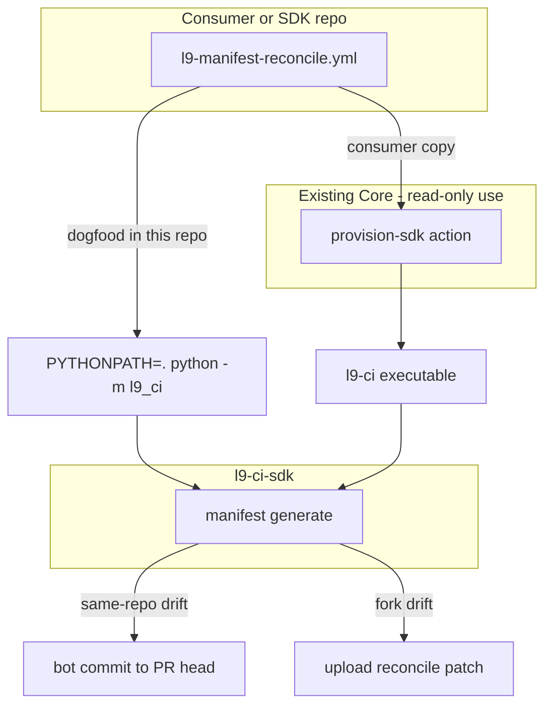

# PLAN: Fleet Manifest Auto-Fix Bot (SDK-owned)

### Objective

Turn the WIP pack at [`memory-bank/WIP-L9-SDK/l9-ci-sdk-agent-repository-manifest-reconcile/`](memory-bank/WIP-L9-SDK/l9-ci-sdk-agent-repository-manifest-reconcile/) into a production **auto-fix bot** for misaligned `MANIFEST.md` files:

- Deterministic SDK CLI generates/reconciles the inventory.
- A standalone GitHub Actions workflow commits corrections to same-repo PR heads.
- Downstream consumers adopt by **copying the caller workflow** (same pattern as [`l9-analysis.yml`](.github/workflows/l9-analysis.yml)).

**Locked decisions**

- `l9-ci-core` is **out of scope** — no new Core workflows, actions, or `invoke-sdk` operations.
- Standalone workflow (not folded into analysis) — analysis stays `contents: read`; bot needs `contents: write`.
- Default mode: **auto-fix** via `manifest generate` + bot commit (not check-only gate).
- Fork PRs: upload patch artifact; never use `pull_request_target`.

### Scope

**In**

- Apply WIP engine, CLI, tests, architecture doc into the live tree.
- Wire CLI registration (`__main__`, `commands/__init__`, `repository/__init__`).
- Ship `.github/workflows/l9-manifest-reconcile.yml` (dogfood + consumer copy-in template).
- Document consumer adoption using **existing** Core `provision-sdk` + shell invoke of `l9-ci manifest generate` (no Core code changes).
- Contract + ADR updates for the new CLI surface.
- Regenerate root `MANIFEST.md` under the new self-excluding rules.

**Out**

- Any edits to `Quantum-L9/l9-ci-core`.
- Core `workflow_call` reusable packaging.
- Governance profile toggles in Core.
- Folding into `l9-analysis*.yml`.
- Fleet rollout PRs into other consumer repos (docs only; adoption is copy-in).

### Architecture (SDK-only fleet path)



### TODO Plan

| # | Task | Files | Effort | Risk |
|---|------|-------|--------|------|
| 1 | Copy engine + CLI + tests from WIP | [`l9_ci/repository/manifest.py`](l9_ci/repository/manifest.py) (new), [`l9_ci/commands/manifest.py`](l9_ci/commands/manifest.py) (new), [`tests/repository/test_manifest.py`](tests/repository/test_manifest.py) (new), [`tests/commands/test_manifest.py`](tests/commands/test_manifest.py) (new) | S | Low |
| 2 | Apply registration patch | [`l9_ci/__main__.py`](l9_ci/__main__.py), [`l9_ci/commands/__init__.py`](l9_ci/commands/__init__.py), [`l9_ci/repository/__init__.py`](l9_ci/repository/__init__.py) — content from WIP `EXISTING_FILE_EDITS.patch` | S | Low |
| 3 | Ship architecture doc | [`docs/architecture/repository-manifest.md`](docs/architecture/repository-manifest.md) — adapt WIP doc: Core reusable orchestration marked future/out-of-scope; consumer path = copy-in workflow + existing `provision-sdk` | S | Low |
| 4 | Ship dual-purpose workflow | [`.github/workflows/l9-manifest-reconcile.yml`](.github/workflows/l9-manifest-reconcile.yml) from WIP, with template comments: (a) this repo dogfoods via `PYTHONPATH=.`; (b) consumers replace generate step with `provision-sdk` @ pinned Core SHA + `"$EXECUTABLE" manifest generate ...` | M | Med |
| 5 | Contract CLI surface | [`.l9/integration-contract.yaml`](.l9/integration-contract.yaml) — add `manifest_generate` and `manifest_check` under `CLI.commands` | S | Low |
| 6 | ADR | [`docs/adr/0009-repository-manifest-reconciliation.md`](docs/adr/0009-repository-manifest-reconciliation.md) — SDK owns deterministic inventory; drift repaired on PR; Core packaging deferred | S | Low |
| 7 | Consumer adoption docs | [`README.md`](README.md) and/or [`AGENTS.md`](AGENTS.md) — short “Manifest auto-fix” section: copy workflow, `contents: write`, pin SDK SHA that includes `manifest`, fork patch behavior | S | Low |
| 8 | Regenerate `MANIFEST.md` | Root [`MANIFEST.md`](MANIFEST.md) via `manifest generate --tracked-only` (must drop self-listing) | S | Low |
| 9 | Validate | `pytest` on new tests; `python -m l9_ci manifest generate/check`; ruff on touched Python | S | Low |

### Workflow behavior (concrete)

Preserve WIP semantics in [`.github/workflows/l9-manifest-reconcile.yml`](.github/workflows/l9-manifest-reconcile.yml):

- Triggers: PR `opened|synchronize|reopened|ready_for_review`, `workflow_dispatch`
- Permissions: `contents: write`
- Concurrency: `l9-manifest-${{ github.event.pull_request.number || github.ref }}`, cancel-in-progress
- Generate with `--tracked-only` → `MANIFEST.md`
- Same-repo PR + changed → commit as `l9-manifest-bot` / `chore(manifest): reconcile repository truth` → push head ref
- Fork PR + changed → upload `manifest-reconcile.patch` artifact; do not fail

Consumer copy-in delta (documented in workflow header + architecture doc):

1. Keep commit/fork steps as-is.
2. After checkout, call existing `Quantum-L9/l9-ci-core/.github/actions/provision-sdk@<sha>` (no Core changes).
3. Run `"${{ steps.sdk.outputs.executable }}" manifest generate --repository-root . --output MANIFEST.md --tracked-only`.
4. Pin an SDK revision that includes this feature (via whatever pin mechanism `provision-sdk` already uses).

### Dependencies

```
TODO-1 (engine) → TODO-2 (register) → TODO-8 (regen MANIFEST) → TODO-9 (validate)
TODO-1 → TODO-3, TODO-4, TODO-5, TODO-6, TODO-7 (docs/workflow/contract in parallel after engine lands)
TODO-4 depends on TODO-1/2 for dogfood path
```

### Risks

| Risk | Mitigation |
|------|------------|
| Consumer copies dogfood `PYTHONPATH=.` and gets no `manifest` command | Workflow header + architecture doc explicitly require `provision-sdk` + SDK pin for non-SDK repos |
| Bot push retriggers PR CI loops | Concurrency cancel + idempotent second generate (`changed=false`) |
| Fork PRs never auto-fix | Document patch artifact; keep security constraint (no `pull_request_target`) |
| Current `MANIFEST.md` lists itself / may drift on first run | TODO-8 regenerates under new rules in the same PR |
| Phase 1 AGENTS.md says “do not add scanner providers” | Manifest is repository inventory, not a scanner provider — stays within SDK CLI/contract |

### Estimate

**Total:** ~0.5–1 day
**GMPs:** 1 (SDK merge + dogfood workflow + docs/contract)

### Success criteria

- `l9-ci manifest generate|check` works from this repo.
- New unit/CLI tests pass.
- Workflow present and dogfoods on this repo’s PRs.
- Docs state a clear copy-in path for downstream consumers without requiring Core changes.
- `MANIFEST.md` no longer lists itself.

### Next after plan approval

Execute via `l9-gmp-protocol` (single GMP in this repo). Do not open Core work.
