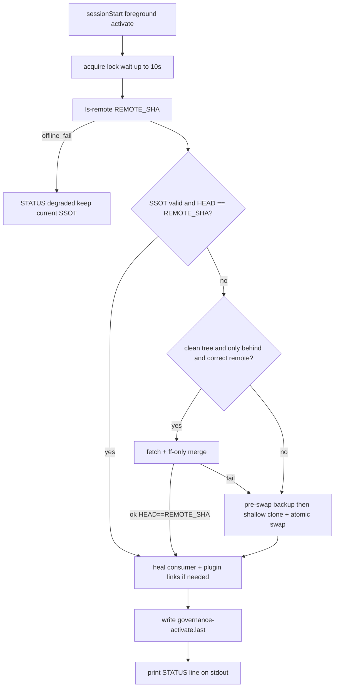

# Fresh governance activation on sessionStart (Improved)

## Target binding

- **Artifact:** Cursor-Governance activation path — sessionStart → SSOT at `$HOME/.cursor-governance` → consumer `.cursor-commands` + `l9-governance` plugin.
- **Authority:** GitHub `origin/${GOVERNANCE_GITHUB_BRANCH:-main}` tip of `Quantum-L9/Cursor-Governance` is the only load tip after a successful activate.
- **Not in scope:** golden-repo → l9-repo-template content migration; making `~/Cursor-Governance` WIP the live SSOT.

## Improve passes (plan hardening)

### Pass 1 — Verified defects in prior plan

| ID | Severity | Defect | Evidence |
|----|----------|--------|----------|
| P1 | high | sessionStart backgrounds sync then resolves SSOT immediately → session can load stale tip | [`session_start_bootstrap.sh`](ops/hooks/session_start_bootstrap.sh) `run_reconciler "$SYNC"` then later `resolve_global_commands` |
| P2 | high | Chicken-egg: bootstrap cannot call `$HOME/.cursor-governance/.../governance_activate_fresh.sh` if SSOT missing or script not yet on disk | Installed hook is a **copy**; new script only exists after first successful land on main + sync |
| P3 | high | Replacing sync on sessionStart drops **push-half**; swap would shelve dirty/ahead SSOT into bak without backup attempt | [`governance_sync.sh`](ops/scripts/governance_sync.sh) lines 117–129 |
| P4 | high | Always shallow-clone when behind blows 30s hook budget and produces shallow SSOT that weakens later `backup_to_github` history | `hooks.json.template` timeout 30; shallow clone lacks full history |
| P5 | med | “Stale” conflates **tip freshness** with **wiring correctness** (Dropbox link while SSOT already at tip) | Prior plan §Chosen policy items 1–4 mixed |
| P6 | med | Lock “skip silently” leaves a second window on stale tip | sync lock exits 0 when lock held |
| P7 | med | SSOT self-link infinite IDE nesting | `~/.cursor-governance/.cursor-commands` → self |
| P8 | low | Ambiguous relationship: activator vs `governance_sync.sh` dual pull strategies | Prior plan §1 last paragraph |

### Pass 2 — Hardened contracts

**C1 — Tip authority.** After successful activate, `git -C ~/.cursor-governance rev-parse HEAD` == remote tip SHA from `git ls-remote` (or fetched `origin/main`) for the expected remote URL.

**C2 — Tip freshness vs wiring (split).**

- **Tip stale:** SSOT missing / not git / invalid layout / wrong remote URL / `HEAD != REMOTE_SHA`.
- **Wiring stale:** open `$REPO/.cursor-commands` realpath ≠ activated SSOT (Dropbox or other). Wiring-only heal does **not** clone.

**C3 — Activation algorithm (smallest safe path to C1).**



**C4 — Pre-swap backup.** If existing SSOT is a git repo with dirty tree or commits ahead of `origin/main`, run `backup_to_github.sh` against that tree **before** `mv` to bak (best-effort; on failure still swap but STATUS warns `bak_unpushed`). Never delete the only copy of local work.

**C5 — Atomic swap.** Stage at `$HOME/.cursor-governance.activating`. Verify staged `HEAD == REMOTE_SHA` and layout (`CANONICAL_LAW.md` + `skills/`) **before** any `mv` of the live path. Same-filesystem renames only. On failure: remove staging; leave live SSOT untouched.

**C6 — Bak retention.** `mv` live → `~/.cursor-governance.bak.<UTC>`; keep newest **2** bak dirs; never auto-delete a bak that still has unpushed commits if detectable (prefer keep 3rd in that case, STATUS warn).

**C7 — Fail-soft sessionStart.** Activator exits 0 always for hook compatibility; stdout last line is machine-parseable:
`STATUS action=fresh|ff|swapped|wire_only|degraded sha=<full> detail=...`
Bootstrap maps that into PARTS. Degraded ≠ silent success: PARTS must say `governance: DEGRADED ...`.

**C8 — Chicken-egg bootstrap.** Installed [`session_start_bootstrap.sh`](ops/hooks/session_start_bootstrap.sh) must:

1. Prefer `$HOME/.cursor-governance/ops/scripts/governance_activate_fresh.sh` if executable.
2. Else if `$HOME/.cursor-governance` missing/invalid: **inline minimal bootstrap** in the installed hook (or a tiny always-installed `$HOME/.cursor/hooks/governance-activate-fresh.sh` copied beside the bootstrap) that `git clone --depth 1` into `~/.cursor-governance`, then re-exec/call the in-tree activator once present.
3. After activate, `cp -f` in-tree bootstrap → installed hook (self-heal).

**C9 — Timeout.** Raise `sessionStart` bootstrap timeout in [`ops/hooks/hooks.json.template`](ops/hooks/hooks.json.template) from **30 → 60** seconds. Prefer ff path; shallow clone only when ff unsafe. Activator enforces internal deadline (~50s): if clone unfinished, abort staging, STATUS degraded.

**C10 — No SSOT self-alias.** `setup_workspace_symlinks.sh`: if `realpath(workspace)==realpath(GOV_ROOT)`, remove `.cursor-commands` symlink; never create. Activator: `rm -f $SSOT/.cursor-commands` after land.

**C11 — Dual-strategy ban.** sessionStart calls **only** `governance_activate_fresh.sh` (not `governance_sync.sh`). `governance_sync.sh` remains for manual/`make` and its push half is reused **as a function/call from activator pre-swap** only. Pull-half of sync is not used on sessionStart.

**C12 — Dev WIP unchanged.** `~/Cursor-Governance` is never auto-activated. Consumers load GitHub tip via `~/.cursor-governance` only. Local WIP reaches consumers only after merge to `main` + next activate.

**C13 — Post-hook state surface.** sessionStart `additional_context` MUST be a sectioned state report (Governance, Runtime, Graphiti hydrate, Code-graph). MUST include Graphiti `hydrate_stats`. MUST NOT scaffold, excerpt, or recommend `memory-bank/` as resume SSOT. Resume path text = Graphiti inject/PICKUP/hydrate only.

## Implementation map

### 1. [`ops/scripts/governance_activate_fresh.sh`](ops/scripts/governance_activate_fresh.sh) (new)

- Env: `GOVERNANCE_GITHUB_REMOTE`, `GOVERNANCE_GITHUB_BRANCH`, `CURSOR_PROJECT_DIR` / `REPO`, `HOME`.
- Lock: reuse/extend sync lock dir; **wait up to 10s** for lock; if still busy, if receipt shows sha==REMOTE_SHA then STATUS fresh; else STATUS degraded `lock_busy`.
- Remote SHA via `git ls-remote` (no local clone required). Require remote URL host/path match `github.com/Quantum-L9/Cursor-Governance` (allow `.git` suffix).
- Implement C3–C7, C10 rm self-link, C4 pre-swap backup.
- Rewire: plugin `~/.cursor/plugins/local/l9-governance`; consumer `$REPO/.cursor-commands` when repo set and not SSOT.
- Receipt: `~/.cursor/governance-activate.last` JSON `{ts,action,remote_sha,local_sha,repo,detail}`.

### 2. [`ops/hooks/session_start_bootstrap.sh`](ops/hooks/session_start_bootstrap.sh)

- Replace backgrounded sync with **foreground** activate (capture STATUS → state report) **before** `resolve_global_commands`.
- Implement C8 fallback path; do not background activate.
- Replace flat `PARTS |`-joined blob with **structured session state** (see next section).
- Delete any remaining memory-bank scaffold/excerpt comments or PARTS; never mention memory-bank as an active resume path (orchestrator already says deprecated — scrub to “Graphiti only”).

### 2b. Comprehensive post-hook state report (no memory-bank)

**Goal:** After the hook runs, `additional_context` is a readable, sectioned state update an agent can trust—not a pipe soup, and not memory-bank.

Emit markdown sections (keep under existing hydration budget; truncate facts body last):

```markdown
## L9 session state
### Governance
- tip: <shortsha> action=<fresh|ff|swapped|wire_only|degraded> detail=...
- ssot: ~/.cursor-governance
- remote: origin/main @ <shortsha> (match|behind|unknown)
- wiring: PASS|FAIL | .cursor-commands → <target>
- self-link: absent|REMOVED
### Runtime
- venv: ...
- ide-profile: ...
- claude-plugins: ...
- tunnel: ...
- graphiti health: healthy|degraded|...
### Graphiti hydrate
- group_id / agent_id / packet_id / conversation_id
- degraded: false|true (reason)
- pickup: objective=... | next=...
- stats: facts_returned=N | pickup_parsed=yes|no | context_chars=N | search_queries_used=K | budget_chars=N
- facts_preview: (up to 3 one-line fact summaries, truncated)
### Code-graph
- skipped | summary (PlasticOS only)
```

**Graphiti stats implementation** (packet already has `fact_count`; extend):

1. [`ops/graphiti/hydration/compile_session_packet.py`](ops/graphiti/hydration/compile_session_packet.py)
   - Add to packet: `hydrate_stats`:
     - `facts_returned` (len facts)
     - `pickup_parsed` (bool — structured PICKUP extracted vs fallback)
     - `context_chars` (len context_slice)
     - `search_queries_used` (count of search attempts that ran)
     - `budget_chars` (`_hydration_budget()`)
     - `degraded` / `degrade_reason` (mirror)
   - Optionally attach `fact_previews: [{uuid?, text_head}]` max 3 × ~120 chars (no secrets).
2. [`format_additional_context`](ops/graphiti/hydration/compile_session_packet.py): render a **`### Graphiti hydrate`** stats block + include `hydrate_stats` in the compact JSON fence (today `fact_count` is omitted from the fence — fix that).
3. [`ops/hooks/session_start_memory_orchestrator.sh`](ops/hooks/session_start_memory_orchestrator.sh):
   - Prefer `--format json` (or dual) so bootstrap can merge stats into the structured report; keep fail-open.
   - Remove string `memory-bank` from disabled/degrade PARTS (“Graphiti disabled — no resume memory” / “hydration degraded …”).
4. Bootstrap builds the final `additional_context` from structured sections (governance STATUS + runtime probes + orchestrator hydrate JSON + code-graph), not only `printf '%s | '`.

**AGENTS.md scrub (docs todo):** rewrite §2.1 steps that still say “scaffolds memory-bank” / “activeContext excerpt” to match the retired append (Graphiti hydrate + stats only). Do not reintroduce memory-bank paths.

### 3. [`ops/hooks/hooks.json.template`](ops/hooks/hooks.json.template) + install path

- Timeout 60 for session-start-bootstrap.
- Ensure `setup_workspace_symlinks.sh` / activator also copies activator helper next to installed hooks if using sidecar pattern for C8.

### 4. [`ops/scripts/setup_workspace_symlinks.sh`](ops/scripts/setup_workspace_symlinks.sh)

- C10 SSOT self-link skip/remove (keeps prior `.cursor/plans` convenience link behavior for consumers).

### 5. Docs / checks

- [`CANONICAL_LAW.md`](CANONICAL_LAW.md): sessionStart = activate-fresh (ff or clone+swap); GitHub tip authority; bak+backup before displace; post-hook state = governance tip + Graphiti hydrate stats (not memory-bank).
- [`AGENTS.md`](AGENTS.md) §2.1: replace stale memory-bank bullets with activate-fresh + hydrate stats; Dropbox consumer rewire; golden-repo deprecated → l9-repo-template (no migration).
- [`ops/scripts/check_governance_wiring.sh`](ops/scripts/check_governance_wiring.sh): fetch (or trust receipt age < 15m); **fail** if `HEAD != origin/main`; fail if consumer `.cursor-commands` realpath ≠ SSOT; pass if SSOT `.cursor-commands` absent.

### 6. Tests

[`ops/scripts/tests/test_governance_activate_fresh.sh`](ops/scripts/tests/test_governance_activate_fresh.sh) — fixture remote via local bare repo + `file://` override:

| Case | Expect |
|------|--------|
| At tip, wiring OK | `action=fresh`, no bak |
| Clean behind | `action=ff`, HEAD==tip, no bak |
| Dirty behind | `action=swapped`, bak exists, live at tip |
| Diverged / wrong remote | swap |
| Dropbox consumer link, SSOT at tip | `action=wire_only`, link retargeted |
| Clone failure | live unchanged, staging gone, `action=degraded` |
| setup inside SSOT | no `.cursor-commands` self-link |

Hydration unit tests ([`ops/graphiti/hydration/test_hydration.py`](ops/graphiti/hydration/test_hydration.py)):

- Packet includes `hydrate_stats` with `facts_returned` / `pickup_parsed`.
- `format_additional_context` contains `### Graphiti hydrate` (or equivalent stats lines) and JSON fence includes stats.
- Formatted context never contains the string `memory-bank`.

Also run [`test_workspace_rules_overlay.sh`](ops/scripts/tests/test_workspace_rules_overlay.sh).

## Definition of done

1. New session in a consumer after activate shows governance tip `fresh|ff|swapped|wire_only @ <sha>` matching `git ls-remote` (when online).
2. `readlink $REPO/.cursor-commands` → `~/.cursor-governance` (never Dropbox).
3. `~/.cursor-governance/.cursor-commands` absent.
4. Dirty pre-swap SSOT still present under `.bak.*` and backup attempted.
5. Offline: session starts, governance DEGRADED, previous SSOT still used (no half-swap).
6. `additional_context` is sectioned (Governance / Runtime / Graphiti hydrate / Code-graph); includes hydrate stats (`facts_returned`, `pickup_parsed`, `context_chars`, …); **no memory-bank** references.
7. Unit fixture + hydration format tests PASS; overlay PASS.

## Residual Unknown / explicit non-goals

- Unknown until implement: wall-clock of shallow clone on this machine under 50s (mitigated by ff-first + 60s timeout).
- Non-goal: scanning all repos on disk for Dropbox links (only open workspace + plugin).
- Non-goal: golden-repo content migration to l9-repo-template.
- Non-goal: unshallow after swap (document that post-swap SSOT is shallow; full history lives in bak / GitHub).

## Validation commands (post-implement)

```bash
bash ops/scripts/tests/test_governance_activate_fresh.sh
bash ops/scripts/tests/test_workspace_rules_overlay.sh
bash ops/scripts/governance_activate_fresh.sh
bash ops/scripts/check_governance_wiring.sh "$(pwd)"
test ! -e "$HOME/.cursor-governance/.cursor-commands"
```
