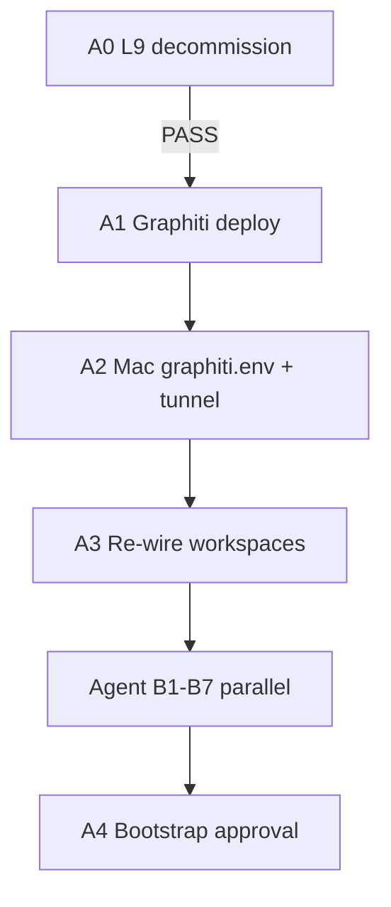
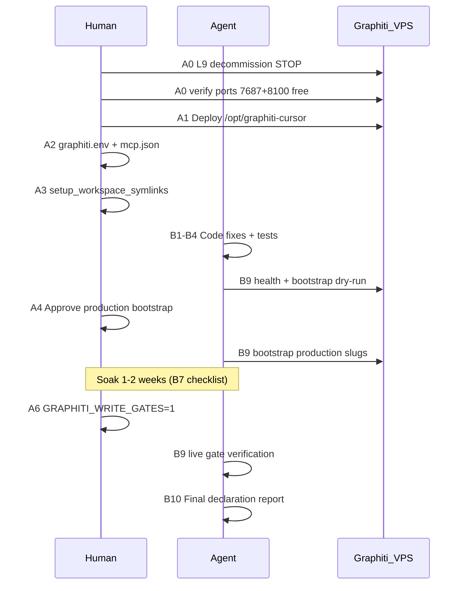

# GMP-GRAPHITI-GATES-002 — Complete Activation Plan

**Run ID:** `GMP-GRAPHITI-GATES-002`
**Depends on:** GLOBAL-001 substrate (already shipped in GlobalCommands) + live VPS
**VPS target (locked):** Hetzner C1 `46.62.243.82` — Graphiti-only at `/opt/graphiti-cursor` after L9 stack decommission
**Scope:** GlobalCommands SSOT only — no PlasticOS addon changes

### Infrastructure boundary (revised 2026-06-07)

| System | Status | Graphiti relationship |
|--------|--------|----------------------|
| L9 monorepo on C1 (`/opt/l9`, PacketStore, C1 MCP memory) | **Deprecated — decommission before A1** | Must be removed; do not bootstrap L9 repo slug |
| L9 Constellation (Constellation.Gate, Gate hub) | **Replacement runtime** | Separate concern — memory gate hooks ≠ ADR-002 Gate hub |
| Graphiti + Neo4j (`graphiti_cursor` DB) | **Memory layer on C1** | Sole occupant at `/opt/graphiti-cursor` post-L9 |

**Host decision (locked):** Reuse Hetzner C1 after L9 decommission — not constellation infra VPS, not co-located with `/opt/l9`.

**Naming contract:** Graphiti MCP server = episodic memory. Constellation Gate = action routing. Never conflate in hooks, rules, or bootstrap slugs.

---

## BUILD NOW — before you go outside (~30–45 min human)

**Current state:** L9 stack **still running** on C1 (per `93-c1-server-protection.mdc` baseline: `l9-api`, `l9-mcp-memory`, `l9-neo4j`, `l9-postgres`, `l9-redis`, etc.). Graphiti **cannot** deploy until **A0 PASS**.



| Step | Action | Exit gate |
|------|--------|-----------|
| **0** | SSH smoke test | `hostname` returns on C1 |
| **A0** | L9 decommission (below) | No `l9-*` containers; **7687 and 8100 free** |
| **A1** | `/opt/graphiti-cursor` compose up | `healthcheck` 200 on loopback 8100 |
| **A2** | SSH tunnel + `~/.cursor/graphiti.env` | `graphiti_memory_client.py health` OK from Mac |
| **A3** | `setup_workspace_symlinks.sh` | wiring check PASS |
| **Kick agent** | Switch to Agent mode: **execute the plan** | B1–B7 run while you are out |

**Parallel (no VPS):** After A3, agent executes Track B code fixes without waiting for bootstrap.

**Port conflict (why A0 blocks A1):** Baseline `l9-neo4j` binds `127.0.0.1:7687` — same port Graphiti Neo4j needs. Must stop L9 Neo4j before Graphiti compose.

---

## What “flipping write gates” means

Two independent flags in [`~/.cursor/graphiti.env`](file:///Users/ib-mac/Dropbox/Cursor%20Governance/GlobalCommands/ops/graphiti/graphiti.env.example):

| Flag | When `0` (today) | When `1` |
|------|------------------|----------|
| `GRAPHITI_MEMORY_ENABLED` | Prefetch/inject/search off or degraded | sessionStart orchestrator calls Graphiti; state file written |
| `GRAPHITI_WRITE_GATES` | **Advisory only** — hooks registered but allow all edits | **Fail-closed** — Write/Shell/subagent blocked until memory satisfied |

**With `GRAPHITI_WRITE_GATES=1`, the agent cannot:**

- Apply patches (`Write`, `StrReplace`, `ApplyPatch`, etc.) until prefetch is fresh or Graphiti search marks the task satisfied
- Run `git commit` or `make push` via shell until satisfied
- Spawn subagents if parent conversation memory is not satisfied
- Start a GMP run (prompt matches `GMP|phase [0-6]|modification lock`) without `gmp:phase_lock` in state after conflicts check

**Why wait ~1–2 weeks (plan default):**

- Prefetch must reliably populate `~/.cursor/graphiti-state/<conv>.json` before blocking edits — otherwise every session starts with false denies
- Bootstrap episode quality must be verified (no garbage entities in `ib-odoo-19` / `cursor-governance` graphs)
- Circuit breaker / VPS-down path must be proven (memory-bank T0 still loads; gates use 30m TTL cache)
- Early flip risk: agents stall on Write with no recovery path → you disable gates again

**When to flip early (same-day):** Only if soak checklist (B7) passes in 3+ real sessions across 2 repos with zero false denies and VPS health green.

**Recommendation:** You flip `GRAPHITI_WRITE_GATES=1`; agent builds soak checklist + auto-metrics; flip when checklist passes (your third option).


---

## Current state vs. plan gaps

**Shipped (code exists, default off):**

- Gate hooks in [`hooks.json.template`](file:///Users/ib-mac/Dropbox/Cursor%20Governance/GlobalCommands/ops/hooks/hooks.json.template): `graphiti-gate-edits/shell/subagent`, `graphiti-mark-ok`, `graphiti-reset-generation`
- Gate logic in [`graphiti_gate_lib.py`](file:///Users/ib-mac/Dropbox/Cursor%20Governance/GlobalCommands/ops/graphiti/graphiti_gate_lib.py) including GMP matcher + `gmp:phase_lock` check
- Minimal E2E in [`test_gate_e2e.sh`](file:///Users/ib-mac/Dropbox/Cursor%20Governance/GlobalCommands/ops/graphiti/test_gate_e2e.sh) (pre_tool_use deny/allow only)

**Gaps blocking real GATES-002 activation (agent must fix):**

| Gap | File(s) | Issue |
|-----|---------|-------|
| Fail-open on error | `graphiti-gate-*.sh` | `|| echo '{"permission":"allow"}'` violates failClosed when gates on |
| `gmp:phase_lock` never written | `graphiti_memory_client.py`, `graphiti-mark-ok.sh` | Matcher denies GMP prompts but nothing adds `gmp:phase_lock` after `conflicts` |
| Incomplete E2E | `test_gate_e2e.sh` | No shell/subagent/GMP tests |
| `reset-generation` input | `graphiti-reset-generation.sh` | Uses `CURSOR_USER_MESSAGE` env — likely unset; must parse `beforeSubmitPrompt` stdin JSON |
| `mark-ok` input | `graphiti-mark-ok.sh` | Uses `$1` grep; `postToolUse` passes JSON on stdin |
| `pre_tool_use` tool filter | `graphiti_gate_lib.py` | Should explicitly allow read-only tools if matcher broadens |
| Missing runbook | — | No `GATES-002-ACTIVATION.md` with soak criteria + rollback |
| Infra deploy doc stale | `DEPLOY.md`, `docker-compose.yml` | Needs locked C1 section: `46.62.243.82`, `/opt/graphiti-cursor`, post-L9; no `/opt/l9` |
| C1 memory rules stale | `03-mcp-memory.mdc`, `87-cursor-memory-kernel.mdc` | Still document C1 endpoints as primary — contradicts Graphiti cutover |
| Constellation repo absent | `group_registry.yaml` | No `constellation-gate` slug — add if Constellation.Gate repo will use Graphiti bootstrap |
| `hooks.json.template` orphan ref | line 35 | `pre-tool-use-code-graph-gate.sh` referenced but file absent in GlobalCommands — wiring may fail silently |

---

## Track A — Human-only (you during/after break)

### A0. L9 decommission on C1 — **BLOCKING** (not done yet)

**Status:** L9 still live on `46.62.243.82` at `/opt/l9`. Complete A0 before any Graphiti deploy.

**Protection:** Stopping/removing `/opt/l9` compose is a **protected Docker operation** — you are explicitly decommissioning; do not let an agent run this without your approval.

**Step 0 — Inventory (read-only, ~2 min):**

```bash
ssh -i ~/.ssh/Hetzner-C1-nopass root@46.62.243.82 \
  "docker ps --format 'table {{.Names}}\t{{.Status}}\t{{.Ports}}'"
ss -tlnp | grep -E '7687|8100|9002|5432' || true   # run on C1 after SSH
```

Expected today: `l9-neo4j` on **7687**, `l9-mcp-memory` on **9002**, `l9-postgres` on **5432**, etc.

**Step 1 — Stop L9 stack (~5 min):**

```bash
ssh -i ~/.ssh/Hetzner-C1-nopass root@46.62.243.82
cd /opt/l9
docker compose down          # stops all l9-* containers
docker ps | grep l9 || echo "OK: no l9 containers"
```

**Step 2 — Archive install dir (optional but recommended):**

```bash
mv /opt/l9 /opt/l9.archived-$(date +%Y%m%d)   # preserves compose/.env for rollback reference
# Do NOT commit VPS .env to git
```

**Step 3 — Port gate (must pass before A1):**

```bash
ss -tlnp | grep -E ':7687|:8100' && echo "FAIL: ports still bound" || echo "PASS: 7687+8100 free"
```

**Step 4 — Disable legacy memory routes (if nginx/Caddy still exposes `/memory`, `:9002`):**

- Remove or comment routes pointing to `l9-mcp-memory` / PacketStore
- Goal: no client can write to deprecated C1 memory after cutover
- Record what changed in a one-line note in `DEPLOY.md` (no secrets)

**A0 DoD checklist:**

- [ ] `docker ps` shows **zero** `l9-*` containers
- [ ] `/opt/l9` archived or removed (not running)
- [ ] Ports **7687** and **8100** free on loopback
- [ ] Legacy `:9002` / `/memory` external routes disabled or documented as retired
- [ ] **No** Graphiti deploy attempted before this checklist complete

**A0 rollback (if needed):** `cd /opt/l9.archived-YYYYMMDD && docker compose up -d` — only if Graphiti deploy not yet started.

**Out of scope for A0:** Migrating PacketStore/Neo4j data into Graphiti — archive only; bootstrap fresh per repo later.

---

### A1. Graphiti VPS — Hetzner C1 post-L9 (`46.62.243.82`)

**Preflight (blocking):**

- **A0 DoD checklist complete** — copy/paste `PASS: 7687+8100 free` output into session notes
- Record public IP `46.62.243.82` + access method (SSH tunnel or Caddy) in [`DEPLOY.md`](file:///Users/ib-mac/Dropbox/Cursor%20Governance/GlobalCommands/ops/graphiti/DEPLOY.md)
- Per [`93-c1-server-protection.mdc`](file:///Users/ib-mac/Dropbox/Cursor%20Governance/GlobalCommands/rules/93-c1-server-protection.mdc): explicit approval for new `/opt/graphiti-cursor` compose (greenfield — not modifying legacy `/opt/l9` files)

**Deploy on C1:**

```bash
ssh -i ~/.ssh/Hetzner-C1-nopass root@46.62.243.82
mkdir -p /opt/graphiti-cursor
# copy ops/graphiti/docker-compose.yml + graphiti.env (secrets on VPS only)
cd /opt/graphiti-cursor && docker compose up -d
```

1. Neo4j DB `graphiti_cursor` only (not PlasticOS buyer-match Neo4j; not removed L9 Neo4j data)
2. MCP `127.0.0.1:8100` on VPS — Mac access via SSH tunnel or Caddy (Tailscale **out of scope**)
3. Verify on VPS:

   ```bash
   curl -sf -H "Authorization: Bearer $TOKEN" http://127.0.0.1:8100/healthcheck
   cypher-shell -a bolt://127.0.0.1:7687 "RETURN 1"
   ```

**Do not:** bootstrap or migrate legacy C1 PacketStore / L9 MCP memory — fresh Graphiti episodes per repo only.

### A1 access model (no Tailscale)

Graphiti MCP and Neo4j stay **loopback-only on the VPS** (`127.0.0.1:8100`, `127.0.0.1:7687`). Mac/Cursor reach them via one of:

| Method | Who runs it | Mac `graphiti.env` |
|--------|-------------|-------------------|
| **SSH local forward (default)** | You (or agent via your Mac shell) | `GRAPHITI_MCP_URL=http://127.0.0.1:8100/mcp/` while tunnel open |
| **Caddy HTTPS route** | You on C1 (explicit approval per 93-c1) | `https://46.62.243.82:<port>/mcp/` + bearer token |

**SSH command (documented in `93-c1-server-protection.mdc`):**

```bash
ssh -i ~/.ssh/Hetzner-C1-nopass root@46.62.243.82
# Optional tunnel for local Graphiti CLI from Mac:
ssh -N -L 8100:127.0.0.1:8100 -i ~/.ssh/Hetzner-C1-nopass root@46.62.243.82
```

**Agent SSH:** The agent has **no independent SSH credentials**. It can only run `ssh` on **your Mac** if `~/.ssh/Hetzner-C1-nopass` exists and your network allows `46.62.243.82`. Deploy and tunnel are **human A1** unless you explicitly ask the agent to run SSH commands in Agent mode.

### A2. Mac client secrets

```bash
cp GlobalCommands/ops/graphiti/graphiti.env.example ~/.cursor/graphiti.env
# Fill Graphiti MCP URL (no Tailscale — pick one):
# Option 1 SSH tunnel:  ssh -L 8100:127.0.0.1:8100 -i ~/.ssh/Hetzner-C1-nopass root@46.62.243.82
#                         GRAPHITI_MCP_URL=http://127.0.0.1:8100/mcp/
# Option 2 Caddy HTTPS:   GRAPHITI_MCP_URL=https://46.62.243.82:PORT/mcp/  (after A1 Caddy route)
#       GRAPHITI_MCP_TOKEN, OPENAI_API_KEY, NEO4J_PASSWORD
#       GRAPHITI_MEMORY_ENABLED=1
#       GRAPHITI_WRITE_GATES=0   # keep off until soak passes
```

Merge [`mcp.json.example`](file:///Users/ib-mac/Dropbox/Cursor%20Governance/GlobalCommands/ops/graphiti/mcp.json.example) into `~/.cursor/mcp.json`.

### A3. Re-wire workspaces

```bash
bash GlobalCommands/ops/scripts/setup_workspace_symlinks.sh "/Users/ib-mac/IB-Odoo_19 (LOCAL)/IB-Odoo_19"
bash GlobalCommands/ops/scripts/check_governance_wiring.sh "$(pwd)"
```

### A4. Bootstrap approval (production slugs)

After agent runs dry-run, you approve production writes:

```bash
# PlasticOS
cd IB-Odoo_19 && python3 .cursor-commands/ops/graphiti/graphiti_memory_client.py bootstrap --dry-run --group-id sandbox-test
python3 .cursor-commands/ops/graphiti/graphiti_memory_client.py bootstrap   # ib-odoo-19

# GlobalCommands
cd GlobalCommands && python3 ops/graphiti/graphiti_memory_client.py bootstrap  # cursor-governance

# Constellation.Gate (when repo wired) — add slug to group_registry.yaml first
# cd Constellation.Gate && python3 .cursor-commands/ops/graphiti/graphiti_memory_client.py bootstrap
```

### A5. Cursor Settings

- Disable **Cursor native Memories** for repo facts (manual Settings)
- Confirm `~/.cursor/hooks.json` matches template after re-wire

### A6. Gate flip (your decision)

When soak checklist passes → set `GRAPHITI_WRITE_GATES=1` in `~/.cursor/graphiti.env` and restart Cursor.

**Rollback:** Set `GRAPHITI_WRITE_GATES=0` — immediate; no code change.

---

## Track B — Agent executes when you return (after A2 minimum)

### B1. Fix failClosed semantics

In [`graphiti-gate-edits.sh`](file:///Users/ib-mac/Dropbox/Cursor%20Governance/GlobalCommands/ops/hooks/graphiti-gate-edits.sh), [`graphiti-gate-shell.sh`](file:///Users/ib-mac/Dropbox/Cursor%20Governance/GlobalCommands/ops/hooks/graphiti-gate-shell.sh), [`graphiti-gate-subagent.sh`](file:///Users/ib-mac/Dropbox/Cursor%20Governance/GlobalCommands/ops/hooks/graphiti-gate-subagent.sh):

- When `graphiti_gates_enabled`: on Python error → `{"permission":"deny","user_message":"Graphiti gate error — failClosed"}`
- When gates off: keep allow fallback

### B2. Implement `gmp:phase_lock` lifecycle

Add CLI subcommand to [`graphiti_memory_client.py`](file:///Users/ib-mac/Dropbox/Cursor%20Governance/GlobalCommands/ops/graphiti/graphiti_memory_client.py):

```bash
python3 graphiti_memory_client.py phase-lock   # runs conflicts + appends gmp:phase_lock to state
```

- Writes to `~/.cursor/graphiti-state/<conv>.json` → `memory_satisfied_for` includes `"gmp:phase_lock"`
- GMP Phase 0 contract: agent runs `conflicts` then `phase-lock` before any file edits

Update [`graphiti-mark-ok.sh`](file:///Users/ib-mac/Dropbox/Cursor Governance/GlobalCommands/ops/hooks/graphiti-mark-ok.sh) to parse `postToolUse` stdin JSON; mark satisfied on Graphiti MCP tool success.

### B3. Fix hook stdin contracts

- [`graphiti-reset-generation.sh`](file:///Users/ib-mac/Dropbox/Cursor Governance/GlobalCommands/ops/hooks/graphiti-reset-generation.sh): read prompt from stdin JSON (`prompt` / `user_message` fields per Cursor hook schema)
- [`graphiti-mark-ok.sh`](file:///Users/ib-mac/Dropbox/Cursor Governance/GlobalCommands/ops/hooks/graphiti-mark-ok.sh): same for tool name + result

### B4. Expand gate test suite

Extend [`test_gate_e2e.sh`](file:///Users/ib-mac/Dropbox/Cursor Governance/GlobalCommands/ops/graphiti/test_gate_e2e.sh) or add `test_gate_e2e_full.sh`:

| Case | Expected |
|------|----------|
| `pre_tool_use` unsatisfied | deny |
| `pre_tool_use` satisfied | allow |
| GMP prompt without `gmp:phase_lock` | deny |
| GMP prompt with `gmp:phase_lock` | allow |
| `shell` `git commit` unsatisfied | deny |
| `shell` `git commit` satisfied | allow |
| `shell` benign `ls` | allow always |
| `subagent` parent unsatisfied | deny |
| Gates off (`GRAPHITI_WRITE_GATES=0`) | allow all |

Wire into [`check_governance_wiring.sh`](file:///Users/ib-mac/Dropbox/Cursor Governance/GlobalCommands/ops/scripts/check_governance_wiring.sh).

### B5. DEPLOY.md — locked C1 post-L9 section

Update [`DEPLOY.md`](file:///Users/ib-mac/Dropbox/Cursor%20Governance/GlobalCommands/ops/graphiti/DEPLOY.md) with canonical values:

- **Host:** `46.62.243.82` (Hetzner C1)
- **Install path:** `/opt/graphiti-cursor` (post-L9; no `/opt/l9`)
- **Ports:** MCP 8100, Neo4j bolt 7687 (loopback on VPS; Mac via SSH tunnel or Caddy — **not Tailscale**)
- **Prerequisite:** L9 stack decommissioned on C1
- **Warnings:** PlasticOS buyer-match Neo4j separate; Constellation Gate hub separate; no PacketStore migration

Update [`group_registry.yaml`](file:///Users/ib-mac/Dropbox/Cursor%20Governance/GlobalCommands/ops/graphiti/group_registry.yaml) if Constellation.Gate repo will bootstrap (slug + `integrates_with` edges).

### B5b. C1 memory rule sweep (agent)

Surgical updates to deprecate C1-as-primary references still in active rules (`87-cursor-memory-kernel.mdc` endpoint lines, any `46.62.243.82/memory` write paths). C1 protection rule (`93-c1-server-protection.mdc`) remains for infra — not memory SSOT.

### B6. Resolve hooks.json orphan

Either add stub [`pre-tool-use-code-graph-gate.sh`](file:///Users/ib-mac/Dropbox/Cursor%20Governance/GlobalCommands/ops/hooks/pre-tool-use-code-graph-gate.sh) (allow-pass) or remove entry from template if PlasticOS installs it separately — prevent broken hook registration.

### B7. Activation runbook + soak checklist

Create [`ops/graphiti/GATES-002-ACTIVATION.md`](file:///Users/ib-mac/Dropbox/Cursor%20Governance/GlobalCommands/ops/graphiti/GATES-002-ACTIVATION.md):

**Soak criteria (all must pass before you flip gates):**

- [ ] `health` green 7 consecutive days (or 3 days if aggressive)
- [ ] 3+ sessions/repo with prefetch state file written (`prefetch_ts` fresh)
- [ ] Zero sessions where Write would deny incorrectly (manual log)
- [ ] Bootstrap `stats` shows RepoManifest for `ib-odoo-19` + `cursor-governance` (+ `constellation-gate` if registered)
- [ ] Zero bootstrap attempts against removed L9 repo slug or C1 PacketStore migration
- [ ] `conflicts` returns empty or all documented
- [ ] VPS down test: memory-bank loads; gate uses cached prefetch within TTL
- [ ] `test_gate_e2e_full.sh` PASS

### B8. Docs/skill updates

- [`skills/l9-graphiti-memory/SKILL.md`](file:///Users/ib-mac/Dropbox/Cursor%20Governance/GlobalCommands/skills/l9-graphiti-memory/SKILL.md) — GATES-002 activation + rollback section
- [`rules/98-graphiti-memory-gate.mdc`](file:///Users/ib-mac/Dropbox/Cursor%20Governance/GlobalCommands/rules/98-graphiti-memory-gate.mdc) — link to runbook
- [`reports/GMP-GRAPHITI-GATES-002-FINAL-DECLARATION.md`](file:///Users/ib-mac/Dropbox/Cursor%20Governance/GlobalCommands/reports/GMP-GRAPHITI-GATES-002-FINAL-DECLARATION.md) — after live verification

### B9. Live verification (after your A2 + B1–B4)

Agent runs when VPS reachable:

```bash
python3 .cursor-commands/ops/graphiti/graphiti_memory_client.py health
python3 .cursor-commands/ops/graphiti/graphiti_memory_client.py bootstrap --dry-run --group-id sandbox-test
python3 .cursor-commands/ops/graphiti/graphiti_memory_client.py conflicts
python3 .cursor-commands/ops/graphiti/graphiti_memory_client.py phase-lock   # after B2
bash .cursor-commands/ops/graphiti/test_gate_e2e_full.sh
make governance-backup   # PlasticOS or manual backup_to_github.sh
```

**Live session test (manual with you in Cursor):**

1. Open PlasticOS → confirm sessionStart additional_context mentions Graphiti + memory-bank
2. With `GRAPHITI_WRITE_GATES=1`: attempt Write before prefetch → denied
3. Run Graphiti search or satisfy prefetch → Write allowed
4. Start GMP prompt without `phase-lock` → denied; after `phase-lock` → allowed
5. End session → `memory-bank/activeContext.md` diff visible

### B10. Optional (Phase 6 — post-gates)

- T1 session-end distill hook (1 JSON episode per session) in [`graphiti-session-end.sh`](file:///Users/ib-mac/Dropbox/Cursor Governance/GlobalCommands/ops/hooks/graphiti-session-end.sh) — currently T0 only
- Allowlist tuning from first 20 episodes
- `prune.py` cron on VPS
- OTel metrics (`graphiti.gate.denied_count`)

---

## Success criteria (from plan v2.1)

| Criterion | Owner | Verification |
|-----------|-------|--------------|
| Write/Shell denied until prefetch/search satisfied | Agent code + You flip | Live session + `test_gate_e2e_full.sh` |
| GMP blocked without `gmp:phase_lock` when gates on | Agent B2 | GMP prompt deny/allow test |
| Zero writes to `group_id=main/default` | Agent + You | `stats --group main` → 0 |
| Prefetch session cycle | Agent B9 | State file + additional_context |
| C1/L9 memory write paths disabled | Agent B5b + Done | `learning_to_mcp_bridge.py` exit 2; rules point to Graphiti |
| Graphiti on C1 post-L9 at `/opt/graphiti-cursor` | Human A0 + A1 | A0 DoD complete; DEPLOY.md records 46.62.243.82 |
| Wiring check on fresh clone | Agent B4 | `check_governance_wiring.sh` PASS |

---

## Execution order (when you're back)



**Parallel while you decommission/deploy:** Agent can start B1–B7 after you kick **execute the plan** (no VPS required for code fixes).

**If you only have 5 min before leaving:** Run A0 Step 0 inventory + SSH smoke test; kick agent for B1–B7; finish A0→A1 when back.

---

## Out of scope (unchanged)

- C1 PostgreSQL / L9 PacketStore → Graphiti data migration (bootstrap fresh per repo)
- L9 monorepo memory on C1 (stack removal — not Graphiti migration target)
- Constellation Gate hub routing / action handlers (ADR-002) — memory hooks only
- PlasticOS buyer-match Neo4j
- `pipeline_v2.py` / Gate hub phased autonomy

---

## Files touched (agent Track B)

| Action | Path |
|--------|------|
| Fix | `ops/hooks/graphiti-gate-*.sh`, `graphiti-reset-generation.sh`, `graphiti-mark-ok.sh` |
| Extend | `ops/graphiti/graphiti_gate_lib.py`, `graphiti_memory_client.py` |
| Extend | `ops/graphiti/test_gate_e2e.sh` → full suite |
| Update | `ops/graphiti/DEPLOY.md`, `check_governance_wiring.sh` |
| Create | `ops/graphiti/GATES-002-ACTIVATION.md` |
| Create | `reports/GMP-GRAPHITI-GATES-002-FINAL-DECLARATION.md` |
| Update | `skills/l9-graphiti-memory/SKILL.md`, `rules/98-graphiti-memory-gate.mdc` |
| Fix | `ops/hooks/hooks.json.template` (orphan code-graph gate ref) |
| Update | `ops/graphiti/group_registry.yaml` (constellation slug if applicable) |
| Sweep | `rules/87-cursor-memory-kernel.mdc`, residual C1 memory endpoints |

---

## Convergence block (recursive optimization v1)

```yaml
convergence_status: converged
recursive_passes_run: 10
align_improve_cycles_run: 3
max_cycles: 3
cycles_exhausted: false
same_output_after_multiple_passes: true
alignment_score: 96
critical_violations_remaining: 0
high_violations_remaining: 0
blocks_release: false
violations_fixed_in_session: 1
violations_deferred: 0
source_intent_preserved: true
scope_drift_detected: false
execution_readiness: partial  # A0 not started — L9 still on C1
host_decision_locked: "46.62.243.82 /opt/graphiti-cursor post-L9"
l9_decommission_status: "NOT STARTED — blocking A1"
remaining_unknowns:
  - Caddy external port for Graphiti MCP if not using SSH tunnel (optional A1 sub-step)
  - Constellation.Gate repo slug for group_registry.yaml (optional bootstrap)
minimum_safe_next_action: "BUILD NOW Step 0: SSH inventory on C1; then A0 docker compose down; then A1 deploy"
```
