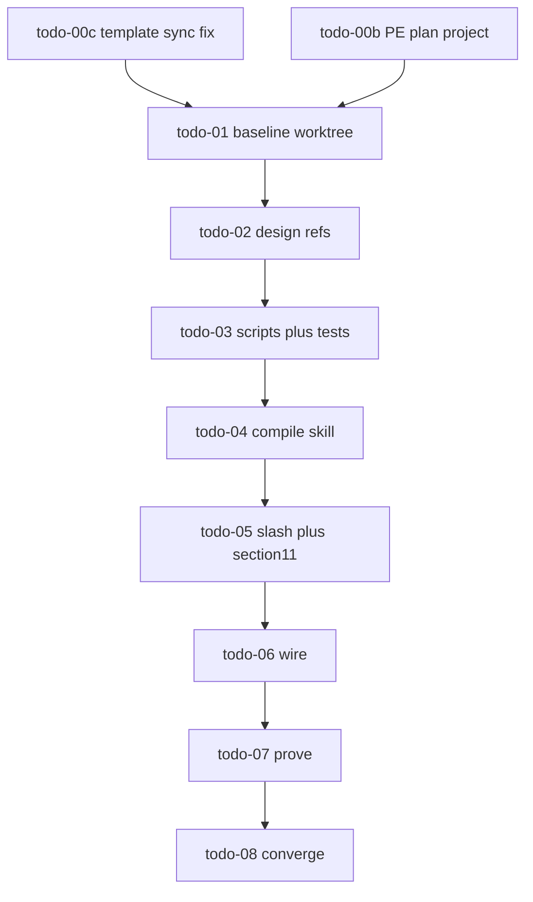

# PLAN: l9-git-work-preserve (PE+autonomy)

> **Improve kernel applied:** [`kernels/Improve.md`](kernels/Improve.md) v3 — inspect→patch on this plan artifact (not repo Build). Pass log at end.
> **Execute path:** `.plan.md` → `@environment/program-execution` → `@autonomy` / `l9-bounded-autonomy` → PE adapter `cursor-foreground`.
> **Depth:** deep · **risk_class:** irreversible (prune/stash-drop paths)
> **Plan SSOT file:** this document. Summary card [`git_work_preserve_skill_7cce0a11.plan.md`](/Users/ib-mac/.cursor/plans/git_work_preserve_skill_7cce0a11.plan.md) must mirror overview/todos only.

## Metadata

| Field | Value |
|---|---|
| plan_id | `l9-git-work-preserve` |
| schema_version | canonical.plan_document / executable_plan.v1 |
| status | `draft` — not `executable` until todo-00b validates + W0 baseline SHA locked |
| tip_authority | `origin/main` (refresh at Build; last audited `9a0a018`) |
| build_branch | `fix/l9-git-work-preserve` (new from origin/main; KERNEL pack new-branch default) |

## Architect framing

Ship a diagnose-first git work-preservation skill that inventories unpushed/dirty/orphan/stale/stash state with receipts, extracts unique value safely, and never deletes work without layered auth. Consume existing isolation gate (#113); do not rebuild it. Land on tip that already has PE `/l9-plan` v4 (#115).

## Immutable baseline

| Field | Value |
|---|---|
| baseline_ref | `origin/main` @ Build start |
| full_sha | *(lock at todo-01 — Unknown until W0)* |
| working_tree | **Must be clean dedicated worktree** — do not Build on dirty primary (`feat/kernel-pack-new-branch-default` / WIP trees are out of envelope) |
| stop_and_replan | HEAD ≠ locked SHA; Program Lock drift; tip moves mid-flight without rebase policy |

## Objective

Standalone L9 skill answering with evidence: unpushed commits; uncommitted dirt; orphaned local/GitHub branches; staleness with value diagnosis; safe extract; prune proposals that cannot delete without authorization.

**Success properties (blocking):**

| id | property | evidence_type | proof |
|---|---|---|---|
| SP-01 | Pack exists + self_test + validate_pack_structure PASS | structural | pack scripts |
| SP-02 | `/git-work-preserve` in COMMANDS_MANIFEST + index + `02-slash-commands` | filesystem | path presence |
| SP-03 | `inventory_git_work.py` emits JSON covering unpushed/dirty/worktrees/orphans/stashes class | runtime_behavior | fixture + dry-run |
| SP-04 | Refs bind Diagnose-First full kernel + forbid stash drop/branch delete without auth+receipt | structural | SKILL/refs text |
| SP-05 | Wired via `l9-wire-skill-into-repo` | filesystem | registry + symlink |
| SP-06 | `sync_cursor_plan_template.py --check` PASS with home-linked `.cursor/plans` | runtime_behavior | script exit 0 |
| SP-07 | `make pr-check` PASS on changed files | quality_gate | make |
| SP-08 | This plan executed only via PE+autonomy worktree (no primary-clone checkout thrash) | repository_state | worktree path ≠ primary |

## Capability preflight

| Probe | Required |
|---|---|
| `git` + `gh` | yes |
| `python3` + pack validators | yes |
| `l9-skill-compiler` / `l9-wire-skill-into-repo` skills | yes |
| Graphiti / PE Controller / L4 local | yes for execute path |
| Network (GitHub) | only at authorize-release / `make pr` |
| Secrets | none in skill runtime; auth via env flags only |

## Audit residue (origin/main @ 9a0a018)

| Check | Result |
|---|---|
| PE l9-plan v4 + `/l9-plan` | PASS (landed #115) |
| Isolation gate #113 | PASS — consume |
| `sync_cursor_plan_template --check` | **FAIL** — realpath of `.cursor/plans/_TEMPLATE` → `~/.cursor/plans/...` fails `_under_repo` |
| CANONICAL_LAW §11 source path | **BROKEN** — cites missing `WIP/Diagnose First Kernel.md` |
| Diagnose First full kernel on main | **PASS** at [`WIP/backlog/kernels/diagnose-first/Diagnose First Kernel.md`](WIP/backlog/kernels/diagnose-first/Diagnose%20First%20Kernel.md) (v3, ~41KB) |
| `prompts/10X Kernels/Diagnose First Kernel.md` | short digest only — **not** §11 SSOT |
| Local untracked `kernels/Diagnose First Kernel.md` | copy of backlog kernel — **out of this plan**; do not treat as landed SSOT |
| `l9-git-work-preserve` | absent |
| This CreatePlan PE-complete | **NO** until todo-00b |

Cleared historically: dual-state v3 tip, missing PE files, isolation missing.

## Decision lock

| Decision | Choice |
|---|---|
| Skill / slash | `l9-git-work-preserve` + `/git-work-preserve` |
| Default prune | report-only |
| Stash drop | never auto; deep-analysis receipt + `L9_GIT_STASH_DROP_AUTHORIZED=<reason>` |
| Remote branch delete | never default; explicit user auth after local-safe extract |
| Build method | `l9-skill-compiler` → `l9-wire-skill-into-repo` |
| Inventory | deterministic `scripts/inventory_git_work.py` |
| Diagnose binding | backlog full kernel path above (not prompts/10X) |
| PR envelope | **one** worktree PR: todo-00c + skill + §11 append (smallest coherent landing) |
| §1 `/plan` table residue | **out of envelope** — append already supersedes |

## todo-00c fix contract (root cause)

**Defect:** [`sync_cursor_plan_template.py`](skills/l9-plan/scripts/sync_cursor_plan_template.py) `_under_repo` uses `os.path.realpath` on join result. Governed wiring `.cursor/plans` → `$HOME/.cursor/plans` makes mirror realpath escape repo → SystemExit.

**Remediation (single place):** confine using the **logical** path under repo (symlink node), allow write/check through the symlink; keep Sonar-safe join (no `..` parts). Do not disable path checks. Self_test must pass on both: real `.cursor/plans` dir **and** home-symlink layout.

**Regression:** fixture covering symlink-out layout → exit 0 on `--check` when hashes match.

## Execution envelope

| Axis | Allow |
|---|---|
| write_allow | `skills/l9-git-work-preserve/**`, `skills/l9-plan/scripts/sync_cursor_plan_template.py`, related l9-plan self_test if needed, `commands/git-work-preserve.md`, `commands/COMMANDS_MANIFEST.yaml`, `commands-index.md`, `rules/02-slash-commands.mdc`, `rules/88-shared-worktree-isolation.mdc` (cross-link only), `CANONICAL_LAW.md` (append-only §11), registries via wire skill, `.l9/autonomy/**` L4 receipts |
| write_deny | isolation gate semantics, backup/sessionEnd hooks, unrelated WIP/, force-push, hard-reset |
| commands_allow | git (non-destructive until prune-execute auth), python pack scripts, make pr-check / make pr after L4 release, gh pr*, l4_local.py |
| network | GitHub only post `authorize-release` |
| secrets | no values in receipts |
| autonomous_merge | false in packet; L4 Build merge after green+mergeable |

## Side effects and idempotency

| todo_id | side_effects | idempotency | irreversible |
|---|---|---|---|
| todo-00c | filesystem_mutation | safe_to_repeat | false |
| todo-00b | filesystem_mutation (plan artifacts) | safe_to_repeat | false |
| todo-01 | filesystem_mutation (worktree/L4) | begin once | false |
| todo-02..06 | filesystem_mutation | rewrite pack ok | false |
| todo-07 | filesystem_read + quality_gate | safe_to_repeat | false |
| todo-08 | network_write (push/PR) | PR update idempotent | merge true (gated) |
| prune-execute (skill runtime) | destructive_filesystem_mutation | auth-gated | true |

## Architecture impact

- New skill pack + slash; registries via wire.
- Tiny harden of l9-plan sync script (consumer symlink reality).
- Append-only law pointer for Diagnose First.
- No change to isolation gate behavior.

## Rollback

- Skill PR: `git revert` or wire unwire mode.
- Prune accidents: reflog SHA in every prune receipt before delete.
- Sync script: revert single file.
- Never default prune-execute in CI.

## Complexity and uncertainty

| Item | Status |
|---|---|
| Symlink-safe path confinement vs Sonar S2083 | Known defect; fix contract above |
| PE Blueprint / Controller bootstrap at execute | Unknown until Build session |
| Exact `origin/main` SHA at Build | Unknown until W0 lock |
| Whether local `kernels/Diagnose First Kernel.md` will land separately | Out of envelope — ignore |

## Skill contract

### Modes

| Mode | Mutates? | Output |
|---|---|---|
| `audit` (default) | No | JSON + summary |
| `diagnose-value` | No | Per-ref diagnosis receipt |
| `extract` | Local only | New branch/worktree + surgical commits; never deletes source |
| `prune-propose` | No | Candidates + receipts + copy-paste commands |
| `prune-execute` | Yes | User auth + `L9_GIT_PRUNE_AUTHORIZED=<reason>`; local-only default |

### Enforcement (Diagnose-First)

1. Discovery (RO) → inventory script
2. Diagnosis (RO) → unique commits/files vs `origin/main`; classify keep_push / extract / archive_ref / prune_candidate
3. Planning → extract/prune plan + rollback (reflog SHA)
4. Execution → extract first; prune-execute last; stash drop only with `L9_GIT_STASH_DROP_AUTHORIZED`

### Forbidden

- stash drop/clear without deep-analysis + auth
- `branch -D` / `push --delete` without prune-execute + auth
- age ⇒ worthless
- broad add / dirty shared-clone thrash (defer isolation gate)
- delete worktree with unique dirty paths

### Pack layout

```text
skills/l9-git-work-preserve/
  SKILL.md
  agents/meta.yaml
  references/
    diagnose-first-binding.md
    audit-workflow.md
    value-diagnosis.md
    extract-workflow.md
    prune-policy.md
    stash-deep-analysis.md
    output-receipt.schema.yaml
  scripts/
    inventory_git_work.py
    diagnose_ref_value.py
    self_test.py
    validate_pack_structure.py
  fixtures/
```

## Execution DAG



| ID | Deps | Mutates |
|---|---|---|
| todo-00c | — | yes |
| todo-00b | — | yes (plan files) |
| todo-01 | 00c, 00b | yes |
| todo-02 | todo-01 | yes |
| todo-03 | todo-02 | yes |
| todo-04 | todo-02, todo-03 | yes |
| todo-05 | todo-04 | yes |
| todo-06 | todo-05 | yes |
| todo-07 | todo-06 | no (gates) |
| todo-08 | todo-07 | yes (remote) |

**Critical path:** 00c ∥ 00b → 01 → 02 → 03 → 04 → 05 → 06 → 07 → 08

## Property evidence matrix

| evidence_id | SP | method | command / artifact | status |
|---|---|---|---|---|
| EV-SP-01 | SP-01 | pack self_test | pack `self_test.py` | not_run |
| EV-SP-02 | SP-02 | path grep | COMMANDS_MANIFEST / index / 02 | not_run |
| EV-SP-03 | SP-03 | fixture + dry-run | inventory script | not_run |
| EV-SP-04 | SP-04 | structural read | refs + SKILL | not_run |
| EV-SP-05 | SP-05 | wire skill receipt | registry | not_run |
| EV-SP-06 | SP-06 | sync --check | `sync_cursor_plan_template.py --check` | failed_on_tip |
| EV-SP-07 | SP-07 | quality gate | `make pr-check` | not_run |
| EV-SP-08 | SP-08 | worktree path | toplevel ≠ primary dirty clone | not_run |

## Stress and disconfirm

| Failure | Mitigation |
|---|---|
| Delete “stale” branch with unique commits | diagnosis receipt hash + auth; default audit-only |
| Stash dropped | separate auth + deep-analysis |
| Shared clone thrash during build | dedicated worktree; isolation ON |
| Dual-clone SSOT drift | edit workspace then PR |
| False “no unique value” | `git cherry` / path diff; unknown ⇒ keep |
| §11 points at prompts/10X digest | **disconfirmed** — use backlog full kernel |

## Out of scope

- Isolation gate redesign
- backup/sessionEnd rewrite
- Landing untracked `kernels/Diagnose First Kernel.md`
- §1 `/plan` table cell rewrite
- Auto force-push / hard-reset / admin-merge
- Claiming branches worthless without receipt

## Convergence

Ready for **Build** only when:

1. todo-00b: `validate_plan_document.py` PASS + rendered PE `.plan.md` has required sections from [`canonical.template.executable_plan.v1.plan.md`](environment/contracts/execution/templates/canonical.template.executable_plan.v1.plan.md)
2. W0 locks full baseline SHA on clean worktree from refreshed `origin/main`
3. Blocking SP-* evidence can be collected during execute

**execute_via:** `@environment/program-execution` → Program Lock/Controller → `@autonomy` (`l9-bounded-autonomy`) under Program lease → `cursor-foreground`

**Handoff:** after green+mergeable, merge (L4 plan Build auth); older open PRs bottom-up first.

---

## Improve.md pass log (plan artifact only)

| Pass | Name | Findings → changes |
|---|---|---|
| 1 | target_binding | Bound SSOT plan `96c9a045`; summary `7cce0a11` is mirror. Tip refreshed `origin/main@9a0a018` (stale `e6bb88f` removed). |
| 2 | issue_discovery | Wrong Diagnose path (prompts/10X); DAG compile-before-scripts contradiction; historical dual-state entropy; missing PE sections; optional residue todo noise; dirty primary not build base; sync realpath root cause. |
| 3 | contract_hardening | Added Metadata, baseline, SP table, envelope, side-effects, evidence matrix, 00c fix contract, single-PR envelope. |
| 4 | root_cause_remediation | §11 → `WIP/backlog/kernels/diagnose-first/…`; DAG scripts→compile; dropped §1 residue todo; W0 forbids dirty primary. |
| 5 | entropy_reduction | Collapsed pre-merge dual-state analysis; removed obsolete isolation/self_test claims. |
| 6 | validation | Structural vs PE section list: draft still needs todo-00b JSON+render for `executable`. Sync check still Failed on tip (code not changed — plan mode). |
| 7 | convergence | **Plan improved / Build-blocked** until 00b+W0. No repo code modified. |

**Convergence status (plan):** Converged for plan-quality under Improve. **Not** implementation-ready until PE projection + baseline lock.
